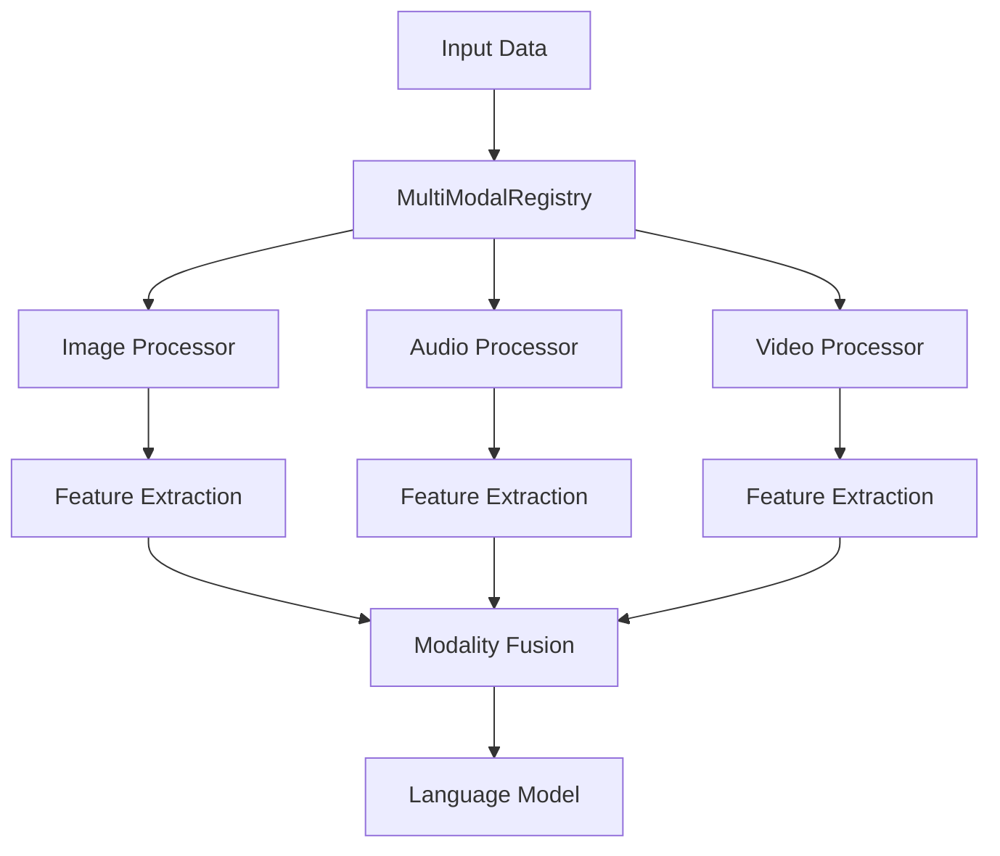
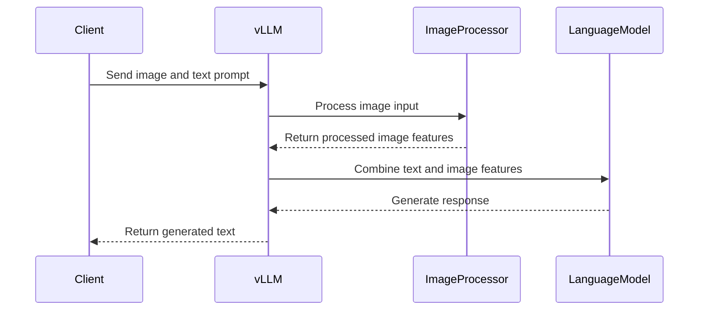
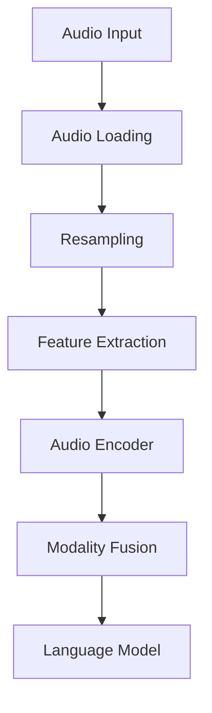
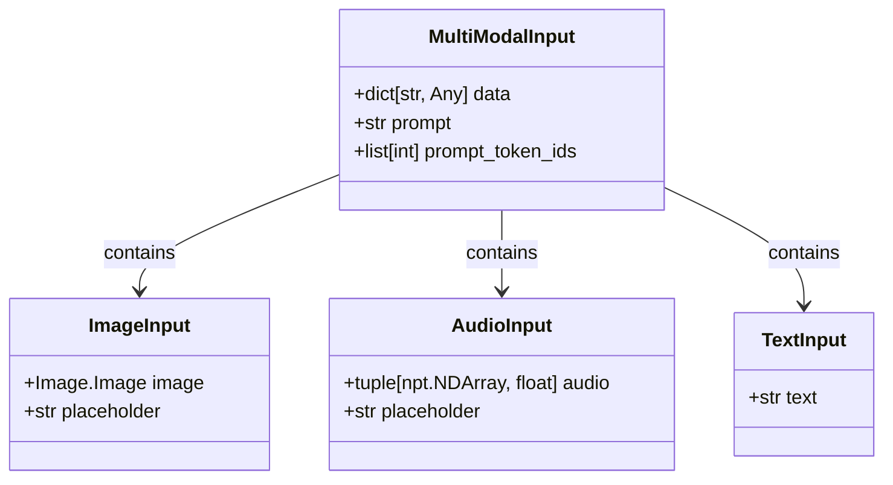
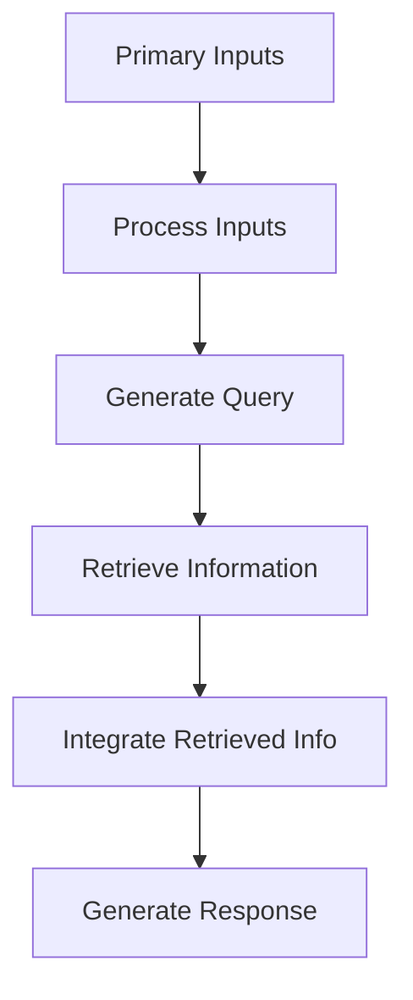
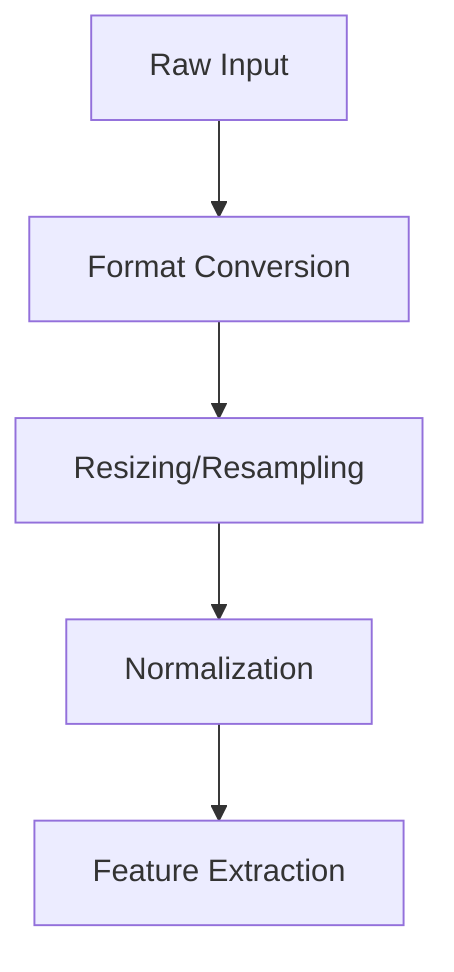

# Multi-modal Examples

<cite>
**Referenced Files in This Document**   
- [vision_language.py](file://examples/offline_inference/vision_language.py)
- [audio_language.py](file://examples/offline_inference/audio_language.py)
- [encoder_decoder_multimodal.py](file://examples/offline_inference/encoder_decoder_multimodal.py)
- [image.py](file://vllm/multimodal/image.py)
- [audio.py](file://vllm/multimodal/audio.py)
- [base.py](file://vllm/multimodal/base.py)
- [minicpmo.py](file://vllm/model_executor/models/minicpmo.py)
- [phi4mm_audio.py](file://vllm/model_executor/models/phi4mm_audio.py)
- [phi4_multimodal.py](file://vllm/model_executor/models/phi4_multimodal.py)
- [qwen3_omni_moe_thinker.py](file://vllm/model_executor/models/qwen3_omni_moe_thinker.py)
- [qwen2_5_omni_thinker.py](file://vllm/model_executor/models/qwen2_5_omni_thinker.py)
- [qwen2_audio.py](file://vllm/model_executor/models/qwen2_audio.py)
</cite>

## Table of Contents
1. [Introduction](#introduction)
2. [Multi-modal Processing Architecture](#multi-modal-processing-architecture)
3. [Vision-Language Models](#vision-language-models)
4. [Audio-Language Models](#audio-language-models)
5. [Cross-modal Input Processing](#cross-modal-input-processing)
6. [Retrieval-Augmented Generation](#retrieval-augmented-generation)
7. [Configuration Options](#configuration-options)
8. [Input Preprocessing and Modality Fusion](#input-preprocessing-and-modality-fusion)
9. [Common Issues and Solutions](#common-issues-and-solutions)
10. [Performance Considerations](#performance-considerations)
11. [Conclusion](#conclusion)

## Introduction

vLLM provides comprehensive support for multi-modal inputs, enabling models to process vision, audio, and text together in a single inference pipeline. This documentation details the implementation of multi-modal processing in vLLM, covering vision-language models, audio-language models, and cross-modal inputs. The system is designed to handle various multi-modal scenarios, from simple image-text combinations to complex audio-visual-text interactions.

The multi-modal capabilities in vLLM are built around a flexible architecture that supports different modalities through specialized processors and a unified interface. The system handles input preprocessing, feature extraction, and modality fusion, allowing models to effectively combine information from different sources. This document provides concrete examples and implementation details to help users understand and utilize vLLM's multi-modal features effectively.

**Section sources**
- [vision_language.py](file://examples/offline_inference/vision_language.py#L1-L50)
- [audio_language.py](file://examples/offline_inference/audio_language.py#L1-L50)

## Multi-modal Processing Architecture

vLLM's multi-modal processing architecture is centered around the `multimodal` module, which provides a comprehensive framework for handling different modalities. The architecture consists of several key components that work together to process multi-modal inputs efficiently.

The core of the multi-modal system is the `MultiModalRegistry` class, which serves as a central dispatcher for multi-modal data processing. This registry allows model runners to handle different modalities according to the target model's requirements. The registry is responsible for coordinating the processing of various modalities and ensuring that the correct processing pipeline is applied for each model.

**Diagram sources**
- [base.py](file://vllm/multimodal/base.py#L1-L55)
- [__init__.py](file://vllm/multimodal/__init__.py#L1-L41)

The architecture follows a modular design, with separate processors for each modality. This design allows for easy extension and customization of the processing pipeline. The system supports both raw media inputs (images, audio files) and pre-extracted embeddings, providing flexibility in how multi-modal data is provided to the model.

The processing pipeline begins with input validation and preprocessing, where each modality is processed according to its specific requirements. For images, this includes format conversion and resizing. For audio, it involves loading and resampling to the required sample rate. The processed inputs are then passed to the feature extraction stage, where modality-specific features are extracted.

After feature extraction, the system performs modality fusion, combining the features from different modalities into a unified representation that can be processed by the language model. This fusion process is model-specific and can involve simple concatenation or more complex attention-based mechanisms.

**Section sources**
- [base.py](file://vllm/multimodal/base.py#L1-L55)
- [__init__.py](file://vllm/multimodal/__init__.py#L1-L41)

## Vision-Language Models

Vision-language models in vLLM enable the processing of images and text together, allowing for tasks such as image captioning, visual question answering, and image-based reasoning. The implementation supports various vision-language models with different architectures and processing requirements.

The vision-language processing pipeline begins with image preprocessing, which handles format conversion and normalization. The `ImageMediaIO` class provides methods for loading images from various sources, including files, base64-encoded data, and raw bytes. This class also handles format conversion, ensuring that images are in the correct mode (e.g., RGB) for processing.

**Diagram sources**
- [image.py](file://vllm/multimodal/image.py#L1-L135)
- [vision_language.py](file://examples/offline_inference/vision_language.py#L1-L50)

The system supports multiple vision-language models, each with its own prompt format and processing requirements. For example, the Aria model uses a specific prompt format with image tokens, while the BLIP-2 model uses a simpler question-answer format. The implementation provides functions for each model type, handling the specific prompt formatting and configuration requirements.

The vision processing pipeline includes several key steps:
1. Image loading and format conversion
2. Resizing and normalization
3. Feature extraction using the vision encoder
4. Integration with the language model

The system also supports multi-image inputs, allowing models to process multiple images in a single prompt. This is particularly useful for tasks that require comparison or reasoning across multiple images. The implementation handles the ordering and positioning of image tokens in the prompt, ensuring that the model can correctly associate each image with its corresponding text.

**Section sources**
- [image.py](file://vllm/multimodal/image.py#L1-L135)
- [vision_language.py](file://examples/offline_inference/vision_language.py#L1-L50)

## Audio-Language Models

Audio-language models in vLLM enable the processing of audio and text together, supporting applications such as speech recognition, audio-based question answering, and audio transcription. The implementation provides comprehensive support for audio inputs, including various audio formats and processing requirements.

The audio processing pipeline begins with audio loading and preprocessing. The `AudioMediaIO` class provides methods for loading audio from various sources, including files, base64-encoded data, and raw bytes. This class uses the librosa library for audio loading and processing, supporting a wide range of audio formats.

**Diagram sources**
- [audio.py](file://vllm/multimodal/audio.py#L1-L143)
- [audio_language.py](file://examples/offline_inference/audio_language.py#L1-L50)

The system includes an `AudioResampler` class that handles audio resampling to the required sample rate. This is important for ensuring consistency across different audio inputs and for matching the requirements of the audio encoder. The resampler supports multiple methods, including librosa and scipy, allowing users to choose the most appropriate method for their use case.

The audio processing pipeline supports both raw audio inputs and pre-extracted audio features. For raw audio, the system handles the entire processing chain from loading to feature extraction. For pre-extracted features, the system can directly use the provided features, bypassing the initial processing steps.

The implementation supports multiple audio-language models, each with its own requirements and capabilities. For example, the Whisper model is designed for speech recognition and transcription, while the Qwen2-Audio model supports more general audio-based question answering. The system provides specific functions for each model type, handling the appropriate prompt formatting and configuration.

The audio processing pipeline also supports multiple audio inputs in a single prompt, allowing models to process several audio clips together. This is useful for tasks that require comparison or reasoning across multiple audio inputs. The implementation handles the ordering and positioning of audio tokens in the prompt, ensuring that the model can correctly associate each audio clip with its corresponding text.

**Section sources**
- [audio.py](file://vllm/multimodal/audio.py#L1-L143)
- [audio_language.py](file://examples/offline_inference/audio_language.py#L1-L50)

## Cross-modal Input Processing

Cross-modal input processing in vLLM enables the combination of multiple modalities in a single inference pipeline. This includes scenarios where vision, audio, and text inputs are processed together, allowing for complex multi-modal reasoning and generation.

The cross-modal processing architecture is designed to handle the integration of different modalities in a flexible and extensible way. The system uses a unified interface for multi-modal inputs, allowing different combinations of modalities to be processed together. This interface supports both explicit and implicit prompt formats, providing flexibility in how multi-modal inputs are specified.

**Diagram sources**
- [base.py](file://vllm/multimodal/base.py#L1-L55)
- [image.py](file://vllm/multimodal/image.py#L1-L135)
- [audio.py](file://vllm/multimodal/audio.py#L1-L143)

The system supports various cross-modal scenarios, including:
- Vision-audio-text: Processing images, audio, and text together
- Audio-video-text: Processing audio, video, and text together
- Multi-image-text: Processing multiple images with text
- Multi-audio-text: Processing multiple audio clips with text

The implementation handles the ordering and positioning of modality tokens in the prompt, ensuring that the model can correctly associate each input with its corresponding text. This is particularly important for complex scenarios where multiple inputs of the same modality are used.

The cross-modal processing pipeline includes several key steps:
1. Input validation and preprocessing for each modality
2. Feature extraction for each modality
3. Modality fusion to combine features from different modalities
4. Integration with the language model for generation

The system also supports encoder-decoder architectures for cross-modal processing, where different modalities are processed by separate encoder and decoder components. This is particularly useful for tasks like speech-to-text translation, where the audio input is processed by an encoder and the text output is generated by a decoder.

**Section sources**
- [base.py](file://vllm/multimodal/base.py#L1-L55)
- [image.py](file://vllm/multimodal/image.py#L1-L135)
- [audio.py](file://vllm/multimodal/audio.py#L1-L143)

## Retrieval-Augmented Generation

Retrieval-augmented generation (RAG) in vLLM extends the multi-modal capabilities to include external knowledge sources. This allows models to access and incorporate information from external databases, documents, or other sources during the generation process.

The RAG implementation in vLLM is designed to work seamlessly with multi-modal inputs, allowing for the combination of retrieved information with vision, audio, and text inputs. The system supports various retrieval methods, including vector-based retrieval, keyword-based retrieval, and hybrid approaches.

The retrieval-augmented generation pipeline begins with the processing of the primary inputs (vision, audio, text), followed by the retrieval of relevant information from external sources. The retrieved information is then integrated with the primary inputs and passed to the language model for generation.

**Diagram sources**
- [encoder_decoder_multimodal.py](file://examples/offline_inference/encoder_decoder_multimodal.py#L1-L134)
- [vision_language.py](file://examples/offline_inference/vision_language.py#L1-L50)

The system supports various types of external knowledge sources, including:
- Document databases
- Vector databases
- Knowledge graphs
- Web resources

The implementation provides a flexible interface for integrating different retrieval systems, allowing users to customize the retrieval process according to their specific requirements. This includes support for custom retrieval algorithms, ranking functions, and filtering criteria.

The RAG pipeline also includes mechanisms for handling the uncertainty and reliability of retrieved information. This includes confidence scoring, source attribution, and fallback strategies for cases where the retrieved information is insufficient or unreliable.

**Section sources**
- [encoder_decoder_multimodal.py](file://examples/offline_inference/encoder_decoder_multimodal.py#L1-L134)
- [vision_language.py](file://examples/offline_inference/vision_language.py#L1-L50)

## Configuration Options

vLLM provides a comprehensive set of configuration options for multi-modal input processing, allowing users to customize the behavior of the system according to their specific requirements. These options are exposed through the `EngineArgs` class and can be set when initializing the LLM instance.

The key configuration options for multi-modal processing include:

| Configuration Option | Description | Default Value | Example Usage |
|----------------------|-------------|---------------|---------------|
| `limit_mm_per_prompt` | Limits the number of inputs per modality in a single prompt | None | `{"image": 1, "audio": 2}` |
| `mm_processor_kwargs` | Additional arguments for modality-specific processors | None | `{"crop_to_patches": True}` |
| `config_format` | Format of the model configuration | "default" | "mistral" |
| `load_format` | Format for loading the model | "auto" | "mistral" |
| `tokenizer_mode` | Mode for tokenizer operation | "auto" | "mistral" |
| `enforce_eager` | Whether to enforce eager execution mode | False | True |
| `enable_lora` | Whether to enable LoRA for fine-tuning | False | True |
| `max_lora_rank` | Maximum rank for LoRA matrices | 64 | 320 |

**Section sources**
- [vision_language.py](file://examples/offline_inference/vision_language.py#L1-L50)
- [audio_language.py](file://examples/offline_inference/audio_language.py#L1-L50)

The `limit_mm_per_prompt` option is particularly important for multi-modal processing, as it controls the maximum number of inputs allowed for each modality in a single prompt. This helps prevent resource exhaustion and ensures consistent behavior across different models.

The `mm_processor_kwargs` option allows users to pass additional arguments to modality-specific processors. For example, in vision processing, this can be used to control image cropping or resizing behavior. In audio processing, it can be used to specify resampling parameters or feature extraction options.

Other configuration options, such as `enforce_eager` and `enable_lora`, provide additional control over the execution mode and fine-tuning capabilities of the model. These options can be used to optimize performance or enable specific features required by certain models.

**Section sources**
- [vision_language.py](file://examples/offline_inference/vision_language.py#L1-L50)
- [audio_language.py](file://examples/offline_inference/audio_language.py#L1-L50)

## Input Preprocessing and Modality Fusion

Input preprocessing and modality fusion are critical components of vLLM's multi-modal processing pipeline. These processes ensure that inputs from different modalities are properly prepared and combined for effective processing by the language model.

The input preprocessing pipeline handles the conversion of raw media inputs into a format suitable for feature extraction. For images, this includes format conversion, resizing, and normalization. For audio, it involves loading, resampling, and normalization. The preprocessing steps are designed to ensure consistency across different inputs and to match the requirements of the feature extraction models.

**Diagram sources**
- [image.py](file://vllm/multimodal/image.py#L1-L135)
- [audio.py](file://vllm/multimodal/audio.py#L1-L143)

Modality fusion is the process of combining features from different modalities into a unified representation that can be processed by the language model. vLLM supports several fusion strategies, including:

1. **Concatenation**: Simple concatenation of feature vectors from different modalities
2. **Attention-based fusion**: Using attention mechanisms to weight and combine features
3. **Cross-modal attention**: Allowing features from one modality to attend to features from another modality
4. **Hierarchical fusion**: Combining features at multiple levels of abstraction

The choice of fusion strategy depends on the specific model and task requirements. Some models have built-in fusion mechanisms, while others rely on the framework to handle fusion.

The system also supports advanced preprocessing techniques, such as:
- Image tiling for high-resolution images
- Audio chunking for long audio clips
- Video frame sampling for video inputs
- Multi-scale feature extraction

These techniques help manage the computational complexity of processing large or high-dimensional inputs while preserving important information.

**Section sources**
- [image.py](file://vllm/multimodal/image.py#L1-L135)
- [audio.py](file://vllm/multimodal/audio.py#L1-L143)

## Common Issues and Solutions

When working with multi-modal inputs in vLLM, users may encounter various issues related to input preprocessing, modality alignment, and resource management. This section addresses common problems and provides solutions to help users troubleshoot and optimize their multi-modal applications.

### Input Preprocessing Errors

Input preprocessing errors are common when working with multi-modal data. These errors can occur due to incompatible file formats, incorrect dimensions, or missing dependencies.

**Common issues:**
- Unsupported image or audio formats
- Incorrect image modes (e.g., RGBA instead of RGB)
- Audio files with unsupported sample rates
- Missing dependencies (e.g., librosa, soundfile)

**Solutions:**
- Ensure all input files are in supported formats
- Use the appropriate preprocessing functions to convert image modes and audio sample rates
- Install required dependencies using the appropriate package manager
- Validate inputs before processing

### Modality Alignment Problems

Modality alignment problems occur when the system fails to correctly associate inputs from different modalities with their corresponding text. This can lead to incorrect or nonsensical outputs.

**Common issues:**
- Incorrect positioning of modality tokens in the prompt
- Mismatch between the number of inputs and placeholders
- Confusion between inputs of the same modality

**Solutions:**
- Carefully construct prompts with the correct number and positioning of modality tokens
- Use consistent naming and ordering conventions for inputs
- Validate the alignment between inputs and placeholders before processing

### Resource Management Issues

Resource management issues can occur when processing large multi-modal inputs, leading to memory exhaustion or performance degradation.

**Common issues:**
- Out of memory errors when processing high-resolution images or long audio clips
- Slow processing times for large inputs
- Resource contention in multi-user environments

**Solutions:**
- Use appropriate configuration options to limit resource usage
- Implement input batching and queuing
- Optimize input preprocessing and feature extraction
- Use hardware acceleration when available

**Section sources**
- [image.py](file://vllm/multimodal/image.py#L1-L135)
- [audio.py](file://vllm/multimodal/audio.py#L1-L143)
- [vision_language.py](file://examples/offline_inference/vision_language.py#L1-L50)
- [audio_language.py](file://examples/offline_inference/audio_language.py#L1-L50)

## Performance Considerations

Performance is a critical consideration when working with multi-modal inputs in vLLM. The processing of vision, audio, and text inputs together can be computationally intensive, requiring careful optimization to achieve acceptable performance.

### Multi-modal Feature Extraction Latency

Feature extraction is often the most time-consuming part of the multi-modal processing pipeline. The latency of feature extraction depends on several factors, including:

- Input size and resolution
- Complexity of the feature extraction model
- Hardware acceleration availability
- Batch size

To optimize feature extraction latency:
- Use appropriate input sizes and resolutions
- Leverage hardware acceleration (GPU, TPU)
- Implement batching where possible
- Cache frequently used features

### Memory Requirements

Multi-modal processing can have significant memory requirements, particularly for large visual features. The memory usage depends on:

- Number and size of inputs
- Dimensionality of feature vectors
- Batch size
- Model size

To manage memory requirements:
- Use the `limit_mm_per_prompt` configuration option to control input数量
- Implement memory-efficient data structures
- Use mixed precision when possible
- Monitor memory usage and adjust configurations accordingly

### Throughput Optimization

Throughput optimization is important for applications that need to process multiple multi-modal inputs efficiently. Strategies for improving throughput include:

- Input batching
- Parallel processing of independent inputs
- Caching of frequently used features
- Load balancing in distributed environments

The system provides several configuration options that can help optimize throughput, such as `max_num_seqs` and `max_model_len`. These options should be tuned based on the specific hardware and workload characteristics.

**Section sources**
- [vision_language.py](file://examples/offline_inference/vision_language.py#L1-L50)
- [audio_language.py](file://examples/offline_inference/audio_language.py#L1-L50)

## Conclusion

vLLM provides a comprehensive and flexible framework for multi-modal input processing, supporting vision, audio, and text inputs in a single inference pipeline. The system's modular architecture and extensive configuration options make it suitable for a wide range of applications, from simple vision-language tasks to complex cross-modal reasoning.

The implementation covers all aspects of multi-modal processing, from input preprocessing and feature extraction to modality fusion and generation. The system supports various models and processing requirements, providing a unified interface for handling different modalities.

By following the guidelines and best practices outlined in this documentation, users can effectively leverage vLLM's multi-modal capabilities to build powerful and efficient applications. The system's performance optimizations and error handling mechanisms help ensure reliable and scalable operation in production environments.

As multi-modal AI continues to evolve, vLLM's flexible architecture positions it well to support new models and modalities, making it a valuable tool for researchers and developers working in this exciting field.