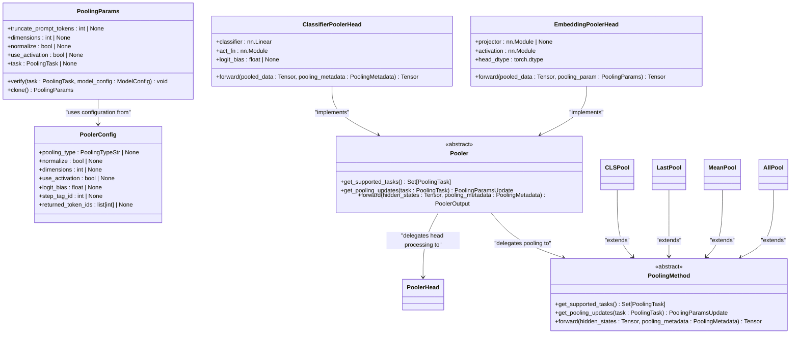
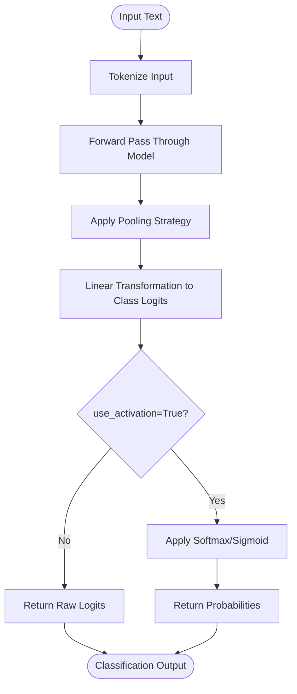
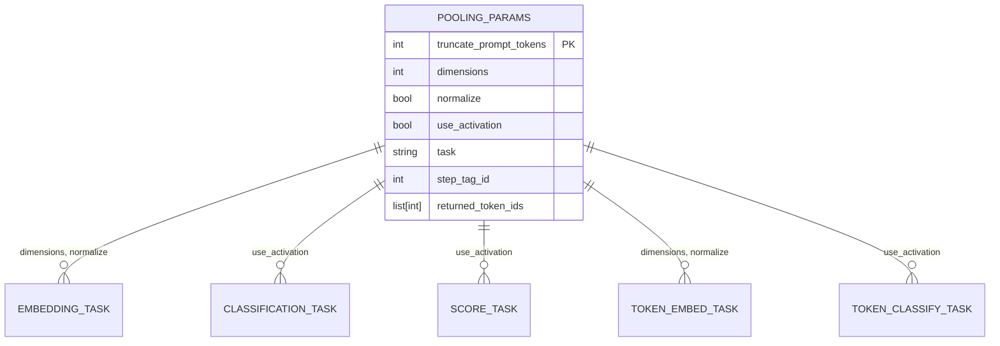
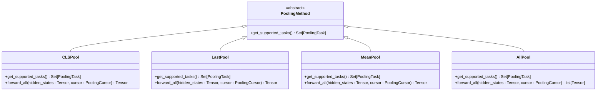

# Pooling Examples

<cite>
**Referenced Files in This Document**   
- [pooling_params.py](file://vllm/pooling_params.py)
- [pooler.py](file://vllm/model_executor/layers/pooler.py)
- [config/pooler.py](file://vllm/config/pooler.py)
- [openai_embedding_client.py](file://examples/pooling/embed/openai_embedding_client.py)
- [openai_classification_client.py](file://examples/pooling/classify/openai_classification_client.py)
- [cohere_rerank_client.py](file://examples/pooling/score/cohere_rerank_client.py)
- [multi_vector_retrieval.py](file://examples/pooling/token_embed/multi_vector_retrieval.py)
- [openai_embedding_matryoshka_fy.py](file://examples/pooling/embed/openai_embedding_matryoshka_fy.py)
- [openai_cross_encoder_score.py](file://examples/pooling/score/openai_cross_encoder_score.py)
- [qwen3_reranker.py](file://examples/pooling/score/qwen3_reranker.py)
</cite>

## Table of Contents
1. [Introduction](#introduction)
2. [Pooling Architecture Overview](#pooling-architecture-overview)
3. [Embedding Generation and Pooling](#embedding-generation-and-pooling)
4. [Classification with Pooled Representations](#classification-with-pooled-representations)
5. [Similarity Scoring and Reranking](#similarity-scoring-and-reranking)
6. [Configuration Options](#configuration-options)
7. [Pooling Strategies and Implementation](#pooling-strategies-and-implementation)
8. [Common Issues and Solutions](#common-issues-and-solutions)
9. [Performance Considerations](#performance-considerations)
10. [Conclusion](#conclusion)

## Introduction

vLLM provides comprehensive support for embedding models and retrieval tasks through its pooling framework. This documentation details the implementation of generating sentence embeddings, performing classification on pooled representations, and computing similarity scores for retrieval tasks. The system supports various pooling strategies, dimension selection, and normalization methods, enabling efficient handling of embedding, classification, and reranking workloads.

The pooling framework in vLLM is designed to work with various model types including embedding models, classification models, and rerankers. It provides a unified interface for different pooling tasks while maintaining optimal performance through batch processing and efficient memory management.

**Section sources**
- [pooling_params.py](file://vllm/pooling_params.py#L1-L231)
- [pooler.py](file://vllm/model_executor/layers/pooler.py#L1-L818)

## Pooling Architecture Overview

The vLLM pooling architecture consists of several key components that work together to process inputs and generate appropriate outputs for different tasks. The core components include the PoolingParams class, PoolerConfig, various pooling methods, and specialized pooler heads for different tasks.



**Diagram sources **
- [pooling_params.py](file://vllm/pooling_params.py#L15-L231)
- [pooler.py](file://vllm/model_executor/layers/pooler.py#L33-L757)
- [config/pooler.py](file://vllm/config/pooler.py#L1-L125)

**Section sources**
- [pooling_params.py](file://vllm/pooling_params.py#L1-L231)
- [pooler.py](file://vllm/model_executor/layers/pooler.py#L1-L818)
- [config/pooler.py](file://vllm/config/pooler.py#L1-L125)

## Embedding Generation and Pooling

### Embedding Generation Process

vLLM supports generating embeddings through various interfaces, including the OpenAI-compatible API and direct LLM integration. The embedding generation process involves several steps: input processing, hidden state extraction, pooling operation, and output formatting.

For embedding models, vLLM provides the `embed()` method which generates embeddings for input texts. The process begins with tokenizing the input text, passing it through the model to obtain hidden states, applying the specified pooling strategy, and optionally normalizing the output.

```python
# Example of embedding generation using OpenAI client
client.embeddings.create(
    input=["Hello my name is", "The best thing about vLLM"],
    model="intfloat/e5-small",
    dimensions=384,
    normalize=True
)
```

The system supports various embedding models including E5, BGE, and Jina embeddings, with specific examples provided for each model type.

### Matryoshka Embeddings

vLLM supports Matryoshka embeddings, which allow models to generate embeddings of different dimensions from the same underlying representation. This enables efficient retrieval at multiple precision levels by using smaller embedding dimensions for coarse-grained retrieval and larger dimensions for fine-grained ranking.

The Matryoshka representation is controlled through the `dimensions` parameter in PoolingParams. When specified, the system truncates the full-dimensional embedding to the requested size:

```python
# Example of Matryoshka embedding with reduced dimensions
responses = client.embeddings.create(
    input=["Follow the white rabbit."],
    model="jinaai/jina-embeddings-v3",
    dimensions=32  # Request 32-dimensional embedding
)
```

The system validates that the requested dimensions are supported by the model configuration, ensuring optimal performance and accuracy.

### Multi-Vector Retrieval

For advanced retrieval scenarios, vLLM supports token-level embedding generation through the `token_embed` task. This enables multi-vector retrieval approaches where each token in the input text is represented by its own embedding vector.

```python
# Generate embeddings for each token in the input
outputs = llm.encode(prompts, pooling_task="token_embed")
```

This approach is particularly useful for dense passage retrieval and other scenarios where fine-grained matching is required.

**Section sources**
- [openai_embedding_client.py](file://examples/pooling/embed/openai_embedding_client.py#L1-L41)
- [openai_embedding_matryoshka_fy.py](file://examples/pooling/embed/openai_embedding_matryoshka_fy.py#L1-L38)
- [multi_vector_retrieval.py](file://examples/pooling/token_embed/multi_vector_retrieval.py#L1-L57)
- [pooler.py](file://vllm/model_executor/layers/pooler.py#L461-L496)

## Classification with Pooled Representations

### Classification Implementation

vLLM supports classification tasks through its pooling framework, where the final hidden states are pooled and passed through a classification head to produce logits for each class. The classification process involves several key components:

1. **Pooling**: Extracting relevant hidden states using strategies like CLS, LAST, or MEAN pooling
2. **Head Processing**: Applying a linear transformation to map pooled representations to class logits
3. **Activation**: Optionally applying activation functions like softmax to produce probabilities

The system supports both single-label and multi-label classification through appropriate activation functions configured based on the model's problem type.

```python
# Example of classification using direct HTTP API
payload = {
    "model": "jason9693/Qwen2.5-1.5B-apeach",
    "input": ["Hello, my name is", "The president of the United States is"]
}
classify_response = requests.post("http://localhost:8000/classify", json=payload)
```

### Activation Functions

The classification output can be processed with activation functions controlled by the `use_activation` parameter. The system automatically selects appropriate activation functions based on the model configuration:

- **Single-label classification**: Softmax activation
- **Multi-label classification**: Sigmoid activation  
- **Regression**: Identity function

The activation function can be explicitly controlled through the PoolingParams configuration, allowing for flexibility in output processing.



**Diagram sources **
- [openai_classification_client.py](file://examples/pooling/classify/openai_classification_client.py#L1-L54)
- [pooler.py](file://vllm/model_executor/layers/pooler.py#L603-L620)

**Section sources**
- [openai_classification_client.py](file://examples/pooling/classify/openai_classification_client.py#L1-L54)
- [pooler.py](file://vllm/model_executor/layers/pooler.py#L603-L620)

## Similarity Scoring and Reranking

### Cross-Encoder Scoring

vLLM supports cross-encoder scoring for reranking tasks, where pairs of texts are scored for relevance. This is particularly useful for information retrieval scenarios where candidate documents need to be ranked against a query.

The scoring process involves:
1. Encoding query-document pairs
2. Computing similarity scores
3. Returning ranked results

```python
# Example of cross-encoder scoring
prompt = {
    "model": "BAAI/bge-reranker-v2-m3",
    "text_1": "What is the capital of Brazil?",
    "text_2": "The capital of Brazil is Brasilia."
}
score_response = requests.post("http://localhost:8000/score", json=prompt)
```

The system supports various input patterns:
- Single query with single document
- Single query with multiple documents  
- Multiple queries with multiple documents

### Reranking with Specialized Models

vLLM supports specialized reranking models like the Qwen3-Reranker, which uses a unique approach of computing logits for "yes" and "no" tokens to determine relevance. For optimal performance, these models can be converted to sequence classification format:

```python
# Initialize Qwen3-Reranker with hf_overrides for optimal performance
llm = LLM(
    model="Qwen/Qwen3-Reranker-0.6B",
    runner="pooling",
    hf_overrides={
        "architectures": ["Qwen3ForSequenceClassification"],
        "classifier_from_token": ["no", "yes"],
        "is_original_qwen3_reranker": True,
    }
)
```

The system also supports Cohere-compatible reranking APIs, enabling seamless integration with existing applications:

```python
# Cohere-compatible reranking
cohere_v1 = cohere.Client(base_url="http://localhost:8000", api_key="sk-fake-key")
rerank_result = cohere_v1.rerank(
    model="BAAI/bge-reranker-base",
    query="What is the capital of France?",
    documents=["The capital of France is Paris", "Reranking is fun!"]
)
```

**Section sources**
- [cohere_rerank_client.py](file://examples/pooling/score/cohere_rerank_client.py#L1-L48)
- [openai_cross_encoder_score.py](file://examples/pooling/score/openai_cross_encoder_score.py#L1-L64)
- [qwen3_reranker.py](file://examples/pooling/score/qwen3_reranker.py#L1-L90)
- [pooler.py](file://vllm/model_executor/layers/pooler.py#L115-L156)

## Configuration Options

### Pooling Parameters

The PoolingParams class provides comprehensive configuration options for controlling pooling behavior:



**Diagram sources **
- [pooling_params.py](file://vllm/pooling_params.py#L36-L76)

The valid parameters are task-specific:
- **Embedding tasks**: `dimensions`, `normalize`
- **Classification tasks**: `use_activation`  
- **Scoring tasks**: `use_activation`
- **Token-level tasks**: Appropriate parameters based on task type

### Pooler Configuration

The PoolerConfig class provides model-level configuration for pooling behavior:

```python
class PoolerConfig:
    pooling_type: PoolingTypeStr | None = None
    normalize: bool | None = None  # Default: True
    dimensions: int | None = None  # Default: None
    enable_chunked_processing: bool | None = None  # Default: False
    max_embed_len: int | None = None  # Default: None
    use_activation: bool | None = None  # Default: True
    logit_bias: float | None = None  # Default: None
    step_tag_id: int | None = None
    returned_token_ids: list[int] | None = None
```

These configurations can be set when serving the model or through model configuration files.

**Section sources**
- [pooling_params.py](file://vllm/pooling_params.py#L1-L231)
- [config/pooler.py](file://vllm/config/pooler.py#L1-L125)

## Pooling Strategies and Implementation

### Supported Pooling Methods

vLLM implements several pooling strategies through the PoolingMethod class hierarchy:



**Diagram sources **
- [pooler.py](file://vllm/model_executor/layers/pooler.py#L140-L224)

Each pooling method has specific characteristics:
- **CLS Pooling**: Uses the hidden state of the CLS token (common in BERT-style models)
- **LAST Pooling**: Uses the hidden state of the last token
- **MEAN Pooling**: Computes the mean of all token hidden states
- **ALL Pooling**: Returns all token hidden states (for token-level tasks)

### Implementation Details

The pooling implementation follows a two-stage process:
1. **Pooling**: Extracting relevant hidden states based on the pooling strategy
2. **Head Processing**: Applying task-specific transformations

For embedding tasks, the EmbeddingPoolerHead applies normalization and dimension reduction:

```python
# Pseudocode for embedding head processing
def forward(pooled_data, pooling_param):
    # Apply ST projector if present
    if self.projector is not None:
        pooled_data = self.projector(pooled_data)
    
    # Apply dimension reduction for Matryoshka
    if pooling_param.dimensions is not None:
        pooled_data = pooled_data[..., :pooling_param.dimensions]
    
    # Apply normalization
    if pooling_param.normalize:
        pooled_data = F.normalize(pooled_data, p=2, dim=-1)
    
    return pooled_data
```

For classification tasks, the ClassifierPoolerHead applies a linear transformation followed by activation:

```python
# Pseudocode for classification head processing
def forward(pooled_data, pooling_metadata):
    # Apply classifier linear layer
    pooled_data = self.classifier(pooled_data)
    
    # Apply activation function if requested
    if pooling_param.use_activation:
        pooled_data = self.act_fn(pooled_data)
    
    return pooled_data
```

**Section sources**
- [pooler.py](file://vllm/model_executor/layers/pooler.py#L461-L641)

## Common Issues and Solutions

### Dimension Mismatches

A common issue when working with embedding models is dimension mismatches, particularly with Matryoshka embeddings. The system provides validation to prevent poor results:

```python
# Validation in _set_default_parameters
if self.dimensions is not None and model_config is not None:
    if not model_config.is_matryoshka:
        raise ValueError(
            f'Model "{model_config.served_model_name}" does not '
            f"support matryoshka representation"
        )
    
    mds = model_config.matryoshka_dimensions
    if mds is not None and self.dimensions not in mds:
        raise ValueError(
            f'Model "{model_config.served_model_name}" '
            f"only supports {str(mds)} matryoshka dimensions"
        )
```

**Solution**: Always verify that the requested dimensions are supported by the model, and check the model's configuration for available Matryoshka dimensions.

### Pooling Strategy Selection

Selecting the appropriate pooling strategy is crucial for optimal performance. The system validates that parameters are appropriate for the selected task:

```python
# Validation in _verify_valid_parameters
valid_parameters = self.valid_parameters[self.task]
invalid_parameters = []
for k in self.all_parameters:
    if k in valid_parameters:
        continue
    if getattr(self, k, None) is not None:
        invalid_parameters.append(k)

if invalid_parameters:
    raise ValueError(
        f"Task {self.task} only supports {valid_parameters} "
        f"parameters, does not support {invalid_parameters} parameters"
    )
```

**Solution**: Use the appropriate parameters for each task type:
- For embedding tasks: Use `dimensions` and `normalize`
- For classification tasks: Use `use_activation`  
- Avoid mixing parameters between task types

### Model Selection

When working with specialized models like Qwen3-Reranker, proper configuration is essential:

**Issue**: The original Qwen3-Reranker computes logits for "no" and "yes" tokens, which is inefficient.

**Solution**: Convert to sequence classification format using hf_overrides:

```python
LLM(
    model="Qwen/Qwen3-Reranker-0.6B",
    runner="pooling",
    hf_overrides={
        "architectures": ["Qwen3ForSequenceClassification"],
        "classifier_from_token": ["no", "yes"],
        "is_original_qwen3_reranker": True,
    }
)
```

**Section sources**
- [pooling_params.py](file://vllm/pooling_params.py#L194-L210)
- [qwen3_reranker.py](file://examples/pooling/score/qwen3_reranker.py#L1-L90)

## Performance Considerations

### Batch Processing Efficiency

vLLM optimizes batch processing for pooling tasks by:
- Processing multiple inputs in parallel
- Efficient memory management
- Minimizing data transfers

The system uses asynchronous iterators to handle multiple embedding requests efficiently:

```python
# Internal implementation using async iterators
result_generator = merge_async_iterators(*generators)
final_res_batch: list[PoolingRequestOutput] = []
embeddings: list[PoolingRequestOutput | None] = [None] * len(engine_prompts)

async for i, res in result_generator:
    embeddings[i] = res
```

### Memory Usage for High-Dimensional Embeddings

High-dimensional embeddings can consume significant memory. vLLM addresses this through:

1. **Matryoshka representations**: Allowing dimension reduction without re-computation
2. **Efficient storage**: Using appropriate data types and compression
3. **Batch size optimization**: Balancing throughput and memory usage

For large-scale retrieval applications, consider:
- Using smaller embedding dimensions for initial retrieval
- Applying dimension reduction through the `dimensions` parameter
- Optimizing batch sizes based on available GPU memory

### Normalization Impact

Normalization (L2 normalization) affects both performance and accuracy:
- **With normalization**: Embeddings are unit vectors, enabling cosine similarity computation
- **Without normalization**: Raw embeddings preserve magnitude information

The default behavior is to normalize embeddings, as this is typically required for similarity computations:

```python
# Test showing default normalization behavior
default = get_outputs(normalize=None)  # Uses default (True)
w_normal = get_outputs(normalize=True)  # Explicitly normalized
wo_normal = get_outputs(normalize=False)  # Not normalized

assert torch.allclose(default, w_normal)  # Default should use normalization
assert not torch.allclose(w_normal, wo_normal)  # Different results
```

**Section sources**
- [test_offline.py](file://tests/entrypoints/pooling/embed/test_offline.py#L49-L68)
- [pooler.py](file://vllm/model_executor/layers/pooler.py#L486-L496)

## Conclusion

vLLM provides a comprehensive and flexible framework for pooling operations in embedding models and retrieval tasks. The system supports various pooling strategies, dimension selection, and normalization methods through a unified interface. Key features include:

- **Multiple pooling methods**: CLS, LAST, MEAN, and ALL pooling for different use cases
- **Matryoshka embeddings**: Support for dimension reduction in embedding models
- **Classification and scoring**: Integrated support for classification and reranking tasks
- **Flexible configuration**: Comprehensive parameter control through PoolingParams and PoolerConfig
- **Performance optimization**: Efficient batch processing and memory management

By understanding the configuration options, implementation details, and performance considerations outlined in this documentation, users can effectively leverage vLLM's pooling capabilities for their embedding and retrieval applications.