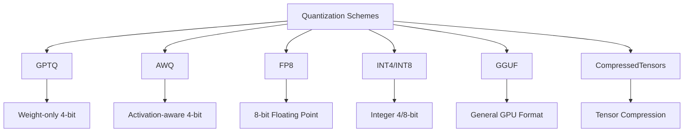
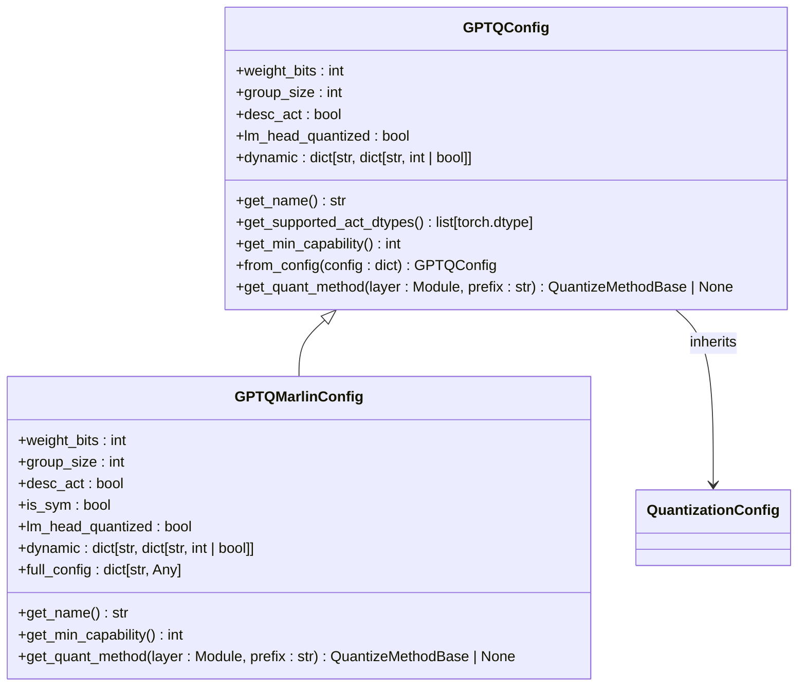
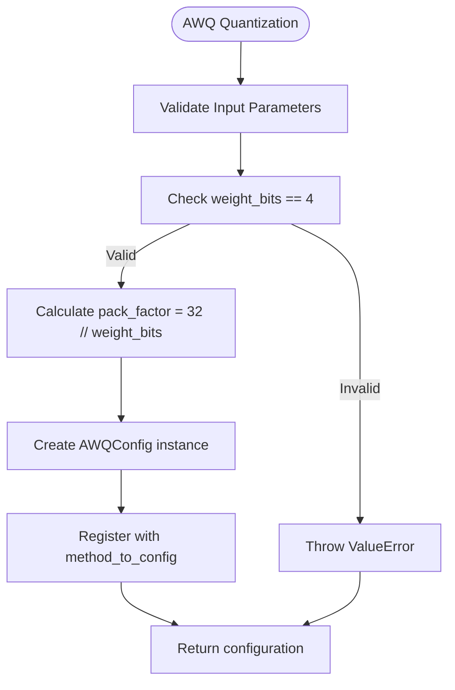
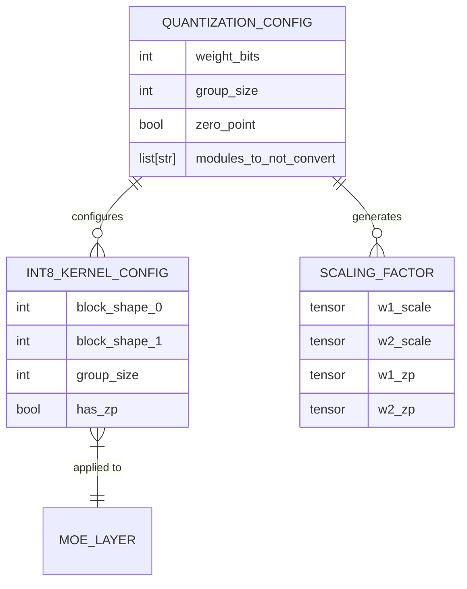
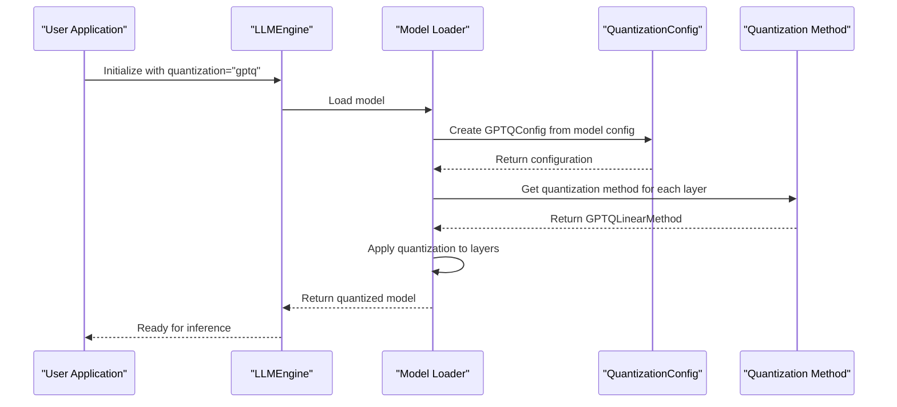
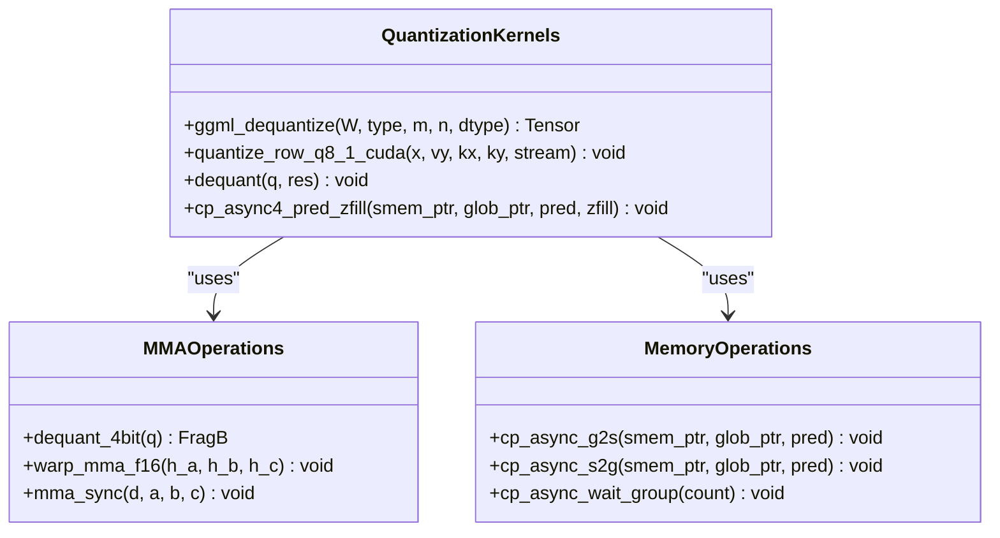
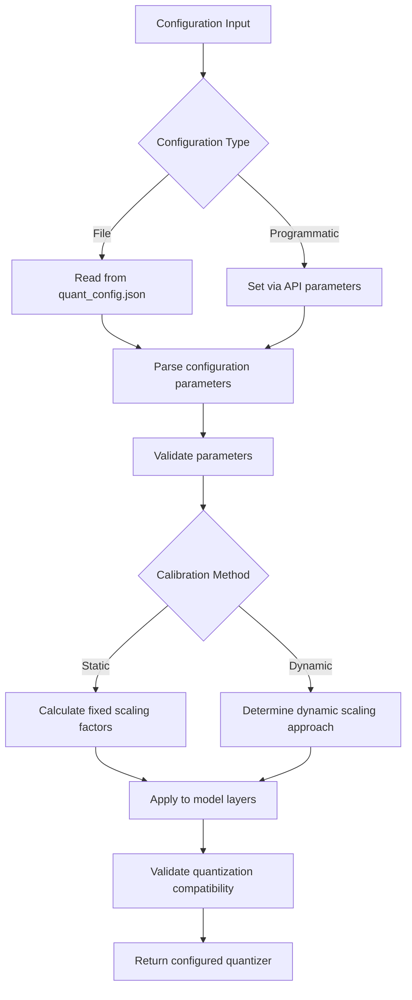

# Quantization Examples

<cite>
**Referenced Files in This Document**   
- [fp8.py](file://vllm/model_executor/layers/quantization/fp8.py)
- [gptq.py](file://vllm/model_executor/layers/quantization/gptq.py)
- [awq.py](file://vllm/model_executor/layers/quantization/awq.py)
- [gptq_marlin.py](file://vllm/model_executor/layers/quantization/gptq_marlin.py)
- [ipex_quant.py](file://vllm/model_executor/layers/quantization/ipex_quant.py)
- [lora_with_quantization_inference.py](file://examples/offline_inference/lora_with_quantization_inference.py)
- [rlhf_online_quant.py](file://examples/offline_inference/rlhf_online_quant.py)
- [activation_kernels.cu](file://csrc/quantization/activation_kernels.cu)
- [gguf_kernel.cu](file://csrc/quantization/gguf/gguf_kernel.cu)
- [moe_wna16_utils.h](file://csrc/moe/moe_wna16_utils.h)
- [marlin/sparse/common/mma.h](file://csrc/quantization/marlin/sparse/common/mma.h)
- [base_config.py](file://vllm/model_executor/layers/quantization/base_config.py)
- [compressed_tensors.py](file://vllm/model_executor/layers/quantization/compressed_tensors/compressed_tensors.py)
- [quant_utils.py](file://vllm/model_executor/layers/quantization/utils/quant_utils.py)
- [int8_utils.py](file://vllm/model_executor/layers/quantization/utils/int8_utils.py)
</cite>

## Table of Contents
1. [Introduction](#introduction)
2. [Quantization Schemes Overview](#quantization-schemes-overview)
3. [GPTQ Quantization](#gptq-quantization)
4. [AWQ Quantization](#awq-quantization)
5. [FP8 Quantization](#fp8-quantization)
6. [INT4/INT8 Quantization](#int4int8-quantization)
7. [Model Executor Integration](#model-executor-integration)
8. [CUDA Kernels Implementation](#cuda-kernels-implementation)
9. [Configuration and Calibration](#configuration-and-calibration)
10. [Common Issues and Solutions](#common-issues-and-solutions)
11. [Performance Considerations](#performance-considerations)
12. [Conclusion](#conclusion)

## Introduction

vLLM provides comprehensive model compression through various quantization techniques that enable efficient inference while maintaining model accuracy. This document details the implementation of GPTQ, AWQ, FP8, and INT4/INT8 quantization schemes, covering both pre-quantized checkpoints and online quantization workflows. The quantization framework is deeply integrated with the model_executor/quantization module and leverages specialized CUDA kernels in csrc/quantization for optimal performance.

The quantization system in vLLM follows a modular design where each quantization method is implemented as a configuration class that inherits from the base QuantizationConfig. These configurations define the quantization parameters, supported data types, and minimum hardware requirements. The framework supports mixed-precision settings and various calibration methods to optimize the quantization process for different model architectures and use cases.

**Section sources**
- [base_config.py](file://vllm/model_executor/layers/quantization/base_config.py)
- [__init__.py](file://vllm/model_executor/layers/quantization/__init__.py)

## Quantization Schemes Overview

vLLM supports multiple quantization schemes designed for different performance and accuracy trade-offs. The framework implements weight-only quantization, activation-aware quantization, and mixed-precision approaches. Each scheme is optimized for specific hardware capabilities and use cases, with GPTQ and AWQ focusing on 4-bit weight quantization, FP8 enabling 8-bit floating-point quantization with hardware acceleration, and INT4/INT8 providing integer-based quantization for maximum efficiency.

The quantization methods are registered in the system through the method_to_config dictionary in the quantization module's __init__.py file. This registration system allows for dynamic selection of quantization methods based on model configuration and user preferences. The framework also supports fallback mechanisms when certain quantization methods are not available on the target hardware platform.



**Diagram sources **
- [__init__.py](file://vllm/model_executor/layers/quantization/__init__.py)
- [base_config.py](file://vllm/model_executor/layers/quantization/base_config.py)

**Section sources**
- [__init__.py](file://vllm/model_executor/layers/quantization/__init__.py)
- [base_config.py](file://vllm/model_executor/layers/quantization/base_config.py)

## GPTQ Quantization

GPTQ (Generalized Post-Training Quantization) in vLLM implements a weight-only quantization scheme that compresses model weights to 2, 3, 4, or 8 bits while maintaining high accuracy. The GPTQConfig class defines the quantization parameters including weight_bits, group_size, and desc_act (descend activation order). The implementation supports dynamic per-module quantization through the dynamic configuration parameter, allowing different quantization settings for different layers within the same model.

The GPTQ implementation in vLLM includes multiple backend options, with GPTQMarlin being the preferred choice for 4-bit quantization due to its optimized CUDA kernels. The framework provides warnings when using the legacy gptq_gemm kernel, which has known issues with 4-bit quantization. For MoE (Mixture of Experts) models, GPTQ falls back to the MoeWNA16 quantization method to ensure broad compatibility.



**Diagram sources **
- [gptq.py](file://vllm/model_executor/layers/quantization/gptq.py)
- [gptq_marlin.py](file://vllm/model_executor/layers/quantization/gptq_marlin.py)

**Section sources**
- [gptq.py](file://vllm/model_executor/layers/quantization/gptq.py)
- [gptq_marlin.py](file://vllm/model_executor/layers/quantization/gptq_marlin.py)

## AWQ Quantization

AWQ (Activation-Aware Weight Quantization) in vLLM implements a 4-bit weight quantization scheme that considers activation patterns during the quantization process to preserve model accuracy. The AWQConfig class defines the quantization parameters including weight_bits (fixed at 4), group_size, and zero_point. The implementation packs 32 4-bit weights into a single 32-bit integer for efficient storage and computation.

The AWQ implementation in vLLM is designed to work with the Marlin kernel for optimal performance on NVIDIA GPUs. The framework supports modules_to_not_convert to exclude specific layers from quantization, allowing for mixed-precision models where certain critical layers maintain higher precision. The AWQ method is particularly effective for maintaining accuracy in smaller models where quantization noise can have a more significant impact.



**Diagram sources **
- [awq.py](file://vllm/model_executor/layers/quantization/awq.py)
- [__init__.py](file://vllm/model_executor/layers/quantization/__init__.py)

**Section sources**
- [awq.py](file://vllm/model_executor/layers/quantization/awq.py)

## FP8 Quantization

FP8 (8-bit Floating Point) quantization in vLLM enables efficient mixed-precision computation using NVIDIA's FP8 tensor cores available on Hopper and Ada Lovelace architectures. The FP8Config class manages the quantization process, supporting both static and dynamic activation schemes. For GPUs without native FP8 hardware support, the framework can leverage Marlin kernels for weight-only FP8 quantization.

The FP8 implementation includes specialized methods for handling MoE (Mixture of Experts) layers through the Fp8MoeBackend enumeration, which selects the appropriate backend (FlashInfer, DeepGEMM, Marlin, etc.) based on hardware capabilities and model configuration. The framework also supports FP8 quantization of the KV cache through the Fp8KVCacheMethod, reducing memory footprint during inference.

```mermaid
stateDiagram-v2
[*] --> Initialize
Initialize --> CheckHardware["Check GPU capability >= 89"]
CheckHardware --> |Supported| UseNativeFP8["Use native FP8 operations"]
CheckHardware --> |Not Supported| UseMarlin["Use Marlin kernel for weight-only"]
UseNativeFP8 --> ConfigureScales["Configure activation and weight scales"]
UseMarlin --> ConfigureScales
ConfigureScales --> ApplyQuantization["Apply FP8 quantization to layers"]
ApplyQuantization --> HandleMoE["Handle MoE layers with appropriate backend"]
HandleMoE --> Complete["FP8 quantization complete"]
```

**Diagram sources **
- [fp8.py](file://vllm/model_executor/layers/quantization/fp8.py)
- [fbgemm_fp8.py](file://vllm/model_executor/layers/quantization/fbgemm_fp8.py)

**Section sources**
- [fp8.py](file://vllm/model_executor/layers/quantization/fp8.py)
- [fbgemm_fp8.py](file://vllm/model_executor/layers/quantization/fbgemm_fp8.py)

## INT4/INT8 Quantization

INT4 and INT8 quantization in vLLM provides integer-based quantization schemes for maximum computational efficiency. The framework implements per-token and per-group quantization methods through utility functions like per_token_group_quant_int8, which performs quantization on input tensors with configurable group sizes. These methods convert floating-point weights to signed integers while maintaining scaling factors for accurate dequantization.

The INT4/INT8 implementation leverages specialized CUDA kernels for efficient quantization and dequantization operations. The pack_rows and pack_cols utility functions handle the packing of multiple quantized values into single integers for storage efficiency. For MoE models, the MoeWNA16Config class provides INT8 quantization support with specialized kernel configurations.



**Diagram sources **
- [int8_utils.py](file://vllm/model_executor/layers/quantization/utils/int8_utils.py)
- [moe_wna16.py](file://vllm/model_executor/layers/quantization/moe_wna16.py)
- [quant_utils.py](file://vllm/model_executor/layers/quantization/utils/quant_utils.py)

**Section sources**
- [int8_utils.py](file://vllm/model_executor/layers/quantization/utils/int8_utils.py)
- [moe_wna16.py](file://vllm/model_executor/layers/quantization/moe_wna16.py)

## Model Executor Integration

The quantization system in vLLM is tightly integrated with the model_executor module, which handles the loading and execution of quantized models. The integration occurs through the QuantizationConfig classes that implement the get_quant_method method to return appropriate quantization methods for different layer types. This design allows for flexible quantization strategies where different layers can use different quantization methods based on their characteristics.

The model executor processes quantization configurations during model loading, applying the appropriate quantization methods to linear layers, attention layers, and MoE layers. For pre-quantized checkpoints, the executor reads the quantization parameters from configuration files like quantize_config.json. For online quantization, the executor applies quantization during the model loading process based on the specified quantization method.



**Diagram sources **
- [model_loader.py](file://vllm/model_executor/model_loader/__init__.py)
- [base_config.py](file://vllm/model_executor/layers/quantization/base_config.py)
- [linear.py](file://vllm/model_executor/layers/linear.py)

**Section sources**
- [model_loader.py](file://vllm/model_executor/model_loader/__init__.py)
- [base_config.py](file://vllm/model_executor/layers/quantization/base_config.py)

## CUDA Kernels Implementation

The quantization performance in vLLM is heavily dependent on optimized CUDA kernels implemented in the csrc/quantization directory. These kernels handle critical operations such as quantization, dequantization, and quantized matrix multiplication. The implementation leverages low-level CUDA intrinsics like lop3 for efficient bit manipulation and fused operations to maximize throughput.

For GGUF format models, the ggml_dequantize kernel efficiently converts quantized weights back to floating-point format during inference. The moe_wna16_utils.h header contains specialized dequantization functions for MoE layers, while the marlin/sparse/common/mma.h header provides optimized matrix multiplication operations for 4-bit quantized weights. These kernels are designed to minimize memory bandwidth usage and maximize computational efficiency.



**Diagram sources **
- [gguf_kernel.cu](file://csrc/quantization/gguf/gguf_kernel.cu)
- [moe_wna16_utils.h](file://csrc/moe/moe_wna16_utils.h)
- [mma.h](file://csrc/quantization/marlin/sparse/common/mma.h)

**Section sources**
- [gguf_kernel.cu](file://csrc/quantization/gguf/gguf_kernel.cu)
- [moe_wna16_utils.h](file://csrc/moe/moe_wna16_utils.h)
- [mma.h](file://csrc/quantization/marlin/sparse/common/mma.h)

## Configuration and Calibration

vLLM's quantization framework provides extensive configuration options for fine-tuning the quantization process. Configuration parameters are specified through JSON files like quant_config.json or quantize_config.json, which are automatically detected during model loading. The framework supports mixed-precision settings where different layers can have different quantization parameters, enabling optimal accuracy-efficiency trade-offs.

Calibration methods in vLLM include both static and dynamic approaches. Static calibration uses fixed scaling factors determined during the quantization process, while dynamic calibration adjusts scaling factors based on input activations during inference. The framework also supports per-channel and per-group quantization, where scaling factors are calculated for individual channels or groups of weights to minimize quantization error.



**Diagram sources **
- [base_config.py](file://vllm/model_executor/layers/quantization/base_config.py)
- [ipex_quant.py](file://vllm/model_executor/layers/quantization/ipex_quant.py)
- [compressed_tensors.py](file://vllm/model_executor/layers/quantization/compressed_tensors/compressed_tensors.py)

**Section sources**
- [base_config.py](file://vllm/model_executor/layers/quantization/base_config.py)
- [ipex_quant.py](file://vllm/model_executor/layers/quantization/ipex_quant.py)

## Common Issues and Solutions

Several common issues can arise when using quantization in vLLM, including quantization accuracy degradation and kernel compatibility problems. Accuracy degradation often occurs when using aggressive quantization (e.g., 2-bit or 3-bit) or when the group_size is too large, causing important weight patterns to be lost. The solution is to use larger group sizes for more stable quantization or to employ activation-aware methods like AWQ.

Kernel compatibility issues typically stem from hardware requirements not being met. For example, FP8 quantization requires GPU capability 89 or higher for native support, while GPTQMarlin kernels have specific architectural requirements. When hardware doesn't support a requested quantization method, vLLM either falls back to a compatible method (like using Marlin kernels for FP8 on older GPUs) or raises an appropriate error.

Memory-related issues can occur with large models and quantization due to the additional memory needed for scaling factors and zero points. The solution is to use weight-only quantization methods and ensure sufficient GPU memory is available. For MoE models, special attention must be paid to the quantization of expert layers, which may require different configurations than standard layers.

**Section sources**
- [gptq.py](file://vllm/model_executor/layers/quantization/gptq.py)
- [fp8.py](file://vllm/model_executor/layers/quantization/fp8.py)
- [base_config.py](file://vllm/model_executor/layers/quantization/base_config.py)

## Performance Considerations

Quantization in vLLM provides significant performance benefits through reduced memory footprint and increased computational efficiency. The memory footprint reduction is proportional to the quantization bit width, with 4-bit quantization reducing model size by approximately 75% compared to 16-bit floating point. This reduction enables larger models to fit in GPU memory and reduces memory bandwidth requirements during inference.

Computational efficiency gains come from several factors: reduced memory bandwidth requirements, increased arithmetic intensity, and specialized kernel optimizations. INT4 and INT8 quantization can achieve 2-4x speedup in matrix multiplication operations compared to FP16, while FP8 quantization leverages tensor cores for additional acceleration on supported hardware. The actual performance gains depend on the specific model architecture, batch size, and hardware platform.

The choice of quantization method involves trade-offs between model size, inference speed, and accuracy. Weight-only quantization methods like GPTQ and AWQ typically provide the best accuracy preservation, while activation-aware methods like FP8 can achieve higher throughput on compatible hardware. For production deployments, it's recommended to benchmark different quantization configurations to find the optimal balance for the specific use case.

**Section sources**
- [fp8.py](file://vllm/model_executor/layers/quantization/fp8.py)
- [gptq.py](file://vllm/model_executor/layers/quantization/gptq.py)
- [awq.py](file://vllm/model_executor/layers/quantization/awq.py)

## Conclusion

vLLM's quantization framework provides a comprehensive set of tools for model compression through GPTQ, AWQ, FP8, and INT4/INT8 quantization schemes. The system is designed for both pre-quantized checkpoints and online quantization workflows, with extensive configuration options for mixed-precision settings and calibration methods. The tight integration with the model_executor module and optimized CUDA kernels in csrc/quantization ensures high performance and efficiency.

When implementing quantization in vLLM, it's important to consider the hardware requirements, accuracy requirements, and performance goals of the specific use case. The framework provides multiple fallback options and compatibility layers to ensure broad hardware support, while still delivering the performance benefits of specialized quantization methods. By carefully selecting the appropriate quantization scheme and configuration parameters, users can achieve significant model size reduction and inference speedup while maintaining acceptable accuracy levels.