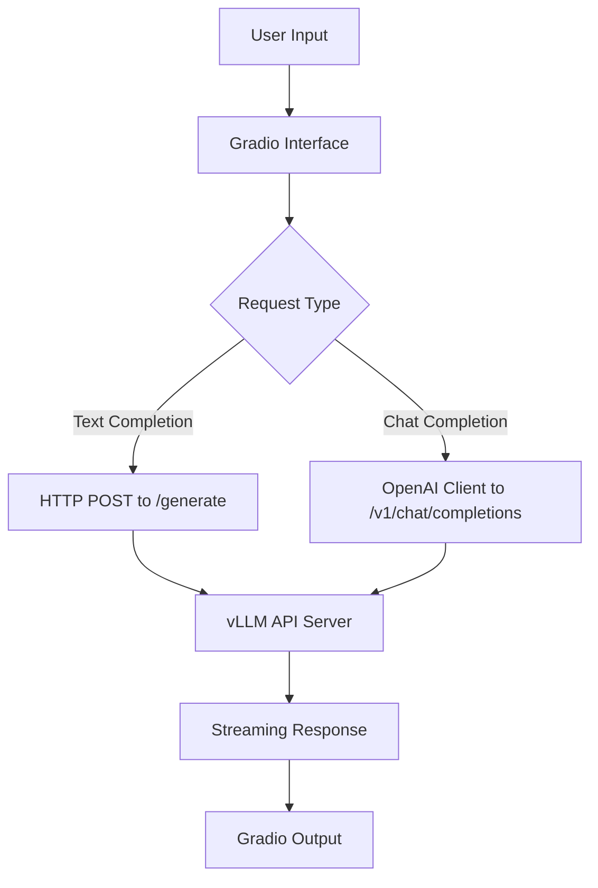
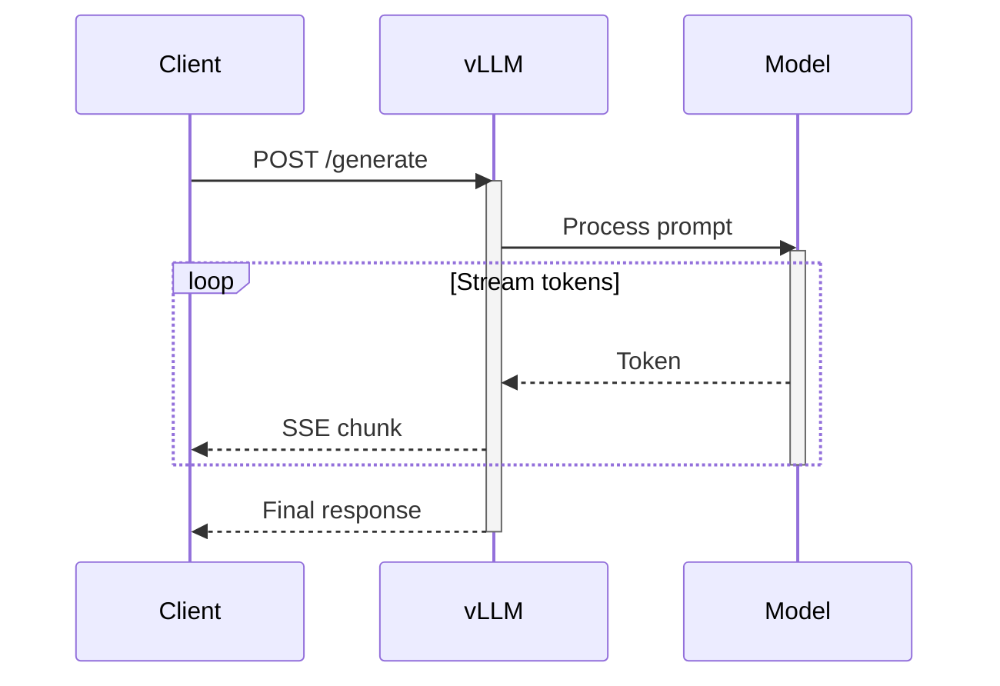
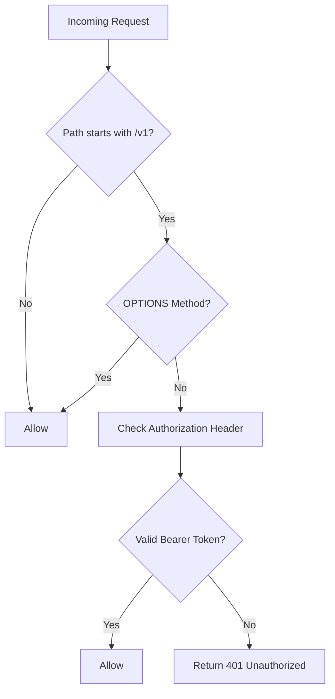
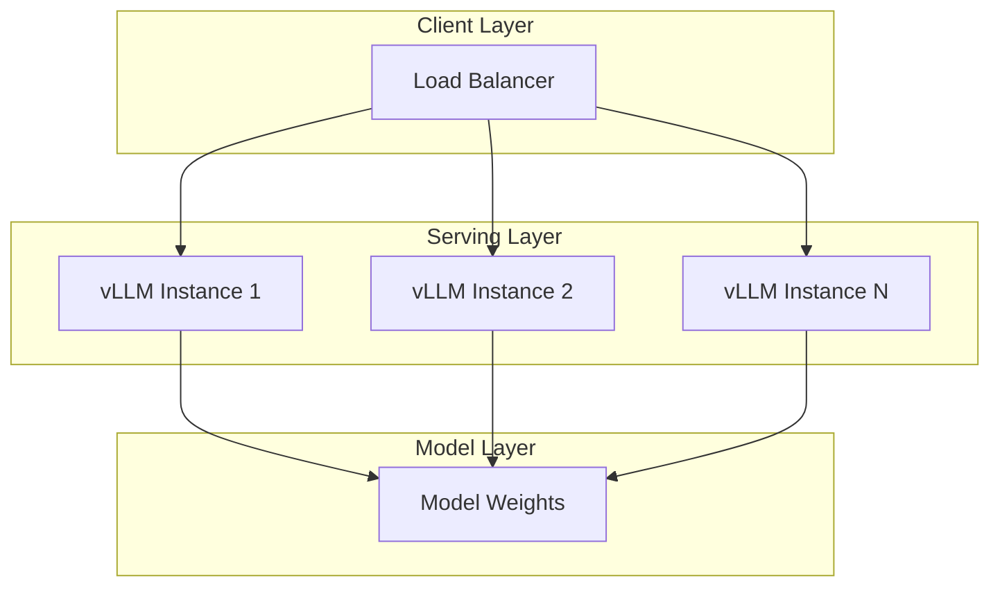

# Serving Examples

<cite>
**Referenced Files in This Document**   
- [api_client.py](file://examples/online_serving/api_client.py)
- [gradio_webserver.py](file://examples/online_serving/gradio_webserver.py)
- [gradio_openai_chatbot_webserver.py](file://examples/online_serving/gradio_openai_chatbot_webserver.py)
- [streamlit_openai_chatbot_webserver.py](file://examples/online_serving/streamlit_openai_chatbot_webserver.py)
- [ray_serve_deepseek.py](file://examples/online_serving/ray_serve_deepseek.py)
- [api_server.py](file://vllm/entrypoints/openai/api_server.py)
- [serve.py](file://vllm/entrypoints/cli/serve.py)
- [disagg_proxy_demo.py](file://examples/online_serving/disaggregated_serving/disagg_proxy_demo.py)
</cite>

## Table of Contents
1. [Introduction](#introduction)
2. [Web Interface Integration with Gradio and Streamlit](#web-interface-integration-with-gradio-and-streamlit)
3. [Custom API Client Implementation](#custom-api-client-implementation)
4. [Production Deployment with Ray Serve](#production-deployment-with-ray-serve)
5. [API Endpoint Configuration and Authentication](#api-endpoint-configuration-and-authentication)
6. [Error Handling and Retry Mechanisms](#error-handling-and-retry-mechanisms)
7. [Performance Optimization Strategies](#performance-optimization-strategies)
8. [Microservice Architecture Patterns](#microservice-architecture-patterns)
9. [Conclusion](#conclusion)

## Introduction

vLLM provides comprehensive serving capabilities for large language models with various deployment and integration patterns. This document details the implementation of web interfaces using Gradio and Streamlit, creation of custom API clients, and production deployment strategies using Ray Serve. The serving examples demonstrate real-time chat applications, batch processing pipelines, and microservice architectures that leverage vLLM's high-performance inference engine.

The serving infrastructure is built around the OpenAI-compatible API server, which exposes standardized endpoints for chat completions, completions, and model management. This compatibility enables seamless integration with existing tools and frameworks while providing advanced features like streaming responses, request batching, and distributed serving.

**Section sources**
- [api_server.py](file://vllm/entrypoints/openai/api_server.py)

## Web Interface Integration with Gradio and Streamlit

### Gradio Integration Patterns

vLLM provides multiple examples for integrating with Gradio to create interactive web interfaces. The `gradio_webserver.py` example demonstrates a basic text completion interface that connects directly to the vLLM API server using HTTP requests. This implementation uses the `requests` library to send streaming requests to the generate endpoint, processing response chunks as they arrive.

The `gradio_openai_chatbot_webserver.py` example showcases a more sophisticated chat interface that leverages the OpenAI client library to communicate with vLLM's OpenAI-compatible API. This approach provides better integration with chat-specific features and handles the streaming protocol automatically. The implementation includes configurable parameters for temperature, stop tokens, and model selection, allowing users to customize the generation behavior.



**Diagram sources**
- [gradio_webserver.py](file://examples/online_serving/gradio_webserver.py)
- [gradio_openai_chatbot_webserver.py](file://examples/online_serving/gradio_openai_chatbot_webserver.py)

### Streamlit Chat Application

The `streamlit_openai_chatbot_webserver.py` example demonstrates a feature-rich chat application built with Streamlit. This implementation includes advanced features such as:

- Multiple chat session management with timestamp-based session IDs
- Real-time chat history persistence using Streamlit's session state
- Configurable API endpoint through environment variables
- Optional reasoning process visualization for models that support thinking display
- API settings configuration in the sidebar

The application uses the OpenAI client to connect to vLLM's API server, enabling streaming responses that update in real-time. The reasoning display feature is particularly noteworthy, as it can show the model's "thinking process" above the final response when enabled, providing transparency into the reasoning chain.

**Section sources**
- [streamlit_openai_chatbot_webserver.py](file://examples/online_serving/streamlit_openai_chatbot_webserver.py)

## Custom API Client Implementation

### Direct HTTP Client

The `api_client.py` example provides a foundation for building custom API clients that communicate directly with vLLM's HTTP endpoints. This implementation demonstrates:

- POST request construction for text generation
- Streaming response handling using `requests.iter_lines()`
- JSON response parsing and error handling
- Command-line argument parsing for configuration

The client supports both streaming and non-streaming modes, with appropriate handling for each response type. In streaming mode, it processes line-delimited JSON responses, extracting the generated text from each chunk. The implementation includes utility functions for clearing terminal output during streaming to provide a clean user experience.



**Diagram sources**
- [api_client.py](file://examples/online_serving/api_client.py)

### OpenAI-Compatible Client

The `openai_chat_completion_client.py` example demonstrates how to use the official OpenAI client library to interact with vLLM's API server. This approach provides several advantages:

- Automatic handling of the OpenAI API protocol
- Built-in support for chat completion message formats
- Simplified streaming implementation
- Compatibility with existing OpenAI-based tools and libraries

The client configuration is straightforward, requiring only the API key (set to "EMPTY" for vLLM) and the base URL pointing to the vLLM server. This pattern enables developers to leverage their existing OpenAI client code with minimal modifications.

**Section sources**
- [api_client.py](file://examples/online_serving/api_client.py)
- [openai_chat_completion_client.py](file://examples/online_serving/openai_chat_completion_client.py)

## Production Deployment with Ray Serve

### Ray Serve LLM Configuration

The `ray_serve_deepseek.py` example illustrates how to deploy vLLM models in production using Ray Serve LLM. This approach provides enterprise-grade features including:

- Automatic scaling with configurable min and max replicas
- Load balancing across a Ray cluster
- Unified multi-node, multi-model deployment
- OpenAI-compatible HTTP API exposure
- Multi-LoRA support with shared base models

The configuration is defined through the `LLMConfig` class, which specifies model loading parameters, deployment configuration, accelerator type, and vLLM engine arguments. The example demonstrates deployment of the DeepSeek R1 model with H100 accelerators and optimized vLLM settings for high-performance inference.

```python
llm_config = LLMConfig(
    model_loading_config={
        "model_id": "deepseek",
        "model_source": "deepseek-ai/DeepSeek-R1",
    },
    deployment_config={
        "autoscaling_config": {
            "min_replicas": 1,
            "max_replicas": 1,
        }
    },
    accelerator_type="H100",
    engine_kwargs={
        "tensor_parallel_size": 8,
        "pipeline_parallel_size": 2,
        "gpu_memory_utilization": 0.92,
        "dtype": "auto",
        "max_num_seqs": 40,
        "max_model_len": 16384,
        "enable_chunked_prefill": True,
        "enable_prefix_caching": True,
        "trust_remote_code": True,
    },
)
```

**Section sources**
- [ray_serve_deepseek.py](file://examples/online_serving/ray_serve_deepseek.py)

## API Endpoint Configuration and Authentication

### Authentication Middleware

vLLM's API server includes built-in authentication middleware that can be configured with API keys. The `AuthenticationMiddleware` class implements token-based authentication using bearer tokens. Key features include:

- SHA-256 hashing of API tokens for security
- Constant-time comparison to prevent timing attacks
- Support for multiple valid API keys
- Exemption for OPTIONS requests and non-v1 endpoints

The authentication system can be enabled by passing the `--api-key` parameter to the API server, which accepts one or more API keys. Requests to v1 endpoints must include a valid Authorization header with the Bearer scheme.



**Diagram sources**
- [api_server.py](file://vllm/entrypoints/openai/api_server.py)

### Rate Limiting and Throttling

The disaggregated serving examples demonstrate rate limiting and request throttling patterns. The disagg_proxy_demo.py implementation includes an admin API key for managing instances and validating requests. This pattern allows for:

- Controlled access to proxy management endpoints
- Instance validation before adding to the pool
- Request throttling based on client identity
- Monitoring and logging of access attempts

The proxy validates new instances by checking their model compatibility before adding them to the available pool, ensuring consistency across the serving infrastructure.

**Section sources**
- [disagg_proxy_demo.py](file://examples/online_serving/disaggregated_serving/disagg_proxy_demo.py)
- [api_server.py](file://vllm/entrypoints/openai/api_server.py)

## Error Handling and Retry Mechanisms

### Connection Timeout Management

vLLM's serving examples include robust error handling for common issues like connection timeouts and request throttling. The API client implementations use appropriate timeout values and retry strategies to handle transient failures. Key patterns include:

- Configurable timeout settings for HTTP requests
- Graceful handling of connection errors
- Error message display for debugging
- Stream recovery mechanisms

The OpenAI client configuration in the tests demonstrates a 600-second timeout, which is suitable for long-running generation tasks while preventing indefinite hangs.

### Request Retry Strategies

The serving infrastructure supports various retry strategies through client configuration. The OpenAI client can be configured with retry policies, while custom HTTP clients can implement exponential backoff or other retry algorithms. Important considerations include:

- Idempotency of requests
- Rate limit awareness
- Circuit breaker patterns for persistent failures
- Monitoring of retry metrics

**Section sources**
- [api_client.py](file://examples/online_serving/api_client.py)
- [test_sagemaker_middleware_integration.py](file://tests/entrypoints/sagemaker/test_sagemaker_middleware_integration.py)

## Performance Optimization Strategies

### Request Queuing and Connection Pooling

vLLM's architecture includes sophisticated request queuing and connection pooling mechanisms. The API server manages a queue of incoming requests, batching them efficiently for processing by the underlying engine. Key performance features include:

- Adaptive request batching based on available resources
- Priority queuing for different request types
- Connection pooling to reduce overhead
- Efficient memory management for concurrent requests

The engine parameters like `max_num_seqs` and `max_num_batched_tokens` can be tuned to optimize throughput and latency based on the specific workload and hardware constraints.

### Horizontal Scaling

The serving examples demonstrate multiple horizontal scaling patterns:

- **Ray Serve**: Automatic scaling of replicas based on load
- **Disaggregated Serving**: Proxy-based load balancing across multiple instances
- **Data Parallelism**: Multi-instance data parallel execution

The `multi_instance_data_parallel.py` example shows how to coordinate multiple vLLM instances for data-parallel serving, enabling horizontal scaling across multiple machines.



**Diagram sources**
- [multi_instance_data_parallel.py](file://examples/online_serving/multi_instance_data_parallel.py)

**Section sources**
- [serve.py](file://vllm/entrypoints/cli/serve.py)
- [multi_instance_data_parallel.py](file://examples/online_serving/multi_instance_data_parallel.py)

## Microservice Architecture Patterns

### Disaggregated Serving

The disaggregated serving examples demonstrate a microservice architecture where different components of the inference pipeline are separated. This pattern enables:

- Independent scaling of prefill and decode stages
- Specialized hardware for different processing phases
- Improved resource utilization
- Fault isolation between components

The proxy server acts as a gateway, routing requests to appropriate backend instances based on load and capabilities. This architecture supports dynamic instance management, allowing new servers to be added or removed from the pool as needed.

### Service Mesh Integration

The serving examples can be integrated into larger service meshes using standard patterns:

- Health checks and readiness probes
- Metrics collection and monitoring
- Distributed tracing
- Configuration management

The API server exposes standard endpoints like `/health` and `/metrics` that can be used by service mesh components for monitoring and orchestration.

**Section sources**
- [disagg_proxy_demo.py](file://examples/online_serving/disaggregated_serving/disagg_proxy_demo.py)

## Conclusion

vLLM provides a comprehensive suite of serving examples that demonstrate various deployment and integration patterns for large language models. From simple web interfaces with Gradio and Streamlit to production-grade deployments with Ray Serve, these examples showcase the flexibility and power of the vLLM serving infrastructure.

The key takeaways include:
- Web interfaces can be quickly built using Gradio or Streamlit with minimal code
- Custom API clients can be implemented using either direct HTTP requests or the OpenAI client library
- Production deployments benefit from Ray Serve's scaling and load balancing capabilities
- Security and access control can be implemented through API key authentication
- Performance can be optimized through proper configuration of batching and queuing parameters
- Microservice architectures enable horizontal scaling and improved resource utilization

These patterns provide a solid foundation for building robust, scalable LLM applications that can handle real-world workloads.