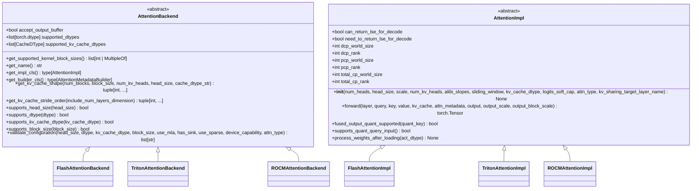
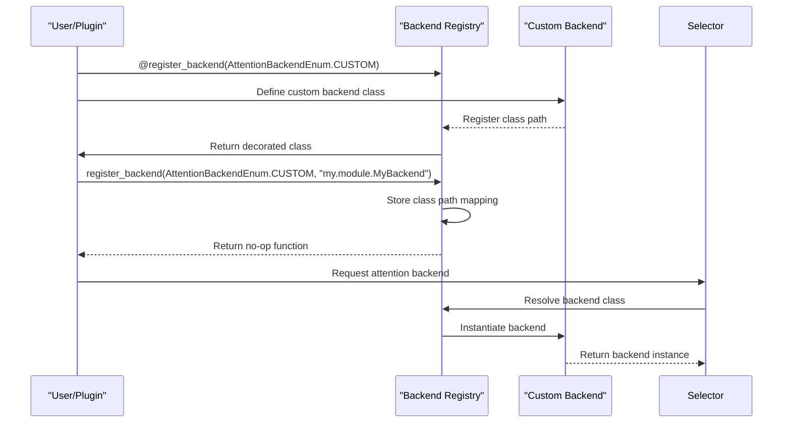
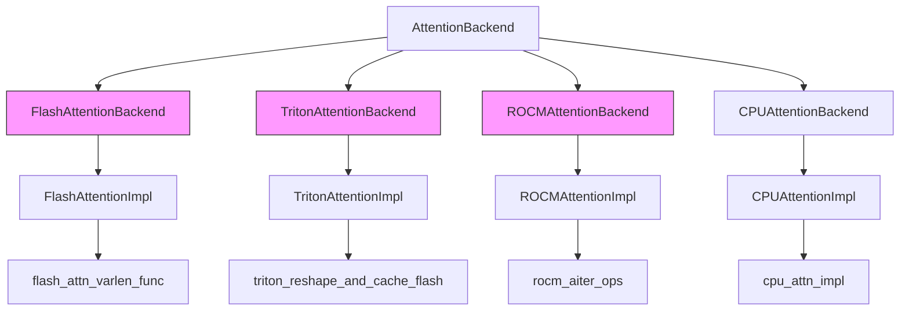
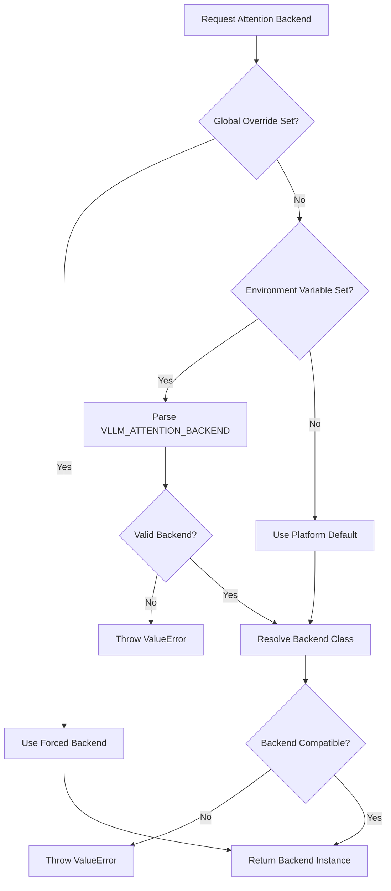
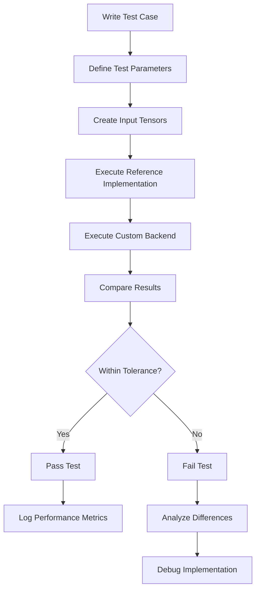

# Custom Attention Backends

<cite>
**Referenced Files in This Document**   
- [vllm/attention/backends/abstract.py](file://vllm/attention/backends/abstract.py)
- [vllm/attention/selector.py](file://vllm/attention/selector.py)
- [vllm/attention/backends/registry.py](file://vllm/attention/backends/registry.py)
- [vllm/v1/attention/backends/flash_attn.py](file://vllm/v1/attention/backends/flash_attn.py)
- [vllm/v1/attention/backends/triton_attn.py](file://vllm/v1/attention/backends/triton_attn.py)
- [tests/kernels/attention/test_attention.py](file://tests/kernels/attention/test_attention.py)
- [tests/kernels/attention/test_rocm_attention_selector.py](file://tests/kernels/attention/test_rocm_attention_selector.py)
</cite>

## Table of Contents
1. [Introduction](#introduction)
2. [AttentionBackend Interface](#attentionbackend-interface)
3. [Backend Registration and Discovery](#backend-registration-and-discovery)
4. [Concrete Backend Implementations](#concrete-backend-implementations)
5. [Attention Selector and Kernel Dispatching](#attention-selector-and-kernel-dispatching)
6. [Testing Custom Backends](#testing-custom-backends)
7. [Common Issues and Compatibility](#common-issues-and-compatibility)
8. [Conclusion](#conclusion)

## Introduction

The vLLM framework provides a flexible architecture for implementing custom attention backends, allowing optimization for different hardware platforms and attention types. This document details the AttentionBackend interface, registration mechanism, and integration with the system's attention selector. The architecture supports various attention implementations including FlashAttention, Triton, and ROCm-specific backends, enabling high-performance inference across different hardware configurations.

**Section sources**
- [vllm/attention/backends/abstract.py](file://vllm/attention/backends/abstract.py#L40-L435)
- [vllm/attention/selector.py](file://vllm/attention/selector.py#L81-L269)

## AttentionBackend Interface

The AttentionBackend interface, defined in `abstract.py`, serves as the foundation for all attention implementations in vLLM. This abstract base class defines the contract that all attention backends must follow, ensuring consistent behavior across different implementations.

The interface includes several key components:

- **Class-level attributes**: `accept_output_buffer`, `supported_dtypes`, and `supported_kv_cache_dtypes` define fundamental capabilities and constraints of the backend
- **Static methods**: `get_name()`, `get_impl_cls()`, `get_builder_cls()`, and `get_kv_cache_shape()` provide metadata and factory methods for the backend
- **Validation methods**: `supports_head_size()`, `supports_dtype()`, `supports_kv_cache_dtype()`, and `supports_block_size()` enable capability detection
- **Configuration validation**: `validate_configuration()` method checks compatibility with various attention parameters

The interface also defines the `AttentionImpl` abstract class, which all backend implementations must extend. This class requires the implementation of `__init__()` and `forward()` methods, with additional support for features like decode context parallelism through the `can_return_lse_for_decode` attribute.

**Diagram sources**
- [vllm/attention/backends/abstract.py](file://vllm/attention/backends/abstract.py#L40-L435)

**Section sources**
- [vllm/attention/backends/abstract.py](file://vllm/attention/backends/abstract.py#L40-L435)

## Backend Registration and Discovery

The backend registration system in vLLM enables dynamic discovery and selection of attention implementations through a registry pattern. The `registry.py` file defines the `AttentionBackendEnum` enumeration, which maps backend names to their corresponding class paths.

The registration mechanism provides several key features:

- **Enumeration of backends**: `AttentionBackendEnum` defines all supported backends with their default class paths
- **Runtime overrides**: The `register_backend()` decorator allows custom implementations to override existing backends or register new ones
- **Backward compatibility**: The `_Backend` class provides a deprecated alias for backward compatibility with plugins

The registration process supports both decorator-based and direct registration methods. When using the decorator pattern, the class path is automatically generated from the class's module and qualified name. For direct registration, the class path must be explicitly specified.

**Diagram sources**
- [vllm/attention/backends/registry.py](file://vllm/attention/backends/registry.py#L18-L287)

**Section sources**
- [vllm/attention/backends/registry.py](file://vllm/attention/backends/registry.py#L18-L287)

## Concrete Backend Implementations

The vLLM framework includes several concrete implementations of the AttentionBackend interface, each optimized for specific hardware and use cases. These implementations demonstrate how to extend the base interface to provide specialized functionality.

### FlashAttention Backend

The FlashAttention backend, implemented in `flash_attn.py`, provides high-performance attention for CUDA-capable devices. Key features include:

- Support for FlashAttention-1 and FlashAttention-2 kernels
- FP8 quantization support through `flash_attn_supports_fp8()`
- Sink token support for long context handling
- Compute capability requirements (>= 8.0)

The implementation validates compatibility through methods like `supports_head_size()` (requires head size divisible by 8 and ≤ 256) and `supports_compute_capability()`.

### Triton Attention Backend

The Triton backend, implemented in `triton_attn.py`, uses Triton kernels for attention computation. Key characteristics:

- Support for multiple data types including float32
- FP8 KV cache support
- Head size requirements (≥ 32)
- Block size constraints (must be multiple of 16)

The Triton backend demonstrates how to implement the metadata builder pattern with `TritonAttentionMetadataBuilder`, which handles the construction of attention metadata for kernel execution.

### ROCm Backends

The ROCm platform includes specialized backends like `ROCM_AITER_MLA` and `ROCM_AITER_FA` that leverage AMD's AITER (AMD Intra-Tile Efficient Reduction) technology for improved performance on ROCm-compatible hardware.

**Diagram sources**
- [vllm/v1/attention/backends/flash_attn.py](file://vllm/v1/attention/backends/flash_attn.py#L56-L200)
- [vllm/v1/attention/backends/triton_attn.py](file://vllm/v1/attention/backends/triton_attn.py#L150-L200)

**Section sources**
- [vllm/v1/attention/backends/flash_attn.py](file://vllm/v1/attention/backends/flash_attn.py#L56-L200)
- [vllm/v1/attention/backends/triton_attn.py](file://vllm/v1/attention/backends/triton_attn.py#L150-L200)

## Attention Selector and Kernel Dispatching

The attention selector, implemented in `selector.py`, is responsible for selecting the appropriate attention backend based on system configuration and workload characteristics. The selection process follows a priority order:

1. **Global override**: Check for a globally forced backend via `global_force_attn_backend()`
2. **Environment variable**: Check the `VLLM_ATTENTION_BACKEND` environment variable
3. **Platform-specific selection**: Delegate to the current platform's `get_attn_backend_cls()` method

The selector uses capability detection to ensure compatibility between the requested attention configuration and available backends. It validates parameters such as head size, data type, KV cache type, block size, and attention type (MHA, MGA, MLA) before selecting a backend.

The dispatching mechanism supports both automatic selection and explicit overrides, allowing users to target specific backends for performance tuning or debugging purposes. The selector also handles special cases like Mamba attention through the `get_mamba_attn_backend()` function.

**Diagram sources**
- [vllm/attention/selector.py](file://vllm/attention/selector.py#L81-L269)

**Section sources**
- [vllm/attention/selector.py](file://vllm/attention/selector.py#L81-L269)

## Testing Custom Backends

The vLLM framework provides a comprehensive test infrastructure in `tests/kernels/attention/` for validating custom attention backends. The testing approach includes:

- **Functional correctness tests**: Verify that the attention implementation produces results within acceptable tolerance of reference implementations
- **Performance benchmarks**: Measure throughput and latency under various configurations
- **Compatibility testing**: Validate support for different head sizes, data types, and attention configurations

The test suite uses parameterized testing to cover multiple scenarios, including different sequence lengths, head configurations, and data types. Tests validate both prefill and decode phases of attention computation.

Key testing considerations for custom backends:

- Implement tests that verify the `validate_configuration()` method correctly identifies incompatible configurations
- Test edge cases such as minimum and maximum sequence lengths
- Validate proper handling of padding and masking
- Ensure compatibility with quantization features when applicable

**Section sources**
- [tests/kernels/attention/test_attention.py](file://tests/kernels/attention/test_attention.py#L1-L200)
- [tests/kernels/attention/test_rocm_attention_selector.py](file://tests/kernels/attention/test_rocm_attention_selector.py#L37-L61)

## Common Issues and Compatibility

When implementing custom attention backends, several common issues may arise related to performance mismatches and compatibility:

### Performance Mismatches

- **Kernel launch overhead**: Triton kernels may have higher launch overhead compared to compiled CUDA kernels
- **Memory bandwidth limitations**: Inefficient memory access patterns can bottleneck performance
- **Register pressure**: High register usage can limit occupancy and throughput

### Compatibility Problems

- **Head size requirements**: Different backends have specific head size constraints (e.g., FlashAttention requires head size divisible by 8)
- **Data type support**: Not all backends support all data types (e.g., some may not support float32)
- **KV cache format**: Quantized KV cache formats may not be supported by all backends
- **Attention type compatibility**: MLA (Multi-Head Latent Attention) and other specialized attention types may require specific backend support

To address these issues, the framework provides comprehensive validation through the `validate_configuration()` method, which checks all compatibility requirements before selecting a backend. Developers should ensure their custom backends properly implement this method to prevent runtime errors.

**Section sources**
- [vllm/attention/backends/abstract.py](file://vllm/attention/backends/abstract.py#L161-L250)
- [vllm/v1/attention/backends/flash_attn.py](file://vllm/v1/attention/backends/flash_attn.py#L143-L178)

## Conclusion

The vLLM framework provides a robust and extensible architecture for implementing custom attention backends. By following the AttentionBackend interface and leveraging the registration system, developers can create optimized attention implementations for specific hardware platforms and use cases. The attention selector ensures proper backend selection based on capability detection, while the comprehensive test infrastructure enables thorough validation of new implementations. Understanding the interaction between these components is essential for developing high-performance attention backends that integrate seamlessly with the vLLM ecosystem.