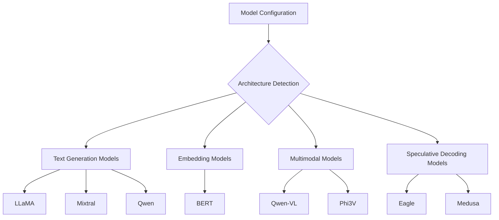
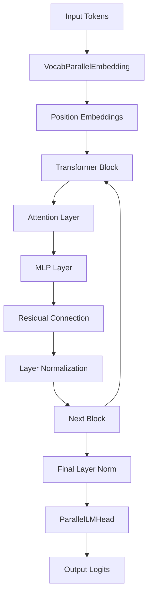
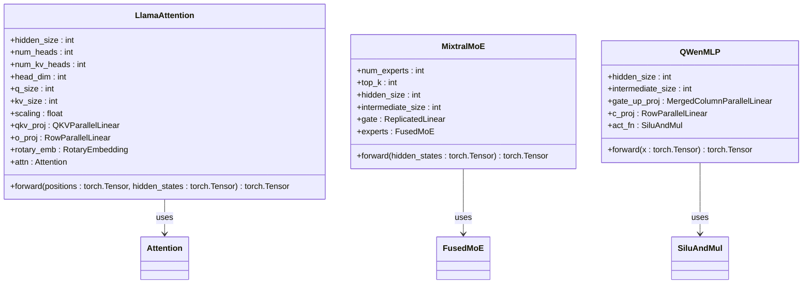
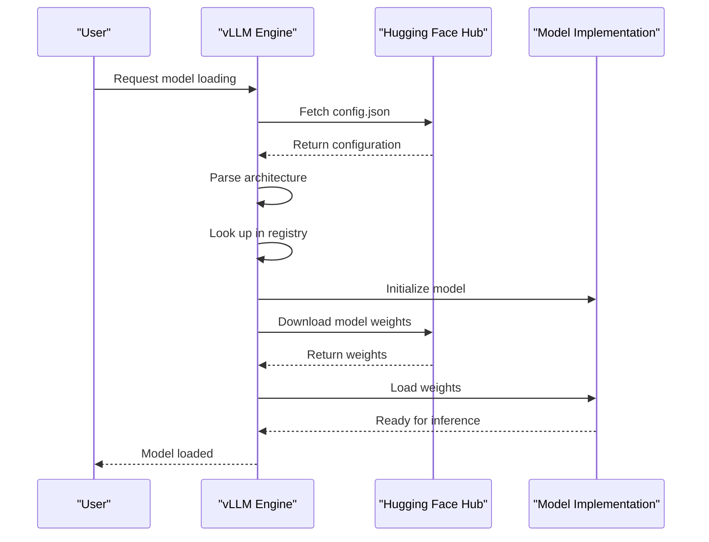
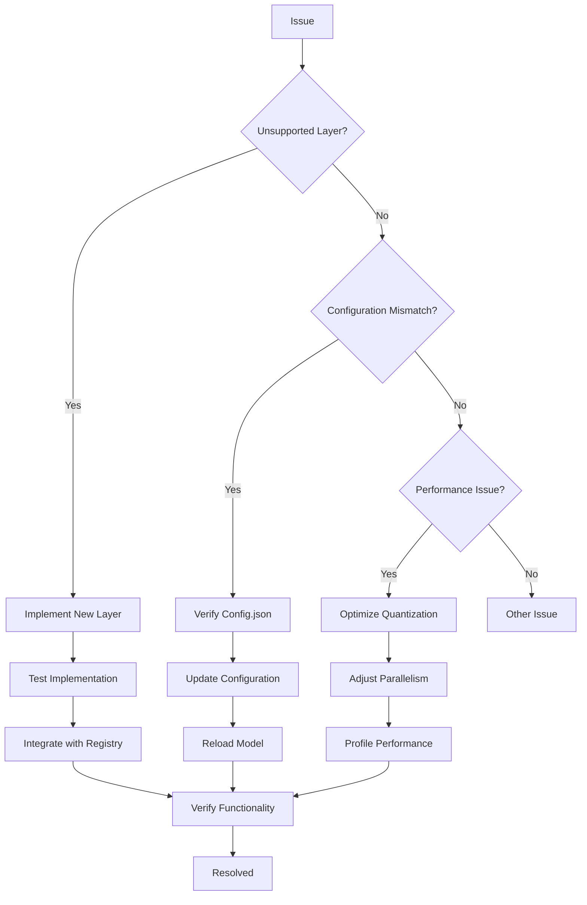

# Custom Models

<cite>
**Referenced Files in This Document**   
- [registry.py](file://vllm/model_executor/models/registry.py)
- [interfaces_base.py](file://vllm/model_executor/models/interfaces_base.py)
- [interfaces.py](file://vllm/model_executor/models/interfaces.py)
- [llama.py](file://vllm/model_executor/models/llama.py)
- [mixtral.py](file://vllm/model_executor/models/mixtral.py)
- [qwen.py](file://vllm/model_executor/models/qwen.py)
- [bloom.py](file://vllm/model_executor/models/bloom.py)
- [utils.py](file://vllm/model_executor/models/utils.py)
- [config.py](file://vllm/transformers_utils/config.py)
</cite>

## Table of Contents
1. [Introduction](#introduction)
2. [Model Registry System](#model-registry-system)
3. [Base Model Interface](#base-model-interface)
4. [Core Component Layers](#core-component-layers)
5. [Model Architecture Examples](#model-architecture-examples)
6. [Hugging Face Integration](#hugging-face-integration)
7. [Common Issues and Solutions](#common-issues-and-solutions)
8. [Implementing New Model Support](#implementing-new-model-support)
9. [Conclusion](#conclusion)

## Introduction
This document provides comprehensive guidance on supporting custom model architectures in vLLM. It covers the model registry system, base interfaces, core components, and integration with Hugging Face Transformers. The documentation includes concrete examples from the codebase showing how specific models implement their unique architectures and provides guidelines for implementing new model support.

## Model Registry System

The model registry system in vLLM serves as the central mechanism for discovering and registering model architectures. The system is implemented in `vllm/model_executor/models/registry.py` and uses a comprehensive dictionary-based approach to map model architectures to their corresponding implementation modules.

The registry contains several specialized dictionaries for different model types:
- `_TEXT_GENERATION_MODELS`: For decoder-only text generation models
- `_EMBEDDING_MODELS`: For embedding models
- `_CROSS_ENCODER_MODELS`: For cross-encoder models
- `_MULTIMODAL_MODELS`: For multimodal models
- `_SPECULATIVE_DECODING_MODELS`: For speculative decoding models
- `_TRANSFORMERS_SUPPORTED_MODELS`: For models compatible with Transformers backend

Each entry in these dictionaries follows the format `{"ModelClassName": ("module_name", "ModelClass")}`, where the model class name from the Hugging Face configuration is mapped to the corresponding vLLM implementation module and class.

The registry supports both eager and lazy model loading through the `_RegisteredModel` and `_LazyRegisteredModel` classes. The lazy loading approach is particularly important for avoiding CUDA initialization issues when importing models in subprocesses.



**Diagram sources**
- [registry.py](file://vllm/model_executor/models/registry.py#L66-L498)

**Section sources**
- [registry.py](file://vllm/model_executor/models/registry.py#L66-L800)

## Base Model Interface

The base model interface in vLLM defines the contract that all models must adhere to for compatibility with the inference engine. This interface is implemented through protocol classes in `vllm/model_executor/models/interfaces_base.py` and `vllm/model_executor/models/interfaces.py`.

The core interface `VllmModel` requires three essential methods:
- `__init__(self, vllm_config: VllmConfig, prefix: str = "")`: Constructor that accepts the vLLM configuration
- `embed_input_ids(self, input_ids: torch.Tensor) -> torch.Tensor`: Method to apply token embeddings to input IDs
- `forward(self, input_ids: torch.Tensor, positions: torch.Tensor) -> T_co`: Forward pass method

For text generation models, the `VllmModelForTextGeneration` interface extends the base interface with:
- `compute_logits(self, hidden_states: T) -> T | None`: Method to compute logits from hidden states

```mermaid
classDiagram
class VllmModel {
+__init__(vllm_config : VllmConfig, prefix : str)
+embed_input_ids(input_ids : torch.Tensor) torch.Tensor
+forward(input_ids : torch.Tensor, positions : torch.Tensor) T_co
}
class VllmModelForTextGeneration {
+compute_logits(hidden_states : T) T | None
}
class VllmModelForPooling {
+is_pooling_model : ClassVar[Literal[True]]
+default_pooling_type : ClassVar[PoolingTypeStr]
+attn_type : ClassVar[AttnTypeStr]
+pooler : Pooler
}
class SupportsLoRA {
+supports_lora : ClassVar[Literal[True]]
+packed_modules_mapping : dict[str, list[str]]
+embedding_modules : dict[str, str]
}
class SupportsPP {
+supports_pp : ClassVar[Literal[True]]
+make_empty_intermediate_tensors(batch_size : int, dtype : torch.dtype, device : torch.device) IntermediateTensors
+forward(*, intermediate_tensors : IntermediateTensors | None) IntermediateTensors | None
}
class SupportsMultiModal {
+supports_multimodal : ClassVar[Literal[True]]
+supports_multimodal_raw_input_only : ClassVar[bool]
+supports_encoder_tp_data : ClassVar[bool]
+merge_by_field_config : ClassVar[bool]
+multimodal_cpu_fields : ClassVar[Set[str]]
+_processor_factory : ClassVar[_ProcessorFactories]
+get_placeholder_str(modality : str, i : int) str | None
+embed_multimodal(**kwargs : object) MultiModalEmbeddings
+get_language_model() VllmModel
+embed_input_ids(input_ids : Tensor, multimodal_embeddings : MultiModalEmbeddings, *, is_multimodal : torch.Tensor, handle_oov_mm_token : bool = False) Tensor
}
VllmModel <|-- VllmModelForTextGeneration
VllmModel <|-- VllmModelForPooling
VllmModel <|-- SupportsLoRA
VllmModel <|-- SupportsPP
VllmModel <|-- SupportsMultiModal
```



**Diagram sources**
- [interfaces_base.py](file://vllm/model_executor/models/interfaces_base.py#L44-L244)
- [interfaces.py](file://vllm/model_executor/models/interfaces.py#L56-L784)

**Section sources**
- [interfaces_base.py](file://vllm/model_executor/models/interfaces_base.py#L1-L244)
- [interfaces.py](file://vllm/model_executor/models/interfaces.py#L1-L800)

## Core Component Layers

The core component layers in vLLM provide the fundamental building blocks for transformer-based architectures. These layers are implemented in the `vllm/model_executor/layers` module and are designed for high performance and memory efficiency.

### Attention Layers
The attention layer is a critical component that implements the multi-head attention mechanism. The base attention implementation handles:
- Query, key, and value projection
- Rotary position embeddings (RoPE)
- Attention computation with configurable scaling
- Key-value caching for efficient inference

The attention layer supports various attention types through the `AttentionType` enum and can be configured for different use cases such as decoder-only or encoder-decoder architectures.

### MLP Layers
The MLP (Multi-Layer Perceptron) layer implements the feed-forward network component of transformer blocks. The implementation varies slightly between different model architectures but generally follows the pattern of:
- Gate and up projection using `MergedColumnParallelLinear`
- Activation function (typically SiLU)
- Down projection using `RowParallelLinear`

For models like Mixtral that use Mixture of Experts (MoE), the MLP layer is replaced with a `FusedMoE` layer that implements expert routing and parallel computation.

### Embedding Layers
The embedding layers handle token and positional embeddings:
- `VocabParallelEmbedding`: Splits the vocabulary across tensor parallel workers
- `ParallelLMHead`: Parallel linear layer for the language model head
- Positional embeddings: Implemented through rotary embeddings (RoPE) for most modern architectures



**Diagram sources**
- [llama.py](file://vllm/model_executor/models/llama.py#L72-L112)
- [mixtral.py](file://vllm/model_executor/models/mixtral.py#L74-L153)
- [qwen.py](file://vllm/model_executor/models/qwen.py#L49-L77)

**Section sources**
- [llama.py](file://vllm/model_executor/models/llama.py#L72-L112)
- [mixtral.py](file://vllm/model_executor/models/mixtral.py#L74-L153)
- [qwen.py](file://vllm/model_executor/models/qwen.py#L49-L77)

## Model Architecture Examples

This section provides concrete examples of how specific models implement their unique architectures in vLLM.

### LLaMA Architecture
The LLaMA model implementation in `vllm/model_executor/models/llama.py` follows the standard transformer architecture with several optimizations:
- Uses RMSNorm instead of LayerNorm for better numerical stability
- Implements SiLU activation function for the MLP layer
- Supports grouped-query attention through configurable KV heads
- Uses rotary position embeddings with optional partial rotary factor

The attention layer handles the QKV projection with separate output sizes for queries and key/values, enabling grouped-query attention. The MLP layer uses a merged linear layer for the gate and up projections, followed by SiLU activation and a down projection.

### Mixtral Architecture
The Mixtral model in `vllm/model_executor/models/mixtral.py` implements a Mixture of Experts (MoE) architecture:
- Each transformer block contains a MoE layer with multiple experts
- Expert routing is performed using a gate network
- The implementation supports tensor parallelism across experts
- Includes support for expert parallelism load balancing (EPLB)

The MoE layer uses a fused kernel for efficient computation of multiple experts in parallel. The routing mechanism selects the top-k experts for each token, and the outputs are combined with learned weights.

### Qwen Architecture
The Qwen model in `vllm/model_executor/models/qwen.py` implements several unique features:
- Uses RMSNorm with a specific epsilon value
- Implements a custom MLP structure with a 2:1 ratio between intermediate and hidden sizes
- Supports specific rope parameters for position embeddings
- Handles attention with bias in the QKV projection

The Qwen implementation also includes special handling for its tokenizer and configuration, ensuring compatibility with the original Hugging Face implementation.



**Diagram sources**
- [llama.py](file://vllm/model_executor/models/llama.py#L115-L200)
- [mixtral.py](file://vllm/model_executor/models/mixtral.py#L74-L153)
- [qwen.py](file://vllm/model_executor/models/qwen.py#L49-L77)

**Section sources**
- [llama.py](file://vllm/model_executor/models/llama.py#L1-L705)
- [mixtral.py](file://vllm/model_executor/models/mixtral.py#L1-L600)
- [qwen.py](file://vllm/model_executor/models/qwen.py#L1-L364)

## Hugging Face Integration

The integration with Hugging Face Transformers configuration is a critical aspect of vLLM's model support system. This integration allows vLLM to leverage the extensive ecosystem of pre-trained models available through Hugging Face.

The configuration parsing is handled in `vllm/transformers_utils/config.py`, which extracts model architecture information from the Hugging Face config.json file. The system automatically detects the model type by examining the `architectures` field in the configuration.

When loading a model, vLLM follows these steps:
1. Parse the Hugging Face configuration to determine the model architecture
2. Look up the architecture in the model registry to find the corresponding vLLM implementation
3. Initialize the model with the appropriate configuration parameters
4. Load the model weights using the weight loading utilities

The system supports various configuration formats and can handle both local and remote model repositories. For remote GGUF models, it requires a config.json file to be present in the repository for proper configuration parsing.



**Diagram sources**
- [config.py](file://vllm/transformers_utils/config.py#L545-L582)
- [registry.py](file://vllm/model_executor/models/registry.py#L36-L498)

**Section sources**
- [config.py](file://vllm/transformers_utils/config.py#L1-L1000)
- [registry.py](file://vllm/model_executor/models/registry.py#L1-L1184)

## Common Issues and Solutions

This section addresses common issues encountered when working with custom model architectures in vLLM and provides solutions.

### Unsupported Layer Types
When a model contains layer types not supported by vLLM, the system will fail to initialize. To resolve this:
1. Check the model registry to see if the architecture is supported
2. If not supported, implement a new model class following the base interface
3. Register the new model architecture in the registry
4. Implement the necessary layers and weight loading logic

### Configuration Mismatches
Configuration mismatches between the Hugging Face config and vLLM expectations can cause initialization failures. Common issues include:
- Missing or incorrect architecture names
- Incompatible parameter names
- Unsupported configuration options

Solutions include:
- Ensuring the Hugging Face config.json file is present and correct
- Using the `hf_config_path` parameter to specify a custom configuration
- Updating the model implementation to handle the specific configuration

### Performance Optimization
For novel architectures, performance optimization is crucial. Key strategies include:
- Using appropriate quantization configurations
- Optimizing tensor parallelism settings
- Enabling kernel fusion where possible
- Properly configuring the cache for efficient memory usage

The model loader system in `vllm/model_executor/model_loader` provides utilities for optimizing weight loading and memory management.



**Diagram sources**
- [utils.py](file://vllm/model_executor/models/utils.py#L1-L833)
- [registry.py](file://vllm/model_executor/models/registry.py#L747-L792)

**Section sources**
- [utils.py](file://vllm/model_executor/models/utils.py#L1-L833)
- [registry.py](file://vllm/model_executor/models/registry.py#L1-L1184)

## Implementing New Model Support

Implementing support for new model architectures in vLLM follows a systematic process:

### Step 1: Analyze the Model Architecture
Before implementation, thoroughly analyze the target model's architecture:
- Review the original paper and documentation
- Examine the Hugging Face implementation
- Identify unique components and deviations from standard transformers

### Step 2: Implement the Model Class
Create a new model class that inherits from the appropriate base interfaces:
- Implement the required methods from `VllmModel`
- Define any architecture-specific components
- Ensure compatibility with vLLM's distributed execution

### Step 3: Register the Model
Add the new model to the registry in `vllm/model_executor/models/registry.py`:
```python
_TEXT_GENERATION_MODELS = {
    # ... existing models
    "NewModelForCausalLM": ("new_model", "NewModelForCausalLM"),
}
```

### Step 4: Implement Weight Loading
Create a weight loading mechanism that maps Hugging Face parameter names to vLLM's internal representation. Use the `AutoWeightsLoader` class to handle the loading process efficiently.

### Step 5: Testing
Thoroughly test the new model implementation:
- Verify functionality with small inputs
- Test with different batch sizes
- Validate distributed execution
- Compare outputs with the original implementation

The testing framework in `tests/models/` provides examples of how to structure tests for new models.


**Section sources**
- [registry.py](file://vllm/model_executor/models/registry.py#L747-L792)
- [utils.py](file://vllm/model_executor/models/utils.py#L110-L200)

## Conclusion
Supporting custom model architectures in vLLM requires understanding the model registry system, base interfaces, and core components. By following the patterns established in existing implementations and adhering to the defined interfaces, new models can be integrated efficiently. The system's modular design allows for extensibility while maintaining performance and compatibility with the Hugging Face ecosystem.