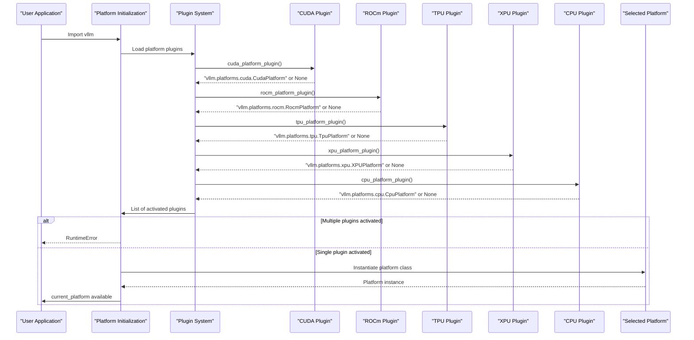
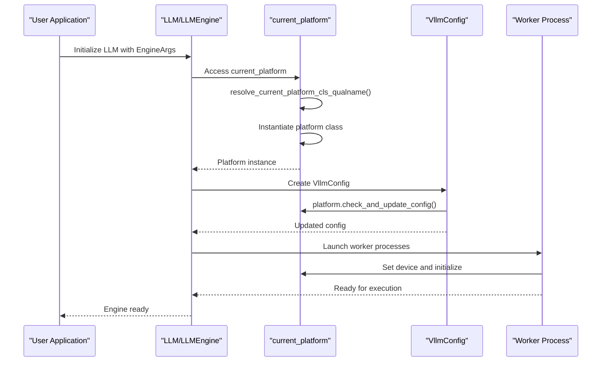

# Custom Platforms

<cite>
**Referenced Files in This Document**   
- [interface.py](file://vllm/platforms/interface.py)
- [__init__.py](file://vllm/platforms/__init__.py)
- [cuda.py](file://vllm/platforms/cuda.py)
- [rocm.py](file://vllm/platforms/rocm.py)
- [tpu.py](file://vllm/platforms/tpu.py)
- [xpu.py](file://vllm/platforms/xpu.py)
</cite>

## Table of Contents
1. [Introduction](#introduction)
2. [Platform Interface Definition](#platform-interface-definition)
3. [Platform Detection and Registration](#platform-detection-and-registration)
4. [Platform-Specific Implementations](#platform-specific-implementations)
5. [Core Platform Methods](#core-platform-methods)
6. [Memory Management](#memory-management)
7. [Execution Configuration](#execution-configuration)
8. [Device Detection](#device-detection)
9. [Platform Interaction with Core Engine](#platform-interaction-with-core-engine)
10. [Common Issues and Troubleshooting](#common-issues-and-troubleshooting)
11. [Implementing New Platform Support](#implementing-new-platform-support)
12. [Testing and Performance Validation](#testing-and-performance-validation)
13. [Conclusion](#conclusion)

## Introduction

The vLLM framework provides a flexible platform architecture that enables optimized execution across various hardware backends including CUDA, ROCm, TPU, XPU, and CPU. This document details the platform interface defined in `interface.py`, explaining how platform-specific implementations provide optimized paths for their respective hardware. The platform system allows vLLM to automatically detect and select the appropriate platform based on available hardware and configuration, enabling high-performance inference across diverse computing environments.

The platform architecture is designed to abstract hardware-specific details while providing optimized implementations for critical operations such as attention computation, memory management, and distributed communication. This abstraction enables vLLM to maintain a consistent interface across different hardware platforms while maximizing performance through platform-specific optimizations.

**Section sources**
- [interface.py](file://vllm/platforms/interface.py#L1-L657)
- [__init__.py](file://vllm/platforms/__init__.py#L1-L278)

## Platform Interface Definition

The `Platform` class defined in `interface.py` serves as the base interface for all hardware platform implementations in vLLM. This abstract base class defines the contract that all platform implementations must follow, ensuring consistent behavior across different hardware backends.

The `Platform` class includes several class-level attributes that define platform characteristics:

- `device_name`: String identifier for the platform (e.g., "cuda", "rocm")
- `device_type`: PyTorch device type string
- `dispatch_key`: Dispatch key used in PyTorch operator registration
- `ray_device_key`: Device key used by Ray for distributed execution
- `device_control_env_var`: Environment variable controlling device visibility
- `simple_compile_backend`: Default compilation backend for simple functions
- `dist_backend`: Distributed communication backend
- `supported_quantization`: List of supported quantization methods

The interface also defines numerous class methods that must be implemented by platform-specific subclasses, covering device detection, memory management, execution configuration, and hardware-specific optimizations.

```mermaid
classDiagram
class Platform {
<<abstract>>
+_enum : PlatformEnum
+device_name : str
+device_type : str
+dispatch_key : str
+ray_device_key : str
+device_control_env_var : str
+simple_compile_backend : str
+dist_backend : str
+supported_quantization : list[str]
+get_device_capability(device_id : int) : DeviceCapability | None
+get_device_name(device_id : int) : str
+get_device_total_memory(device_id : int) : int
+get_current_memory_usage(device : Device | None) : float
+set_device(device : torch.device) : None
+check_and_update_config(vllm_config : VllmConfig) : None
+verify_model_arch(model_arch : str) : None
+verify_quantization(quant : str) : None
+get_attn_backend_cls(selected_backend : AttentionBackendEnum, head_size : int, dtype : torch.dtype, kv_cache_dtype : CacheDType | None, block_size : int, use_mla : bool, has_sink : bool, use_sparse : bool) : str
+get_punica_wrapper() : str
+get_device_communicator_cls() : str
+supports_fp8() : bool
+use_custom_allreduce() : bool
+opaque_attention_op() : bool
}
class CudaPlatform {
+get_device_capability(device_id : int) : DeviceCapability
+get_device_name(device_id : int) : str
+get_device_total_memory(device_id : int) : int
+get_current_memory_usage(device : Device | None) : float
+set_device(device : torch.device) : None
+check_and_update_config(vllm_config : VllmConfig) : None
+get_attn_backend_cls(selected_backend : AttentionBackendEnum, head_size : int, dtype : torch.dtype, kv_cache_dtype : CacheDType | None, block_size : int, use_mla : bool, has_sink : bool, use_sparse : bool) : str
+get_punica_wrapper() : str
+get_device_communicator_cls() : str
+supports_fp8() : bool
+use_custom_allreduce() : bool
+opaque_attention_op() : bool
}
class RocmPlatform {
+get_device_capability(device_id : int) : DeviceCapability
+get_device_name(device_id : int) : str
+get_device_total_memory(device_id : int) : int
+get_current_memory_usage(device : Device | None) : float
+set_device(device : torch.device) : None
+check_and_update_config(vllm_config : VllmConfig) : None
+verify_model_arch(model_arch : str) : None
+verify_quantization(quant : str) : None
+get_attn_backend_cls(selected_backend : AttentionBackendEnum, head_size : int, dtype : torch.dtype, kv_cache_dtype : CacheDType | None, block_size : int, use_mla : bool, has_sink : bool, use_sparse : bool) : str
+get_punica_wrapper() : str
+get_device_communicator_cls() : str
+supports_fp8() : bool
+use_custom_allreduce() : bool
+opaque_attention_op() : bool
}
class TpuPlatform {
+get_device_name(device_id : int) : str
+get_device_total_memory(device_id : int) : int
+set_device(device : torch.device) : None
+check_and_update_config(vllm_config : VllmConfig) : None
+get_attn_backend_cls(selected_backend : AttentionBackendEnum, head_size : int, dtype : torch.dtype, kv_cache_dtype : CacheDType | None, block_size : int, use_mla : bool, has_sink : bool, use_sparse : bool) : str
+get_punica_wrapper() : str
+get_device_communicator_cls() : str
+inference_mode() : contextmanager
+is_pin_memory_available() : bool
+validate_request(prompt : PromptType, params : SamplingParams | PoolingParams, processed_inputs : ProcessorInputs) : None
}
class XpuPlatform {
+get_device_name(device_id : int) : str
+get_device_total_memory(device_id : int) : int
+get_current_memory_usage(device : Device | None) : float
+set_device(device : torch.device) : None
+check_and_update_config(vllm_config : VllmConfig) : None
+get_attn_backend_cls(selected_backend : AttentionBackendEnum, head_size : int, dtype : torch.dtype, kv_cache_dtype : CacheDType | None, block_size : int, use_mla : bool, has_sink : bool, use_sparse : bool) : str
+get_punica_wrapper() : str
+get_device_communicator_cls() : str
+supports_fp8() : bool
+opaque_attention_op() : bool
}
Platform <|-- CudaPlatform
Platform <|-- RocmPlatform
Platform <|-- TpuPlatform
Platform <|-- XpuPlatform
```



**Diagram sources**
- [interface.py](file://vllm/platforms/interface.py#L100-L657)
- [cuda.py](file://vllm/platforms/cuda.py#L98-L643)
- [rocm.py](file://vllm/platforms/rocm.py#L163-L514)
- [tpu.py](file://vllm/platforms/tpu.py#L36-L276)
- [xpu.py](file://vllm/platforms/xpu.py#L24-L262)

**Section sources**
- [interface.py](file://vllm/platforms/interface.py#L100-L657)

## Platform Detection and Registration

vLLM employs an automatic platform detection and registration mechanism that identifies the appropriate hardware platform at runtime. This system is implemented in `vllm/platforms/__init__.py` and follows a plugin-based architecture that supports both built-in and out-of-tree platform implementations.

The detection process begins with the `resolve_current_platform_cls_qualname()` function, which checks for available platform plugins in a specific order:

1. First, it attempts to load out-of-tree (OOT) platform plugins registered through the `vllm.platforms` entry point group
2. If no OOT plugins are found, it checks built-in platform plugins for CUDA, ROCm, TPU, XPU, and CPU
3. If no platform is detected, it falls back to `UnspecifiedPlatform`

Each platform plugin is a callable function that returns the fully qualified class name of the platform implementation if the platform is available, or `None` otherwise. For example, the CUDA platform plugin checks for NVIDIA GPU availability using NVML (NVIDIA Management Library), while the ROCm platform plugin uses AMD's `amdsmi` library.



**Diagram sources**
- [__init__.py](file://vllm/platforms/__init__.py#L182-L278)

**Section sources**
- [__init__.py](file://vllm/platforms/__init__.py#L1-L278)

## Platform-Specific Implementations

vLLM provides optimized implementations for several hardware platforms, each tailored to leverage the specific capabilities and optimizations of the underlying hardware.

### CUDA Platform

The CUDA platform implementation in `cuda.py` provides optimized paths for NVIDIA GPUs. It inherits from `CudaPlatformBase` and selects between `NvmlCudaPlatform` and `NonNvmlCudaPlatform` based on NVML availability. The platform supports advanced features like custom all-reduce operations, opaque attention operators, and hybrid KV cache.

Key characteristics:
- Device type: "cuda"
- Dispatch key: "CUDA"
- Ray device key: "GPU"
- Dist backend: "nccl"
- Device control env var: "CUDA_VISIBLE_DEVICES"

The CUDA platform implements sophisticated attention backend selection logic based on device capability, automatically choosing the most appropriate attention implementation (FlashAttention, FlashInfer, Triton, etc.) for the specific GPU architecture.

### ROCm Platform

The ROCm platform implementation in `rocm.py` targets AMD GPUs and provides optimized paths for MI300 series and other AMD hardware. It uses AMD's `amdsmi` library for device detection and management.

Key characteristics:
- Device type: "cuda" (uses PyTorch CUDA interface)
- Dispatch key: "CUDA"
- Ray device key: "GPU"
- Dist backend: "nccl"
- Device control env var: "CUDA_VISIBLE_DEVICES"

The ROCm platform supports FP8 quantization with FNUZ format on MI300 series GPUs and provides specialized attention backends like ROCM_AITER_FA for Flash Attention on gfx9 architectures.

### TPU Platform

The TPU platform implementation in `tpu.py` targets Google TPUs and uses the XLA (Accelerated Linear Algebra) compiler for optimized execution. It has specific requirements and limitations compared to GPU platforms.

Key characteristics:
- Device type: "tpu"
- Dispatch key: "XLA"
- Ray device key: "TPU"
- Dist backend: "gloo"
- Device control env var: "TPU_VISIBLE_CHIPS"
- Additional env vars: "TPU_CHIPS_PER_HOST_BOUNDS", "TPU_HOST_BOUNDS"

The TPU platform uses the OpenXLA compiler backend and has specific constraints, such as not supporting speculative decoding and requiring the use of bfloat16 precision.

### XPU Platform

The XPU platform implementation in `xpu.py` targets Intel GPUs and uses Intel's oneAPI extensions for PyTorch. It provides optimized paths for Intel Data Center GPUs and client GPUs.

Key characteristics:
- Device type: "xpu"
- Dispatch key: "XPU"
- Ray device key: "GPU"
- Dist backend: "ccl" or "xccl"
- Device control env var: "ZE_AFFINITY_MASK"

The XPU platform requires specific attention to memory management and has platform-specific constraints, such as not supporting static graph mode.

**Section sources**
- [cuda.py](file://vllm/platforms/cuda.py#L98-L643)
- [rocm.py](file://vllm/platforms/rocm.py#L163-L514)
- [tpu.py](file://vllm/platforms/tpu.py#L36-L276)
- [xpu.py](file://vllm/platforms/xpu.py#L24-L262)

## Core Platform Methods

The platform interface defines several core methods that are essential for hardware interaction and optimization. These methods are implemented differently by each platform to leverage hardware-specific capabilities.

### Device Capability Methods

The `get_device_capability()` method returns the compute capability of the device as a `DeviceCapability` namedtuple with major and minor version numbers. This information is used to determine feature support and select appropriate kernels.

```mermaid
flowchart TD
A[Get Device Capability] --> B{Platform Type}
B --> |CUDA| C[Use NVML or torch.cuda.get_device_capability]
B --> |ROCm| D[Use torch.cuda.get_device_capability]
B --> |TPU| E[Not implemented - returns None]
B --> |XPU| F[Not implemented - returns None]
C --> G[Return DeviceCapability(major, minor)]
D --> G
E --> H[Return None]
F --> H
```

**Diagram sources**
- [interface.py](file://vllm/platforms/interface.py#L248-L254)
- [cuda.py](file://vllm/platforms/cuda.py#L509-L607)
- [rocm.py](file://vllm/platforms/rocm.py#L333-L336)
- [tpu.py](file://vllm/platforms/tpu.py#L87-L91)
- [xpu.py](file://vllm/platforms/xpu.py#L87-L93)

### Attention Backend Selection

The `get_attn_backend_cls()` method determines the appropriate attention backend for the current platform and configuration. This method considers factors such as head size, data type, KV cache type, block size, and attention type to select the optimal implementation.

The selection process involves:
1. Validating the selected backend if specified
2. Finding all valid backends for the current configuration
3. Selecting the highest priority backend from the valid options

Each platform implements this method differently, with CUDA and ROCm platforms having sophisticated selection logic based on device capability and available libraries.

**Section sources**
- [interface.py](file://vllm/platforms/interface.py#L232-L245)
- [cuda.py](file://vllm/platforms/cuda.py#L323-L418)
- [rocm.py](file://vllm/platforms/rocm.py#L209-L322)
- [tpu.py](file://vllm/platforms/tpu.py#L57-L76)
- [xpu.py](file://vllm/platforms/xpu.py#L42-L78)

## Memory Management

Memory management is a critical aspect of platform implementation, with each platform providing optimized methods for memory allocation, deallocation, and monitoring.

### Memory Usage Monitoring

The `get_current_memory_usage()` method returns the current memory usage in bytes. Implementations vary by platform:

- **CUDA**: Uses `torch.cuda.max_memory_allocated()` after resetting peak statistics
- **ROCm**: Calculates usage as total memory minus free memory
- **XPU**: Uses `torch.xpu.max_memory_allocated()` after resetting peak statistics
- **TPU**: Not implemented (raises NotImplementedError)

```mermaid
flowchart TD
A[Get Current Memory Usage] --> B{Platform Type}
B --> |CUDA| C[torch.cuda.reset_peak_memory_stats()]
C --> D[torch.cuda.max_memory_allocated()]
B --> |ROCm| E[torch.cuda.mem_get_info()]
E --> F[total - free]
B --> |XPU| G[torch.xpu.reset_peak_memory_stats()]
G --> H[torch.xpu.max_memory_allocated()]
B --> |TPU| I[NotImplementedError]
D --> J[Return memory usage]
F --> J
H --> J
```

**Diagram sources**
- [interface.py](file://vllm/platforms/interface.py#L434-L441)
- [cuda.py](file://vllm/platforms/cuda.py#L255-L261)
- [rocm.py](file://vllm/platforms/rocm.py#L430-L434)
- [xpu.py](file://vllm/platforms/xpu.py#L200-L205)

### Memory Transfer Operations

Platforms implement optimized methods for transferring data between device and host memory:

- `insert_blocks_to_device()`: Copies blocks from source cache to destination cache on the device
- `swap_out_blocks_to_host()`: Copies blocks from device cache to host (CPU) cache

These methods are critical for operations like KV cache swapping and are optimized for each platform's memory architecture.

**Section sources**
- [cuda.py](file://vllm/platforms/cuda.py#L471-L493)
- [rocm.py](file://vllm/platforms/rocm.py#L430-L434)
- [tpu.py](file://vllm/platforms/tpu.py#L222-L244)
- [xpu.py](file://vllm/platforms/xpu.py#L240-L262)

## Execution Configuration

Platform implementations provide methods to configure execution parameters and validate compatibility with the current hardware.

### Configuration Validation

The `check_and_update_config()` method validates and updates the vLLM configuration for compatibility with the current platform. This method can raise exceptions for incompatible configurations or modify the configuration to ensure compatibility.

For example:
- CUDA platform sets default worker class and KV cache block size
- ROCm platform enables specific optimizations when CUDA graphs are used
- TPU platform forces DYNAMO_TRACE_ONCE compilation mode and disables CUDA graphs
- XPU platform sets appropriate block size and compilation mode

### Quantization Support

The `verify_quantization()` method checks whether a specific quantization method is supported by the platform. Platforms define their supported quantization methods in the `supported_quantization` class variable and can provide additional validation logic.

For example, the ROCm platform automatically enables `VLLM_USE_TRITON_AWQ` when AWQ quantization is used, ensuring optimal performance on AMD hardware.

**Section sources**
- [cuda.py](file://vllm/platforms/cuda.py#L151-L253)
- [rocm.py](file://vllm/platforms/rocm.py#L375-L398)
- [tpu.py](file://vllm/platforms/tpu.py#L114-L194)
- [xpu.py](file://vllm/platforms/xpu.py#L123-L186)

## Device Detection

Device detection methods provide information about the available hardware, enabling vLLM to optimize execution based on specific device characteristics.

### Device Identification

The `get_device_name()` and `get_device_uuid()` methods return identifying information about the device:

- **CUDA**: Uses NVML or `torch.cuda.get_device_name()` to get GPU name
- **ROCm**: Uses `amdsmi` to get ASIC information and maps device IDs to human-readable names
- **TPU**: Uses `tpu_info` to get chip type and returns "TPU {chip_type}"
- **XPU**: Uses `torch.xpu.get_device_name()` to get device name

### Device Memory

The `get_device_total_memory()` method returns the total memory of the device in bytes:

- **CUDA**: Uses NVML or `torch.cuda.get_device_properties().total_memory`
- **ROCm**: Uses `torch.cuda.get_device_properties().total_memory`
- **TPU**: Not implemented (raises NotImplementedError)
- **XPU**: Uses `torch.xpu.get_device_properties().total_memory`

**Section sources**
- [interface.py](file://vllm/platforms/interface.py#L304-L316)
- [cuda.py](file://vllm/platforms/cuda.py#L534-L537)
- [rocm.py](file://vllm/platforms/rocm.py#L360-L367)
- [tpu.py](file://vllm/platforms/tpu.py#L86-L91)
- [xpu.py](file://vllm/platforms/xpu.py#L96-L111)

## Platform Interaction with Core Engine

The platform system integrates closely with the vLLM core engine, influencing various aspects of model execution and optimization.

### Engine Initialization

During engine initialization, the platform system is automatically detected and configured. The `current_platform` singleton is lazily initialized when first accessed, ensuring that platform detection occurs after all plugins are loaded.



**Diagram sources**
- [__init__.py](file://vllm/platforms/__init__.py#L241-L265)
- [llm.py](file://vllm/entrypoints/llm.py#L1-L267)
- [llm_engine.py](file://vllm/engine/llm_engine.py#L1-L7)

### Runtime Interaction

During execution, the platform influences various operations:

- **Memory management**: Platform-specific memory allocation and deallocation
- **Kernel selection**: Attention and other kernels are selected based on platform capabilities
- **Distributed communication**: Platform-specific communicators handle inter-process communication
- **Compilation**: Platform-specific compilation backends optimize model execution

**Section sources**
- [interface.py](file://vllm/platforms/interface.py#L1-L657)
- [__init__.py](file://vllm/platforms/__init__.py#L1-L278)

## Common Issues and Troubleshooting

When working with custom platforms, several common issues may arise. Understanding these issues and their solutions is essential for successful deployment.

### Driver Compatibility

Driver compatibility issues can prevent platform detection or cause runtime errors:

- **CUDA**: Ensure NVIDIA drivers and CUDA toolkit are properly installed
- **ROCm**: Verify AMD GPU drivers and ROCm stack are correctly configured
- **TPU**: Confirm TPU runtime and `tpu_info` package are available
- **XPU**: Ensure Intel GPU drivers and oneAPI extensions are installed

### Memory Allocation Limits

Memory allocation issues can occur due to platform-specific limitations:

- **CUDA**: Use `CUDA_VISIBLE_DEVICES` to control device visibility
- **ROCm**: Set appropriate memory limits for MI300 series GPUs
- **TPU**: Configure `TPU_VISIBLE_CHIPS` and related environment variables
- **XPU**: Use `ZE_AFFINITY_MASK` to control device affinity

### Performance Tuning

Performance can be optimized through platform-specific configuration:

- **CUDA**: Enable custom all-reduce and appropriate attention backends
- **ROCm**: Use AITER optimizations and appropriate compilation settings
- **TPU**: Leverage XLA compilation and appropriate batch sizes
- **XPU**: Configure CCL/XPUL backend and optimize for Intel GPU architecture

**Section sources**
- [cuda.py](file://vllm/platforms/cuda.py#L98-L643)
- [rocm.py](file://vllm/platforms/rocm.py#L163-L514)
- [tpu.py](file://vllm/platforms/tpu.py#L36-L276)
- [xpu.py](file://vllm/platforms/xpu.py#L24-L262)

## Implementing New Platform Support

To implement support for a new hardware platform, follow these steps:

### Create Platform Class

Create a new class that inherits from `Platform` and implements the required methods:

```python
from vllm.platforms.interface import Platform, PlatformEnum

class NewPlatform(Platform):
    _enum = PlatformEnum.NEW_PLATFORM
    device_name: str = "new_platform"
    device_type: str = "new_device"
    dispatch_key: str = "NEW_DISPATCH"
    ray_device_key: str = "NEW_DEVICE"
    dist_backend: str = "new_backend"
    device_control_env_var: str = "NEW_DEVICE_VISIBLE"
    
    @classmethod
    def get_device_name(cls, device_id: int = 0) -> str:
        # Implementation
        pass
        
    @classmethod
    def get_device_total_memory(cls, device_id: int = 0) -> int:
        # Implementation
        pass
        
    # Implement other required methods
```

### Implement Detection Plugin

Create a detection plugin function that returns the platform class name if the hardware is available:

```python
def new_platform_plugin() -> str | None:
    # Check for hardware availability
    if hardware_available():
        return "vllm.platforms.new_platform.NewPlatform"
    return None
```

### Register Plugin

Register the plugin in your package's `setup.py` or `pyproject.toml`:

```python
# setup.py
entry_points={
    'vllm.platforms': [
        'new_platform = vllm_new_platform: new_platform_plugin',
    ],
}
```

### Test Implementation

Test the implementation thoroughly, verifying:
- Platform detection works correctly
- All required methods are implemented
- Performance is optimized for the hardware
- Edge cases and error conditions are handled properly

**Section sources**
- [interface.py](file://vllm/platforms/interface.py#L100-L657)
- [__init__.py](file://vllm/platforms/__init__.py#L182-L278)

## Testing and Performance Validation

Thorough testing and performance validation are essential when implementing or using platform support.

### Unit Testing

Create unit tests that verify platform-specific behavior:

- Device detection and initialization
- Memory management operations
- Attention backend selection
- Configuration validation
- Error handling for unsupported features

### Performance Benchmarking

Conduct performance benchmarking to validate that the platform implementation achieves expected performance:

- Measure throughput and latency for various model sizes
- Compare against baseline implementations
- Test under different load conditions
- Validate memory usage and efficiency

### Integration Testing

Perform integration testing to ensure the platform works correctly with the full vLLM system:

- Test with various model architectures
- Verify distributed execution
- Test with different quantization methods
- Validate compatibility with vLLM features like LoRA and speculative decoding

**Section sources**
- [test_seed_behavior.py](file://vllm/tests/test_seed_behavior.py#L1-L24)
- [test_oot_registration.py](file://vllm/tests/entrypoints/openai/test_oot_registration.py#L1-L44)

## Conclusion

The vLLM platform system provides a robust and extensible architecture for supporting diverse hardware backends. By defining a comprehensive interface in `interface.py` and implementing platform-specific optimizations in dedicated modules, vLLM achieves high performance across CUDA, ROCm, TPU, XPU, and CPU platforms.

The automatic platform detection and registration mechanism ensures that the appropriate platform is selected based on available hardware, while the plugin architecture allows for easy extension to support new platforms. The system balances abstraction with optimization, providing a consistent interface while enabling hardware-specific performance improvements.

When implementing or using custom platforms, it is essential to understand the platform interface, detection mechanism, and integration points with the core engine. Proper testing and performance validation ensure that platform implementations meet performance expectations and work correctly within the vLLM ecosystem.