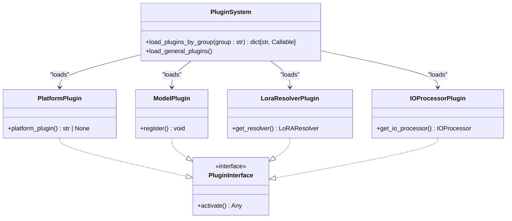
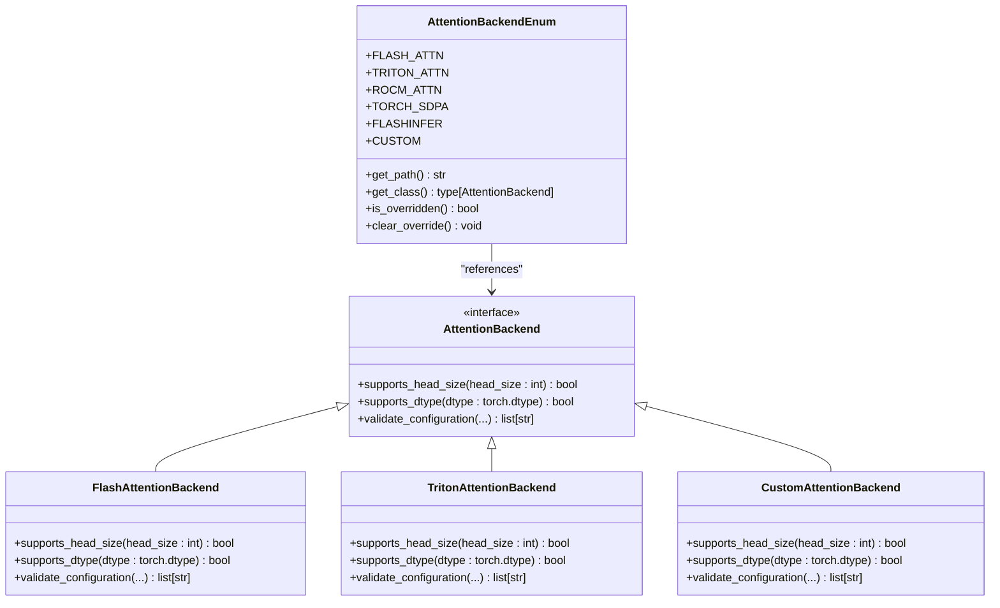
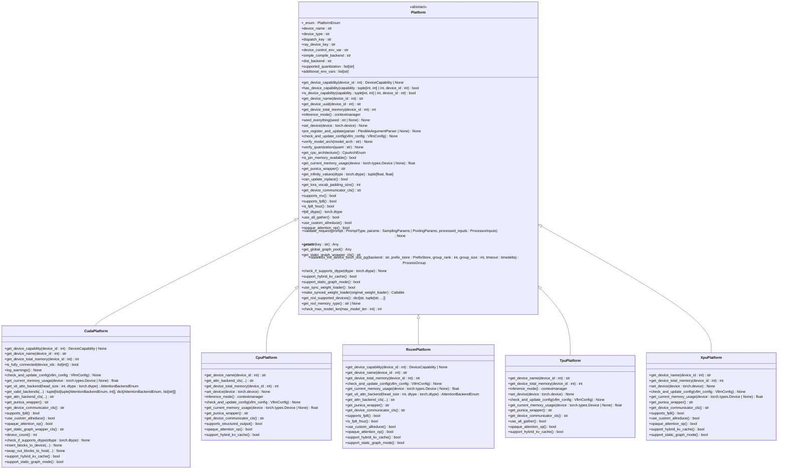
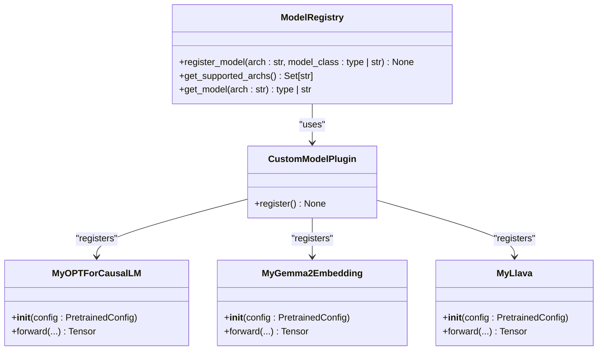
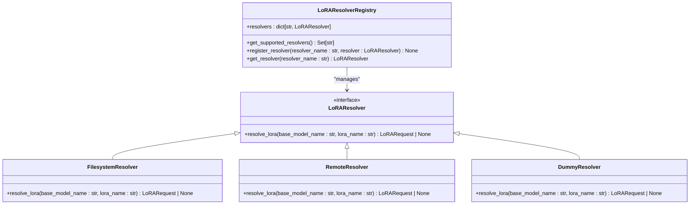
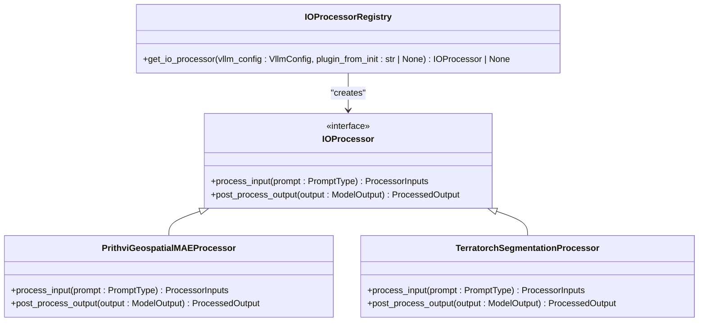

# Extending vLLM

<cite>
**Referenced Files in This Document**   
- [interface.py](file://vllm/platforms/interface.py)
- [__init__.py](file://vllm/platforms/__init__.py)
- [cuda.py](file://vllm/platforms/cuda.py)
- [cpu.py](file://vllm/platforms/cpu.py)
- [registry.py](file://vllm/attention/backends/registry.py)
- [layer.py](file://vllm/attention/layer.py)
- [resolver.py](file://vllm/lora/resolver.py)
- [__init__.py](file://vllm/plugins/__init__.py)
- [io_processors/__init__.py](file://vllm/plugins/io_processors/__init__.py)
- [lora_resolvers/filesystem_resolver.py](file://vllm/plugins/lora_resolvers/filesystem_resolver.py)
- [vllm_add_dummy_platform/__init__.py](file://tests/plugins/vllm_add_dummy_platform/vllm_add_dummy_platform/__init__.py)
- [vllm_add_dummy_model/__init__.py](file://tests/plugins/vllm_add_dummy_model/vllm_add_dummy_model/__init__.py)
</cite>

## Table of Contents
1. [Introduction](#introduction)
2. [Plugin Architecture Overview](#plugin-architecture-overview)
3. [Attention Backend Interface](#attention-backend-interface)
4. [Platform Interface](#platform-interface)
5. [Custom Model Registration](#custom-model-registration)
6. [LoRA Resolver System](#lora-resolver-system)
7. [IO Processor Plugins](#io-processor-plugins)
8. [Development and Testing Guidelines](#development-and-testing-guidelines)
9. [Distribution Methods](#distribution-methods)
10. [Troubleshooting Common Issues](#troubleshooting-common-issues)
11. [Conclusion](#conclusion)

## Introduction
vLLM provides a comprehensive plugin architecture that enables extensibility across multiple dimensions of the inference system. This documentation details the various extension points available in vLLM, including attention backends, hardware platforms, custom models, LoRA resolvers, and IO processors. The plugin system is designed to allow developers to customize vLLM's behavior without modifying the core codebase, enabling integration with specialized hardware, alternative attention implementations, and domain-specific processing pipelines. This extensibility architecture follows a modular design pattern that promotes loose coupling between components while maintaining a consistent interface contract.

**Section sources**
- [interface.py](file://vllm/platforms/interface.py#L1-L657)
- [__init__.py](file://vllm/plugins/__init__.py#L1-L82)

## Plugin Architecture Overview
vLLM implements a plugin system based on Python's entry points mechanism, allowing for out-of-tree extensions that can be dynamically loaded at runtime. The architecture is organized around several plugin groups, each serving a specific purpose within the system. The core plugin groups include general plugins, IO processor plugins, platform plugins, and stat logger plugins, each loaded in specific contexts and processes. This design enables selective extension of vLLM's functionality based on the deployment scenario and hardware environment. The plugin system follows the dependency inversion principle, where high-level modules depend on abstractions rather than concrete implementations, allowing for flexible substitution of components.

**Diagram sources**
- [__init__.py](file://vllm/plugins/__init__.py#L1-L82)
- [interface.py](file://vllm/platforms/interface.py#L1-L657)

**Section sources**
- [__init__.py](file://vllm/plugins/__init__.py#L1-L82)
- [interface.py](file://vllm/platforms/interface.py#L1-L657)

## Attention Backend Interface
The attention backend interface in vLLM provides a standardized contract for implementing alternative attention mechanisms. This interface allows for the integration of specialized attention implementations optimized for specific hardware or algorithmic requirements. The system uses a registry pattern to manage available backends, with each backend identified by a unique enum value that maps to its implementation class. The attention backend selection process considers factors such as hardware capabilities, model configuration, and performance characteristics to determine the optimal implementation at runtime. This abstraction enables vLLM to support multiple attention algorithms, including FlashAttention, Triton-based attention, ROCm-optimized attention, and custom implementations, while maintaining a consistent API for the rest of the system.

**Diagram sources**
- [registry.py](file://vllm/attention/backends/registry.py#L1-L287)
- [layer.py](file://vllm/attention/layer.py#L246-L281)

**Section sources**
- [registry.py](file://vllm/attention/backends/registry.py#L1-L287)
- [layer.py](file://vllm/attention/layer.py#L246-L281)

## Platform Interface
The platform interface in vLLM defines a comprehensive abstraction layer for supporting different hardware accelerators and execution environments. This interface encapsulates platform-specific functionality such as device management, memory allocation, distributed communication, and kernel execution. Each platform implementation must adhere to the defined contract, providing implementations for methods related to device capability detection, memory management, and execution configuration. The platform system uses a plugin discovery mechanism to automatically detect available hardware and select the appropriate implementation at runtime. This design enables vLLM to support diverse hardware ecosystems including CUDA, ROCm, TPU, XPU, and CPU platforms, while maintaining a consistent interface for the higher-level components.

**Diagram sources**
- [interface.py](file://vllm/platforms/interface.py#L1-L657)
- [cuda.py](file://vllm/platforms/cuda.py#L1-L643)
- [cpu.py](file://vllm/platforms/cpu.py#L1-L411)

**Section sources**
- [interface.py](file://vllm/platforms/interface.py#L1-L657)
- [cuda.py](file://vllm/platforms/cuda.py#L1-L643)
- [cpu.py](file://vllm/platforms/cpu.py#L1-L411)

## Custom Model Registration
vLLM supports the registration of custom models through a plugin system that allows for out-of-tree model implementations. This extensibility point enables developers to integrate proprietary or research models without modifying the core vLLM codebase. The model registration system uses a registry pattern where models are registered with a unique identifier and their corresponding implementation class. This approach supports both direct class references and lazy loading through string-based qualified names, providing flexibility in how models are integrated. The system also supports the registration of multimodal models and specialized architectures, making it suitable for a wide range of use cases beyond standard language models.

**Diagram sources**
- [vllm_add_dummy_model/__init__.py](file://tests/plugins/vllm_add_dummy_model/vllm_add_dummy_model/__init__.py#L1-L23)

**Section sources**
- [vllm_add_dummy_model/__init__.py](file://tests/plugins/vllm_add_dummy_model/vllm_add_dummy_model/__init__.py#L1-L23)

## LoRA Resolver System
The LoRA resolver system in vLLM provides a flexible mechanism for locating and loading LoRA (Low-Rank Adaptation) models based on their identifiers. This system uses a plugin architecture where multiple resolvers can be registered, each implementing a different strategy for locating LoRA models. The resolver system follows a chain-of-responsibility pattern, where each registered resolver is queried in sequence until one successfully resolves the requested LoRA model. This design enables integration with various storage systems, including local filesystems, remote repositories, and custom storage backends. The system also supports asynchronous resolution, allowing for non-blocking model loading in distributed environments.

**Diagram sources**
- [resolver.py](file://vllm/lora/resolver.py#L36-L83)
- [filesystem_resolver.py](file://vllm/plugins/lora_resolvers/filesystem_resolver.py)

**Section sources**
- [resolver.py](file://vllm/lora/resolver.py#L36-L83)
- [test_resolver.py](file://tests/lora/test_resolver.py#L1-L74)
- [test_lora_resolvers.py](file://tests/entrypoints/openai/test_lora_resolvers.py#L39-L74)
- [serving_models.py](file://vllm/entrypoints/openai/serving_models.py#L220-L314)

## IO Processor Plugins
IO processor plugins in vLLM enable the processing of multimodal inputs and specialized data formats. These plugins are responsible for handling input data that requires preprocessing before being fed into the language model, such as images, audio, or domain-specific data formats. The IO processor system uses a plugin architecture where each processor is associated with a specific model or task type, allowing for targeted preprocessing based on the model's requirements. This design enables vLLM to support a wide range of multimodal applications while maintaining a clean separation between data preprocessing and model inference. The system also supports offline inference scenarios where processed data can be saved for later use.

**Diagram sources**
- [io_processors/__init__.py](file://vllm/plugins/io_processors/__init__.py#L1-L69)
- [prithvi_geospatial_mae_io_processor.py](file://examples/pooling/plugin/prithvi_geospatial_mae_io_processor.py#L1-L59)

**Section sources**
- [io_processors/__init__.py](file://vllm/plugins/io_processors/__init__.py#L1-L69)
- [prithvi_geospatial_mae_io_processor.py](file://examples/pooling/plugin/prithvi_geospatial_mae_io_processor.py#L1-L59)

## Development and Testing Guidelines
When developing plugins for vLLM, it is essential to follow established guidelines to ensure compatibility and maintainability. Plugin developers should adhere to the interface contracts defined in the core system, ensuring that all required methods are implemented and that the behavior matches the documented expectations. Testing should include both unit tests for individual components and integration tests that verify the plugin works correctly within the full vLLM system. Developers should also consider performance implications, ensuring that their implementations are optimized for the target hardware and use case. The vLLM codebase includes example plugins that serve as templates for new implementations, demonstrating best practices for plugin development.

**Section sources**
- [vllm_add_dummy_platform/__init__.py](file://tests/plugins/vllm_add_dummy_platform/vllm_add_dummy_platform/__init__.py#L1-L7)
- [vllm_add_dummy_model/__init__.py](file://tests/plugins/vllm_add_dummy_model/vllm_add_dummy_model/__init__.py#L1-L23)

## Distribution Methods
vLLM plugins can be distributed using standard Python packaging mechanisms, making them easy to share and install. Plugins should be packaged as Python modules with appropriate entry points configured in their setup.py or pyproject.toml files. This allows the vLLM plugin discovery system to automatically detect and load the plugins when they are installed in the same environment. Distribution packages should include comprehensive documentation and examples to help users understand how to configure and use the plugin. Version compatibility should be carefully managed, with clear indications of which vLLM versions are supported by each plugin release.

**Section sources**
- [__init__.py](file://vllm/plugins/__init__.py#L1-L82)
- [vllm_add_dummy_platform/__init__.py](file://tests/plugins/vllm_add_dummy_platform/vllm_add_dummy_platform/__init__.py#L1-L7)
- [vllm_add_dummy_model/__init__.py](file://tests/plugins/vllm_add_dummy_model/vllm_add_dummy_model/__init__.py#L1-L23)

## Troubleshooting Common Issues
When working with vLLM plugins, several common issues may arise that require specific troubleshooting approaches. Compatibility problems often stem from version mismatches between the plugin and the core vLLM system, which can be resolved by ensuring that both components are using compatible versions. Configuration issues may occur when environment variables or command-line arguments are not set correctly for the target platform, requiring careful validation of the setup. Performance problems can result from suboptimal attention backend selection or memory configuration, which can be addressed by reviewing the platform-specific recommendations and adjusting the configuration accordingly. Debugging should leverage the logging system to identify the source of issues and verify that plugins are being loaded and initialized correctly.

**Section sources**
- [interface.py](file://vllm/platforms/interface.py#L1-L657)
- [__init__.py](file://vllm/platforms/__init__.py#L70-L286)
- [cuda.py](file://vllm/platforms/cuda.py#L1-L643)
- [cpu.py](file://vllm/platforms/cpu.py#L1-L411)

## Conclusion
vLLM's plugin architecture provides a robust foundation for extending the system's capabilities across multiple dimensions, including attention implementations, hardware platforms, custom models, and data processing pipelines. The modular design and well-defined interfaces enable developers to create specialized extensions without modifying the core codebase, promoting maintainability and reducing the risk of introducing bugs. By following the documented patterns and guidelines, developers can create high-quality plugins that integrate seamlessly with vLLM's ecosystem. The extensibility points described in this documentation represent a comprehensive set of tools for customizing vLLM to meet specific requirements, whether for research, production deployment, or specialized applications.