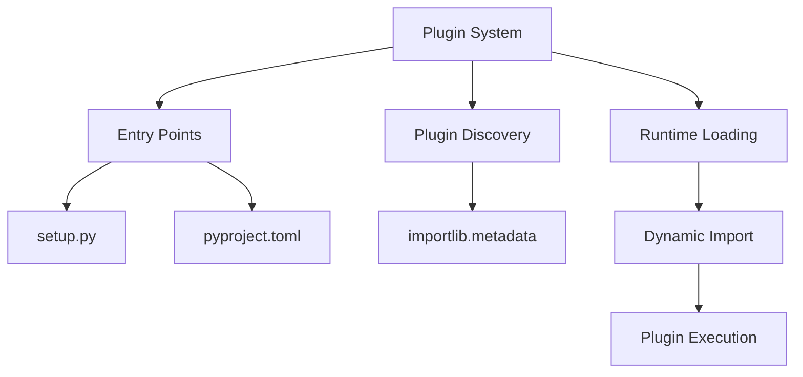
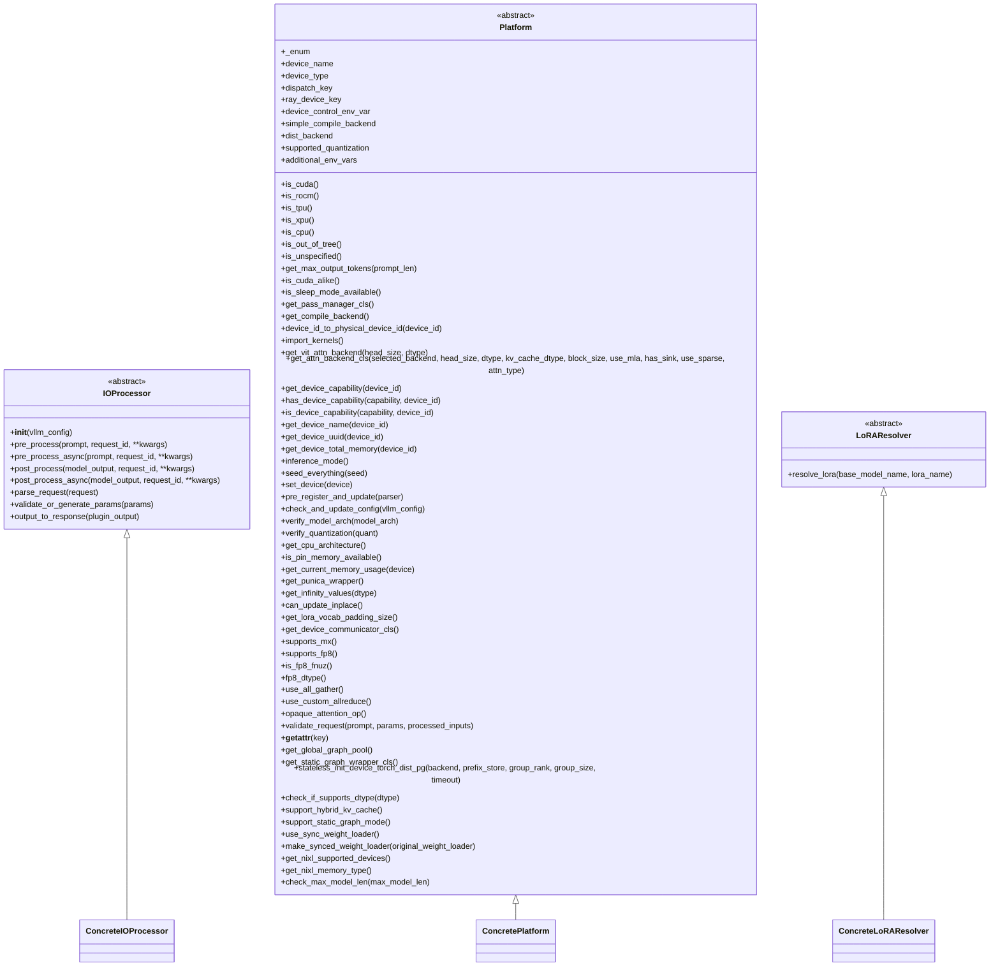
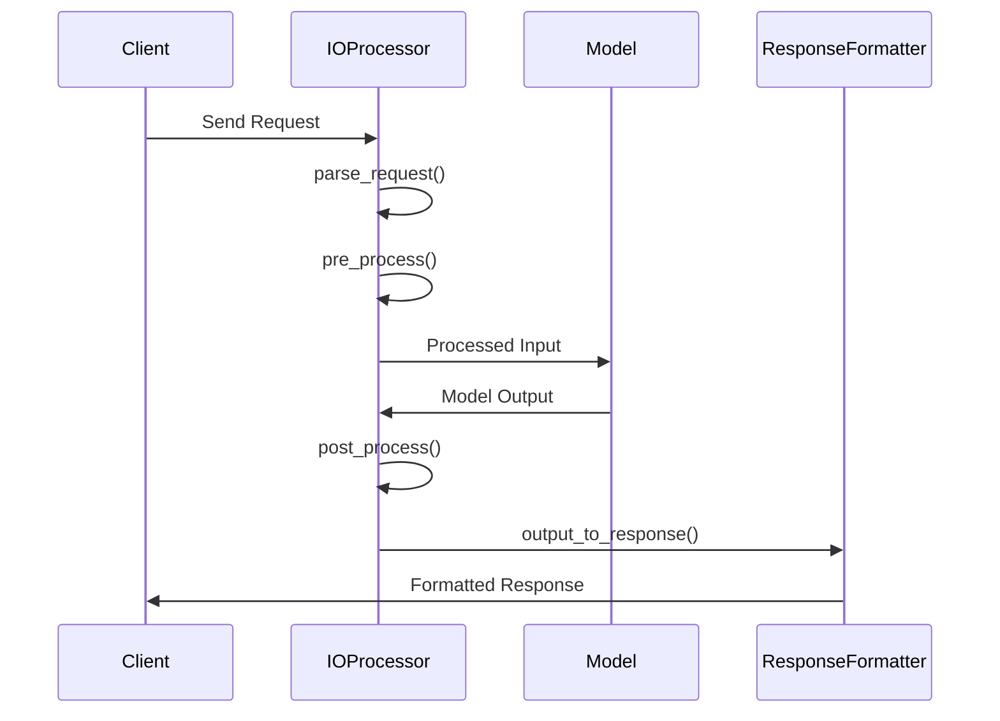
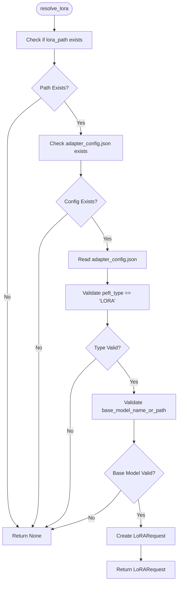
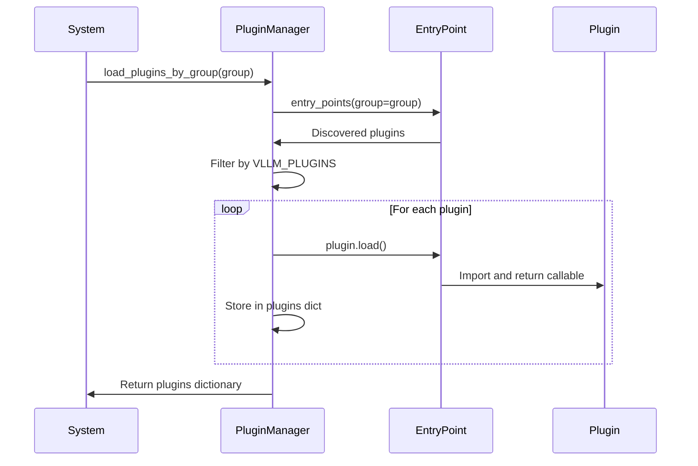
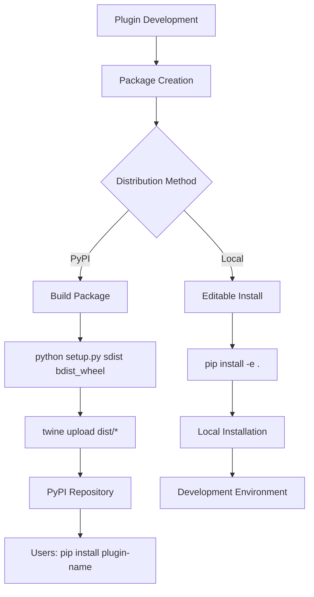

# Plugin Development Guide

<cite>
**Referenced Files in This Document**   
- [setup.py](file://setup.py)
- [pyproject.toml](file://pyproject.toml)
- [vllm/plugins/__init__.py](file://vllm/plugins/__init__.py)
- [vllm/plugins/io_processors/interface.py](file://vllm/plugins/io_processors/interface.py)
- [vllm/plugins/lora_resolvers/filesystem_resolver.py](file://vllm/plugins/lora_resolvers/filesystem_resolver.py)
- [vllm/platforms/interface.py](file://vllm/platforms/interface.py)
- [tests/plugins/prithvi_io_processor_plugin/prithvi_io_processor/prithvi_processor.py](file://tests/plugins/prithvi_io_processor_plugin/prithvi_io_processor/prithvi_processor.py)
- [tests/plugins/vllm_add_dummy_platform/setup.py](file://tests/plugins/vllm_add_dummy_platform/setup.py)
- [tests/plugins/vllm_add_dummy_stat_logger/setup.py](file://tests/plugins/vllm_add_dummy_stat_logger/setup.py)
</cite>

## Table of Contents
1. [Introduction](#introduction)
2. [Plugin System Architecture](#plugin-system-architecture)
3. [Entry Points in setup.py](#entry-points-in-setuppy)
4. [Plugin Interface Requirements](#plugin-interface-requirements)
5. [IO Processors Example](#io-processors-example)
6. [LoRA Resolvers Example](#lora-resolvers-example)
7. [Plugin Discovery and Loading](#plugin-discovery-and-loading)
8. [Distribution Methods](#distribution-methods)
9. [Best Practices](#best-practices)
10. [Testing Plugins](#testing-plugins)

## Introduction
This guide provides comprehensive documentation for developing and distributing vLLM plugins. The vLLM plugin system enables extensibility through various extension points including attention backends, platforms, IO processors, and LoRA resolvers. This document explains the architecture, interface requirements, and development practices for creating well-structured plugins that integrate seamlessly with the vLLM framework.

**Section sources**
- [vllm/plugins/__init__.py](file://vllm/plugins/__init__.py)

## Plugin System Architecture
The vLLM plugin system is built on Python's entry points mechanism, allowing for dynamic discovery and loading of extensions at runtime. The architecture is designed to be modular and extensible, with different plugin groups serving specific purposes within the system. The core components include:

- **General Plugins**: Loaded in all processes and executed immediately
- **IO Processor Plugins**: Handle input/output processing for specific model types
- **Platform Plugins**: Define platform-specific behavior and capabilities
- **Stat Logger Plugins**: Manage metrics and logging functionality

The plugin system uses setuptools entry points to register extensions, which are then discovered and loaded through the importlib.metadata API. This approach enables out-of-tree (OOT) extensions that can be developed and distributed independently of the core vLLM codebase.



**Diagram sources **
- [setup.py](file://setup.py)
- [pyproject.toml](file://pyproject.toml)
- [vllm/plugins/__init__.py](file://vllm/plugins/__init__.py)

**Section sources**
- [vllm/plugins/__init__.py](file://vllm/plugins/__init__.py)
- [setup.py](file://setup.py)
- [pyproject.toml](file://pyproject.toml)

## Entry Points in setup.py
The vLLM plugin system utilizes setuptools entry points defined in setup.py to register extension points. These entry points serve as the primary mechanism for plugin discovery and loading. The key entry point groups include:

- **vllm.general_plugins**: For general-purpose plugins that execute functions when loaded
- **vllm.io_processor_plugins**: For IO processor plugins that handle model-specific input/output processing
- **vllm.platform_plugins**: For platform-specific implementations that extend vLLM's capabilities
- **vllm.stat_logger_plugins**: For custom metrics and logging implementations

In the setup.py file, entry points are defined within the setup() function call, specifying the plugin name and the callable object that provides the plugin functionality. For example:

```python
setup(
    # ... other setup parameters
    entry_points={
        "vllm.general_plugins": [
            "dummy_custom_ops = vllm_add_dummy_platform:register_ops"
        ],
        "vllm.platform_plugins": [
            "dummy_platform_plugin = vllm_add_dummy_platform:dummy_platform_plugin"
        ],
    },
    # ... other setup parameters
)
```

This configuration allows the vLLM framework to discover and load plugins by their entry point group, enabling extensibility without modifying the core codebase.

**Section sources**
- [setup.py](file://setup.py)
- [pyproject.toml](file://pyproject.toml)

## Plugin Interface Requirements
vLLM plugins must adhere to specific interface requirements based on their type and extension point. The framework defines abstract base classes and protocols that plugins should implement to ensure compatibility and consistent behavior.

For IO processors, plugins must implement the IOProcessor abstract base class, which defines methods for pre-processing, post-processing, request parsing, and response generation. The interface includes both synchronous and asynchronous variants of processing methods to accommodate different use cases.

For platform plugins, extensions should inherit from the Platform base class and implement platform-specific functionality such as device capability detection, memory management, and distributed communication. The platform interface provides hooks for initialization, configuration validation, and runtime behavior customization.

LoRA resolvers must implement the LoRAResolver interface, which defines methods for resolving LoRA adapter configurations and creating LoRA requests. This enables custom logic for discovering and validating LoRA adapters from various sources.

All plugins should follow the principle of being idempotent and safe to load multiple times, as they may be loaded in different processes within the vLLM execution environment.



**Diagram sources **
- [vllm/plugins/io_processors/interface.py](file://vllm/plugins/io_processors/interface.py)
- [vllm/platforms/interface.py](file://vllm/platforms/interface.py)
- [vllm/lora/resolver.py](file://vllm/lora/resolver.py)

**Section sources**
- [vllm/plugins/io_processors/interface.py](file://vllm/plugins/io_processors/interface.py)
- [vllm/platforms/interface.py](file://vllm/platforms/interface.py)

## IO Processors Example
IO processors in vLLM handle the transformation of input data and model outputs for specific model types. The PrithviMultimodalDataProcessor serves as an example implementation that processes geospatial imagery data.

The IO processor follows the IOProcessor interface, implementing key methods for request parsing, pre-processing, post-processing, and response generation. The pre_process method transforms input imagery into a format suitable for model inference, handling tasks such as:

- Loading geotiff files from various sources (local paths, URLs, base64-encoded data)
- Normalizing pixel values and applying standardization
- Padding images to appropriate dimensions
- Creating data windows for batch processing

The post_process method converts model outputs back into the desired format, such as geotiff files with appropriate metadata. It handles:

- Reconstructing full images from prediction windows
- Converting predictions to appropriate data types
- Saving results in specified formats (path, base64 JSON)

The parse_request method validates and extracts parameters from incoming requests, while output_to_response formats the final output according to the API specification.

This example demonstrates how IO processors can encapsulate domain-specific data handling logic, enabling vLLM to support specialized models without modifying the core inference engine.



**Diagram sources **
- [tests/plugins/prithvi_io_processor_plugin/prithvi_io_processor/prithvi_processor.py](file://tests/plugins/prithvi_io_processor_plugin/prithvi_io_processor/prithvi_processor.py)
- [vllm/plugins/io_processors/interface.py](file://vllm/plugins/io_processors/interface.py)

**Section sources**
- [tests/plugins/prithvi_io_processor_plugin/prithvi_io_processor/prithvi_processor.py](file://tests/plugins/prithvi_io_processor_plugin/prithvi_io_processor/prithvi_processor.py)

## LoRA Resolvers Example
LoRA resolvers in vLLM provide a mechanism for discovering and validating LoRA adapters from various sources. The FilesystemResolver serves as an example implementation that locates LoRA adapters in a specified directory.

The resolver implements the LoRAResolver interface with the resolve_lora method, which takes a base model name and LoRA name as parameters and returns a LoRARequest object if a valid adapter is found. The implementation:

- Constructs the path to the LoRA adapter directory
- Checks for the existence of the adapter directory
- Validates the adapter configuration by reading adapter_config.json
- Verifies that the adapter is compatible with the specified base model
- Creates and returns a LoRARequest with appropriate parameters

The registration function register_filesystem_resolver initializes the resolver with the cache directory specified in the VLLM_LORA_RESOLVER_CACHE_DIR environment variable and registers it with the LoRAResolverRegistry. This enables the vLLM framework to use the filesystem resolver for LoRA adapter discovery.

This example demonstrates how LoRA resolvers can implement custom logic for adapter discovery, enabling integration with various storage systems and repository structures.



**Diagram sources **
- [vllm/plugins/lora_resolvers/filesystem_resolver.py](file://vllm/plugins/lora_resolvers/filesystem_resolver.py)

**Section sources**
- [vllm/plugins/lora_resolvers/filesystem_resolver.py](file://vllm/plugins/lora_resolvers/filesystem_resolver.py)

## Plugin Discovery and Loading
The vLLM plugin system uses Python's importlib.metadata API to discover and load plugins at runtime. The process begins with the load_plugins_by_group function in vllm/plugins/__init__.py, which takes an entry point group name as a parameter and returns a dictionary of discovered plugins.

The discovery process involves:
1. Calling importlib.metadata.entry_points() with the specified group
2. Logging available plugins and their entry point values
3. Filtering plugins based on the VLLM_PLUGINS environment variable if set
4. Loading each plugin using the entry_point.load() method
5. Storing the loaded callable objects in a dictionary

For general plugins, the load_general_plugins function ensures that plugins are loaded only once across multiple processes. It uses a global flag (plugins_loaded) to prevent duplicate loading and executes the loaded functions immediately.

Platform plugins follow a more complex resolution process in resolve_current_platform_cls_qualname, which:
1. Discovers both built-in and out-of-tree platform plugins
2. Validates that only one plugin is activated
3. Resolves the qualified class name of the activated platform
4. Returns the class name for instantiation

The lazy loading approach ensures that plugins are only imported when needed, reducing startup time and memory usage. The system also provides mechanisms for controlling which plugins to load through the VLLM_PLUGINS environment variable, allowing users to selectively enable specific extensions.



**Diagram sources **
- [vllm/plugins/__init__.py](file://vllm/plugins/__init__.py)

**Section sources**
- [vllm/plugins/__init__.py](file://vllm/plugins/__init__.py)

## Distribution Methods
vLLM plugins can be distributed through PyPI or installed locally using setuptools. The distribution process involves packaging the plugin code and configuring the setup.py file with appropriate entry points.

For PyPI distribution, plugins should follow standard Python packaging practices:
1. Create a setup.py file with the necessary metadata and entry points
2. Build the distribution package using python setup.py sdist bdist_wheel
3. Upload to PyPI using twine upload dist/*

The setup.py file must include entry points in the appropriate groups (vllm.general_plugins, vllm.io_processor_plugins, etc.) to ensure proper discovery by the vLLM framework. For example:

```python
setup(
    name="vllm_add_dummy_platform",
    version="0.1",
    packages=["vllm_add_dummy_platform"],
    entry_points={
        "vllm.platform_plugins": [
            "dummy_platform_plugin = vllm_add_dummy_platform:dummy_platform_plugin"
        ],
        "vllm.general_plugins": [
            "dummy_custom_ops = vllm_add_dummy_platform:register_ops"
        ],
    },
)
```

For local installation, developers can use pip install -e . to install the plugin in editable mode, which is useful during development. This allows for immediate testing of changes without rebuilding the package.

The vLLM framework respects the VLLM_PLUGINS environment variable, which can be used to control which plugins are loaded. This enables selective activation of plugins in different environments and simplifies testing and debugging.



**Diagram sources **
- [tests/plugins/vllm_add_dummy_platform/setup.py](file://tests/plugins/vllm_add_dummy_platform/setup.py)
- [tests/plugins/vllm_add_dummy_stat_logger/setup.py](file://tests/plugins/vllm_add_dummy_stat_logger/setup.py)

**Section sources**
- [tests/plugins/vllm_add_dummy_platform/setup.py](file://tests/plugins/vllm_add_dummy_platform/setup.py)
- [tests/plugins/vllm_add_dummy_stat_logger/setup.py](file://tests/plugins/vllm_add_dummy_stat_logger/setup.py)

## Best Practices
When developing vLLM plugins, follow these best practices to ensure reliability, maintainability, and compatibility:

**Error Handling**: Implement comprehensive error handling with appropriate logging. Use try-except blocks to catch and handle exceptions gracefully, providing meaningful error messages that aid in debugging. For example, the FilesystemResolver includes validation of the cache directory and provides clear error messages when configuration is invalid.

**Logging**: Use the vLLM logging system consistently throughout the plugin. Import and use the logger from vllm.logger.init_logger(__name__) to ensure logs are properly formatted and directed to the appropriate output. Use appropriate log levels (debug, info, warning, error) based on the severity of the message.

**Configuration**: Design plugins to be configurable through environment variables or configuration files. Follow the vLLM convention of using VLLM_ prefix for environment variables. Provide clear documentation of all configuration options and their default values.

**Idempotency**: Ensure plugins can be safely loaded multiple times, as they may be loaded in different processes within the vLLM execution environment. Avoid side effects in the import phase and use global flags to prevent duplicate initialization when necessary.

**Testing**: Include comprehensive tests for all plugin functionality. Use the vLLM test framework and follow the pattern of test files in the tests/plugins_tests directory. Test both successful cases and error conditions to ensure robustness.

**Documentation**: Provide clear documentation of the plugin's purpose, usage, and configuration options. Include examples of how to install and use the plugin. Document any dependencies and compatibility requirements.

**Version Compatibility**: Specify version requirements for dependencies in the setup.py file. Test the plugin with different versions of vLLM to ensure compatibility. Use semantic versioning for the plugin itself to communicate breaking changes.

**Dependency Management**: Minimize dependencies to reduce potential conflicts. When dependencies are necessary, specify exact versions or version ranges that are known to work. Consider using optional dependencies for non-essential features.

**Performance**: Optimize plugin code for performance, especially for operations that are executed frequently. Avoid unnecessary computations or I/O operations in critical paths. Use asynchronous methods when appropriate to prevent blocking.

**Security**: Validate all inputs and sanitize data when necessary. Avoid executing arbitrary code from untrusted sources. Follow secure coding practices to prevent common vulnerabilities.

**Modularity**: Design plugins to be focused and single-purpose. If a plugin grows too complex, consider splitting it into multiple smaller plugins that can be used independently.

**Section sources**
- [vllm/plugins/__init__.py](file://vllm/plugins/__init__.py)
- [vllm/plugins/io_processors/interface.py](file://vllm/plugins/io_processors/interface.py)
- [vllm/plugins/lora_resolvers/filesystem_resolver.py](file://vllm/plugins/lora_resolvers/filesystem_resolver.py)

## Testing Plugins
Testing vLLM plugins requires a comprehensive approach that validates functionality, compatibility, and integration with the core framework. The testing strategy should include:

**Unit Testing**: Test individual components and methods in isolation. For example, the test_io_processor_plugins.py file tests the IO processor plugin system by verifying that plugins are discovered and loaded correctly. Use pytest fixtures and parameterized tests to cover various scenarios.

**Integration Testing**: Test the plugin's interaction with the vLLM framework. The test_platform_plugins.py file demonstrates how to test platform plugins by running an example workload and verifying that the plugin is activated correctly. Use monkeypatch to control environment variables and simulate different conditions.

**Environment Variables**: Test how the plugin behaves with different environment variable settings. The VLLM_PLUGINS variable can be used to control which plugins are loaded, allowing tests to verify that plugins are discovered and activated as expected.

**Error Conditions**: Test how the plugin handles error conditions and invalid inputs. Verify that appropriate error messages are logged and that the system fails gracefully when necessary.

**Multiple Processes**: Test plugin behavior in multi-process environments, as plugins may be loaded in different processes. Ensure that plugins are idempotent and can be safely loaded multiple times.

**Version Compatibility**: Test the plugin with different versions of vLLM and its dependencies. Verify that the plugin works correctly across supported versions and handles version-specific differences appropriately.

**Performance Testing**: Measure the performance impact of the plugin on inference latency and throughput. Compare performance with and without the plugin to identify any bottlenecks.

```mermaid
flowchart TD
A[Testing Strategy] --> B[Unit Testing]
A --> C[Integration Testing]
A --> D[Environment Testing]
A --> E[Error Testing]
A --> F[Multi-process Testing]
A --> G[Version Testing]
A --> H[Performance Testing]
B --> B1[Test individual methods]
B --> B2[Use parameterized tests]
B --> B3[Test edge cases]
C --> C1[Test with example workloads]
C --> C2[Verify plugin activation]
C --> C3[Test integration points]
D --> D1[Test with VLLM_PLUGINS]
D --> D2[Test different configurations]
D --> D3[Test environment variables]
E --> E1[Test invalid inputs]
E --> E2[Test error handling]
E --> E3[Test graceful failure]
F --> F1[Test in multiple processes]
F --> F2[Test idempotency]
F --> F3[Test race conditions]
G --> G1[Test with different vLLM versions]
G --> G2[Test dependency versions]
G --> G3[Test backward compatibility]
H --> H1[Test inference latency]
H --> H2[Test throughput]
H --> H3[Test memory usage]
```

The vLLM test framework provides utilities for testing plugins, including mock objects and test fixtures that simplify the testing process. Tests should be placed in the tests/plugins_tests directory and follow the naming convention test_<plugin_type>_plugins.py.



**Diagram sources **
- [tests/plugins_tests/test_io_processor_plugins.py](file://tests/plugins_tests/test_io_processor_plugins.py)
- [tests/plugins_tests/test_platform_plugins.py](file://tests/plugins_tests/test_platform_plugins.py)
- [tests/plugins_tests/test_stats_logger_plugins.py](file://tests/plugins_tests/test_stats_logger_plugins.py)

**Section sources**
- [tests/plugins_tests/test_io_processor_plugins.py](file://tests/plugins_tests/test_io_processor_plugins.py)
- [tests/plugins_tests/test_platform_plugins.py](file://tests/plugins_tests/test_platform_plugins.py)
- [tests/plugins_tests/test_stats_logger_plugins.py](file://tests/plugins_tests/test_stats_logger_plugins.py)