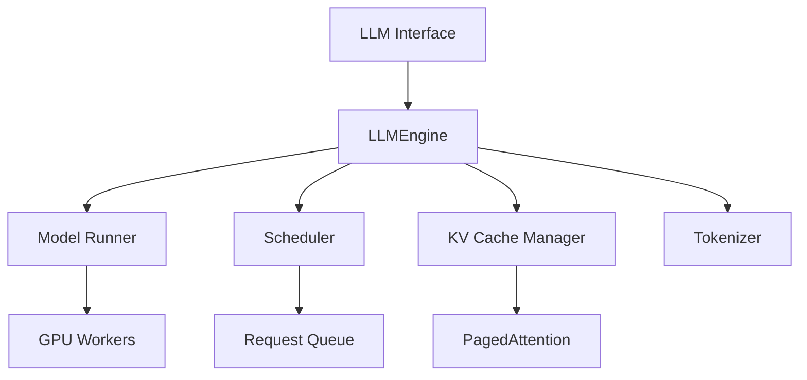

# Getting Started

<cite>
**Referenced Files in This Document**   
- [README.md](file://README.md)
- [setup.py](file://setup.py)
- [pyproject.toml](file://pyproject.toml)
- [requirements/common.txt](file://requirements/common.txt)
- [requirements/cuda.txt](file://requirements/cuda.txt)
- [requirements/cpu.txt](file://requirements/cpu.txt)
- [vllm/entrypoints/llm.py](file://vllm/entrypoints/llm.py)
- [examples/offline_inference/batch_llm_inference.py](file://examples/offline_inference/batch_llm_inference.py)
- [examples/offline_inference/async_llm_streaming.py](file://examples/offline_inference/async_llm_streaming.py)
</cite>

## Table of Contents
1. [Introduction](#introduction)
2. [Prerequisites](#prerequisites)
3. [Installation](#installation)
4. [Basic Inference Workflow](#basic-inference-workflow)
5. [Advanced Inference Features](#advanced-inference-features)
6. [Understanding the LLM Interface](#understanding-the-llm-interface)
7. [Common Setup Issues and Solutions](#common-setup-issues-and-solutions)
8. [Performance Considerations](#performance-considerations)

## Introduction

vLLM is a high-throughput and memory-efficient library for large language model (LLM) inference and serving. It enables users to quickly set up and run inference engines with state-of-the-art performance through advanced memory management techniques like PagedAttention, continuous batching, and optimized CUDA kernels. This guide provides comprehensive instructions for installing vLLM and performing basic inference operations, enabling users to rapidly deploy and experiment with LLMs.

The vLLM library offers a simple yet powerful interface for generating text from language models, with support for various hardware configurations including NVIDIA GPUs, AMD GPUs, Intel GPUs, and CPU-only setups. Its design focuses on maximizing throughput while minimizing latency, making it suitable for both research and production environments.

**Section sources**
- [README.md](file://README.md#L67-L92)

## Prerequisites

Before installing vLLM, ensure your system meets the following requirements:

**Python Version Requirements**
vLLM requires Python 3.10 or higher, with support up to Python 3.13. The library is compatible with modern Python environments and leverages recent language features for optimal performance.

**Hardware and Driver Compatibility**
- **NVIDIA GPUs**: CUDA 12.x or later is recommended for optimal performance. Ensure you have the appropriate NVIDIA drivers installed (version 525 or higher).
- **AMD GPUs**: ROCm 5.7 or later is required. AMD Instinct™ MI200 series and MI300 series GPUs are supported.
- **Intel GPUs**: Intel Arc™ and Data Center GPU Max Series are supported with oneAPI.
- **TPU**: Google Cloud TPU v4 and v5 configurations are supported.
- **CPU**: x86_64, ARM64, PowerPC, and s390x architectures are supported.

**System Requirements**
- Minimum 16GB RAM for small models (7B parameters)
- At least 32GB RAM recommended for larger models (13B+ parameters)
- Sufficient disk space for model weights (varies by model size)
- For GPU inference, ensure adequate VRAM based on model size

**Section sources**
- [pyproject.toml](file://pyproject.toml#L23-L26)
- [setup.py](file://setup.py#L22)
- [README.md](file://README.md#L89)

## Installation

vLLM can be installed through pip with different options depending on your hardware configuration. The installation process automatically handles dependencies based on your target device.

### CUDA Installation
For NVIDIA GPU support, install vLLM using pip:

```bash
pip install vllm
```

This command installs vLLM with CUDA support and automatically detects your CUDA version. The installation includes optimized kernels for your specific GPU architecture.

### ROCm Installation
For AMD GPU support, set the target device environment variable before installation:

```bash
VLLM_TARGET_DEVICE=rocm pip install vllm
```

Alternatively, you can install directly from the ROCm-specific requirements:

```bash
pip install vllm -f https://download.pytorch.org/whl/rocm5.7/torch
```

### CPU-Only Installation
For CPU-only inference (useful for development or systems without GPUs):

```bash
VLLM_TARGET_DEVICE=cpu pip install vllm
```

This installs vLLM with CPU-optimized operations and Intel Extension for PyTorch for x86_64 systems.

### From Source Installation
For development or custom configurations, install from source:

```bash
git clone https://github.com/vllm-project/vllm.git
cd vllm
pip install -e .
```

This approach allows you to modify the source code and contribute to the project.

**Section sources**
- [README.md](file://README.md#L106-L108)
- [setup.py](file://setup.py#L42-L61)
- [pyproject.toml](file://pyproject.toml#L9)

## Basic Inference Workflow

The basic inference workflow with vLLM involves three main steps: importing the LLM class, loading a model, and generating text. This section demonstrates the core functionality with practical examples.

### Importing the LLM Class and Loading a Model

First, import the necessary components and initialize the LLM instance:

```python
from vllm import LLM, SamplingParams

# Initialize the LLM with a Hugging Face model
llm = LLM(model="meta-llama/Llama-3.1-8B-Instruct")
```

The `LLM` class automatically handles model loading, tokenizer initialization, and GPU memory allocation for the KV cache. By default, it uses the model's native data type, but you can specify alternatives:

```python
# Load with specific data type
llm = LLM(model="meta-llama/Llama-3.1-8B-Instruct", dtype="bfloat16")

# Load with tensor parallelism across multiple GPUs
llm = LLM(model="meta-llama/Llama-3.1-8B-Instruct", tensor_parallel_size=2)
```

### Generating Text

Once the model is loaded, generate text using the `generate` method:

```python
# Single prompt generation
prompts = ["Hello, my name is"]
outputs = llm.generate(prompts)
print(outputs[0].outputs[0].text)
```

The output is a list of `RequestOutput` objects containing the generated text, token IDs, and other metadata.

**Section sources**
- [vllm/entrypoints/llm.py](file://vllm/entrypoints/llm.py#L91-L444)
- [examples/offline_inference/async_llm_streaming.py](file://examples/offline_inference/async_llm_streaming.py#L16-L19)

## Advanced Inference Features

vLLM provides several advanced features for more sophisticated inference scenarios, including batch generation, streaming outputs, and parameter customization.

### Batch Generation

vLLM automatically batches multiple prompts for efficient inference:

```python
# Batch generation with multiple prompts
prompts = [
    "The future of AI is",
    "In a world where",
    "The best way to learn"
]
outputs = llm.generate(prompts)

# Process all outputs
for output in outputs:
    print(output.outputs[0].text)
```

For more control over batch processing, you can specify different sampling parameters for each prompt:

```python
# Different sampling parameters for each prompt
sampling_params = [
    SamplingParams(temperature=0.8, top_p=0.95),
    SamplingParams(temperature=0.2, top_p=0.5),
    SamplingParams(temperature=1.0, top_p=0.8)
]
outputs = llm.generate(prompts, sampling_params)
```

### Streaming Outputs

For real-time applications, vLLM supports streaming token-by-token output:

```python
import asyncio
from vllm import SamplingParams
from vllm.v1.engine.async_llm import AsyncLLM

async def stream_response():
    # Create AsyncLLM for streaming
    engine = AsyncLLM.from_engine_args(
        AsyncEngineArgs(model="meta-llama/Llama-3.1-8B-Instruct")
    )
    
    # Configure for streaming
    sampling_params = SamplingParams(
        max_tokens=100,
        temperature=0.8,
        output_kind="DELTA"  # Stream only new tokens
    )
    
    # Stream response
    async for output in engine.generate(
        request_id="request-1",
        prompt="Explain quantum computing",
        sampling_params=sampling_params
    ):
        for completion in output.outputs:
            if completion.text:
                print(completion.text, end="", flush=True)
        if output.finished:
            break

# Run the streaming example
asyncio.run(stream_response())
```

### Parameter Customization

Customize generation behavior using sampling parameters:

```python
# Create sampling parameters with custom settings
sampling_params = SamplingParams(
    temperature=0.7,           # Controls randomness (0 = deterministic)
    top_p=0.9,                 # Nucleus sampling threshold
    top_k=50,                  # Top-k sampling limit
    max_tokens=200,            # Maximum tokens to generate
    stop=["\n", "###"],        # Stop sequences
    frequency_penalty=0.2,     # Reduce repetition
    presence_penalty=0.5,      # Encourage new topics
    seed=42                    # For reproducible results
)

outputs = llm.generate(prompts, sampling_params)
```

**Section sources**
- [vllm/entrypoints/llm.py](file://vllm/entrypoints/llm.py#L374-L444)
- [examples/offline_inference/async_llm_streaming.py](file://examples/offline_inference/async_llm_streaming.py#L36-L42)
- [examples/offline_inference/batch_llm_inference.py](file://examples/offline_inference/batch_llm_inference.py#L45-L54)

## Understanding the LLM Interface

The vLLM library provides a high-level `LLM` interface that abstracts away the complexity of the underlying engine components while maintaining high performance.

### High-Level LLM Class

The `LLM` class serves as the primary interface for offline inference:

```python
class LLM:
    def __init__(self, model: str, **kwargs):
        """Initialize the LLM with a model and configuration."""
        pass
        
    def generate(self, prompts, sampling_params=None):
        """Generate text from prompts."""
        pass
        
    def get_tokenizer(self):
        """Get the tokenizer instance."""
        pass
```

This interface handles model loading, memory management, and request scheduling automatically.

### Underlying Engine Components

The `LLM` class wraps the `LLMEngine` which manages the core inference components:

- **Model Runner**: Executes the forward pass of the language model
- **Scheduler**: Manages request queues and batch scheduling
- **KV Cache Manager**: Handles attention key-value cache with PagedAttention
- **Tokenizer**: Processes input text and decodes output tokens
- **Worker Processes**: Distribute work across multiple GPUs

The architecture enables continuous batching, where new requests are incorporated into ongoing batches without waiting for completion, maximizing GPU utilization.



**Diagram sources**
- [vllm/entrypoints/llm.py](file://vllm/entrypoints/llm.py#L91-L337)
- [vllm/engine/llm_engine.py](file://vllm/engine/llm_engine.py#L4-L6)

**Section sources**
- [vllm/entrypoints/llm.py](file://vllm/entrypoints/llm.py#L91-L337)
- [vllm/engine/llm_engine.py](file://vllm/engine/llm_engine.py#L4-L6)

## Common Setup Issues and Solutions

This section addresses frequent installation and runtime issues with their solutions.

### CUDA Compatibility Issues

**Problem**: "CUDA not available" error despite having NVIDIA GPU
**Solution**: 
1. Verify CUDA installation: `nvcc --version`
2. Check PyTorch CUDA support: `python -c "import torch; print(torch.cuda.is_available())"`
3. Install compatible PyTorch version: `pip install torch==2.9.0`

### ROCm Installation Problems

**Problem**: ROCm support not detected
**Solution**:
1. Set the target device explicitly: `VLLM_TARGET_DEVICE=rocm pip install vllm`
2. Ensure ROCm 5.7+ is installed and properly configured
3. Verify HIP support: `python -c "import torch; print(torch.version.hip)"`

### CPU-Only Mode Configuration

**Problem**: vLLM defaults to CUDA even on CPU-only systems
**Solution**:
1. Set the environment variable: `export VLLM_TARGET_DEVICE=cpu`
2. Or install with: `VLLM_TARGET_DEVICE=cpu pip install vllm`
3. Verify installation: `python -c "from vllm import LLM; llm = LLM('facebook/opt-125m', device='cpu')"`

### Memory Management Issues

**Problem**: Out-of-memory errors during inference
**Solution**:
1. Reduce `gpu_memory_utilization` parameter: `llm = LLM(model, gpu_memory_utilization=0.8)`
2. Use smaller batch sizes
3. Enable CPU offloading: `llm = LLM(model, cpu_offload_gb=4)`
4. Consider model quantization options

**Section sources**
- [setup.py](file://setup.py#L42-L61)
- [vllm/entrypoints/llm.py](file://vllm/entrypoints/llm.py#L202-L204)
- [README.md](file://README.md#L77)

## Performance Considerations

Optimal performance with vLLM depends on hardware configuration, model size, and inference parameters.

### Hardware-Specific Optimization

**NVIDIA GPUs**: 
- Use CUDA 12.x for best performance
- Enable TensorRT-LLM integration for maximum throughput
- Utilize FlashAttention and FlashInfer kernels

**AMD GPUs**:
- ROCm 5.7+ provides optimal performance
- MI200 and MI300 series offer best results
- Ensure HIP runtime is properly configured

**CPU-Only**:
- Intel CPUs benefit from Intel Extension for PyTorch
- AMD EPYC processors show strong performance
- ARM64 systems are supported but may have reduced throughput

### Model Size and Batch Processing

| Model Size | Recommended GPU VRAM | Max Batch Size | Throughput (tokens/s) |
|------------|---------------------|----------------|---------------------|
| 7B         | 16GB                | 256            | 150-200             |
| 13B        | 24GB                | 128            | 80-120              |
| 34B        | 48GB                | 64             | 40-60               |
| 70B        | 80GB+               | 32             | 20-30               |

### Configuration Recommendations

For optimal performance:
- Set `gpu_memory_utilization` to 0.9 for most use cases
- Use `enforce_eager=False` to enable CUDA graph optimization
- Enable tensor parallelism for multi-GPU systems
- Consider quantization (AWQ, GPTQ) for reduced memory usage
- Use PagedAttention for efficient memory management with long sequences

**Section sources**
- [README.md](file://README.md#L73-L80)
- [vllm/entrypoints/llm.py](file://vllm/entrypoints/llm.py#L133-L137)
- [setup.py](file://setup.py#L700-L709)