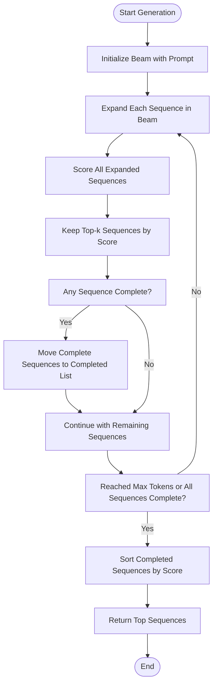
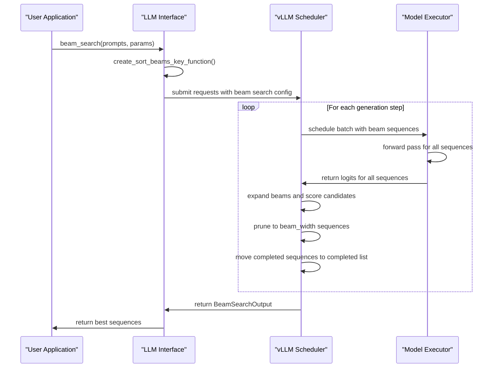
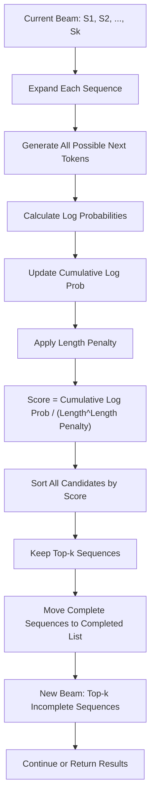

# Beam Search

<cite>
**Referenced Files in This Document**   
- [beam_search.py](file://vllm/beam_search.py)
- [sampling_params.py](file://vllm/sampling_params.py)
- [llm.py](file://vllm/entrypoints/llm.py)
- [test_beam_search.py](file://tests/samplers/test_beam_search.py)
</cite>

## Table of Contents
1. [Introduction](#introduction)
2. [Beam Search Algorithm Overview](#beam-search-algorithm-overview)
3. [Implementation Details](#implementation-details)
4. [Beam Search Parameters](#beam-search-parameters)
5. [Integration with vLLM's Scheduler](#integration-with-vllms-scheduler)
6. [Score Calculation and Sequence Pruning](#score-calculation-and-sequence-pruning)
7. [Trade-offs: Beam Search vs Greedy Sampling](#trade-offs-beam-search-vs-greedy-sampling)
8. [Memory Considerations and Optimization Tips](#memory-considerations-and-optimization-tips)
9. [Conclusion](#conclusion)

## Introduction
Beam search is a heuristic search algorithm used in sequence generation tasks, particularly in natural language processing applications such as machine translation, text summarization, and language modeling. In the context of vLLM, beam search is implemented to find high-probability token sequences by maintaining multiple candidate sequences during generation. This approach balances the quality of generated text with computational efficiency, providing better results than greedy sampling while being more efficient than exhaustive search methods.

The implementation in vLLM supports continuous batching, allowing multiple requests to be processed simultaneously while maintaining the beam search functionality for each request. This document explains the algorithm's purpose, implementation details, configuration options, and integration with vLLM's scheduling system.

**Section sources**
- [beam_search.py](file://vllm/beam_search.py#L1-L89)
- [sampling_params.py](file://vllm/sampling_params.py#L584-L598)

## Beam Search Algorithm Overview
The beam search algorithm in vLLM maintains a fixed number of candidate sequences (the "beam width") at each step of the generation process. At each time step, the algorithm expands each sequence in the beam by considering all possible next tokens, scores these expanded sequences, and keeps only the top-k sequences according to their scores, where k is the beam width.

This approach allows the model to explore multiple generation paths simultaneously, increasing the likelihood of finding high-quality sequences compared to greedy sampling, which only follows the single most probable path at each step. The algorithm continues until all sequences in the beam either reach a maximum length or generate an end-of-sequence token.

The implementation uses a `BeamSearchInstance` class to manage the beam search process for a single request, maintaining both active beams and completed sequences. Completed sequences are those that have generated an end-of-sequence token and are no longer being expanded.



**Diagram sources**
- [beam_search.py](file://vllm/beam_search.py#L44-L61)

**Section sources**
- [beam_search.py](file://vllm/beam_search.py#L44-L61)

## Implementation Details
The beam search implementation in vLLM consists of several key components that work together to generate high-quality text sequences. The core data structures include `BeamSearchSequence`, `BeamSearchOutput`, and `BeamSearchInstance`, which manage the state of the search process.

The `BeamSearchSequence` class represents a single candidate sequence in the beam, storing the tokens, log probabilities, cumulative log probability, and other metadata. Each sequence maintains a running cumulative log probability that is updated as new tokens are added.

The `BeamSearchInstance` class manages the beam search process for a single request, maintaining two lists: active beams that are still being expanded and completed sequences that have generated an end-of-sequence token. This separation allows the algorithm to continue generating text for incomplete sequences while preserving high-quality completed sequences.

The implementation is designed to work within vLLM's continuous batching framework, allowing multiple beam search requests to be processed simultaneously. This requires careful management of memory and computational resources, particularly when handling wide beams or long sequences.

**Section sources**
- [beam_search.py](file://vllm/beam_search.py#L14-L61)

## Beam Search Parameters
The beam search functionality in vLLM is configured through the `BeamSearchParams` class, which defines the key parameters that control the search process. These parameters include:

- **beam_width**: The number of candidate sequences to maintain at each step of generation
- **max_tokens**: The maximum number of tokens to generate for each sequence
- **ignore_eos**: Whether to ignore end-of-sequence tokens and continue generation
- **temperature**: Controls randomness in token selection (0.0 for deterministic)
- **length_penalty**: Penalty applied to shorter sequences during scoring
- **include_stop_str_in_output**: Whether to include stop strings in the output

The beam width parameter is particularly important as it directly affects both the quality of generated text and the computational cost. A wider beam allows the algorithm to explore more potential sequences, potentially finding higher-quality results, but at the cost of increased memory usage and computation time.

```mermaid
erDiagram
BEAM_SEARCH_PARAMS {
int beam_width
int max_tokens
bool ignore_eos
float temperature
float length_penalty
bool include_stop_str_in_output
}
BEAM_SEARCH_SEQUENCE {
list[int] tokens
list[dict[int, Logprob]] logprobs
float cum_logprob
str text
str finish_reason
}
BEAM_SEARCH_OUTPUT {
list[BeamSearchSequence] sequences
}
BEAM_SEARCH_PARAMS ||--o{ BEAM_SEARCH_INSTANCE : "configures"
BEAM_SEARCH_INSTANCE }o--|| BEAM_SEARCH_SEQUENCE : "contains"
BEAM_SEARCH_INSTANCE }o--|| BEAM_SEARCH_OUTPUT : "produces"
```

**Diagram sources**
- [sampling_params.py](file://vllm/sampling_params.py#L584-L598)
- [beam_search.py](file://vllm/beam_search.py#L14-L42)

**Section sources**
- [sampling_params.py](file://vllm/sampling_params.py#L584-L598)

## Integration with vLLM's Scheduler
The beam search implementation integrates with vLLM's scheduler through the `LLM` class's `beam_search` method, which serves as the entry point for beam search generation. This method handles the coordination between the beam search algorithm and the underlying model execution system.

When a beam search request is submitted, the scheduler manages the allocation of computational resources and memory for the request. The implementation supports concurrency limiting, allowing control over the number of simultaneous beam search requests to prevent resource exhaustion.

The integration with the scheduler enables continuous batching, where multiple requests (including both beam search and other sampling methods) can be processed together. This requires the beam search implementation to be compatible with vLLM's memory management and attention mechanisms, particularly the PagedAttention system that manages key-value caches for efficient memory usage.

The scheduler also handles the management of LoRA (Low-Rank Adaptation) requests when they are used in conjunction with beam search, ensuring that the appropriate adapter weights are applied during generation.



**Diagram sources**
- [llm.py](file://vllm/entrypoints/llm.py#L595-L630)
- [beam_search.py](file://vllm/beam_search.py#L44-L61)

**Section sources**
- [llm.py](file://vllm/entrypoints/llm.py#L595-L630)

## Score Calculation and Sequence Pruning
The beam search algorithm in vLLM uses a scoring function that combines the cumulative log probability of a sequence with a length penalty to favor longer, higher-probability sequences. The scoring function is implemented in the `get_beam_search_score` function, which calculates the score as the cumulative log probability divided by the sequence length raised to the power of the length penalty.

This scoring approach addresses the bias toward shorter sequences that can occur in beam search, as shorter sequences naturally have higher cumulative log probabilities (since they have fewer terms in the product). The length penalty parameter allows tuning this trade-off, with values less than 1 favoring shorter sequences and values greater than 1 favoring longer sequences.

Sequence pruning occurs after expanding all sequences in the current beam and scoring the candidates. The algorithm keeps only the top-k sequences according to their scores, where k is the beam width. This pruning step is critical for maintaining computational efficiency while still exploring multiple generation paths.

The implementation also handles special cases such as sequences that generate an end-of-sequence token. These sequences are moved to a separate completed list and are no longer expanded, but they remain eligible to be selected as the final output based on their scores.



**Diagram sources**
- [beam_search.py](file://vllm/beam_search.py#L63-L88)

**Section sources**
- [beam_search.py](file://vllm/beam_search.py#L63-L88)

## Trade-offs: Beam Search vs Greedy Sampling
Beam search and greedy sampling represent different approaches to text generation, each with its own trade-offs in terms of quality and computational cost.

Greedy sampling selects the single most probable token at each step, resulting in deterministic output that is computationally efficient but may get stuck in suboptimal sequences. This approach has O(1) space complexity relative to the beam width and minimal overhead compared to beam search.

In contrast, beam search maintains multiple candidate sequences, allowing it to recover from early suboptimal choices and potentially find higher-quality sequences. However, this comes at a cost: beam search has O(k) space and time complexity where k is the beam width, making it k times more expensive than greedy sampling in terms of memory and computation.

The choice between these methods depends on the specific use case. Beam search is typically preferred when generation quality is paramount and computational resources are sufficient. It is particularly effective for tasks like machine translation or summarization where the global sequence quality is important. Greedy sampling is more suitable for applications requiring low latency or when generating large volumes of text.

In vLLM, the implementation allows users to choose between these approaches based on their specific requirements, with beam search providing higher quality at the cost of increased resource usage.

**Section sources**
- [beam_search.py](file://vllm/beam_search.py#L1-L89)
- [sampling_params.py](file://vllm/sampling_params.py#L25-L29)

## Memory Considerations and Optimization Tips
Beam search in vLLM presents specific memory challenges due to its need to maintain multiple candidate sequences simultaneously. The memory consumption scales linearly with the beam width, as each sequence in the beam requires storage for its tokens, log probabilities, and associated key-value cache in the attention mechanism.

To optimize memory usage when using beam search, consider the following tips:

1. **Choose an appropriate beam width**: Start with a moderate beam width (e.g., 4-8) and increase only if quality improvements justify the additional resource cost.

2. **Limit maximum tokens**: Set a reasonable `max_tokens` parameter to prevent excessively long generations that consume more memory.

3. **Use concurrency limiting**: When processing multiple beam search requests, use the `concurrency_limit` parameter to prevent resource exhaustion.

4. **Monitor memory usage**: Keep track of GPU memory consumption, as wide beams can quickly exhaust available memory, especially with large models.

5. **Consider alternative methods**: For applications where latency is critical, consider using greedy sampling or sampling with temperature instead of beam search.

6. **Batch requests appropriately**: When possible, batch multiple prompts together rather than running separate beam search operations, as this can improve hardware utilization.

The implementation in vLLM is designed to be memory-efficient through integration with the PagedAttention system, which manages key-value caches in a paged format to reduce memory fragmentation and improve memory utilization.

**Section sources**
- [beam_search.py](file://vllm/beam_search.py#L14-L61)
- [llm.py](file://vllm/entrypoints/llm.py#L602-L603)

## Conclusion
The beam search implementation in vLLM provides a powerful method for generating high-quality text sequences by maintaining multiple candidate sequences during generation. The algorithm balances quality and efficiency by exploring multiple generation paths while pruning less promising candidates based on their scores.

Key features of the implementation include support for configurable beam width, length penalty, and integration with vLLM's continuous batching framework. The design allows for efficient resource utilization while providing better generation quality compared to greedy sampling.

When using beam search in vLLM, users should carefully consider the trade-offs between generation quality and computational cost, selecting appropriate parameters based on their specific requirements. The implementation provides a flexible and efficient solution for applications where high-quality text generation is essential.