# Inference Features

<cite>
**Referenced Files in This Document**
- [sampling_params.py](file://vllm\sampling_params.py)
- [beam_search.py](file://vllm\beam_search.py)
- [logprobs.py](file://vllm\logprobs.py)
- [sampler.py](file://vllm\v1\sample\sampler.py)
- [topk_topp_sampler.py](file://vllm\v1\sample\ops\topk_topp_sampler.py)
- [utils.py](file://vllm\model_executor\layers\utils.py)
- [generate.py](file://examples\offline_inference\basic\generate.py)
- [batch_llm_inference.py](file://examples\offline_inference\batch_llm_inference.py)
- [test_beam_search.py](file://tests\samplers\test_beam_search.py)
- [test_logprobs.py](file://tests\samplers\test_logprobs.py)
- [test_ignore_eos.py](file://tests\samplers\test_ignore_eos.py)
</cite>

## Table of Contents
1. [Introduction](#introduction)
2. [Sampling Parameters Overview](#sampling-parameters-overview)
3. [Temperature Control](#temperature-control)
4. [Top-K and Top-P Sampling](#top-k-and-top-p-sampling)
5. [Frequency and Presence Penalties](#frequency-and-presence-penalties)
6. [Repetition Penalty](#repetition-penalty)
7. [Min-P Sampling](#min-p-sampling)
8. [Beam Search Implementation](#beam-search-implementation)
9. [Stopping Criteria](#stopping-criteria)
10. [Log Probability Outputs](#log-probability-outputs)
11. [Practical Configuration Examples](#practical-configuration-examples)
12. [Common Issues and Solutions](#common-issues-and-solutions)
13. [Performance Considerations](#performance-considerations)
14. [Conclusion](#conclusion)

## Introduction

vLLM provides sophisticated inference features that enable fine-grained control over text generation processes through flexible sampling and stopping strategies. These features allow developers to tailor model behavior for different use cases, from creative writing to factual responses, while maintaining optimal performance and preventing common issues like infinite generation loops.

The inference system is built around several core components:
- **Sampling Parameters**: Control randomness and diversity in token selection
- **Beam Search**: Find optimal sequences through systematic exploration
- **Stopping Criteria**: Determine when generation should terminate
- **Log Probability Outputs**: Provide confidence scores for generated tokens

These features work together to create a robust text generation pipeline that balances creativity, accuracy, and computational efficiency.

## Sampling Parameters Overview

vLLM's sampling parameters provide comprehensive control over the generation process through configurable algorithms and constraints. The core `SamplingParams` class encapsulates all generation controls in a unified interface.

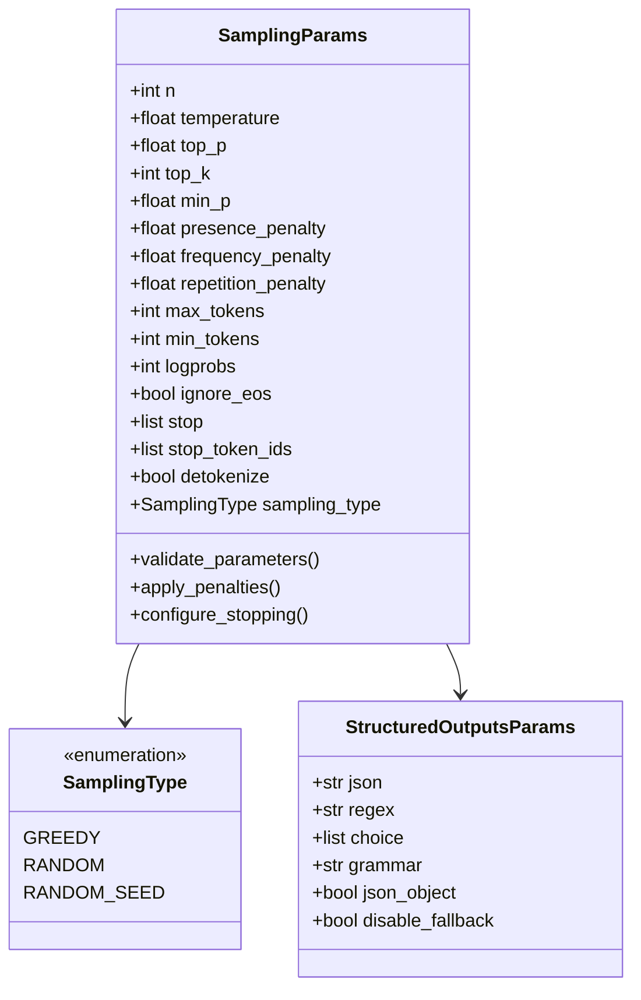

**Diagram sources**
- [sampling_params.py](file://vllm\sampling_params.py#L111-L598)

The sampling system supports multiple algorithms working in concert:
- **Greedy Sampling**: Always selects the highest probability token
- **Random Sampling**: Uses temperature and top-k/top-p filtering
- **Structured Outputs**: Enforces specific formats through constraints

**Section sources**
- [sampling_params.py](file://vllm\sampling_params.py#L111-L598)

## Temperature Control

Temperature controls the randomness of the sampling process by scaling the logits before applying softmax. Higher temperatures increase randomness, while lower temperatures make the model more deterministic.

### Mathematical Foundation

The temperature scaling operation transforms logits using the formula:
```
scaled_logits = logits / temperature
```

Where:
- `logits`: Raw model outputs for each token
- `temperature`: Scaling factor (0.0 < temperature ≤ ∞)
- `scaled_logits`: Modified logits for probability calculation

### Implementation Details

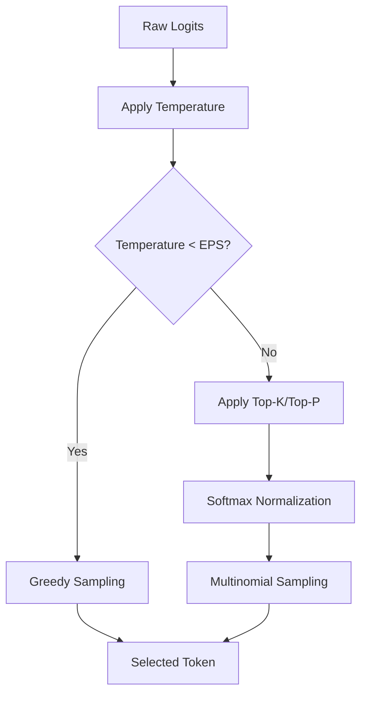

**Diagram sources**
- [sampler.py](file://vllm\v1\sample\sampler.py#L132-L141)

### Temperature Ranges and Effects

| Temperature Range | Behavior | Use Case |
|-------------------|----------|----------|
| 0.0 | Greedy (deterministic) | Factual responses, code generation |
| 0.1-0.3 | Very conservative | Technical documentation |
| 0.4-0.7 | Balanced | General conversation |
| 0.8-1.2 | Creative | Creative writing, brainstorming |
| 1.3+ | Highly random | Artistic expression |

**Section sources**
- [sampler.py](file://vllm\v1\sample\sampler.py#L132-L141)

## Top-K and Top-P Sampling

Top-K and Top-P (nucleus) sampling provide alternative mechanisms for controlling token selection probability distributions.

### Top-K Sampling

Top-K sampling limits consideration to the K most probable tokens:

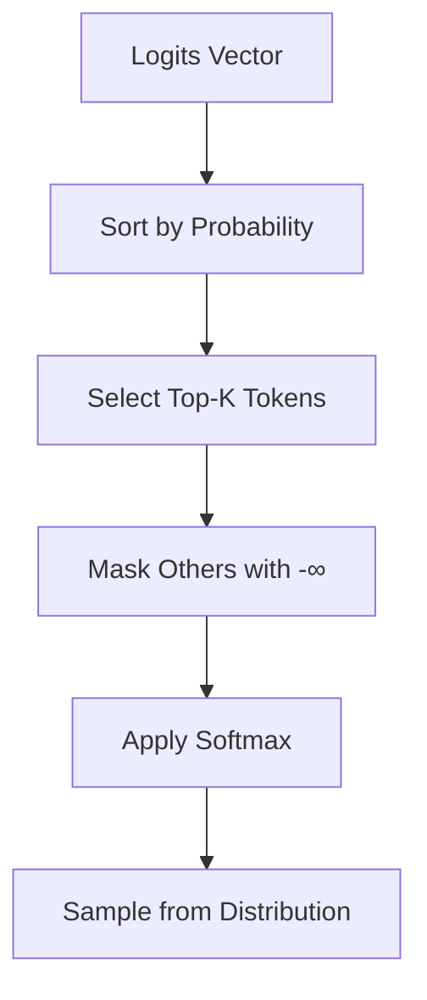

**Diagram sources**
- [topk_topp_sampler.py](file://vllm\v1\sample\ops\topk_topp_sampler.py#L290-L304)

### Top-P (Nucleus) Sampling

Top-P sampling dynamically selects tokens whose cumulative probability reaches the threshold P:

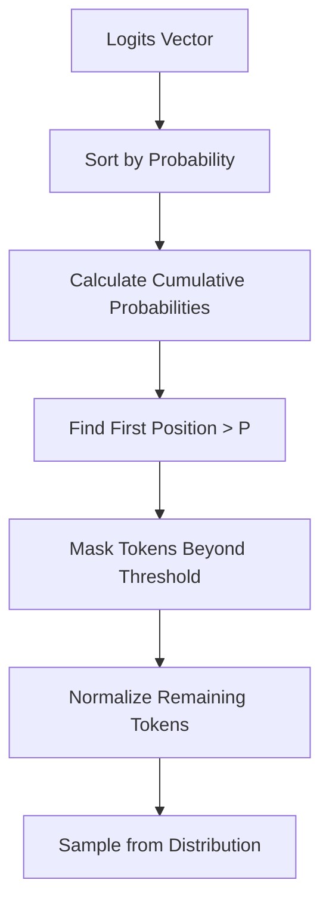

### Combined Approach

When both parameters are used, the system applies a combined filter:
1. Apply Top-K to limit candidate pool
2. Apply Top-P to refine probability distribution
3. Sample from the resulting distribution

**Section sources**
- [topk_topp_sampler.py](file://vllm\v1\sample\ops\topk_topp_sampler.py#L152-L315)

## Frequency and Presence Penalties

Frequency and presence penalties discourage repetition by modifying logits based on token usage history.

### Penalty Types

| Penalty Type | Formula | Effect |
|--------------|---------|--------|
| **Presence Penalty** | `logits[token] -= presence_penalty` | Discourages tokens appearing at any position |
| **Frequency Penalty** | `logits[token] -= frequency_penalty × count` | Discourages tokens based on frequency |
| **Combined Penalty** | `logits[token] -= (presence_penalty + frequency_penalty × count)` | Comprehensive repetition control |

### Implementation Architecture

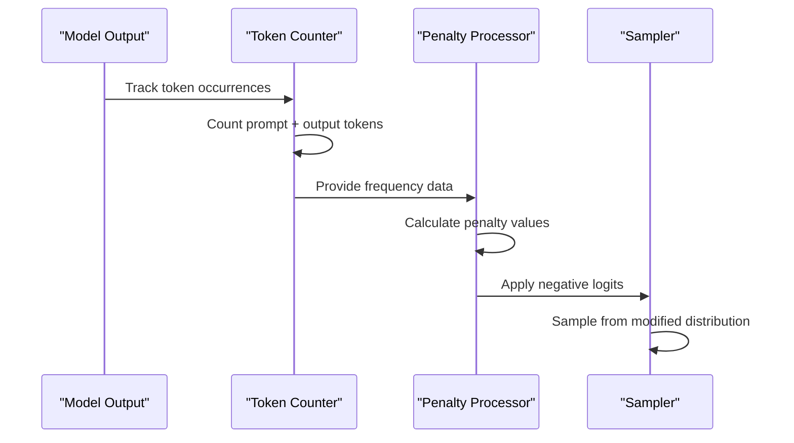

**Diagram sources**
- [utils.py](file://vllm\model_executor\layers\utils.py#L58-L64)

**Section sources**
- [utils.py](file://vllm\model_executor\layers\utils.py#L58-L64)

## Repetition Penalty

Repetition penalty provides more sophisticated control over token repetition by considering both prompt and output history.

### Penalty Application

The repetition penalty modifies logits using:
```
logits[token] *= repetition_penalty^(count_in_prompt + count_in_output)
```

Where:
- `repetition_penalty > 1.0`: Encourages diversity
- `repetition_penalty < 1.0`: Encourages repetition
- `repetition_penalty = 1.0`: No effect

### Penalty Comparison Matrix

| Parameter Combination | Effect | Use Case |
|----------------------|--------|----------|
| `temperature=0.0` + `repetition_penalty=1.0` | Deterministic, no repetition | Code generation |
| `temperature=0.7` + `repetition_penalty=1.1` | Creative, diverse output | Story writing |
| `temperature=0.3` + `repetition_penalty=0.9` | Focused, slightly repetitive | Technical writing |

**Section sources**
- [sampling_params.py](file://vllm\sampling_params.py#L141-L144)

## Min-P Sampling

Min-P sampling implements adaptive probability thresholding, ensuring that only tokens above a minimum probability threshold are considered.

### Algorithm Implementation

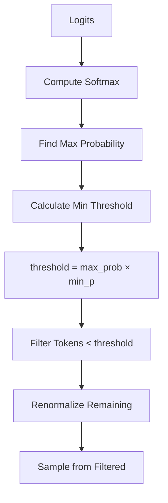

**Diagram sources**
- [sampler.py](file://vllm\v1\sample\ops\topk_topp_sampler.py#L135-L144)

### Min-P Configuration

Min-P works alongside other sampling methods:
- Applied after temperature scaling
- Retains argmax invariance
- Provides fine-grained control over token selection

**Section sources**
- [sampler.py](file://vllm\v1\sample\ops\topk_topp_sampler.py#L135-L144)

## Beam Search Implementation

Beam search finds optimal sequences by maintaining multiple hypotheses during generation, systematically exploring the most promising paths.

### Beam Search Architecture

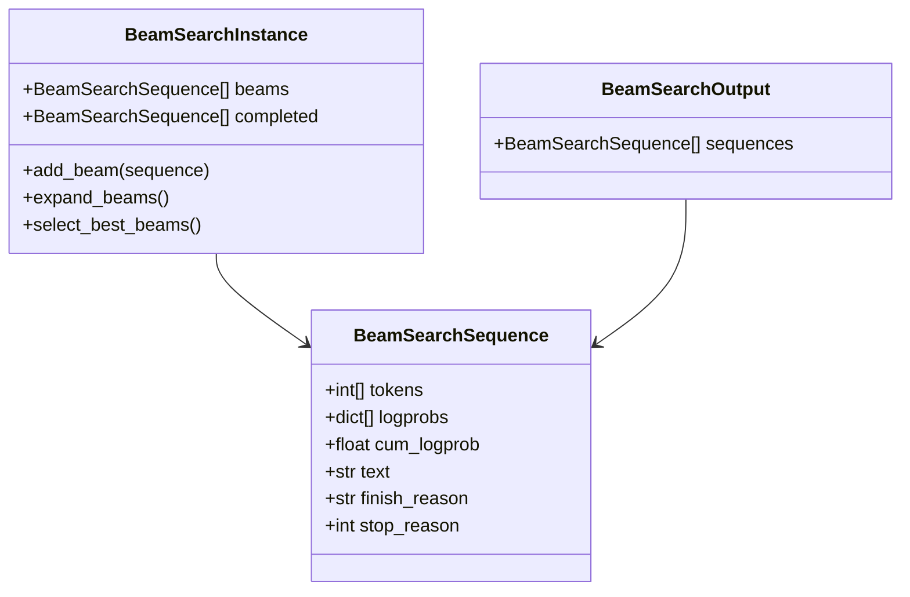

**Diagram sources**
- [beam_search.py](file://vllm\beam_search.py#L14-L89)

### Scoring Function

The beam search score incorporates length penalty:
```
score = cumulative_logprob / (sequence_length^length_penalty)
```

### Beam Search Process

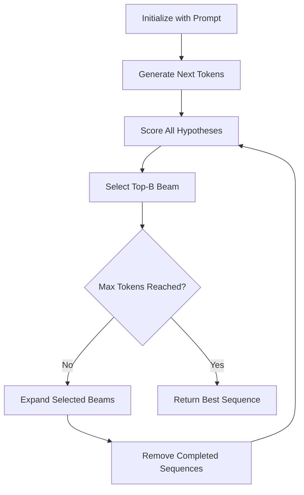

**Diagram sources**
- [beam_search.py](file://vllm\beam_search.py#L44-L89)

**Section sources**
- [beam_search.py](file://vllm\beam_search.py#L44-L89)

## Stopping Criteria

Stopping criteria determine when generation should terminate, preventing infinite loops and ensuring appropriate output length.

### Stop Conditions

| Condition Type | Description | Configuration |
|----------------|-------------|---------------|
| **EOS Token** | End-of-sequence token | Automatically detected |
| **Custom Strings** | Specific text sequences | `stop=[".", "!", "?"]` |
| **Token IDs** | Numeric token identifiers | `stop_token_ids=[13, 30]` |
| **Max Tokens** | Maximum generation length | `max_tokens=100` |
| **Ignore EOS** | Continue past EOS | `ignore_eos=True` |

### Stopping Implementation

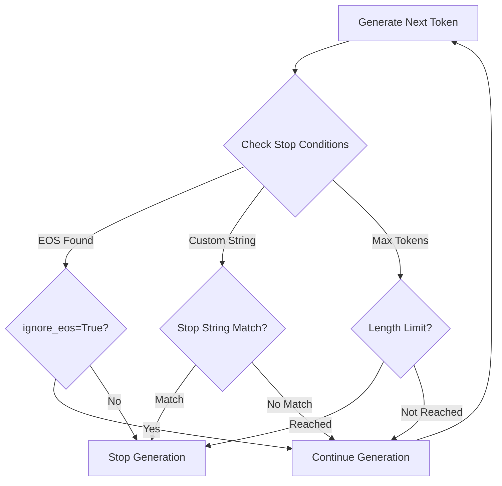

### Common Stopping Patterns

```python
# Creative writing - stop on punctuation
sampling_params = SamplingParams(
    stop=[".", "!", "?"],
    max_tokens=200
)

# Code generation - stop on indentation
sampling_params = SamplingParams(
    stop=["\n    ", "\n\t"],
    max_tokens=500
)

# Dialogue - stop on quote
sampling_params = SamplingParams(
    stop=['"', "'", "\n"],
    max_tokens=100
)
```

**Section sources**
- [sampling_params.py](file://vllm\sampling_params.py#L161-L168)

## Log Probability Outputs

Log probabilities provide confidence scores for generated tokens, enabling applications to assess output quality and implement confidence-based filtering.

### Log Probability Structure

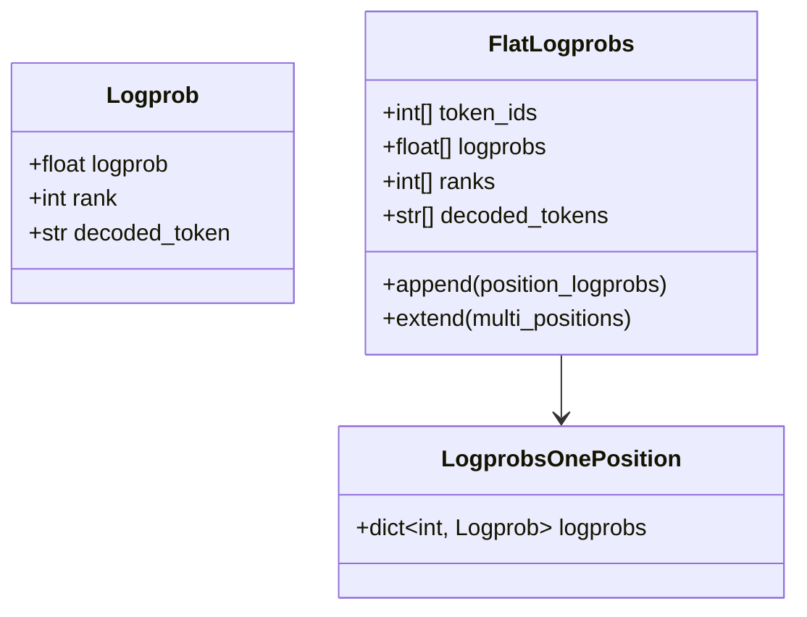

**Diagram sources**
- [logprobs.py](file://vllm\logprobs.py#L9-L207)

### Log Probability Calculation

The system computes log probabilities through multiple modes:

| Mode | Calculation | Use Case |
|------|-------------|----------|
| **Raw Logits** | `logits.to(torch.float32)` | Direct access to model outputs |
| **Processed Logits** | `logits.div_(temperature)` | Temperature-adjusted logits |
| **Processed Logprobs** | `logits.log_softmax()` | Final probability distribution |

### Confidence Assessment

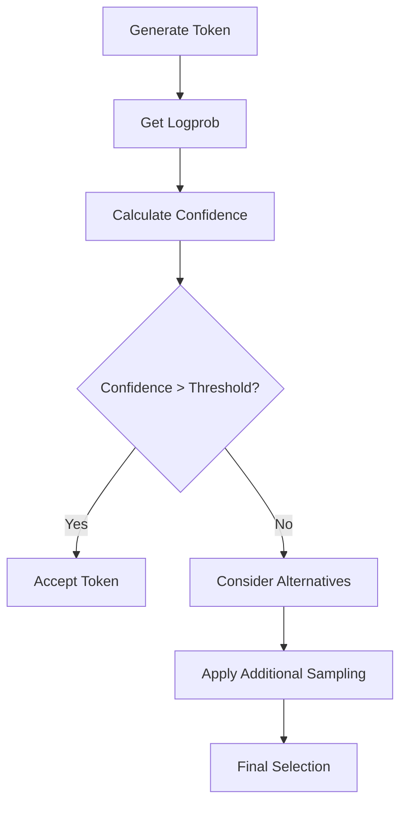

**Section sources**
- [logprobs.py](file://vllm\logprobs.py#L9-L207)

## Practical Configuration Examples

### Creative Writing Configuration

For creative writing tasks requiring high diversity and controlled repetition:

```python
creative_params = SamplingParams(
    temperature=0.8,           # Creative randomness
    top_p=0.9,                # Nucleus sampling
    top_k=50,                 # Limited candidate pool
    repetition_penalty=1.1,   # Encourage diversity
    frequency_penalty=0.1,    # Mild repetition discouragement
    presence_penalty=0.1,     # Encourage new topics
    max_tokens=500,           # Reasonable length
    stop=[".", "!", "?"]      # Natural stopping
)
```

### Factual Response Configuration

For factual responses requiring accuracy and minimal repetition:

```python
factual_params = SamplingParams(
    temperature=0.2,          # Conservative sampling
    top_p=0.8,               # Moderate nucleus
    repetition_penalty=0.9,  # Slight repetition encouragement
    frequency_penalty=0.2,   # Strong repetition discouragement
    presence_penalty=0.1,    # Minimal topic encouragement
    max_tokens=200,          # Concise responses
    stop=[".", "\n"]         # Clear boundaries
)
```

### Code Generation Configuration

For code generation requiring precision and structure:

```python
code_params = SamplingParams(
    temperature=0.1,          # Deterministic
    top_p=0.95,              # Conservative nucleus
    repetition_penalty=1.0,  # No repetition preference
    max_tokens=1000,         # Allow extensive code
    stop=["\nclass", "\ndef", "\n#"]  # Structural stops
)
```

### Batch Processing Example

```python
# Batch inference with varied configurations
prompts = [
    "Write a short story about a robot",
    "Explain quantum computing in simple terms",
    "Generate code for a web scraper"
]

configs = [
    SamplingParams(temperature=0.7, max_tokens=200),
    SamplingParams(temperature=0.3, max_tokens=300),
    SamplingParams(temperature=0.1, max_tokens=500)
]

results = llm.generate(prompts, sampling_params=configs)
```

**Section sources**
- [generate.py](file://examples\offline_inference\basic\generate.py#L23-L66)
- [batch_llm_inference.py](file://examples\offline_inference\batch_llm_inference.py#L55-L75)

## Common Issues and Solutions

### Infinite Generation Prevention

**Problem**: Generation continues indefinitely due to missing stopping criteria.

**Solution**: Implement comprehensive stopping conditions:

```python
# Safe configuration
safe_params = SamplingParams(
    max_tokens=1000,          # Hard limit
    stop=[".", "!", "?"],     # Natural stopping
    ignore_eos=False,         # Respect EOS token
    min_tokens=10             # Minimum content requirement
)
```

### Repetition Control

**Problem**: Generated text becomes repetitive or monotonous.

**Solution**: Fine-tune penalty parameters:

```python
# Repetition mitigation
repetition_control = SamplingParams(
    repetition_penalty=1.1,   # Encourage diversity
    frequency_penalty=0.2,    # Strong repetition discouragement
    presence_penalty=0.1,     # Moderate topic variation
    temperature=0.7           # Balanced creativity
)
```

### Performance Optimization

**Problem**: Slow generation due to excessive sampling overhead.

**Solution**: Optimize sampling parameters:

```python
# Performance-focused configuration
fast_params = SamplingParams(
    temperature=0.0,          # Greedy sampling
    top_k=40,                # Limited candidates
    max_tokens=200,          # Reasonable length
    skip_special_tokens=True  # Faster tokenization
)
```

### Memory Management

**Problem**: High memory usage with large batch sizes.

**Solution**: Implement memory-efficient batching:

```python
# Memory-conscious approach
memory_efficient = SamplingParams(
    max_tokens=100,          # Shorter generations
    logprobs=1,             # Minimal logprobs
    detokenize=True,        # Efficient tokenization
    output_kind=RequestOutputKind.FINAL_ONLY  # Reduce streaming
)
```

**Section sources**
- [test_ignore_eos.py](file://tests\samplers\test_ignore_eos.py#L21-L36)

## Performance Considerations

### Sampling Algorithm Efficiency

Different sampling algorithms have varying computational costs:

| Algorithm | Complexity | Memory Usage | Recommended Use |
|-----------|------------|--------------|-----------------|
| **Greedy** | O(1) | Minimal | Production, fast inference |
| **Top-K** | O(V log K) | Low | Controlled diversity |
| **Top-P** | O(V log V) | Low | Adaptive filtering |
| **Beam Search** | O(B×V) | High | Quality over speed |

### Log Probability Overhead

Log probability computation adds significant overhead:
- **Full logprobs (-1)**: Computes all vocabulary probabilities
- **Limited logprobs (N)**: Computes top-N probabilities
- **No logprobs (None)**: Minimal overhead

### Parallel Processing

vLLM supports efficient parallel processing:
- **Batch Processing**: Multiple prompts in single inference
- **Concurrent Requests**: Independent request handling
- **Pipeline Parallelism**: Distributed model layers

## Conclusion

vLLM's inference features provide a comprehensive toolkit for controlling text generation processes. Through flexible sampling parameters, sophisticated stopping criteria, and detailed log probability outputs, developers can create applications that balance creativity, accuracy, and performance.

Key takeaways:
- **Temperature** controls randomness vs. determinism
- **Top-K/Top-P** provide alternative probability filtering
- **Penalties** manage repetition and diversity
- **Beam Search** finds optimal sequences for high-quality output
- **Stopping Criteria** prevent infinite generation
- **Log Probabilities** enable confidence assessment

By understanding and properly configuring these features, developers can harness vLLM's full potential for diverse text generation applications, from creative writing assistants to factual information systems.