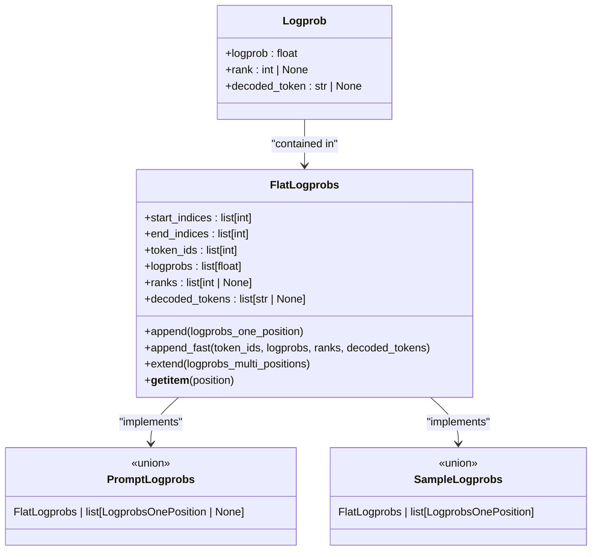
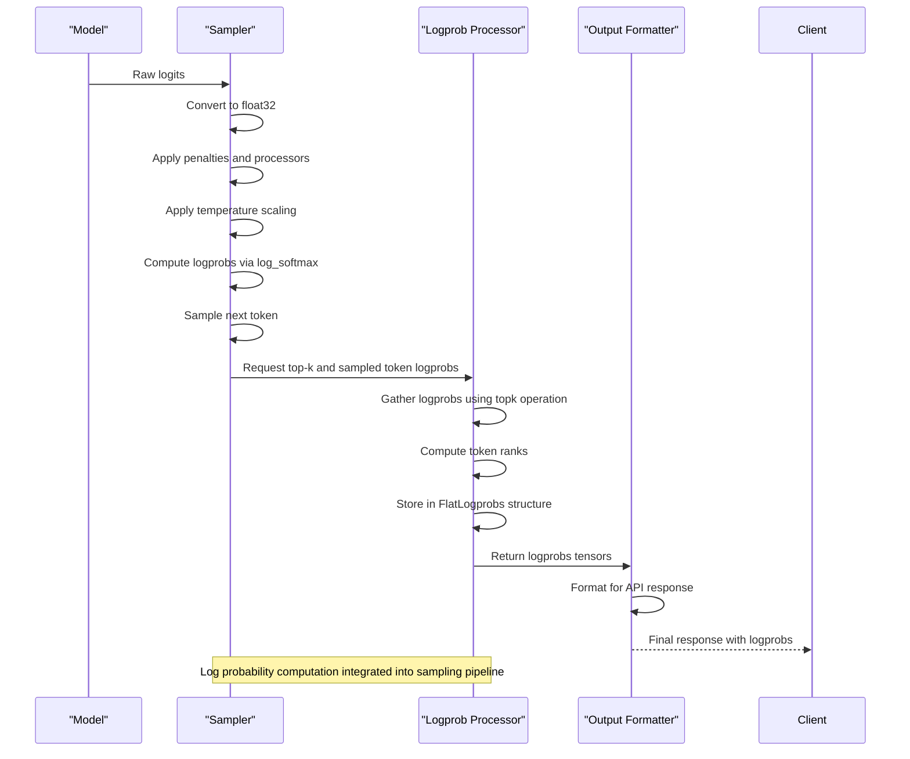

# Log Probabilities

<cite>
**Referenced Files in This Document**   
- [logprobs.py](file://vllm/logprobs.py)
- [sampling_params.py](file://vllm/sampling_params.py)
- [outputs.py](file://vllm/outputs.py)
- [sampler.py](file://vllm/v1/sample/sampler.py)
- [test_logprobs.py](file://tests/samplers/test_logprobs.py)
</cite>

## Table of Contents
1. [Introduction](#introduction)
2. [Core Concepts](#core-concepts)
3. [Implementation Details](#implementation-details)
4. [Memory and Performance Considerations](#memory-and-performance-considerations)
5. [Integration with Sampling Parameters](#integration-with-sampling-parameters)
6. [Common Issues and Optimization Tips](#common-issues-and-optimization-tips)
7. [Conclusion](#conclusion)

## Introduction

Log probabilities in vLLM provide confidence scores for generated tokens, enabling quality assessment and post-processing of model outputs. This feature allows users to understand the model's confidence in its predictions by returning the logarithm of the probability distribution over the vocabulary at each generation step. The log probability output is particularly valuable for applications requiring uncertainty quantification, such as safety-critical systems, content moderation, and model debugging.

vLLM implements log probability computation in a way that's compatible with the OpenAI API, ensuring that developers can easily integrate this functionality into existing workflows. The system supports both prompt token log probabilities (for input tokens) and sampled token log probabilities (for generated tokens), providing comprehensive insights into the model's decision-making process throughout the entire generation sequence.

The implementation is designed to balance accuracy with performance, offering configurable options to control the number of log probabilities returned and the format in which they are presented. This documentation will explore the technical details of how log probabilities are calculated, stored, and returned in vLLM's high-throughput architecture.

**Section sources**
- [logprobs.py](file://vllm/logprobs.py#L1-L207)
- [sampling_params.py](file://vllm/sampling_params.py#L1-L598)

## Core Concepts

Log probabilities in vLLM represent the logarithm of the probability that the model assigns to each token in the vocabulary at each generation step. These values provide a measure of the model's confidence in its predictions, with higher (less negative) log probabilities indicating greater confidence. The log probability of a token is calculated as the logarithm of its probability in the softmax distribution over the vocabulary.

The system implements two types of log probability outputs:
- **Prompt log probabilities**: These are the log probabilities of the input prompt tokens, which help assess how well the model understands the input context
- **Sampled token log probabilities**: These are the log probabilities of the generated output tokens, which indicate the model's confidence in its predictions

vLLM follows the OpenAI API specification for log probability output, which ensures that the sampled token's log probability is always included in the response, even if it wasn't among the top-k most probable tokens. This means that when requesting k log probabilities, the response may contain up to k+1 log probabilities to ensure the sampled token is represented.

The log probability data structure includes three key pieces of information for each token:
- The log probability value itself
- The token's rank in the probability distribution (where 1 is the most probable)
- The decoded token string

This comprehensive information enables detailed analysis of the model's behavior and supports various post-processing applications.



**Diagram sources **
- [logprobs.py](file://vllm/logprobs.py#L9-L207)

**Section sources**
- [logprobs.py](file://vllm/logprobs.py#L9-L207)

## Implementation Details

The implementation of log probabilities in vLLM involves several key components that work together to efficiently compute, store, and return probability information. The core data structure is the `FlatLogprobs` class, which is designed to minimize garbage collection overhead by flattening log probability information into primitive type lists rather than using nested dictionaries.

The `FlatLogprobs` class stores four parallel arrays:
- `token_ids`: The token IDs for which log probabilities are stored
- `logprobs`: The corresponding log probability values
- `ranks`: The vocabulary rank of each token (1-based)
- `decoded_tokens`: The decoded string representation of each token

To efficiently manage log probabilities across multiple token positions, the class uses `start_indices` and `end_indices` arrays that indicate the range of log probabilities for each position in the sequence. This design reduces the number of Python objects created, which significantly improves performance in high-throughput scenarios.

The log probability computation process occurs in several stages within the sampling pipeline:
1. After the model generates logits, they are converted to log probabilities using the log_softmax function
2. During sampling, the system identifies the top-k most probable tokens and the sampled token
3. The log probabilities of these tokens are extracted and stored in the `FlatLogprobs` structure
4. The final output is formatted according to the requested parameters

The `Sampler` class in the v1 implementation handles the log probability computation as part of the token sampling process. It first computes raw log probabilities from the model logits, then applies various sampling parameters (temperature, top-k, top-p), and finally gathers the requested number of log probabilities for the response.



**Diagram sources **
- [sampler.py](file://vllm/v1/sample/sampler.py#L1-L320)
- [logprobs.py](file://vllm/logprobs.py#L9-L207)

**Section sources**
- [sampler.py](file://vllm/v1/sample/sampler.py#L1-L320)
- [logprobs.py](file://vllm/logprobs.py#L9-L207)

## Memory and Performance Considerations

The log probability feature in vLLM introduces additional memory overhead and computational costs that must be carefully managed in high-throughput scenarios. The memory requirements scale with the number of log probabilities requested and the sequence length, as the system must store probability information for each token position.

The primary memory overhead comes from:
- Storing the log probability values themselves (float32)
- Maintaining token IDs, ranks, and decoded strings
- Additional bookkeeping structures for managing the flattened log probability format

To mitigate these costs, vLLM provides the `flat_logprobs` parameter, which enables a more memory-efficient storage format. When enabled, log probabilities are stored in flattened arrays rather than nested dictionaries, significantly reducing garbage collection overhead. This optimization is particularly important in high-throughput serving scenarios where minimizing GC pauses is critical for maintaining low latency.

The computational cost of log probability computation primarily comes from the top-k operation required to identify the most probable tokens. This operation has O(V log k) complexity where V is the vocabulary size and k is the number of log probabilities requested. For large vocabularies, this can become a significant bottleneck.

Performance optimizations include:
- Using efficient CUDA kernels for top-k operations
- Minimizing data movement between CPU and GPU
- Reusing intermediate computation results
- Implementing batched operations for multiple sequences

The system also provides options to limit the number of log probabilities returned, allowing users to balance the need for detailed probability information against performance requirements. Setting `logprobs=-1` returns all vocabulary log probabilities, which should be used with caution due to the substantial memory and bandwidth requirements.

```mermaid
flowchart TD
Start([Log Probability Request]) --> CheckParams["Validate parameters"]
CheckParams --> MemoryEstimate["Estimate memory requirements"]
MemoryEstimate --> FormatChoice{"flat_logprobs enabled?"}
FormatChoice --> |Yes| FlatFormat["Use FlatLogprobs structure"]
FormatChoice --> |No| DictFormat["Use dictionary structure"]
FlatFormat --> TopK["Perform top-k operation"]
DictFormat --> TopK
TopK --> LogSoftmax["Compute log_softmax"]
LogSoftmax --> Gather["Gather top-k and sampled token logprobs"]
Gather --> Rank["Compute token ranks"]
Rank --> Store["Store in output structure"]
Store --> Return["Return to client"]
style FlatFormat fill:#d5e8d4,stroke:#82b366
style DictFormat fill:#f8cecc,stroke:#b85450
style TopK fill:#fff2cc,stroke:#d6b656
Note over FlatFormat,DictFormat: Memory format selection impacts GC overhead
Note over TopK: Computationally expensive operation
Note over Store: Storage efficiency critical for throughput
```

**Diagram sources **
- [logprobs.py](file://vllm/logprobs.py#L30-L207)
- [sampler.py](file://vllm/v1/sample/sampler.py#L205-L252)

**Section sources**
- [logprobs.py](file://vllm/logprobs.py#L30-L207)
- [sampler.py](file://vllm/v1/sample/sampler.py#L205-L252)

## Integration with Sampling Parameters

The log probability feature in vLLM is tightly integrated with the sampling parameters that control text generation. The `SamplingParams` class contains several parameters that directly affect log probability computation and output:

- `logprobs`: Controls the number of log probabilities returned for generated tokens
- `prompt_logprobs`: Controls the number of log probabilities returned for prompt tokens
- `flat_logprobs`: Determines whether log probabilities are returned in a flattened, memory-efficient format
- `temperature`: Affects the probability distribution from which log probabilities are derived
- `top_k` and `top_p`: Influence the shape of the probability distribution and thus the log probability values

These parameters work together to provide fine-grained control over the log probability output. For example, setting `logprobs=5` returns the log probabilities of the 5 most likely tokens at each generation step, plus the log probability of the sampled token if it wasn't among the top 5.

The interaction between sampling parameters and log probability computation follows a specific sequence:
1. The model generates raw logits
2. Sampling parameters like temperature, top-k, and top-p are applied to modify the logits
3. The modified logits are converted to probabilities via softmax
4. Log probabilities are computed as the logarithm of these probabilities
5. The requested number of log probabilities are extracted and formatted for output

This sequence ensures that the log probabilities reflect the actual sampling distribution used to generate tokens, rather than the raw model outputs. This is important because it provides accurate confidence scores that correspond to the actual generation process.

The system also handles edge cases such as:
- When the sampled token is already among the top-k most probable tokens (avoiding duplication)
- When requesting more log probabilities than available tokens
- When using special sampling methods like beam search or speculative decoding

These considerations ensure that the log probability output is consistent and reliable across different sampling configurations.

```mermaid
classDiagram
class SamplingParams {
+logprobs : int | None
+prompt_logprobs : int | None
+flat_logprobs : bool
+temperature : float
+top_p : float
+top_k : int
+min_p : float
}
class Sampler {
+logprobs_mode : LogprobsMode
+forward(logits, sampling_metadata)
+sample(logits, sampling_metadata)
+compute_logprobs(logits)
+gather_logprobs(logprobs, num_logprobs, token_ids)
}
class LogprobProcessor {
+append_logprobs_for_next_position(request_logprobs, token_ids, logprobs, decoded_tokens, rank, num_logprobs)
+create_prompt_logprobs(flat_logprobs)
+create_sample_logprobs(flat_logprobs)
}
SamplingParams --> Sampler : "provides parameters"
Sampler --> LogprobProcessor : "requests logprob processing"
LogprobProcessor --> Sampler : "returns processed logprobs"
Sampler --> SamplingParams : "reads sampling parameters"
note right of SamplingParams
Configuration for log probability
output and sampling behavior
end
note left of LogprobProcessor
Core logic for log probability
extraction and formatting
end
```

**Diagram sources **
- [sampling_params.py](file://vllm/sampling_params.py#L1-L598)
- [sampler.py](file://vllm/v1/sample/sampler.py#L1-L320)
- [logprobs.py](file://vllm/logprobs.py#L162-L207)

**Section sources**
- [sampling_params.py](file://vllm/sampling_params.py#L1-L598)
- [sampler.py](file://vllm/v1/sample/sampler.py#L1-L320)

## Common Issues and Optimization Tips

When using the log probability feature in vLLM, several common issues may arise, particularly related to memory usage and performance. Understanding these issues and applying appropriate optimizations is crucial for maintaining high throughput in production environments.

**Memory Overhead Issues:**
The most common issue is increased memory consumption when requesting log probabilities, especially with large vocabularies or long sequences. This can lead to:
- GPU memory exhaustion
- Increased latency due to memory bandwidth constraints
- Reduced throughput from fewer concurrent requests

**Optimization Strategies:**
1. **Use flat_logprobs**: Enable the `flat_logprobs=True` parameter to reduce garbage collection overhead and improve memory efficiency
2. **Limit logprobs count**: Request only the number of log probabilities actually needed (e.g., `logprobs=5` instead of higher values)
3. **Avoid full vocabulary logprobs**: Never use `logprobs=-1` in production unless absolutely necessary, as it returns all vocabulary log probabilities
4. **Batch wisely**: Consider the combined memory impact of log probabilities across all sequences in a batch

**Performance Tips:**
- For applications that only need confidence scores, consider using just the top-1 log probability rather than multiple log probabilities
- When possible, compute log probabilities on the GPU and minimize CPU-GPU data transfer
- Use asynchronous processing to overlap log probability computation with other operations
- Monitor memory usage and adjust log probability parameters based on available resources

**Configuration Recommendations:**
```python
# Recommended configuration for production
sampling_params = SamplingParams(
    logprobs=5,           # Only request 5 top logprobs
    prompt_logprobs=None, # Disable prompt logprobs if not needed
    flat_logprobs=True,   # Use memory-efficient format
    temperature=0.7,      # Moderate temperature for diversity
)

# High-performance configuration (minimal overhead)
sampling_params_fast = SamplingParams(
    logprobs=None,        # Disable logprobs completely
    prompt_logprobs=None,
    flat_logprobs=False,  # Irrelevant when disabled
)

# High-fidelity configuration (maximum information)
sampling_params_detailed = SamplingParams(
    logprobs=10,          # More logprobs for analysis
    prompt_logprobs=5,    # Include prompt token probabilities
    flat_logprobs=True,   # Still use efficient format
)
```

By carefully tuning these parameters, users can achieve the right balance between the richness of probability information and system performance.

**Section sources**
- [sampling_params.py](file://vllm/sampling_params.py#L176-L192)
- [logprobs.py](file://vllm/logprobs.py#L162-L207)
- [test_logprobs.py](file://tests/samplers/test_logprobs.py#L1-L92)

## Conclusion

The log probability feature in vLLM provides valuable confidence scores for generated tokens, enabling quality assessment and post-processing of model outputs. The implementation is designed to be both comprehensive and efficient, following the OpenAI API specification while optimizing for high-throughput serving scenarios.

Key aspects of the implementation include:
- A memory-efficient `FlatLogprobs` data structure that minimizes garbage collection overhead
- Tight integration with the sampling pipeline to ensure accurate probability information
- Flexible configuration options that allow users to balance detail with performance
- Comprehensive support for both prompt and generated token log probabilities

The system handles the complexity of log probability computation transparently, from the initial log_softmax operation on model logits to the final formatting of results for API responses. By understanding the memory and performance implications of different configuration options, users can effectively leverage this feature in their applications.

For optimal results, we recommend using the `flat_logprobs=True` parameter and carefully selecting the number of log probabilities to request based on the specific use case requirements. This approach provides the benefits of probability information while maintaining the high performance that vLLM is known for.