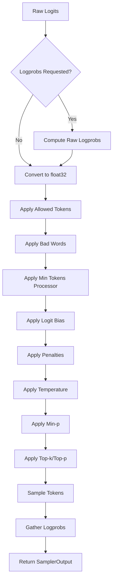
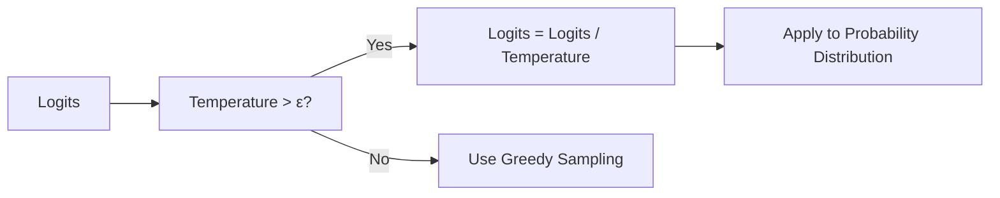
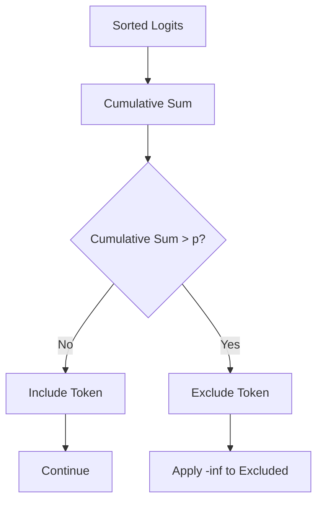
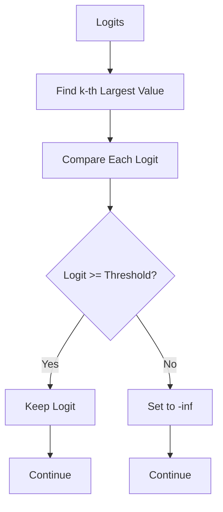
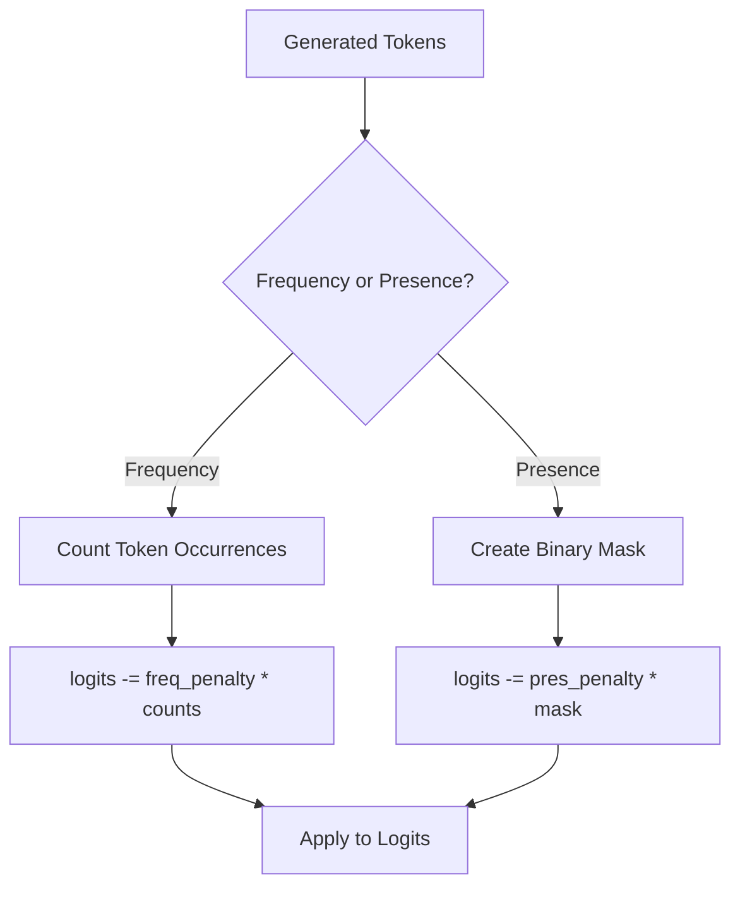
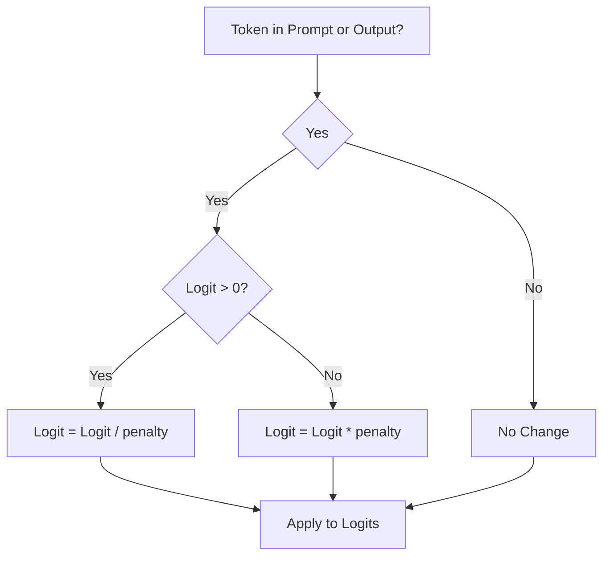
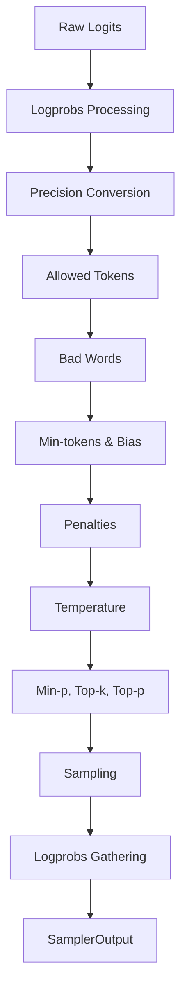

# Sampling Parameters

<cite>
**Referenced Files in This Document**   
- [sampling_params.py](file://vllm/sampling_params.py)
- [sampler.py](file://vllm/v1/sample/sampler.py)
- [topk_topp_sampler.py](file://vllm/v1/sample/ops/topk_topp_sampler.py)
- [penalties.py](file://vllm/v1/sample/ops/penalties.py)
- [utils.py](file://vllm/model_executor/layers/utils.py)
- [sampler.cu](file://csrc/sampler.cu)
- [logits_process.py](file://vllm/logits_process.py)
</cite>

## Table of Contents
1. [Introduction](#introduction)
2. [Sampling Parameters Overview](#sampling-parameters-overview)
3. [Temperature](#temperature)
4. [Top-p (Nucleus Sampling)](#top-p-nucleus-sampling)
5. [Top-k Sampling](#top-k-sampling)
6. [Frequency and Presence Penalties](#frequency-and-presence-penalties)
7. [Repetition Penalty](#repetition-penalty)
8. [Sampling Workflow](#sampling-workflow)
9. [Common Issues and Solutions](#common-issues-and-solutions)
10. [Conclusion](#conclusion)

## Introduction

Sampling parameters in vLLM control the text generation process by influencing how tokens are selected from the model's output distribution. These parameters determine the balance between creativity and coherence in generated text, allowing users to fine-tune the behavior of language models for different applications. This document provides a comprehensive analysis of the implementation and functionality of key sampling parameters including temperature, top_p, top_k, frequency and presence penalties, and repetition penalties.

The sampling system in vLLM follows the OpenAI text completion API specification while extending it with additional features like beam search. The parameters are validated, processed, and applied through a well-defined workflow that ensures both performance and correctness. Understanding these parameters is essential for controlling output diversity, preventing repetition, and achieving desired text generation characteristics.

**Section sources**
- [sampling_params.py](file://vllm/sampling_params.py#L111-L598)

## Sampling Parameters Overview

The `SamplingParams` class in vLLM defines the core parameters that control text generation behavior. These parameters are validated during initialization and influence the token selection process through various mathematical transformations applied to the model's logits.

The primary sampling parameters include:
- **temperature**: Controls randomness in token selection
- **top_p**: Implements nucleus sampling by considering the cumulative probability of top tokens
- **top_k**: Limits selection to the k most likely tokens
- **frequency_penalty**: Penalizes tokens based on their frequency in generated text
- **presence_penalty**: Penalizes tokens based on their mere presence in generated text
- **repetition_penalty**: Penalizes tokens that appear in both prompt and generated text

These parameters work together in a specific processing order to transform the raw logits from the model into a probability distribution from which tokens are sampled. Each parameter has specific validation rules to ensure valid values, such as temperature being non-negative and top_p being in the range (0,1].

**Diagram sources**
- [sampler.py](file://vllm/v1/sample/sampler.py#L20-L59)

**Section sources**
- [sampling_params.py](file://vllm/sampling_params.py#L125-L233)

## Temperature

Temperature controls the randomness of token selection by scaling the logits before applying the softmax function. Lower temperatures make the model more deterministic by sharpening the probability distribution, while higher temperatures increase randomness by flattening the distribution.

In vLLM's implementation, temperature is applied after other logits processors but before top-k and top-p filtering. The temperature scaling is implemented as division of logits by the temperature value. When temperature is zero (or below a small epsilon), the system defaults to greedy sampling regardless of other sampling parameters.

The system includes safeguards to prevent numerical instability with very low temperatures by setting a minimum threshold (_MAX_TEMP = 1e-2). This prevents potential issues with floating-point precision that could lead to NaN or infinite values in the tensors.

**Diagram sources**
- [sampler.py](file://vllm/v1/sample/sampler.py#L131-L141)

**Section sources**
- [sampling_params.py](file://vllm/sampling_params.py#L145-L148)
- [sampler.py](file://vllm/v1/sample/sampler.py#L131-L141)

## Top-p (Nucleus Sampling)

Top-p sampling, also known as nucleus sampling, selects from the smallest set of tokens whose cumulative probability exceeds the threshold p. This approach dynamically adjusts the number of tokens considered based on the confidence of the model's predictions.

In vLLM, top-p is implemented in the `TopKTopPSampler` class, which applies the filtering by sorting logits in descending order and accumulating probabilities until the sum exceeds p. Tokens outside this "nucleus" are assigned negative infinity, effectively removing them from consideration during sampling.

The implementation supports optimized paths using FlashInfer for CUDA devices when available, falling back to PyTorch-native implementation otherwise. The system handles edge cases such as tie values in probabilities by including all tied tokens in the top-p set, leaving tie-breaking to the final sampling step.

**Diagram sources**
- [topk_topp_sampler.py](file://vllm/v1/sample/ops/topk_topp_sampler.py#L20-L24)

**Section sources**
- [sampling_params.py](file://vllm/sampling_params.py#L149-L151)
- [topk_topp_sampler.py](file://vllm/v1/sample/ops/topk_topp_sampler.py#L92-L111)

## Top-k Sampling

Top-k sampling restricts token selection to the k most likely tokens according to the model's predictions. This parameter provides a hard limit on the number of tokens considered during sampling, with k=0 (or -1) meaning all tokens are considered.

In vLLM's implementation, top-k filtering is applied by identifying the k-th largest logit value and setting all logits below this threshold to negative infinity. This effectively removes them from consideration during the sampling process. The implementation handles the special case where k equals the vocabulary size by skipping the operation entirely for efficiency.

The system validates that top-k is either zero (disabled) or a positive integer, with negative values less than -1 being invalid. This validation ensures that the parameter is used correctly and prevents potential errors in the sampling process.

**Diagram sources**
- [topk_topp_sampler.py](file://vllm/v1/sample/ops/topk_topp_sampler.py#L250-L304)

**Section sources**
- [sampling_params.py](file://vllm/sampling_params.py#L152-L154)
- [topk_topp_sampler.py](file://vllm/v1/sample/ops/topk_topp_sampler.py#L250-L304)

## Frequency and Presence Penalties

Frequency and presence penalties are techniques to influence token selection based on previously generated content. These penalties help control repetition and encourage diversity in generated text.

**Frequency penalty** reduces the likelihood of tokens based on how frequently they've appeared in the generated text so far. The penalty is applied by subtracting the frequency count multiplied by the penalty coefficient from the logits. Higher frequency penalty values (>0) discourage repetition, while negative values encourage it.

**Presence penalty** is similar but only considers whether a token has appeared (binary presence) rather than its frequency. It applies a fixed penalty for each occurrence, making it less sensitive to how many times a token has been used.

In vLLM, both penalties are applied after temperature scaling and before top-k/top-p filtering. The implementation uses efficient tensor operations to compute the penalties across the entire batch simultaneously, with the frequency penalty using token frequency counts and the presence penalty using a binary mask.

**Diagram sources**
- [utils.py](file://vllm/model_executor/layers/utils.py#L58-L96)

**Section sources**
- [sampling_params.py](file://vllm/sampling_params.py#L133-L140)
- [utils.py](file://vllm/model_executor/layers/utils.py#L58-L96)

## Repetition Penalty

Repetition penalty is a more comprehensive mechanism that penalizes tokens based on their appearance in both the prompt and generated text. Unlike frequency and presence penalties that only consider generated text, repetition penalty also accounts for tokens in the input prompt.

In vLLM, the repetition penalty is implemented as a custom CUDA kernel (`apply_repetition_penalties_kernel`) for optimal performance. The penalty is applied differently depending on whether the logit value is positive or negative:
- For positive logits: divide by the penalty coefficient
- For negative logits: multiply by the penalty coefficient

This asymmetric application ensures that the relative ordering of tokens is preserved while still applying the desired penalty. Values greater than 1.0 encourage novelty by penalizing repeated tokens, while values less than 1.0 encourage repetition.

The system validates that repetition penalty is greater than zero, with the default value being 1.0 (no penalty). This parameter is particularly useful for preventing infinite loops or excessive repetition in long-form text generation.

**Diagram sources**
- [sampler.cu](file://csrc/sampler.cu#L15-L45)

**Section sources**
- [sampling_params.py](file://vllm/sampling_params.py#L141-L144)
- [sampler.cu](file://csrc/sampler.cu#L15-L45)

## Sampling Workflow

The sampling process in vLLM follows a well-defined sequence of operations that transform raw logits into sampled tokens. This workflow ensures consistent behavior across different hardware platforms and sampling configurations.

The process begins with logit processing, where various constraints and modifications are applied in a specific order:
1. Compute raw logprobs if requested
2. Convert logits to float32 precision
3. Apply allowed token restrictions
4. Apply bad words filtering
5. Apply min-tokens processor and logit bias
6. Apply repetition, frequency, and presence penalties
7. Apply temperature scaling
8. Apply min-p, top-k, and top-p filtering
9. Sample tokens from the resulting distribution
10. Gather logprobs for output

The system uses different implementations based on the hardware platform, with optimized paths for CUDA (using FlashInfer), ROCm (using aiter), and CPU. The `Sampler` class orchestrates this workflow, delegating specific operations to specialized components while maintaining consistency in the overall process.

**Diagram sources**
- [sampler.py](file://vllm/v1/sample/sampler.py#L20-L59)

**Section sources**
- [sampler.py](file://vllm/v1/sample/sampler.py#L67-L129)

## Common Issues and Solutions

Several common issues can arise when using sampling parameters, often related to improper configuration or misunderstanding of parameter interactions.

**Low diversity with high temperature**: Counterintuitively, very high temperature values can sometimes reduce output diversity due to numerical instability in the softmax function. Solution: Use moderate temperature values (0.7-1.0) and combine with top-p sampling.

**Excessive repetition**: This occurs when penalty parameters are not properly configured. Solution: Increase repetition_penalty (1.1-1.5) and presence_penalty (0.1-0.5) values, especially for long-form generation.

**Overly conservative output**: When top-k is too small or top-p is too low, the model may produce repetitive or generic text. Solution: Increase top-k (40-100) or top-p (0.9-0.95) values to allow more exploration.

**Validation errors**: Common mistakes include negative temperature values or invalid top-k values. The system validates parameters during initialization and raises descriptive errors to help users correct configuration issues.

The implementation includes safeguards such as the minimum temperature threshold (_MAX_TEMP) and automatic conversion of zero temperature to greedy sampling, which help prevent common configuration errors.

**Section sources**
- [sampling_params.py](file://vllm/sampling_params.py#L370-L448)

## Conclusion

The sampling parameters in vLLM provide a comprehensive toolkit for controlling text generation behavior. By understanding how temperature, top-p, top-k, and various penalties influence the token selection process, users can fine-tune model outputs for specific applications.

The implementation balances performance and flexibility, with optimized paths for different hardware platforms while maintaining consistent behavior across configurations. The validation system ensures parameter correctness, and the well-defined processing order guarantees predictable results.

For optimal results, users should experiment with combinations of parameters rather than relying on single settings. For example, combining moderate temperature (0.7) with top-p sampling (0.9) and appropriate penalties often produces the best balance of creativity and coherence. Understanding the underlying implementation helps in diagnosing issues and selecting appropriate parameter values for specific use cases.