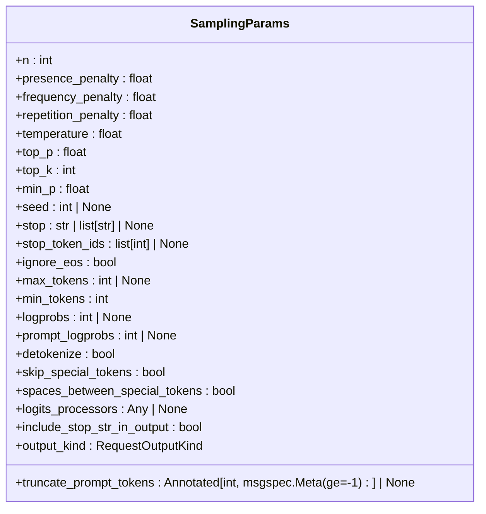
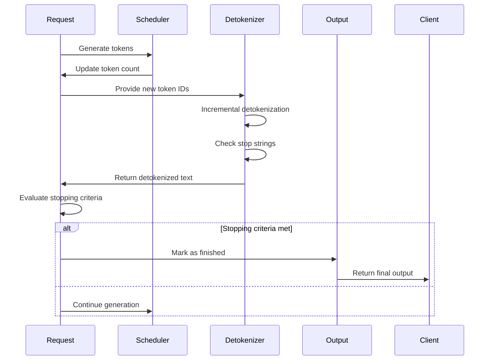
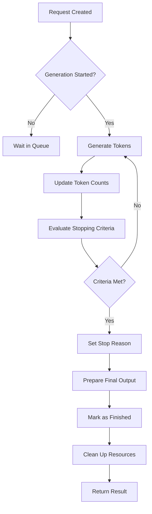

# Stopping Criteria

<cite>
**Referenced Files in This Document**   
- [sampling_params.py](file://vllm/sampling_params.py)
- [request.py](file://vllm/v1/request.py)
- [scheduler.py](file://vllm/v1/core/sched/scheduler.py)
- [utils.py](file://vllm/v1/core/sched/utils.py)
- [detokenizer.py](file://vllm/v1/engine/detokenizer.py)
- [outputs.py](file://vllm/outputs.py)
- [test_stop_reason.py](file://tests/detokenizer/test_stop_reason.py)
</cite>

## Table of Contents
1. [Introduction](#introduction)
2. [Stopping Criteria Types](#stopping-criteria-types)
3. [Implementation Details](#implementation-details)
4. [Request Processing Lifecycle](#request-processing-lifecycle)
5. [Scheduler Integration](#scheduler-integration)
6. [Common Issues and Solutions](#common-issues-and-solutions)
7. [Conclusion](#conclusion)

## Introduction
The stopping criteria mechanism in vLLM determines when text generation should terminate for a given request. This system provides multiple ways to control generation length and termination conditions, ensuring flexibility for various use cases. The stopping criteria are implemented through a combination of configuration parameters, state management, and evaluation logic that work together within vLLM's asynchronous processing model. This document explains how stopping conditions are evaluated during the generation process and how they interact with the scheduler to provide reliable text generation termination.

**Section sources**
- [sampling_params.py](file://vllm/sampling_params.py#L110-L580)
- [request.py](file://vllm/v1/request.py#L29-L240)

## Stopping Criteria Types
vLLM supports several types of stopping criteria that can be used individually or in combination to control text generation:

### Maximum Token Limits
The `max_tokens` parameter in `SamplingParams` defines the maximum number of tokens to generate per output sequence. This hard limit prevents infinite generation and ensures predictable response sizes. The `min_tokens` parameter complements this by specifying the minimum number of tokens to generate before EOS or stop tokens can be generated, ensuring a minimum response length.

### Stop Sequences
Stop sequences are strings that terminate generation when they are generated. These can be specified through the `stop` parameter in `SamplingParams`, which accepts either a single string or a list of strings. The `include_stop_str_in_output` parameter controls whether the stop strings are included in the final output text.

### Special Tokens
Special tokens can be used to stop generation, including:
- EOS (End of Sequence) token, which stops generation when encountered unless `ignore_eos` is set to True
- Specific stop token IDs specified in `stop_token_ids`
- Model-specific special tokens that have designated functions

These criteria are configured through the `SamplingParams` class, which encapsulates all sampling parameters for text generation.

**Diagram sources **
- [sampling_params.py](file://vllm/sampling_params.py#L110-L580)

**Section sources**
- [sampling_params.py](file://vllm/sampling_params.py#L110-L580)

## Implementation Details
The stopping criteria implementation in vLLM involves several components working together to evaluate and enforce stopping conditions during text generation.

### Request State Management
The `Request` class in vLLM maintains the state of each generation request, including tracking generated tokens and evaluating stopping conditions. Key attributes include:
- `output_token_ids`: List of generated token IDs
- `num_output_tokens`: Count of output tokens generated
- `num_tokens`: Total count of tokens (prompt + output)
- `max_tokens`: Maximum tokens to generate (from sampling parameters)
- `stop_reason`: Indicates why generation stopped

The request state is updated as new tokens are generated, allowing for continuous evaluation of stopping criteria.

### Stopping Condition Evaluation
The core stopping condition evaluation is implemented in the `check_stop` function in `utils.py`. This function evaluates multiple stopping criteria in a specific order:

1. **Pooling check**: For pooling requests, generation stops when pooler output is available
2. **Minimum tokens check**: Ensures minimum token count is reached before considering other stopping criteria
3. **EOS token check**: Stops if the EOS token is generated and `ignore_eos` is False
4. **Stop token check**: Stops if any token in `stop_token_ids` is generated
5. **Length limits**: Stops if maximum model length or maximum tokens limit is reached

The function updates the request status to reflect the reason for stopping, such as `FINISHED_STOPPED` or `FINISHED_LENGTH_CAPPED`.

### Detokenization and Stop String Handling
The `IncrementalDetokenizer` class handles the detokenization process and stop string evaluation. It maintains:
- `output_text`: Incrementally built output text
- `stop`: List of stop strings to check
- `stop_buffer_length`: Number of characters to hold back for stop string evaluation
- `min_tokens`: Minimum tokens before stop strings are evaluated

When new tokens are generated, the detokenizer updates the output text and checks for stop strings in the newly generated portion. If a stop string is found, the output is truncated accordingly based on the `include_stop_str_in_output` setting.

**Diagram sources **
- [request.py](file://vllm/v1/request.py#L29-L240)
- [scheduler.py](file://vllm/v1/core/sched/scheduler.py#L57-L800)
- [detokenizer.py](file://vllm/v1/engine/detokenizer.py#L43-L142)
- [utils.py](file://vllm/v1/core/sched/utils.py#L42-L73)

**Section sources**
- [request.py](file://vllm/v1/request.py#L29-L240)
- [utils.py](file://vllm/v1/core/sched/utils.py#L42-L73)
- [detokenizer.py](file://vllm/v1/engine/detokenizer.py#L43-L142)

## Request Processing Lifecycle
The stopping criteria are integrated throughout the request processing lifecycle in vLLM, from request creation to completion.

### Request Creation
When a request is created, stopping criteria are initialized from the `SamplingParams`:
- `max_tokens` is set from the sampling parameters
- `min_tokens` is validated and stored
- Stop token IDs are collected and stored
- Stop strings are prepared for evaluation

The request status is initially set to `WAITING`, and the stopping criteria are not evaluated until generation begins.

### Generation Phase
During the generation phase, the stopping criteria are evaluated after each token generation step:
1. New tokens are added to the request's output token list
2. Token counts are updated
3. The `check_stop` function is called to evaluate stopping conditions
4. If stopping criteria are met, the request status is updated accordingly

The evaluation considers both token-based and text-based stopping criteria, ensuring comprehensive coverage of different stopping conditions.

### Completion Phase
When stopping criteria are met, the request transitions to a finished state:
- The `stop_reason` is set to indicate why generation stopped
- The final output is prepared
- The request is marked as finished
- Resources are cleaned up

The completion phase ensures that all stopping criteria are properly handled and that the final output reflects the configured behavior, such as whether stop strings should be included in the output.

**Diagram sources **
- [request.py](file://vllm/v1/request.py#L29-L240)
- [scheduler.py](file://vllm/v1/core/sched/scheduler.py#L57-L800)

**Section sources**
- [request.py](file://vllm/v1/request.py#L29-L240)
- [scheduler.py](file://vllm/v1/core/sched/scheduler.py#L57-L800)

## Scheduler Integration
The stopping criteria are tightly integrated with vLLM's scheduler, which manages the execution of multiple requests concurrently.

### Scheduling Decisions
The scheduler uses stopping criteria to make scheduling decisions:
- Requests that have met their stopping criteria are removed from the running queue
- The scheduler checks `num_output_tokens` against `max_tokens` to determine if a request should continue
- Memory allocation considers the potential maximum length of generation

The scheduler ensures that requests are only scheduled for execution when they haven't met their stopping criteria, optimizing resource utilization.

### State Synchronization
The scheduler maintains synchronization between the request state and scheduling decisions:
- After each scheduling step, the scheduler updates the request states
- Finished requests are identified and removed from active processing
- Resource cleanup is coordinated between the scheduler and request handlers

This synchronization ensures that stopping criteria are consistently enforced across the system.

### Performance Considerations
The integration with the scheduler includes performance optimizations:
- Efficient checking of stopping criteria to minimize overhead
- Batched evaluation of multiple requests
- Caching of frequently accessed parameters

These optimizations ensure that stopping criteria evaluation doesn't become a bottleneck in high-throughput scenarios.

**Section sources**
- [scheduler.py](file://vllm/v1/core/sched/scheduler.py#L57-L800)
- [request.py](file://vllm/v1/request.py#L29-L240)

## Common Issues and Solutions
Several common issues can arise with stopping criteria configuration, along with their solutions.

### Infinite Generation Loops
Infinite generation loops can occur when:
- `max_tokens` is not set or set too high
- `ignore_eos` is set to True without alternative stopping criteria
- Stop sequences are not properly configured

Solutions include:
- Always set a reasonable `max_tokens` limit
- Use `min_tokens` to ensure minimum response length
- Combine multiple stopping criteria for robust termination

### Stop String Detection Issues
Issues with stop string detection may arise due to:
- Tokenization artifacts affecting string matching
- Timing of stop string evaluation
- Buffering of output text

Solutions include:
- Using token-based stopping (`stop_token_ids`) when possible
- Adjusting `output_text_buffer_length` for proper evaluation
- Testing stop strings with the specific model's tokenizer

### Configuration Best Practices
Recommended configuration practices:
- Set `max_tokens` to a reasonable limit based on use case
- Use `min_tokens` to ensure meaningful responses
- Combine token-based and string-based stopping criteria
- Test stopping behavior with actual prompts and models
- Monitor stopping behavior in production and adjust as needed

Proper configuration of stopping parameters ensures reliable and predictable text generation behavior.

**Section sources**
- [sampling_params.py](file://vllm/sampling_params.py#L110-L580)
- [test_stop_reason.py](file://tests/detokenizer/test_stop_reason.py#L1-L45)
- [request.py](file://vllm/v1/request.py#L29-L240)

## Conclusion
The stopping criteria mechanism in vLLM provides a comprehensive system for controlling text generation termination. By combining maximum token limits, stop sequences, and special tokens, vLLM offers flexible and reliable stopping behavior that can be tailored to various use cases. The implementation integrates stopping criteria evaluation throughout the request processing lifecycle, from request creation to completion, ensuring consistent behavior. The tight integration with the scheduler enables efficient resource management while maintaining accurate stopping condition enforcement. Proper configuration of stopping parameters is essential to prevent issues like infinite generation loops and ensure predictable response behavior. By following best practices and understanding the implementation details, users can effectively leverage vLLM's stopping criteria to build robust text generation applications.