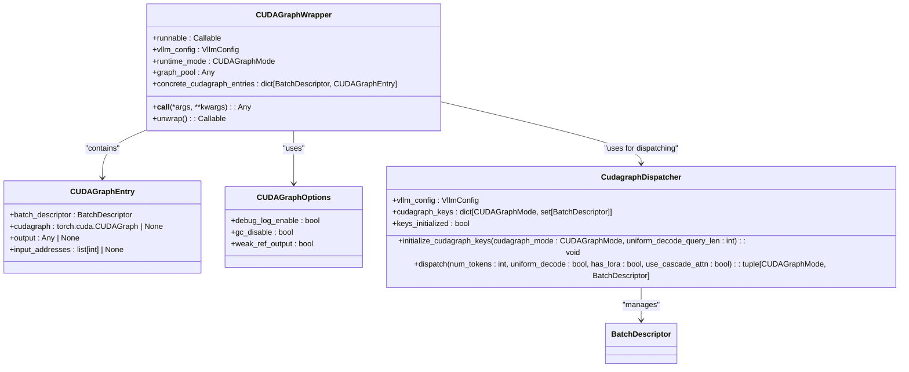
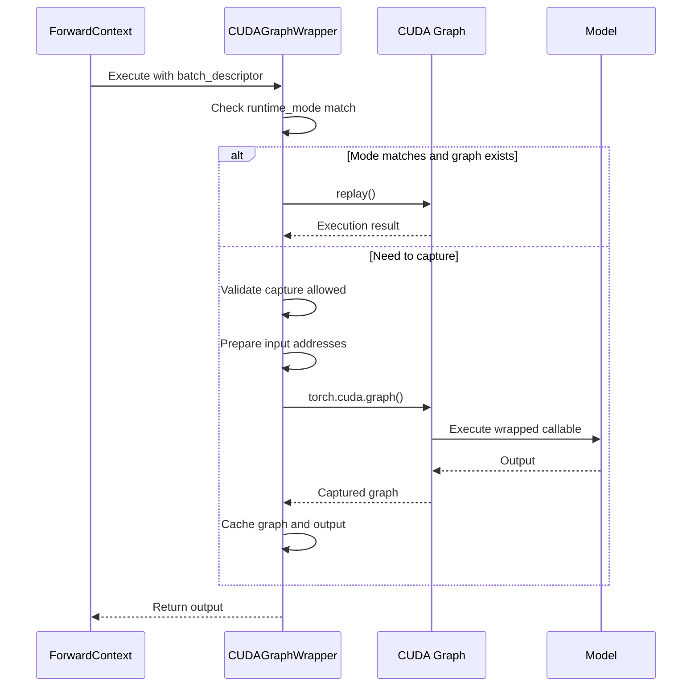
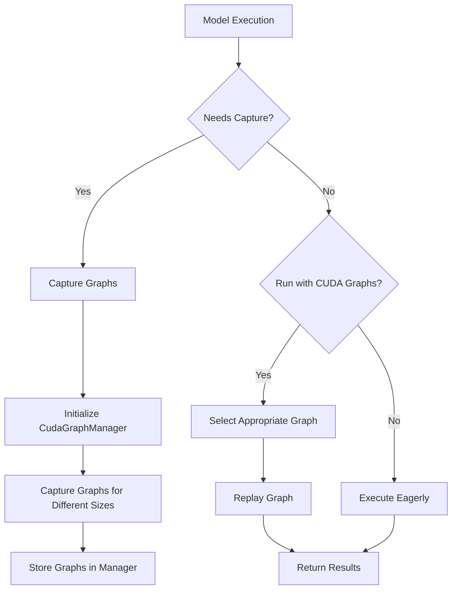
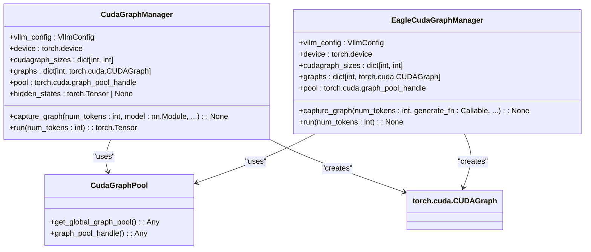
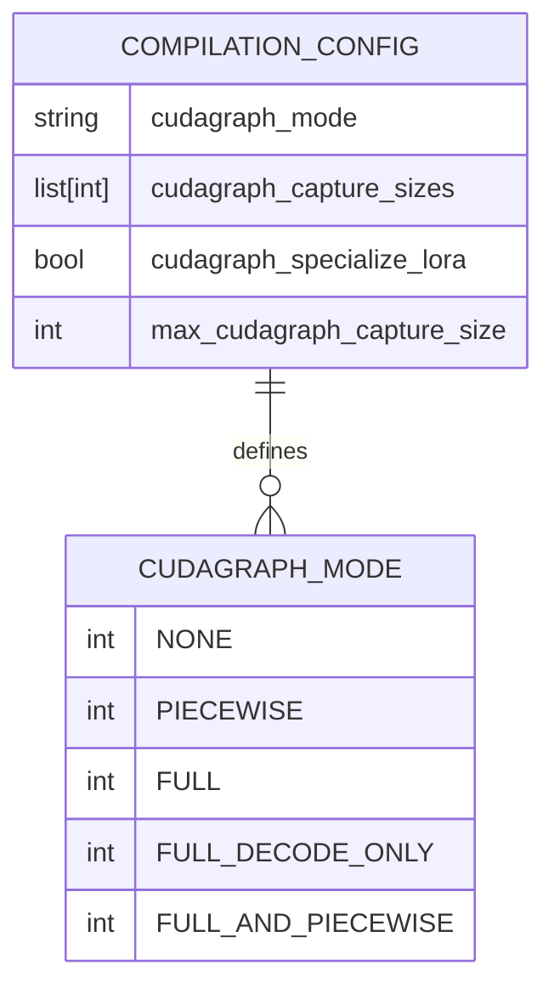

# CUDA Graphs

<cite>
**Referenced Files in This Document**   
- [cuda_graph.py](file://vllm/compilation/cuda_graph.py)
- [cudagraph_utils.py](file://vllm/v1/worker/gpu/cudagraph_utils.py)
- [eagle_cudagraph.py](file://vllm/v1/worker/gpu/spec_decode/eagle_cudagraph.py)
- [compilation.py](file://vllm/config/compilation.py)
- [cudagraph_dispatcher.py](file://vllm/v1/cudagraph_dispatcher.py)
- [monitor.py](file://vllm/compilation/monitor.py)
- [parallel_state.py](file://vllm/distributed/parallel_state.py)
- [pynccl_allocator.py](file://vllm/distributed/device_communicators/pynccl_allocator.py)
</cite>

## Table of Contents
1. [Introduction](#introduction)
2. [Domain Model](#domain-model)
3. [Graph Capture and Replay Mechanism](#graph-capture-and-replay-mechanism)
4. [Integration with GPU Model Runner](#integration-with-gpu-model-runner)
5. [Memory Management and Graph Pooling](#memory-management-and-graph-pooling)
6. [Configuration Options](#configuration-options)
7. [Conclusion](#conclusion)

## Introduction

CUDA Graphs in vLLM represent a critical performance optimization technique that captures sequences of CUDA operations into a single graph to reduce kernel launch overhead. This optimization is particularly important in large language model inference where minimizing latency and maximizing throughput are essential. By capturing repetitive computation patterns into static graphs, vLLM can significantly reduce the CPU overhead associated with launching individual CUDA kernels, leading to improved performance and more efficient GPU utilization.

The implementation leverages PyTorch's CUDA Graph API to capture and replay computation graphs, with vLLM providing an abstraction layer that manages the complexity of graph capture, storage, and execution. This documentation provides a comprehensive analysis of the CUDA Graphs implementation in vLLM, covering the domain model, capture and replay mechanisms, integration with the GPU model runner, memory management strategies, and configuration options.

**Section sources**
- [cuda_graph.py](file://vllm/compilation/cuda_graph.py#L1-L209)
- [compilation.py](file://vllm/config/compilation.py#L1-L200)

## Domain Model

The CUDA Graphs implementation in vLLM is built around several key components that work together to capture, store, and execute computation graphs. The domain model includes the CudaGraphRunner, CudaGraphPool, and related classes that manage the graph lifecycle.

The `CUDAGraphWrapper` class serves as the primary interface for CUDA Graph functionality, wrapping a callable to add graph capturing and replaying capabilities. It maintains a cache of captured graphs indexed by batch descriptors, allowing for efficient lookup and replay of previously captured computation patterns. The wrapper is designed to be transparent to the underlying callable, providing attribute access to the wrapped object through `__getattr__`.

**Diagram sources **
- [cuda_graph.py](file://vllm/compilation/cuda_graph.py#L43-L209)
- [cudagraph_dispatcher.py](file://vllm/v1/cudagraph_dispatcher.py#L12-L184)

**Section sources**
- [cuda_graph.py](file://vllm/compilation/cuda_graph.py#L25-L209)
- [cudagraph_dispatcher.py](file://vllm/v1/cudagraph_dispatcher.py#L12-L184)

## Graph Capture and Replay Mechanism

The graph capture and replay mechanism in vLLM follows a well-defined workflow that ensures efficient execution of captured computation patterns. The process begins with the initialization of a `CUDAGraphWrapper` with a specific runtime mode (FULL or PIECEWISE) and a reference to the callable to be wrapped.

During execution, the wrapper receives a runtime mode and batch descriptor from the forward context, which it uses to determine whether to capture a new graph or replay an existing one. If the runtime mode matches the wrapper's mode and a graph exists for the given batch descriptor, the wrapper replays the graph. Otherwise, it captures a new graph by executing the wrapped callable within a CUDA graph context.

**Diagram sources **
- [cuda_graph.py](file://vllm/compilation/cuda_graph.py#L111-L208)

**Section sources**
- [cuda_graph.py](file://vllm/compilation/cuda_graph.py#L111-L208)
- [monitor.py](file://vllm/compilation/monitor.py#L48-L62)

## Integration with GPU Model Runner

The integration of CUDA Graphs with the GPU model runner in vLLM is designed to optimize the model execution loop by capturing and replaying computation patterns for different sequence lengths. The `CudaGraphManager` class plays a central role in this integration, managing the capture and execution of graphs for various batch sizes.

The manager determines which graph sizes to capture based on the configuration and model constraints, creating a mapping from sequence lengths to appropriate graph sizes. During inference, the manager selects the appropriate graph based on the current batch size and sequence length, ensuring that the most efficient computation pattern is used.

**Diagram sources **
- [cudagraph_utils.py](file://vllm/v1/worker/gpu/cudagraph_utils.py#L24-L154)

**Section sources**
- [cudagraph_utils.py](file://vllm/v1/worker/gpu/cudagraph_utils.py#L24-L154)
- [eagle_cudagraph.py](file://vllm/v1/worker/gpu/spec_decode/eagle_cudagraph.py#L21-L116)

## Memory Management and Graph Pooling

Memory management and graph pooling are critical aspects of the CUDA Graphs implementation in vLLM, addressing the potential memory overhead from maintaining multiple graph instances. The system employs several strategies to optimize memory usage and prevent excessive memory consumption.

The `CudaGraphPool` concept is implemented through PyTorch's graph pool handle, which allows for efficient memory allocation and reuse across graph instances. The global graph pool is accessed through the platform interface, ensuring consistent behavior across different execution environments.

**Diagram sources **
- [cudagraph_utils.py](file://vllm/v1/worker/gpu/cudagraph_utils.py#L24-L58)
- [eagle_cudagraph.py](file://vllm/v1/worker/gpu/spec_decode/eagle_cudagraph.py#L21-L58)
- [pynccl_allocator.py](file://vllm/distributed/device_communicators/pynccl_allocator.py#L62-L191)

**Section sources**
- [cudagraph_utils.py](file://vllm/v1/worker/gpu/cudagraph_utils.py#L52-L58)
- [pynccl_allocator.py](file://vllm/distributed/device_communicators/pynccl_allocator.py#L62-L191)

## Configuration Options

vLLM provides several configuration options for enabling and tuning CUDA Graphs, allowing users to optimize performance based on their specific use cases and hardware constraints. These options are defined in the `CompilationConfig` class and can be set through the vLLM configuration system.

The primary configuration options include:
- `cudagraph_mode`: Controls the CUDA Graph mode (NONE, PIECEWISE, FULL, FULL_DECODE_ONLY, FULL_AND_PIECEWISE)
- `cudagraph_capture_sizes`: Specifies the batch sizes for which graphs should be captured
- `cudagraph_specialize_lora`: Determines whether to specialize graphs for LoRA activation cases
- `max_cudagraph_capture_size`: Sets the maximum size for graph capture

**Diagram sources **
- [compilation.py](file://vllm/config/compilation.py#L47-L88)

**Section sources**
- [compilation.py](file://vllm/config/compilation.py#L47-L88)
- [vllm.py](file://vllm/config/vllm.py#L670-L692)

## Conclusion

The CUDA Graphs implementation in vLLM provides a powerful performance optimization mechanism that significantly reduces kernel launch overhead in large language model inference. By capturing sequences of CUDA operations into static graphs, vLLM can achieve substantial performance improvements, particularly in scenarios with repetitive computation patterns.

The system's design balances performance optimization with memory efficiency through careful graph pooling and memory management strategies. The integration with the GPU model runner ensures that graphs are captured and replayed appropriately for different sequence lengths, while the configuration options provide flexibility for tuning the optimization to specific use cases.

Future work could explore additional optimization opportunities, such as dynamic graph capture for previously unseen batch sizes, more sophisticated graph pooling strategies, and enhanced support for mixed precision computations within captured graphs.

**Section sources**
- [cuda_graph.py](file://vllm/compilation/cuda_graph.py#L1-L209)
- [cudagraph_utils.py](file://vllm/v1/worker/gpu/cudagraph_utils.py#L1-L260)
- [compilation.py](file://vllm/config/compilation.py#L1-L200)