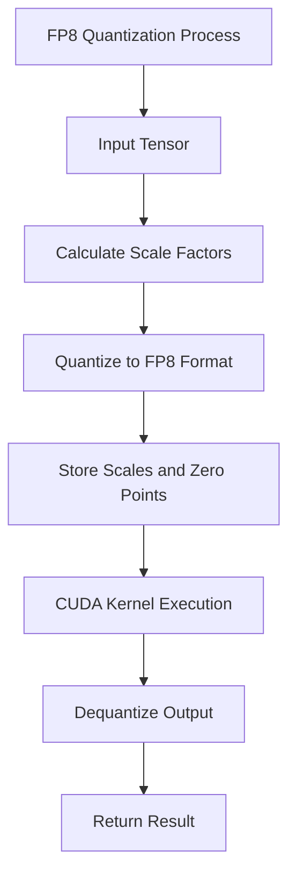
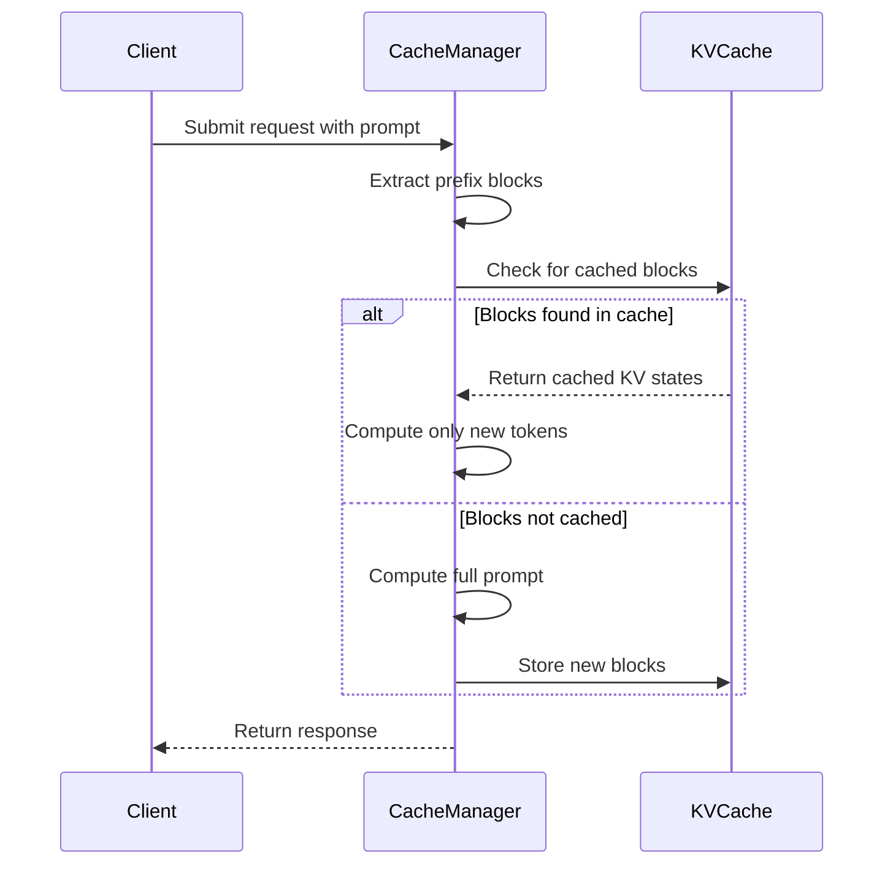
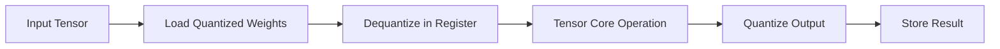

# Performance Optimization

<cite>
**Referenced Files in This Document**   
- [gptq.py](file://vllm/model_executor/layers/quantization/gptq.py)
- [awq.py](file://vllm/model_executor/layers/quantization/awq.py)
- [fp8.py](file://vllm/model_executor/layers/quantization/fp8.py)
- [int8_utils.py](file://vllm/model_executor/layers/quantization/utils/int8_utils.py)
- [quant_utils.py](file://vllm/model_executor/layers/quantization/utils/quant_utils.py)
- [marlin_24_cuda_kernel.cu](file://csrc/quantization/marlin/sparse/marlin_24_cuda_kernel.cu)
- [nvfp4_quant_kernels.cu](file://csrc/quantization/fp4/nvfp4_quant_kernels.cu)
- [benchmark_prefix_caching.py](file://benchmarks/benchmark_prefix_caching.py)
- [kv_cache_manager.py](file://vllm/v1/core/kv_cache_manager.py)
- [spec_decode.py](file://examples/offline_inference/spec_decode.py)
</cite>

## Table of Contents
1. [Introduction](#introduction)
2. [Quantization Techniques](#quantization-techniques)
3. [Speculative Decoding](#speculative-decoding)
4. [Prefix Caching](#prefix-caching)
5. [CUDA Kernel Implementation](#cuda-kernel-implementation)
6. [Performance Evaluation](#performance-evaluation)
7. [Common Issues and Solutions](#common-issues-and-solutions)
8. [Conclusion](#conclusion)

## Introduction

vLLM implements several advanced optimization techniques to improve inference speed and efficiency for large language models. These optimizations include quantization methods that reduce model size and memory bandwidth requirements, speculative decoding that accelerates generation using draft models, and prefix caching that avoids recomputing shared prompt prefixes across requests. This document provides a comprehensive overview of these performance optimization techniques, detailing their implementation in vLLM with a focus on both conceptual understanding and technical details.

**Section sources**
- [README.md](file://README.md#L71-L81)

## Quantization Techniques

Quantization is a crucial technique for reducing model size and memory bandwidth requirements while maintaining accuracy. vLLM supports multiple quantization schemes including GPTQ, AWQ, FP8, and INT4/INT8, each with specific trade-offs between model size, computational efficiency, and accuracy preservation.

### GPTQ (Generalized Post-Training Quantization)

GPTQ is a post-training quantization method that compresses weights to lower precision formats. The implementation supports 2, 3, 4, and 8-bit weight quantization with group-wise quantization where weights are divided into groups and quantized independently. The GPTQ configuration includes parameters such as weight bits, group size, and whether to use descending activation order (desc_act). The quantization process involves calculating scales and zero points for each group, enabling efficient dequantization during inference.

**Section sources**
- [gptq.py](file://vllm/model_executor/layers/quantization/gptq.py#L43-L200)

### AWQ (Activation-Aware Weight Quantization)

AWQ is a quantization method that considers activation patterns when determining quantization parameters. It specifically supports 4-bit weight quantization with configurable group sizes. The AWQ implementation in vLLM includes support for zero-point quantization and allows specifying modules that should not be converted to quantized form. The method preserves accuracy by scaling weights based on activation magnitudes, making it particularly effective for maintaining performance with aggressive quantization.

**Section sources**
- [awq.py](file://vllm/model_executor/layers/quantization/awq.py#L32-L200)

### FP8 (Floating Point 8-bit) Quantization

FP8 quantization uses 8-bit floating point formats to represent both weights and activations. vLLM supports multiple FP8 formats including E4M3 and E5M2, with different configurations for weight and activation quantization. The implementation includes specialized CUDA kernels optimized for tensor core operations on supported hardware (SM90 and SM100). FP8 quantization provides a good balance between numerical precision and memory efficiency, particularly effective on modern NVIDIA GPUs with native FP8 support.

**Diagram sources **
- [fp8.py](file://vllm/model_executor/layers/quantization/fp8.py#L116-L200)
- [nvfp4_quant_kernels.cu](file://csrc/quantization/fp4/nvfp4_quant_kernels.cu#L158-L199)

### INT4/INT8 Quantization

Integer quantization using 4-bit and 8-bit formats provides significant memory savings and computational efficiency. The implementation supports both per-tensor and per-group quantization schemes. For INT8, vLLM provides optimized CUDA kernels that leverage tensor core operations for accelerated matrix multiplication. The quantization process involves calculating scale factors and zero points to map floating-point values to integer representations while minimizing information loss.

**Section sources**
- [int8_utils.py](file://vllm/model_executor/layers/quantization/utils/int8_utils.py#L39-L245)
- [quant_utils.py](file://vllm/model_executor/layers/quantization/utils/quant_utils.py#L533-L571)

## Speculative Decoding

Speculative decoding is an advanced technique that uses a smaller draft model to accelerate generation from a larger target model. The draft model rapidly generates a sequence of tokens, which are then verified by the target model in a single forward pass. When predictions are correct, multiple tokens are accepted simultaneously, significantly reducing the number of forward passes required.

The implementation in vLLM follows a multi-step process:
1. The draft model generates a sequence of tokens
2. The target model computes logits for the draft tokens in parallel
3. Tokens are accepted or rejected based on probability thresholds
4. Rejected tokens trigger standard autoregressive generation

This approach can achieve substantial speedups, particularly for long generation sequences, by reducing the number of sequential operations required.

**Section sources**
- [spec_decode.py](file://examples/offline_inference/spec_decode.py)

## Prefix Caching

Prefix caching is an optimization technique that avoids recomputing shared prompt prefixes across requests. When multiple requests share common prompt prefixes, vLLM caches the key-value states from previous computations and reuses them for subsequent requests.

The implementation uses a hash-based mechanism to identify and store shared prefix blocks. When a new request arrives, the system checks if any prefix blocks are already cached and can be reused. This significantly reduces computation for:
- Batched requests with shared prefixes
- Chat applications with conversation history
- API endpoints serving similar prompts

The cache manager handles block allocation, eviction, and sharing across requests, ensuring efficient memory utilization while maintaining correctness.

**Diagram sources **
- [benchmark_prefix_caching.py](file://benchmarks/benchmark_prefix_caching.py#L1-L278)
- [kv_cache_manager.py](file://vllm/v1/core/kv_cache_manager.py#L99-L130)

## CUDA Kernel Implementation

vLLM implements optimized CUDA kernels for quantized operations, leveraging hardware-specific features for maximum performance. The kernel implementations are designed to maximize throughput and minimize latency for quantized operations.

### Marlin Kernel for INT4/INT8

The Marlin kernel provides optimized execution for INT4 and INT8 quantized models. It uses a 2:4 sparsity pattern and specialized memory layouts to achieve high throughput on NVIDIA GPUs. The kernel implementation includes:
- Efficient weight packing and unpacking
- Optimized memory access patterns
- Tensor core utilization for matrix operations
- Support for various block sizes and group configurations

The kernel supports both 4-bit and 8-bit operations, with different configurations for different hardware capabilities.

**Diagram sources **
- [marlin_24_cuda_kernel.cu](file://csrc/quantization/marlin/sparse/marlin_24_cuda_kernel.cu#L1-L1015)

### FP8 Kernel Optimization

The FP8 kernel implementation is optimized for modern NVIDIA GPUs with tensor core support. It uses specialized data types and memory layouts to maximize computational efficiency. The kernel supports:
- Mixed precision operations (FP8 weights with FP16 activations)
- Block-wise quantization with dynamic scaling
- Efficient scale factor management
- Hardware-accelerated dequantization

The implementation takes advantage of the tensor core's native FP8 support to achieve high throughput for quantized operations.

**Section sources**
- [fp8.py](file://vllm/model_executor/layers/quantization/fp8.py)

## Performance Evaluation

vLLM provides comprehensive benchmarking tools to evaluate the performance impact of different optimization settings. The benchmark suite includes:
- Throughput measurements for various batch sizes
- Latency analysis for different sequence lengths
- Memory utilization monitoring
- Comparative analysis of different quantization schemes

The benchmarks demonstrate significant performance improvements with optimization:
- Quantization can reduce model size by 4-8x with minimal accuracy loss
- Speculative decoding can achieve 2-4x speedup for long sequences
- Prefix caching can reduce computation time by 30-70% for shared prefixes

The performance gains are particularly pronounced for large models and high-throughput serving scenarios.

**Section sources**
- [benchmark_prefix_caching.py](file://benchmarks/benchmark_prefix_caching.py)

## Common Issues and Solutions

While the optimization techniques provide significant benefits, they can introduce challenges that require careful management.

### Accuracy Degradation with Aggressive Quantization

Aggressive quantization (particularly INT4) can lead to accuracy degradation. Solutions include:
- Using larger group sizes to preserve local statistics
- Applying activation-aware scaling (as in AWQ)
- Fine-tuning after quantization
- Using mixed precision (quantized weights with full-precision activations)

### Memory Management in Prefix Caching

Large-scale prefix caching can lead to memory pressure. Solutions include:
- Configurable cache size limits
- LRU-based eviction policies
- Hash-based deduplication
- Memory-efficient data structures

### Speculative Decoding Failure Modes

Speculative decoding can fail when the draft model generates low-quality sequences. Solutions include:
- Adaptive draft length based on confidence
- Multiple draft models for different scenarios
- Fallback to standard decoding when failure rate is high
- Draft model fine-tuning for better alignment with target model

**Section sources**
- [gptq.py](file://vllm/model_executor/layers/quantization/gptq.py)
- [awq.py](file://vllm/model_executor/layers/quantization/awq.py)
- [fp8.py](file://vllm/model_executor/layers/quantization/fp8.py)

## Conclusion

vLLM's performance optimization techniques provide substantial improvements in inference speed and efficiency. The combination of quantization, speculative decoding, and prefix caching enables high-throughput serving of large language models while maintaining accuracy. The implementation leverages optimized CUDA kernels and careful system design to maximize the benefits of these techniques. By understanding the trade-offs and proper configuration of these optimizations, users can achieve optimal performance for their specific use cases.