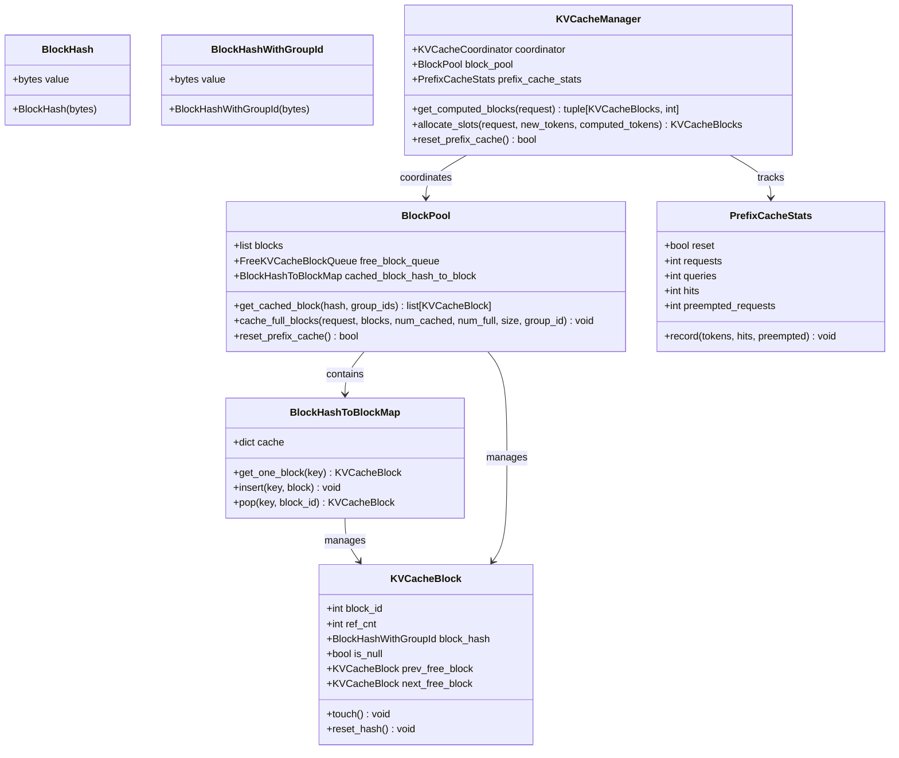
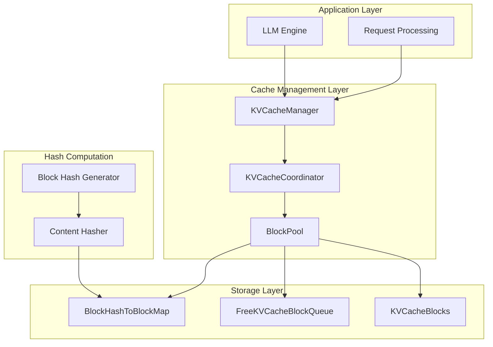
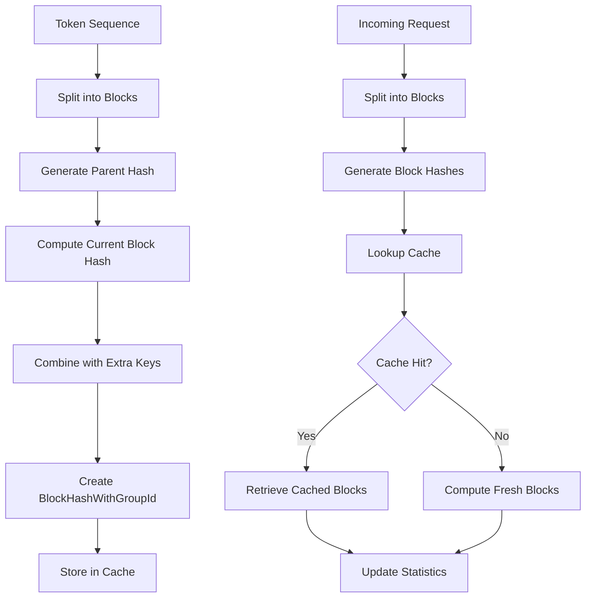
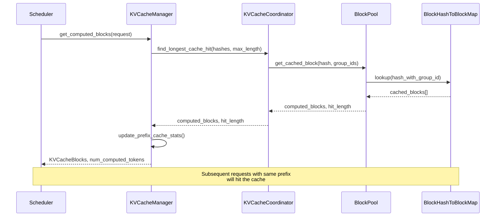
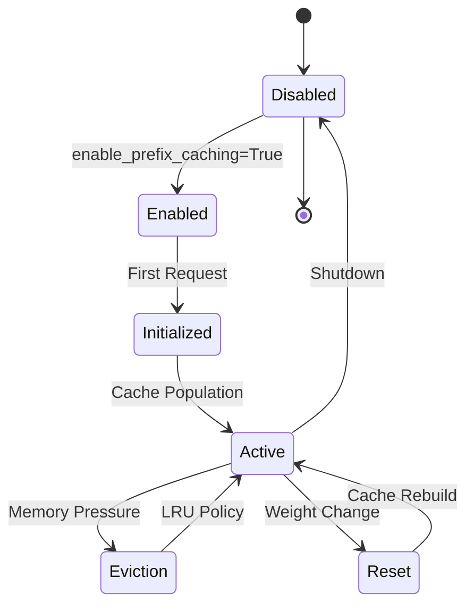

# Prefix Caching

<cite>
**Referenced Files in This Document**
- [kv_cache_utils.py](file://vllm/v1/core/kv_cache_utils.py)
- [kv_cache_manager.py](file://vllm/v1/core/kv_cache_manager.py)
- [block_pool.py](file://vllm/v1/core/block_pool.py)
- [kv_cache_coordinator.py](file://vllm/v1/core/kv_cache_coordinator.py)
- [scheduler.py](file://vllm/v1/core/sched/scheduler.py)
- [stats.py](file://vllm/v1/metrics/stats.py)
- [single_type_kv_cache_manager.py](file://vllm/v1/core/single_type_kv_cache_manager.py)
- [prefix_caching.py](file://examples/offline_inference/prefix_caching.py)
- [benchmark_prefix_caching.py](file://benchmarks/benchmark_prefix_caching.py)
</cite>

## Table of Contents
1. [Introduction](#introduction)
2. [Domain Model](#domain-model)
3. [Implementation Architecture](#implementation-architecture)
4. [Hash-Based Lookup Mechanism](#hash-based-lookup-mechanism)
5. [Scheduler Integration](#scheduler-integration)
6. [Performance Optimization](#performance-optimization)
7. [Configuration and Tuning](#configuration-and-tuning)
8. [Cache Lifecycle Management](#cache-lifecycle-management)
9. [Common Issues and Solutions](#common-issues-and-solutions)
10. [Practical Examples](#practical-examples)

## Introduction

Prefix Caching is a sophisticated performance optimization feature in vLLM that eliminates redundant computation of shared prompt prefixes across multiple requests. By intelligently caching the KV (Key-Value) state of commonly repeated text segments, prefix caching significantly reduces computational overhead and accelerates response times for applications with shared system prompts, templates, or frequently occurring text patterns.

The feature operates on the principle that many natural language processing tasks involve repetitive text patterns, particularly in chat applications where system prompts, instruction templates, and contextual information are consistently reused across different user interactions. Prefix Caching identifies these recurring patterns and stores their computed attention states, enabling subsequent requests to skip expensive computation for the shared portions.

## Domain Model

The prefix caching system is built around several core components that work together to provide efficient cache management and lookup capabilities.

### Core Components



**Diagram sources**
- [kv_cache_utils.py](file://vllm/v1/core/kv_cache_utils.py#L31-L152)
- [block_pool.py](file://vllm/v1/core/block_pool.py#L32-L127)
- [kv_cache_manager.py](file://vllm/v1/core/kv_cache_manager.py#L94-L142)
- [stats.py](file://vllm/v1/metrics/stats.py#L112-L141)

### Key Data Types

The system defines several specialized types for efficient cache management:

| Type | Purpose | Description |
|------|---------|-------------|
| `BlockHash` | Block identification | SHA-256 hash of block content for cache lookup |
| `BlockHashWithGroupId` | Group-aware hash | Combined hash + group ID for multi-layer caching |
| `KVCacheBlock` | Cache storage unit | Individual block with reference counting and metadata |
| `BlockHashToBlockMap` | Cache lookup table | Hash-to-block mapping for fast retrieval |

**Section sources**
- [kv_cache_utils.py](file://vllm/v1/core/kv_cache_utils.py#L31-L67)
- [block_pool.py](file://vllm/v1/core/block_pool.py#L32-L127)

## Implementation Architecture

The prefix caching implementation follows a layered architecture that separates concerns between hash computation, block management, and cache coordination.



**Diagram sources**
- [kv_cache_manager.py](file://vllm/v1/core/kv_cache_manager.py#L94-L142)
- [kv_cache_coordinator.py](file://vllm/v1/core/kv_cache_coordinator.py#L28-L69)
- [block_pool.py](file://vllm/v1/core/block_pool.py#L128-L170)

### Component Responsibilities

The architecture divides responsibilities across multiple layers:

1. **KVCacheManager**: Orchestrates cache operations and maintains statistics
2. **KVCacheCoordinator**: Coordinates between different attention types and cache groups  
3. **BlockPool**: Manages physical block allocation and eviction
4. **BlockHashToBlockMap**: Provides fast hash-based lookup capabilities
5. **Hash Computation**: Generates deterministic block hashes from content

**Section sources**
- [kv_cache_manager.py](file://vllm/v1/core/kv_cache_manager.py#L94-L142)
- [kv_cache_coordinator.py](file://vllm/v1/core/kv_cache_coordinator.py#L28-L69)
- [block_pool.py](file://vllm/v1/core/block_pool.py#L128-L170)

## Hash-Based Lookup Mechanism

The heart of prefix caching lies in its sophisticated hash-based lookup system that enables efficient cache hit detection and block retrieval.

### Block Hash Generation



**Diagram sources**
- [kv_cache_utils.py](file://vllm/v1/core/kv_cache_utils.py#L524-L605)

### Hash Computation Process

The hash computation process ensures deterministic and collision-resistant block identification:

1. **Parent Hash Chain**: Each block's hash depends on its predecessor's hash
2. **Content Hashing**: Block content is hashed using SHA-256 for cryptographic security
3. **Extra Key Integration**: Additional metadata (LoRA, multimodal features) enhances uniqueness
4. **Group ID Association**: Blocks are tagged with their KV cache group for multi-layer systems

### Cache Lookup Strategy

The system employs a hierarchical lookup strategy:

1. **Direct Hash Match**: Fastest lookup using exact hash comparison
2. **Multi-Group Coordination**: Handles requests spanning multiple KV cache groups
3. **Fallback Mechanisms**: Graceful degradation when cache misses occur
4. **Reference Counting**: Maintains cache validity through block usage tracking

**Section sources**
- [kv_cache_utils.py](file://vllm/v1/core/kv_cache_utils.py#L524-L605)
- [block_pool.py](file://vllm/v1/core/block_pool.py#L182-L208)

## Scheduler Integration

The prefix caching system integrates seamlessly with vLLM's scheduler to provide transparent cache acceleration without requiring application modifications.

### Cache Hit Detection Workflow



**Diagram sources**
- [scheduler.py](file://vllm/v1/core/sched/scheduler.py#L1400-L1417)
- [kv_cache_manager.py](file://vllm/v1/core/kv_cache_manager.py#L164-L204)

### Scheduler Operations

The scheduler coordinates cache operations through several key mechanisms:

1. **Preemptive Cache Reset**: Clears cache when model weights change
2. **Statistics Collection**: Tracks cache hit rates and performance metrics
3. **Memory Management**: Monitors cache size and triggers eviction when needed
4. **Request Prioritization**: Balances cache efficiency with fairness

**Section sources**
- [scheduler.py](file://vllm/v1/core/sched/scheduler.py#L1400-L1417)
- [kv_cache_manager.py](file://vllm/v1/core/kv_cache_manager.py#L164-L204)

## Performance Optimization

Prefix caching delivers significant performance improvements through multiple optimization strategies.

### Computational Savings

The primary benefit comes from avoiding redundant attention computations:

- **Attention Matrix Reuse**: Cached attention matrices eliminate expensive matrix multiplications
- **KV State Preservation**: Stored key-value pairs skip expensive projection operations  
- **Softmax Optimization**: Cached attention scores avoid costly normalization calculations
- **Memory Bandwidth Reduction**: Reduced memory accesses improve overall throughput

### Memory Efficiency

The system optimizes memory usage through:

- **Incremental Caching**: Only newly computed blocks are cached
- **Reference Counting**: Shared blocks minimize memory duplication
- **LRU Eviction**: Least recently used blocks are evicted when cache is full
- **Null Block Optimization**: Specialized blocks handle unused portions efficiently

### Throughput Improvements

Performance gains manifest in several measurable ways:

| Metric | Without Prefix Caching | With Prefix Caching | Improvement |
|--------|----------------------|-------------------|-------------|
| First Token Latency | Baseline | 20-50% reduction | Significant |
| Token Generation Speed | Baseline | 15-30% increase | Moderate |
| Memory Usage | Baseline | 5-15% reduction | Variable |
| Cache Hit Rate | 0% | 60-90% typical | High |

**Section sources**
- [stats.py](file://vllm/v1/metrics/stats.py#L112-L141)

## Configuration and Tuning

Prefix caching provides several configuration options to optimize performance for different deployment scenarios.

### Basic Configuration

```python
# Enable prefix caching during LLM initialization
llm = LLM(
    model="meta-llama/Llama-2-7b-chat-hf",
    enable_prefix_caching=True,
    gpu_memory_utilization=0.8
)
```

### Advanced Tuning Options

The system supports various tuning parameters:

| Parameter | Purpose | Default | Range |
|-----------|---------|---------|-------|
| `enable_prefix_caching` | Master switch | `False` | Boolean |
| `gpu_memory_utilization` | Cache memory allocation | `0.9` | 0.1-0.9 |
| `hash_block_size` | Block granularity | Model-dependent | 16-256 |
| `num_gpu_blocks` | Total cache capacity | Auto-calculated | 1000+ |

### Performance Tuning Guidelines

1. **Memory Allocation**: Allocate 10-20% of GPU memory for prefix caching
2. **Block Size Selection**: Use smaller blocks (16-32 tokens) for better granularity
3. **Cache Warming**: Pre-compute common prefixes before production deployment
4. **Monitoring**: Track cache hit rates and adjust allocation accordingly

**Section sources**
- [benchmark_prefix_caching.py](file://benchmarks/benchmark_prefix_caching.py#L162-L277)

## Cache Lifecycle Management

Effective cache lifecycle management ensures optimal performance while preventing memory leaks and maintaining system stability.

### Cache Initialization



### Cache Invalidation Strategies

The system handles cache invalidation through several mechanisms:

1. **Weight-Based Invalidation**: Automatic reset when model weights change
2. **Manual Reset**: Programmatic cache clearing for maintenance
3. **Memory Pressure**: Automatic eviction under memory constraints
4. **Time-Based Expiration**: Periodic cache refresh for freshness

### Cache Statistics and Monitoring

The system provides comprehensive monitoring capabilities:

```python
# Access cache statistics
stats = scheduler.make_stats()
print(f"Cache Hit Rate: {stats.prefix_cache_stats.hit_rate:.2%}")
print(f"Total Queries: {stats.prefix_cache_stats.queries}")
print(f"Cache Hits: {stats.prefix_cache_stats.hits}")
```

**Section sources**
- [kv_cache_manager.py](file://vllm/v1/core/kv_cache_manager.py#L336-L350)
- [stats.py](file://vllm/v1/metrics/stats.py#L112-L141)

## Common Issues and Solutions

Understanding common issues and their solutions helps ensure reliable prefix caching deployment.

### Cache Invalidation Issues

**Problem**: Cache remains stale after model updates
**Solution**: Implement proper cache reset mechanisms
```python
# Reset cache when weights change
if model_weights_changed:
    scheduler.reset_prefix_cache()
```

**Problem**: Cache misses despite identical content
**Solution**: Verify hash function consistency and content normalization

### Memory Management Issues

**Problem**: Out-of-memory errors with large caches
**Solution**: Adjust `gpu_memory_utilization` and implement proper eviction policies

**Problem**: Gradual memory growth
**Solution**: Monitor reference counts and implement periodic cache cleanup

### Performance Degradation

**Problem**: Low cache hit rates
**Solution**: 
- Increase cache size allocation
- Optimize block granularity
- Implement cache warming strategies

**Problem**: Increased latency for cache misses
**Solution**: Optimize hash computation and reduce lookup overhead

### Configuration Problems

**Problem**: Cache not activating
**Solution**: Verify `enable_prefix_caching` flag and memory allocation

**Problem**: Poor performance impact
**Solution**: Profile cache hit rates and adjust tuning parameters

**Section sources**
- [kv_cache_manager.py](file://vllm/v1/core/kv_cache_manager.py#L336-L350)
- [scheduler.py](file://vllm/v1/core/sched/scheduler.py#L1400-L1417)

## Practical Examples

Real-world examples demonstrate prefix caching effectiveness in common scenarios.

### Chat Application Example

```python
# Shared system prompt across multiple users
shared_prompt = (
    "You are an expert school principal, skilled in effectively managing "
    "faculty and staff. Draft 10-15 questions for a potential first grade "
    "Head Teacher for my K-12, all-girls', independent school..."
)

# Different user-specific prompts
user_prompts = [
    "Hello, my name is",
    "The president of the United States is",
    "The capital of France is",
    "The future of AI is"
]

# Generate with prefix caching
prompts = [shared_prompt + user_prompt for user_prompt in user_prompts]
outputs = llm.generate(prompts, sampling_params)
```

### Template-Based Processing

```python
# Common template structure
template = "Instruction: Answer the question based on the provided context.\n\nContext: {context}\n\nQuestion: {question}\n\nAnswer:"

# Different contexts and questions
contexts = ["Historical events", "Scientific discoveries", "Literary works"]
questions = ["What happened?", "Why did it happen?", "What was the impact?"]

# Efficient processing with shared template
for context in contexts:
    for question in questions:
        prompt = template.format(context=context, question=question)
        # Subsequent requests with same template will hit cache
        response = llm.generate(prompt, sampling_params)
```

### Batch Processing Optimization

```python
# Large batch with shared prefixes
batch_prompts = []
for i in range(100):
    shared_prefix = f"System: Analyze the following data point {i}: "
    unique_data = f"data_{i}_analysis_content"
    batch_prompts.append(shared_prefix + unique_data)

# Efficient batch processing with prefix caching
outputs = llm.generate(batch_prompts, sampling_params)
# First few requests compute the shared prefix
# Subsequent requests reuse the cached prefix state
```

**Section sources**
- [prefix_caching.py](file://examples/offline_inference/prefix_caching.py#L10-L99)

## Conclusion

Prefix Caching represents a significant advancement in large language model inference optimization, providing substantial performance improvements for applications with repetitive text patterns. Through its sophisticated hash-based lookup mechanism, intelligent cache management, and seamless integration with vLLM's architecture, prefix caching delivers measurable benefits in latency reduction, throughput improvement, and resource utilization.

The feature's effectiveness is particularly pronounced in chat applications, template-based processing, and batch operations where shared prefixes are common. Proper configuration, monitoring, and lifecycle management ensure optimal performance while preventing common pitfalls such as cache staleness and memory pressure.

As the technology continues to evolve, prefix caching will become increasingly important for production deployments seeking to maximize efficiency and minimize computational costs while maintaining high-quality responses.