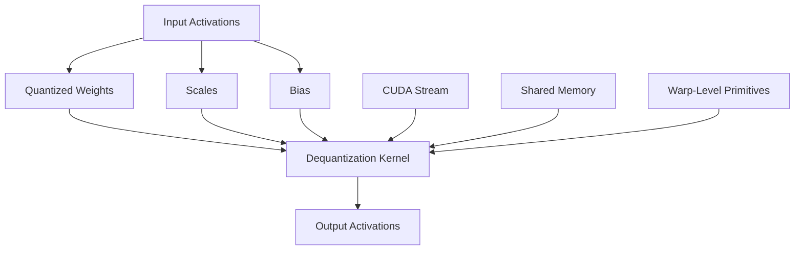

# Quantization

<cite>
**Referenced Files in This Document**   
- [linear.py](file://vllm/model_executor/layers/linear.py)
- [gptq.py](file://vllm/model_executor/layers/quantization/gptq.py)
- [awq.py](file://vllm/model_executor/layers/quantization/awq.py)
- [fp8.py](file://vllm/model_executor/layers/quantization/fp8.py)
- [parameter.py](file://vllm/model_executor/parameter.py)
- [quant_utils.py](file://vllm/model_executor/layers/quantization/utils/quant_utils.py)
- [gemm_kernels.cu](file://csrc/quantization/awq/gemm_kernels.cu)
- [activation_kernels.cu](file://csrc/quantization/activation_kernels.cu)
- [w4a8_mm_entry.cu](file://csrc/quantization/cutlass_w4a8/w4a8_mm_entry.cu)
</cite>

## Table of Contents
1. [Introduction](#introduction)
2. [Quantization Techniques](#quantization-techniques)
   - [GPTQ](#gptq)
   - [AWQ](#awq)
   - [FP8](#fp8)
   - [INT4/INT8](#int4int8)
3. [Domain Model of Quantized Linear Layers](#domain-model-of-quantized-linear-layers)
   - [Weight Packing](#weight-packing)
   - [Scale Storage](#scale-storage)
   - [Dequantization During Inference](#dequantization-during-inference)
4. [CUDA Kernels and Performance Optimization](#cuda-kernels-and-performance-optimization)
5. [Configuration and Usage](#configuration-and-usage)
6. [Common Issues and Solutions](#common-issues-and-solutions)
7. [Conclusion](#conclusion)

## Introduction
Quantization is a critical performance optimization technique in vLLM that reduces the memory footprint and computational requirements of large language models by representing weights and activations with lower-precision data types. This document provides a comprehensive analysis of the quantization sub-feature in vLLM, focusing on the implementation details of various quantization techniques including GPTQ, AWQ, FP8, and INT4/INT8. The analysis covers the domain model of quantized linear layers, the relationship between quantization schemes and CUDA kernels, configuration options, and solutions to common issues such as accuracy degradation.

**Section sources**
- [linear.py](file://vllm/model_executor/layers/linear.py#L1-L1425)
- [gptq.py](file://vllm/model_executor/layers/quantization/gptq.py#L1-L394)
- [awq.py](file://vllm/model_executor/layers/quantization/awq.py#L1-L278)
- [fp8.py](file://vllm/model_executor/layers/quantization/fp8.py#L1-L1349)

## Quantization Techniques

### GPTQ
GPTQ (Generalized Post-Training Quantization) is a post-training quantization method that applies weight correction to minimize quantization error. In vLLM, GPTQ is implemented through the `GPTQConfig` and `GPTQLinearMethod` classes. The `GPTQConfig` class defines the quantization parameters such as weight bits, group size, and activation scheme. The `GPTQLinearMethod` class handles the creation of quantized weights and the application of quantized linear operations.

The implementation supports various weight bit configurations (2, 3, 4, 8 bits) and allows for dynamic per-module quantization through the `dynamic` configuration property. The quantized weights are packed into 32-bit integers to optimize memory usage, with the packing factor determined by the weight bit configuration. During inference, the quantized weights are dequantized using CUDA kernels that perform efficient matrix multiplication with the original precision.

**Section sources**
- [gptq.py](file://vllm/model_executor/layers/quantization/gptq.py#L43-L394)
- [gptq.py](file://vllm/model_executor/layers/quantization/gptq.py#L225-L394)

### AWQ
AWQ (Activation-Aware Weight Quantization) is a quantization technique that considers the activation patterns of the model to preserve the most important weights. In vLLM, AWQ is implemented through the `AWQConfig` and `AWQLinearMethod` classes. The `AWQConfig` class defines the quantization parameters such as weight bits, group size, and zero-point configuration.

The implementation focuses on 4-bit weight quantization and uses a packing factor of 8 to store 4-bit weights in 32-bit integers. The quantized weights are stored in a packed format, with scales and zero points stored separately. During inference, the quantized weights are dequantized using CUDA kernels that perform efficient matrix multiplication. The implementation also supports activation quantization, allowing for dynamic scaling of activations during inference.

**Section sources**
- [awq.py](file://vllm/model_executor/layers/quantization/awq.py#L32-L278)
- [awq.py](file://vllm/model_executor/layers/quantization/awq.py#L164-L278)

### FP8
FP8 (8-bit Floating Point) is a quantization technique that uses 8-bit floating-point numbers to represent weights and activations. In vLLM, FP8 is implemented through the `Fp8Config` and `Fp8LinearMethod` classes. The `Fp8Config` class defines the quantization parameters such as activation scheme and weight block size.

The implementation supports both static and dynamic activation quantization, with the choice of scheme determined by the `activation_scheme` parameter. The quantized weights are stored in a packed format, with scales stored separately. During inference, the quantized weights are dequantized using CUDA kernels that perform efficient matrix multiplication. The implementation also supports block-wise quantization, allowing for more fine-grained control over the quantization process.

**Section sources**
- [fp8.py](file://vllm/model_executor/layers/quantization/fp8.py#L206-L1349)
- [fp8.py](file://vllm/model_executor/layers/quantization/fp8.py#L360-L646)

### INT4/INT8
INT4 and INT8 quantization techniques use 4-bit and 8-bit integers to represent weights and activations, respectively. In vLLM, these techniques are implemented through the `GPTQConfig` and `GPTQLinearMethod` classes for INT4, and through the `Fp8Config` and `Fp8LinearMethod` classes for INT8. The implementation supports various group sizes and allows for dynamic per-module quantization.

The quantized weights are packed into 32-bit integers to optimize memory usage, with the packing factor determined by the weight bit configuration. During inference, the quantized weights are dequantized using CUDA kernels that perform efficient matrix multiplication. The implementation also supports activation quantization, allowing for dynamic scaling of activations during inference.

**Section sources**
- [gptq.py](file://vllm/model_executor/layers/quantization/gptq.py#L43-L394)
- [fp8.py](file://vllm/model_executor/layers/quantization/fp8.py#L206-L1349)

## Domain Model of Quantized Linear Layers

### Weight Packing
In vLLM, quantized weights are packed into 32-bit integers to optimize memory usage and improve computational efficiency. The packing factor is determined by the weight bit configuration, with a packing factor of 8 for 4-bit weights and a packing factor of 4 for 8-bit weights. The packed weights are stored in a contiguous array, with the input dimension packed along the first dimension.

The `PackedvLLMParameter` class is used to represent packed quantized weights, with the `packed_dim` attribute indicating the dimension along which the weights are packed. The `packed_factor` attribute specifies the number of quantized weights packed into each 32-bit integer. During weight loading, the packed weights are unpacked and stored in the appropriate format for the quantization scheme.

**Section sources**
- [parameter.py](file://vllm/model_executor/parameter.py#L1-L643)
- [gptq.py](file://vllm/model_executor/layers/quantization/gptq.py#L283-L294)
- [awq.py](file://vllm/model_executor/layers/quantization/awq.py#L206-L217)

### Scale Storage
Scales are stored separately from the quantized weights to allow for efficient dequantization during inference. The scales are stored as floating-point numbers, with the precision determined by the quantization scheme. For GPTQ and AWQ, the scales are stored as 32-bit floating-point numbers, while for FP8, the scales are stored as 16-bit floating-point numbers.

The `PerTensorScaleParameter` and `GroupQuantScaleParameter` classes are used to represent scales, with the `output_dim` attribute indicating the dimension along which the scales are applied. The scales are stored in a contiguous array, with the output dimension along the first dimension. During inference, the scales are used to dequantize the weights before performing matrix multiplication.

**Section sources**
- [parameter.py](file://vllm/model_executor/parameter.py#L1-L643)
- [gptq.py](file://vllm/model_executor/layers/quantization/gptq.py#L315-L322)
- [awq.py](file://vllm/model_executor/layers/quantization/awq.py#L234-L243)

### Dequantization During Inference
During inference, the quantized weights are dequantized using CUDA kernels that perform efficient matrix multiplication. The dequantization process involves unpacking the quantized weights, applying the scales, and performing matrix multiplication with the input activations. The dequantized weights are not stored in memory, but are computed on-the-fly during the matrix multiplication operation.

The `apply` method of the `GPTQLinearMethod`, `AWQLinearMethod`, and `Fp8LinearMethod` classes handles the dequantization and matrix multiplication. The method takes the input activations, quantized weights, scales, and bias as inputs, and returns the output activations. The dequantization process is optimized for performance, with the CUDA kernels using shared memory and warp-level primitives to minimize memory bandwidth and maximize computational throughput.

**Section sources**
- [gptq.py](file://vllm/model_executor/layers/quantization/gptq.py#L370-L393)
- [awq.py](file://vllm/model_executor/layers/quantization/awq.py#L254-L277)
- [fp8.py](file://vllm/model_executor/layers/quantization/fp8.py#L573-L646)

## CUDA Kernels and Performance Optimization
The quantization implementation in vLLM relies heavily on custom CUDA kernels to achieve high performance. The kernels are optimized for memory bandwidth and computational throughput, using techniques such as shared memory, warp-level primitives, and vectorized memory access.

The `gemm_kernels.cu` file contains the CUDA kernels for GPTQ and AWQ, including the `dequantize_weights` and `awq_gemm` functions. The `activation_kernels.cu` file contains the CUDA kernels for activation quantization, including the `act_and_mul_quant_kernel` function. The `w4a8_mm_entry.cu` file contains the CUDA kernels for INT4/INT8 quantization, including the `w4a8_mm` function.

The kernels are designed to work with the packed weight format and scale storage, using efficient memory access patterns to minimize memory bandwidth. The kernels also use warp-level primitives to maximize computational throughput, with the `__shfl_xor_sync` and `__ballot_sync` functions used to perform warp-level reductions and broadcasts.

**Diagram sources **
- [gemm_kernels.cu](file://csrc/quantization/awq/gemm_kernels.cu#L1-L477)
- [activation_kernels.cu](file://csrc/quantization/activation_kernels.cu#L1-L736)
- [w4a8_mm_entry.cu](file://csrc/quantization/cutlass_w4a8/w4a8_mm_entry.cu#L1-L100)

**Section sources**
- [gemm_kernels.cu](file://csrc/quantization/awq/gemm_kernels.cu#L1-L477)
- [activation_kernels.cu](file://csrc/quantization/activation_kernels.cu#L1-L736)
- [w4a8_mm_entry.cu](file://csrc/quantization/cutlass_w4a8/w4a8_mm_entry.cu#L1-L100)

## Configuration and Usage
Quantization in vLLM is configured through the `quantization` parameter in the model configuration. The parameter specifies the quantization scheme to use, with options for GPTQ, AWQ, FP8, and INT4/INT8. The quantization parameters are specified through the `quant_config` parameter, which is a dictionary containing the quantization configuration.

For GPTQ, the `quant_config` dictionary includes parameters such as `weight_bits`, `group_size`, and `desc_act`. For AWQ, the dictionary includes parameters such as `weight_bits`, `group_size`, and `zero_point`. For FP8, the dictionary includes parameters such as `activation_scheme` and `weight_block_size`. For INT4/INT8, the dictionary includes parameters such as `weight_bits` and `group_size`.

The quantization configuration is applied during model loading, with the quantized weights and scales loaded from the model checkpoint. The quantization configuration can also be applied dynamically during inference, allowing for fine-grained control over the quantization process.

**Section sources**
- [gptq.py](file://vllm/model_executor/layers/quantization/gptq.py#L49-L123)
- [awq.py](file://vllm/model_executor/layers/quantization/awq.py#L38-L64)
- [fp8.py](file://vllm/model_executor/layers/quantization/fp8.py#L209-L242)

## Common Issues and Solutions
One common issue with aggressive quantization is accuracy degradation, which can occur when the quantization error is too large. This can be mitigated through careful parameter tuning, such as adjusting the group size and activation scheme. For GPTQ, using a smaller group size can reduce quantization error, while for AWQ, using a larger group size can improve accuracy.

Another issue is memory usage, which can be high for large models with many quantized layers. This can be mitigated through weight sharing, where the same quantized weights are used for multiple layers. The `packed_modules_mapping` parameter in the quantization configuration can be used to specify which layers share weights.

Performance can also be an issue, particularly for models with many quantized layers. This can be mitigated through the use of optimized CUDA kernels and efficient memory access patterns. The `cutlass` library is used in vLLM to provide optimized matrix multiplication kernels for quantized weights.

**Section sources**
- [gptq.py](file://vllm/model_executor/layers/quantization/gptq.py#L86-L95)
- [awq.py](file://vllm/model_executor/layers/quantization/awq.py#L51-L55)
- [fp8.py](file://vllm/model_executor/layers/quantization/fp8.py#L225-L241)

## Conclusion
Quantization is a powerful technique for optimizing the performance of large language models in vLLM. The implementation supports various quantization schemes, including GPTQ, AWQ, FP8, and INT4/INT8, each with its own strengths and trade-offs. The domain model of quantized linear layers is designed to optimize memory usage and computational efficiency, with packed weights and separate scale storage. The use of custom CUDA kernels ensures high performance, with optimized memory access patterns and warp-level primitives. Configuration options allow for fine-grained control over the quantization process, and solutions to common issues such as accuracy degradation are available through careful parameter tuning.