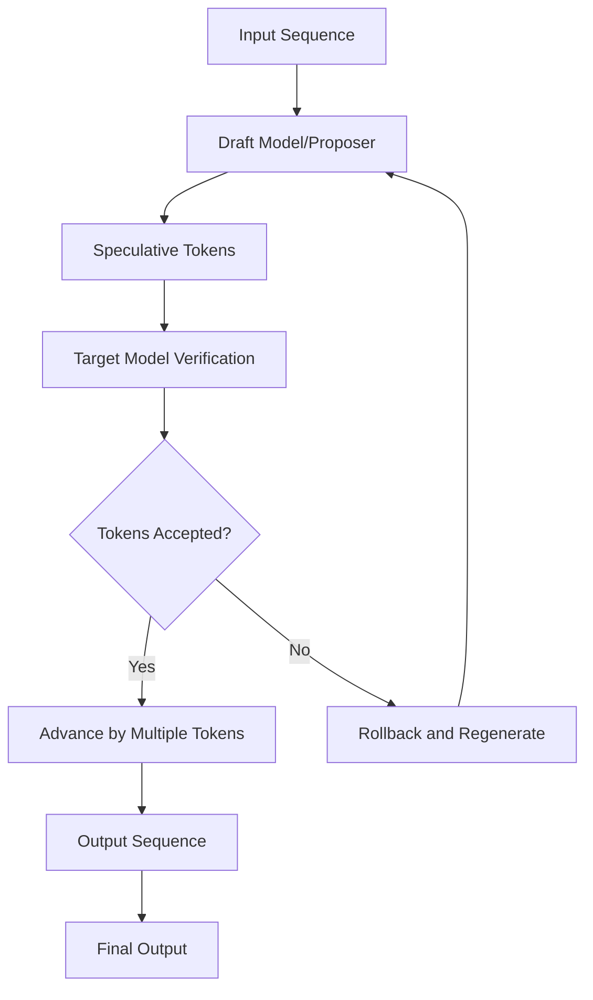
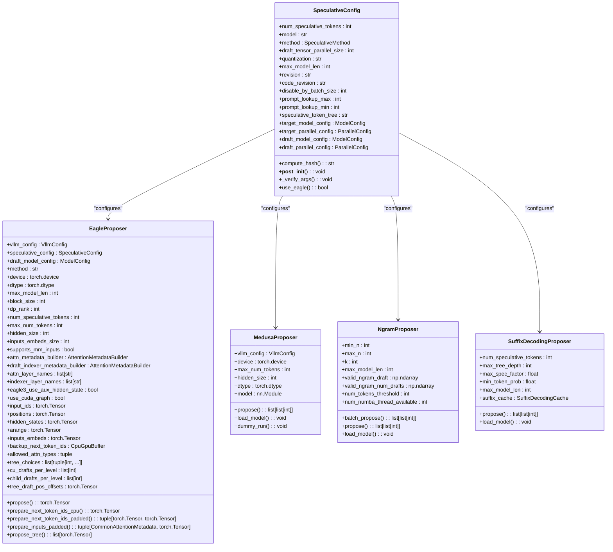
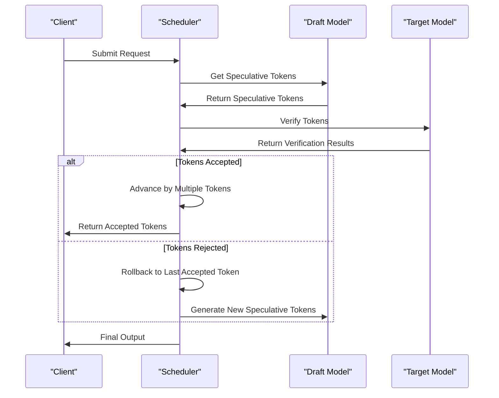
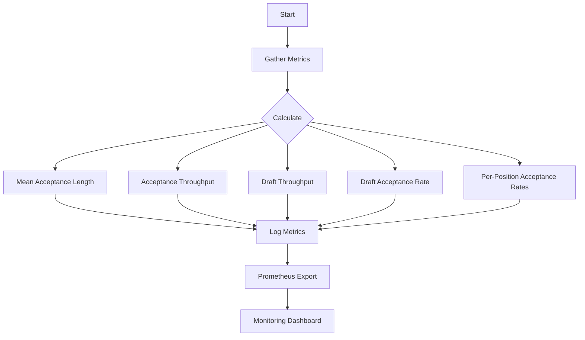

# Speculative Decoding

<cite>
**Referenced Files in This Document**   
- [speculative.py](file://vllm/config/speculative.py)
- [eagle.py](file://vllm/v1/spec_decode/eagle.py)
- [medusa.py](file://vllm/v1/spec_decode/medusa.py)
- [ngram_proposer.py](file://vllm/v1/spec_decode/ngram_proposer.py)
- [suffix_decoding.py](file://vllm/v1/spec_decode/suffix_decoding.py)
- [metrics.py](file://vllm/v1/spec_decode/metrics.py)
- [utils.py](file://vllm/v1/spec_decode/utils.py)
</cite>

## Table of Contents
1. [Introduction](#introduction)
2. [Architecture Overview](#architecture-overview)
3. [Core Components](#core-components)
4. [Domain Model](#domain-model)
5. [Token Verification Process](#token-verification-process)
6. [Configuration Options](#configuration-options)
7. [Performance Metrics](#performance-metrics)
8. [Common Issues and Solutions](#common-issues-and-solutions)

## Introduction
Speculative decoding is a performance optimization technique in vLLM that accelerates text generation by using a smaller draft model to predict tokens, which are then verified by a larger target model. This approach significantly increases generation throughput by reducing the number of expensive forward passes required by the target model. The implementation supports multiple speculative methods including draft models, n-gram proposers, Medusa, Eagle, and suffix decoding, each with specific use cases and performance characteristics.

## Architecture Overview
The speculative decoding architecture in vLLM consists of two main components: the draft model (proposer) and the target model (verifier). The draft model generates a sequence of speculative tokens based on the current context, and the target model verifies these tokens in a single forward pass. When tokens are accepted, the generation process advances by multiple steps, dramatically improving throughput. The system is designed to handle various speculative methods through a unified interface, allowing different proposer implementations to be used interchangeably.

**Diagram sources**
- [eagle.py](file://vllm/v1/spec_decode/eagle.py#L57-L800)
- [medusa.py](file://vllm/v1/spec_decode/medusa.py#L18-L74)

## Core Components
The speculative decoding system in vLLM is built around several key components that work together to enable efficient token prediction and verification. The main components include the SpeculativeConfig class that manages configuration parameters, various proposer implementations (EagleProposer, MedusaProposer, NgramProposer, SuffixDecodingProposer), and the metrics system that tracks performance. The draft model worker is responsible for generating speculative tokens, while the target model performs the verification step. The system is designed to be modular, allowing different speculative methods to be implemented and used based on the specific requirements.

**Section sources**
- [speculative.py](file://vllm/config/speculative.py#L52-L644)
- [eagle.py](file://vllm/v1/spec_decode/eagle.py#L57-L800)

## Domain Model
The domain model for speculative decoding in vLLM centers around the SpeculativeConfig class, which encapsulates all configuration parameters for the speculative decoding process. This includes the number of speculative tokens, the draft model specification, and method-specific parameters. The DraftModelWorker concept is implemented through various proposer classes that generate speculative tokens. The SpeculativeConfig class also manages the relationship between the draft and target models, including tensor parallelism configuration and model length constraints. The system supports multiple speculative methods through the SpeculativeMethod enum, allowing flexible configuration based on use case requirements.

**Diagram sources**
- [speculative.py](file://vllm/config/speculative.py#L52-L644)
- [eagle.py](file://vllm/v1/spec_decode/eagle.py#L57-L800)
- [medusa.py](file://vllm/v1/spec_decode/medusa.py#L18-L74)
- [ngram_proposer.py](file://vllm/v1/spec_decode/ngram_proposer.py#L11-L292)
- [suffix_decoding.py](file://vllm/v1/spec_decode/suffix_decoding.py#L7-L102)

## Token Verification Process
The token verification process in vLLM's speculative decoding system follows a multi-step approach. First, the draft model generates a sequence of speculative tokens based on the current context. These tokens are then passed to the target model, which verifies them in a single forward pass. The verification process compares the logits produced by the target model with the speculative tokens to determine acceptance. When tokens are accepted, the generation process advances by the number of accepted tokens plus one (the bonus token). If tokens are rejected, the system rolls back to the last accepted token and continues generation from that point. This process is optimized through CUDA kernels and memory management techniques to minimize overhead.

**Diagram sources**
- [eagle.py](file://vllm/v1/spec_decode/eagle.py#L219-L525)
- [medusa.py](file://vllm/v1/spec_decode/medusa.py#L37-L50)

## Configuration Options
vLLM provides extensive configuration options for speculative decoding through the SpeculativeConfig class. Key parameters include num_speculative_tokens (the number of tokens to speculate), model (the draft model name), method (the speculative method to use), and draft_tensor_parallel_size (tensor parallelism for the draft model). Advanced options include disable_by_batch_size (to disable speculation under high load), prompt_lookup_max/min (for n-gram proposer), and various suffix decoding parameters. The configuration system automatically validates parameters and ensures compatibility between draft and target models. Users can also configure quantization, revision, and code revision for the draft model to optimize performance and memory usage.

**Section sources**
- [speculative.py](file://vllm/config/speculative.py#L60-L148)

## Performance Metrics
The speculative decoding system in vLLM tracks comprehensive performance metrics to monitor effectiveness and identify optimization opportunities. Key metrics include mean acceptance length (average number of tokens accepted per speculation), acceptance throughput (tokens accepted per second), draft throughput (tokens speculated per second), and per-position acceptance rates. These metrics are exposed through both logging and Prometheus monitoring, allowing users to track performance over time. The system also calculates draft acceptance rate as the ratio of accepted tokens to drafted tokens, providing insight into the efficiency of the speculative process. These metrics help users tune configuration parameters and select appropriate draft models for their use cases.

**Diagram sources**
- [metrics.py](file://vllm/v1/spec_decode/metrics.py#L16-L226)

## Common Issues and Solutions
Common issues in speculative decoding include low acceptance rates due to draft model inaccuracy, compatibility issues between draft and target models, and performance degradation under high load. Solutions include careful selection of draft models that are well-matched to the target model, tuning the number of speculative tokens based on acceptance rates, and using the disable_by_batch_size parameter to disable speculation when system load is high. For n-gram proposers, adjusting the prompt_lookup_max/min parameters can improve performance. The system also provides detailed metrics to help diagnose issues and optimize configuration. In cases where speculative decoding is not beneficial, it can be disabled selectively for specific requests based on their characteristics.

**Section sources**
- [speculative.py](file://vllm/config/speculative.py#L96-L103)
- [utils.py](file://vllm/v1/spec_decode/utils.py#L9-L17)