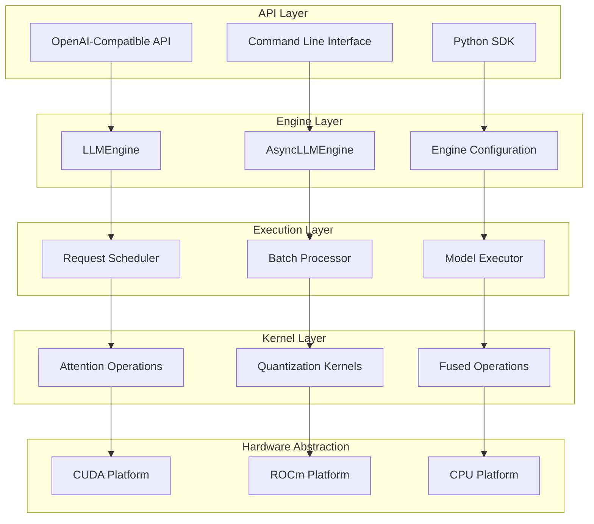
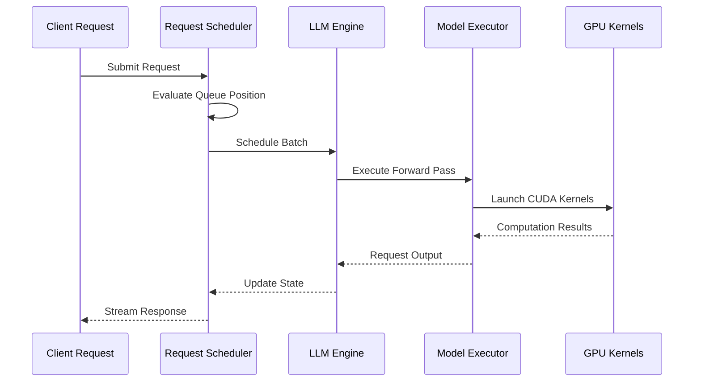
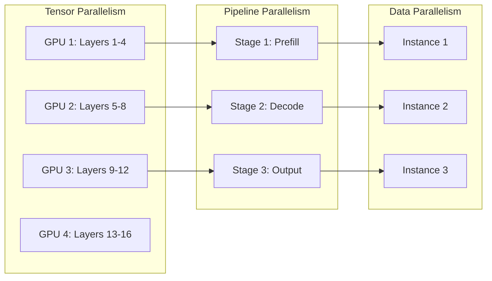
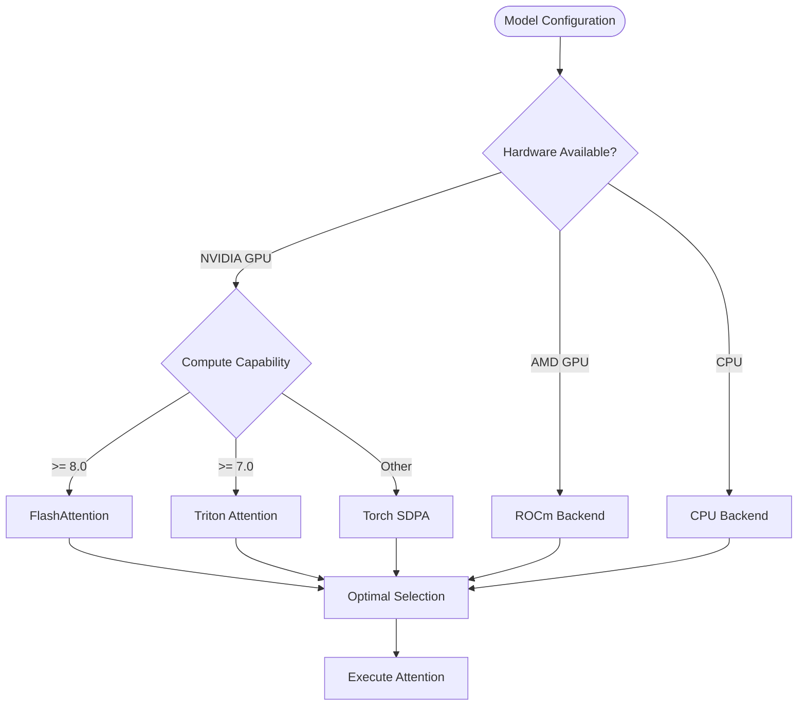
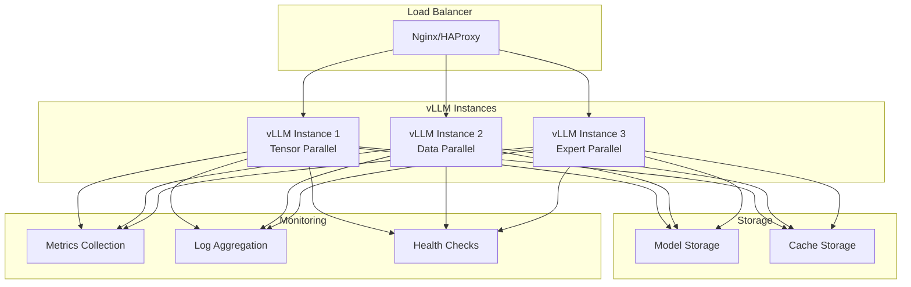

# Project Overview

<cite>
**Referenced Files in This Document**
- [README.md](file://README.md)
- [vllm/__init__.py](file://vllm/__init__.py)
- [vllm/engine/llm_engine.py](file://vllm/engine/llm_engine.py)
- [vllm/v1/engine/llm_engine.py](file://vllm/v1/engine/llm_engine.py)
- [vllm/attention/selector.py](file://vllm/attention/selector.py)
- [vllm/attention/backends/abstract.py](file://vllm/attention/backends/abstract.py)
- [vllm/platforms/cuda.py](file://vllm/platforms/cuda.py)
- [SECURITY.md](file://SECURITY.md)
- [examples/online_serving/openai_chat_completion_client.py](file://examples/online_serving/openai_chat_completion_client.py)
</cite>

## Table of Contents
1. [Introduction](#introduction)
2. [Project Purpose and Vision](#project-purpose-and-vision)
3. [Core Architecture Overview](#core-architecture-overview)
4. [Key Technical Features](#key-technical-features)
5. [System Components](#system-components)
6. [Performance Characteristics](#performance-characteristics)
7. [Deployment Scenarios](#deployment-scenarios)
8. [Open Source Nature and Community](#open-source-nature-and-community)
9. [Security Practices](#security-practices)
10. [Getting Started](#getting-started)
11. [Conclusion](#conclusion)

## Introduction

vLLM is a revolutionary high-performance inference engine designed specifically for large language models (LLMs). Developed originally at UC Berkeley's Sky Computing Lab, vLLM has evolved into a community-driven project that combines cutting-edge research with practical production requirements. As part of the PyTorch Foundation, vLLM represents the state-of-the-art in efficient LLM serving, providing unprecedented throughput and memory efficiency through innovative architectural designs.

The project addresses the fundamental challenge of deploying large language models at scale: how to serve them efficiently while maintaining high quality and low latency. vLLM achieves this through a layered architecture that optimizes every aspect of the inference pipeline, from API interfaces down to specialized CUDA kernels.

## Project Purpose and Vision

### Primary Mission

vLLM's core mission is to democratize access to large language models by making them fast, affordable, and easy to deploy. The project embodies the principle of "easy, fast, and cheap LLM serving for everyone," targeting both individual developers and enterprise deployments.

### Design Philosophy

The architecture follows several key principles:

- **Performance First**: Every component is optimized for maximum throughput and minimal latency
- **Memory Efficiency**: Innovative memory management reduces the computational footprint
- **Flexibility**: Support for diverse hardware platforms and model architectures
- **Standards Compliance**: OpenAI-compatible APIs for seamless integration
- **Community Driven**: Open-source development with active academic-industry collaboration

**Section sources**
- [README.md](file://README.md#L65-L100)

## Core Architecture Overview

vLLM implements a sophisticated layered architecture that separates concerns across multiple abstraction levels, enabling both flexibility and optimization.



**Diagram sources**
- [vllm/__init__.py](file://vllm/__init__.py#L16-L42)
- [vllm/engine/llm_engine.py](file://vllm/engine/llm_engine.py#L1-L7)
- [vllm/v1/engine/llm_engine.py](file://vllm/v1/engine/llm_engine.py#L46-L100)

### Layered Design Philosophy

The architecture follows a clear separation of concerns:

1. **API Interface Layer**: Provides standardized interfaces for different use cases
2. **Engine Layer**: Manages request lifecycle and coordination
3. **Execution Layer**: Handles scheduling and model execution
4. **Kernel Layer**: Implements optimized mathematical operations
5. **Hardware Abstraction**: Enables cross-platform compatibility

**Section sources**
- [vllm/__init__.py](file://vllm/__init__.py#L16-L108)

## Key Technical Features

### Continuous Batching

vLLM's continuous batching capability represents a fundamental departure from traditional batched inference approaches. Instead of waiting for a full batch to accumulate, vLLM continuously schedules and executes requests as they arrive, optimizing resource utilization in real-time.



**Diagram sources**
- [vllm/v1/engine/llm_engine.py](file://vllm/v1/engine/llm_engine.py#L285-L320)

### PagedAttention Memory Management

PagedAttention is vLLM's groundbreaking innovation for efficient KV cache management. Traditional approaches allocate contiguous memory regions, leading to fragmentation and inefficient memory usage. PagedAttention divides memory into fixed-size pages, enabling:

- **Dynamic Memory Allocation**: Pages grow and shrink as needed
- **Reduced Fragmentation**: Better memory utilization patterns
- **Improved Scalability**: Support for longer sequences without memory limits
- **Efficient Swapping**: Pages can be moved between GPU and CPU memory

The PagedAttention mechanism works by organizing KV cache storage in page tables, where each page represents a fixed-size segment of memory. This approach enables fine-grained memory management while maintaining high performance.

**Section sources**
- [README.md](file://README.md#L71-L81)
- [vllm/attention/selector.py](file://vllm/attention/selector.py#L80-L110)

### Distributed Execution Support

vLLM provides comprehensive support for distributed inference across multiple dimensions:

- **Tensor Parallelism**: Splitting model weights across multiple GPUs
- **Pipeline Parallelism**: Distributing layers across different devices
- **Data Parallelism**: Running multiple copies for increased throughput
- **Expert Parallelism**: Specialized routing for mixture-of-expert models



**Diagram sources**
- [vllm/platforms/cuda.py](file://vllm/platforms/cuda.py#L108-L118)

**Section sources**
- [README.md](file://README.md#L86-L88)

## System Components

### LLMEngine: Central Coordinator

The LLMEngine serves as the central coordinator for all inference operations. It manages the complete request lifecycle from input processing to output generation, coordinating between different subsystems.

Key responsibilities include:
- Request queuing and prioritization
- Resource allocation and scheduling
- Output formatting and streaming
- Error handling and recovery

### Attention Backend Selection

vLLM automatically selects the optimal attention implementation based on hardware capabilities and model characteristics. The system supports multiple backends:

- **FlashAttention**: High-performance attention computation
- **FlashInfer**: Optimized inference kernels
- **Triton**: Flexible kernel implementation
- **Custom**: Hardware-specific optimizations



**Diagram sources**
- [vllm/attention/selector.py](file://vllm/attention/selector.py#L80-L208)

### Hardware Abstraction Layer

The platform abstraction enables vLLM to run efficiently across diverse hardware configurations:

- **CUDA Platform**: Optimized for NVIDIA GPUs with advanced memory management
- **ROCm Platform**: Support for AMD GPUs with equivalent optimizations
- **CPU Platform**: Efficient execution on CPU-only systems
- **TPU Platform**: Experimental support for Google TPUs

**Section sources**
- [vllm/attention/selector.py](file://vllm/attention/selector.py#L80-L269)
- [vllm/attention/backends/abstract.py](file://vllm/attention/backends/abstract.py#L40-L120)
- [vllm/platforms/cuda.py](file://vllm/platforms/cuda.py#L98-L118)

## Performance Characteristics

### Throughput Optimization

vLLM achieves exceptional throughput through multiple optimization strategies:

- **CUDA Graph Optimization**: Reduces kernel launch overhead
- **Fused Operations**: Combines multiple operations into single kernels
- **Memory Coalescing**: Optimizes memory access patterns
- **Kernel Fusion**: Reduces memory bandwidth requirements

### Latency Reduction

The system minimizes latency through:

- **Continuous Batching**: Eliminates waiting periods between requests
- **Prefetching**: Overlaps computation with memory transfers
- **Early Stopping**: Terminates unnecessary computations
- **Streaming Responses**: Begins output generation immediately

### Memory Efficiency

Memory optimization occurs at multiple levels:

- **PagedAttention**: Dynamic memory allocation
- **Quantization Support**: Reduced precision inference
- **KV Cache Sharing**: Efficient memory reuse
- **Gradient Checkpointing**: Trade computation for memory

**Section sources**
- [README.md](file://README.md#L71-L81)

## Deployment Scenarios

### Production Serving

vLLM excels in production environments requiring high throughput and reliability:



### Edge Deployment

For edge computing scenarios, vLLM provides optimized configurations:

- **CPU-Only Mode**: Efficient execution on CPU-only hardware
- **Quantized Models**: Reduced memory footprint
- **Minimal Dependencies**: Lightweight installation requirements
- **Resource Monitoring**: Built-in resource usage tracking

### Research and Development

vLLM supports various research applications:

- **Model Comparison**: Easy switching between different models
- **Custom Kernels**: Extensible kernel development
- **Benchmarking Tools**: Comprehensive performance measurement
- **Debugging Support**: Detailed logging and profiling

**Section sources**
- [examples/online_serving/openai_chat_completion_client.py](file://examples/online_serving/openai_chat_completion_client.py#L1-L65)

## Open Source Nature and Community

### Project Governance

As a PyTorch Foundation project, vLLM operates under open governance principles:

- **Community-Driven Development**: Decisions made through collaborative processes
- **Academic-Industry Collaboration**: Partnerships between researchers and practitioners
- **Transparent Decision Making**: Public discussions and documentation
- **Inclusive Participation**: Welcoming contributions from all backgrounds

### Contribution Guidelines

The project welcomes contributions across multiple areas:

- **Code Contributions**: Bug fixes, feature additions, performance improvements
- **Documentation**: Guides, tutorials, API documentation
- **Testing**: Test cases, benchmark suites, validation tools
- **Community Support**: Answering questions, helping users

### Supported Models and Hardware

vLLM maintains broad compatibility:

**Supported Model Architectures:**
- Transformer-based LLMs (Llama, Mistral, etc.)
- Mixture-of-Expert models (Mixtral, DeepSeek)
- Embedding models (E5, BGE)
- Multi-modal models (LLaVA, Qwen-VL)

**Hardware Support:**
- NVIDIA GPUs (Ampere, Hopper, Ada Lovelace)
- AMD GPUs (RDNA, CDNA)
- Intel CPUs/GPUs
- PowerPC CPUs
- ARM CPUs
- TPU support (experimental)

**Section sources**
- [README.md](file://README.md#L93-L100)

## Security Practices

### Vulnerability Management

vLLM maintains a comprehensive security program managed by a dedicated vulnerability management team. The project follows responsible disclosure practices:

- **Private Reporting**: Security issues reported through GitHub Security Advisories
- **Coordinated Disclosure**: Timely communication with affected parties
- **Patch Prioritization**: Critical vulnerabilities receive expedited attention
- **Backport Support**: Security fixes applied to supported versions

### Threat Model and Recommendations

The security guide outlines vLLM's security assumptions and provides recommendations for secure deployment:

- **Trust Boundaries**: Clear delineation of trusted vs. untrusted components
- **Access Control**: Proper authentication and authorization mechanisms
- **Data Protection**: Encryption at rest and in transit
- **Network Security**: Secure communication protocols

### Severity Classification

vLLM uses a standardized severity classification system:

- **CRITICAL**: Remote code execution, full system compromise
- **HIGH**: Significant impact with reasonable prerequisites
- **MODERATE**: Denial of service or partial disruption
- **LOW**: Minor issues with limited impact

**Section sources**
- [SECURITY.md](file://SECURITY.md#L1-L51)

## Getting Started

### Installation

vLLM supports multiple installation methods:

```bash
# Install from PyPI
pip install vllm

# From source with CUDA support
git clone https://github.com/vllm-project/vllm.git
cd vllm
pip install -e .
```

### Basic Usage

Simple inference with vLLM:

```python
from vllm import LLM, SamplingParams

# Initialize model
llm = LLM(model="meta-llama/Llama-2-7b-chat-hf")

# Define sampling parameters
sampling_params = SamplingParams(
    temperature=0.8,
    top_p=0.95,
    max_tokens=100
)

# Generate completions
outputs = llm.generate(prompts, sampling_params)
```

### API Compatibility

vLLM provides OpenAI-compatible APIs for seamless integration:

```python
from openai import OpenAI

client = OpenAI(
    api_key="EMPTY",
    base_url="http://localhost:8000/v1"
)

response = client.chat.completions.create(
    model="your-model-name",
    messages=[{"role": "user", "content": "Hello!"}]
)
```

**Section sources**
- [README.md](file://README.md#L102-L115)
- [examples/online_serving/openai_chat_completion_client.py](file://examples/online_serving/openai_chat_completion_client.py#L10-L40)

## Conclusion

vLLM represents a paradigm shift in large language model inference, combining cutting-edge research with practical engineering solutions. Its innovative architecture, particularly the PagedAttention mechanism and continuous batching approach, addresses the fundamental challenges of scaling LLM serving to production levels.

The project's commitment to open-source development, community collaboration, and security excellence positions it as the leading solution for high-performance LLM inference. Whether deployed in production serving environments, research laboratories, or edge computing scenarios, vLLM provides the performance, flexibility, and reliability required for modern AI applications.

As the field of large language models continues to evolve, vLLM's modular architecture and extensible design ensure that it can adapt to new challenges and opportunities. The project's success demonstrates the power of community-driven development in advancing AI technology while maintaining accessibility and transparency.

Through its combination of technical innovation, practical deployment capabilities, and strong community foundation, vLLM exemplifies the potential of open-source projects to drive meaningful progress in artificial intelligence infrastructure.