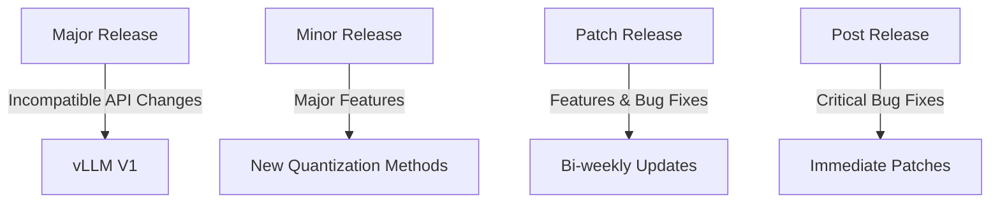
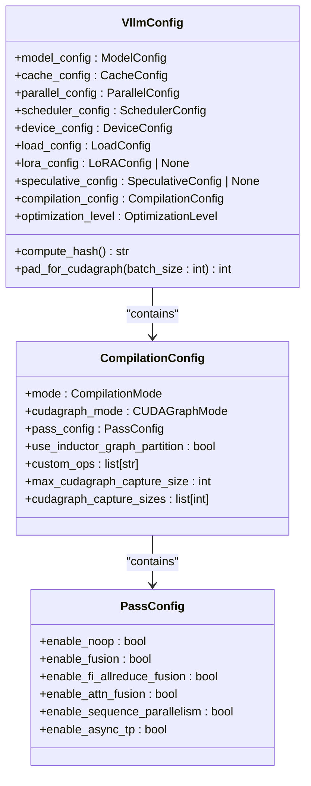
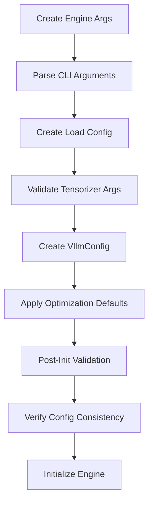
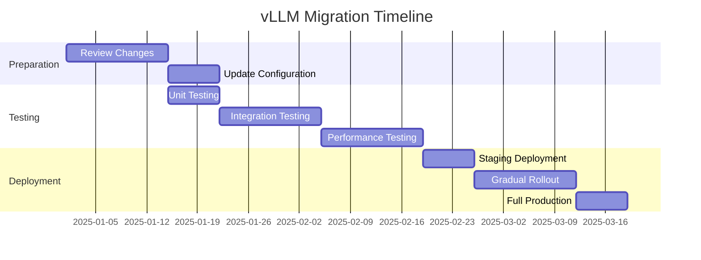
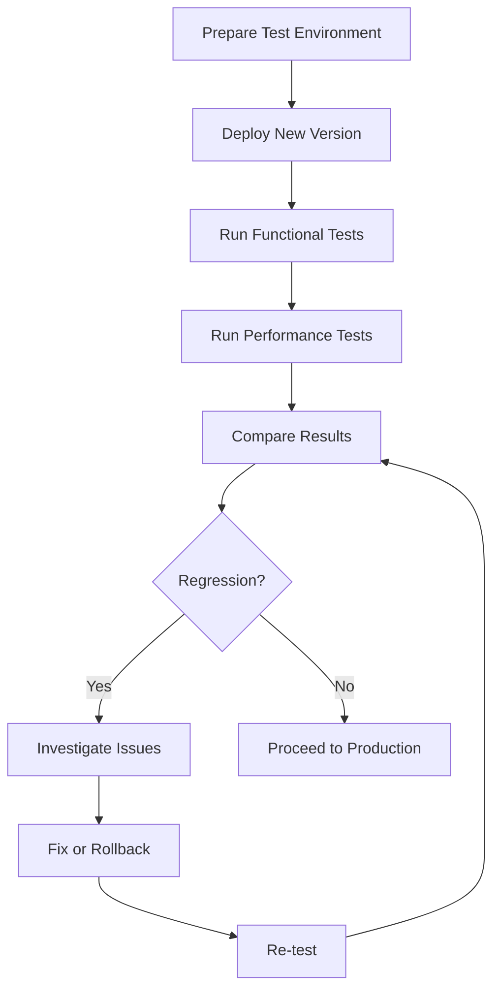

# Breaking Changes

<cite>
**Referenced Files in This Document**   
- [vllm/version.py](file://vllm/version.py)
- [vllm/config/vllm.py](file://vllm/config/vllm.py)
- [vllm/engine/arg_utils.py](file://vllm/engine/arg_utils.py)
- [vllm/config/__init__.py](file://vllm/config/__init__.py)
- [RELEASE.md](file://RELEASE.md)
- [README.md](file://README.md)
</cite>

## Table of Contents
1. [Introduction](#introduction)
2. [Versioning and Release Cadence](#versioning-and-release-cadence)
3. [Configuration System Changes](#configuration-system-changes)
4. [API and Interface Modifications](#api-and-interface-modifications)
5. [Migration Strategies](#migration-strategies)
6. [Compatibility Workarounds](#compatibility-workarounds)
7. [Testing and Validation](#testing-and-validation)
8. [Troubleshooting Common Issues](#troubleshooting-common-issues)
9. [Conclusion](#conclusion)

## Introduction

vLLM has undergone significant architectural and interface changes between versions, particularly with the introduction of vLLM V1. These breaking changes affect configuration, API usage, deployment scripts, and integration patterns. This document provides comprehensive guidance on understanding these changes, migrating existing implementations, and troubleshooting common issues encountered during upgrades.

The most significant changes stem from the vLLM V1 release, which introduced a major architectural upgrade with improved performance, cleaner code organization, and enhanced multimodal support. These changes necessitate updates to existing codebases and configurations to maintain compatibility and leverage the new capabilities.

**Section sources**
- [README.md](file://README.md#L33-L34)
- [RELEASE.md](file://RELEASE.md#L9-L13)

## Versioning and Release Cadence

vLLM uses a "right-shifted" versioning scheme where patch releases contain both features and backwards-compatible bug fixes, differing from traditional semantic versioning. The versioning hierarchy is structured as follows:

- **Major**: Represents major architectural milestones and incompatible API changes (similar to PyTorch 2.0)
- **Minor**: Introduces major features
- **Patch**: Includes features and backwards-compatible bug fixes
- **Post1/patch-1**: Contains backwards-compatible bug fixes, either explicit or implicit post-release

The release cadence follows a bi-weekly schedule for patch releases, with optional post-releases 1-3 days after the patch release. This rapid release cycle enables quick delivery of new features and improvements but requires careful attention to breaking changes between versions.

The vLLM V1 alpha release marked a significant milestone, introducing a 1.7x speedup, optimized execution loop, zero-overhead prefix caching, and enhanced multimodal support. This major version change represents the most substantial set of breaking changes in the project's history.



**Diagram sources**
- [RELEASE.md](file://RELEASE.md#L9-L13)
- [README.md](file://README.md#L33-L34)

**Section sources**
- [RELEASE.md](file://RELEASE.md#L5-L13)
- [vllm/version.py](file://vllm/version.py#L1-L40)

## Configuration System Changes

The configuration system in vLLM has undergone significant changes between versions, particularly with the V1 release. The most notable changes affect how optimization levels, compilation settings, and distributed execution are configured.

### Optimization Level Restructuring

The optimization level system has been restructured to provide clearer performance trade-offs. The new levels are:

- **O0**: No optimization - immediate startup with no compilation or CUDA graphs
- **O1**: Quick optimizations - Dynamo+Inductor compilation with piecewise CUDA graphs
- **O2**: Full optimizations - includes full and piecewise CUDA graphs (default)
- **O3**: Currently equivalent to O2

This change requires updates to existing configuration files that specify optimization levels. Previously, users might have used custom compilation configurations, but now they can leverage the standardized optimization levels.

### Compilation Configuration Updates

The compilation configuration system has been enhanced to better integrate with PyTorch's compilation capabilities. Key changes include:

- Introduction of `CompilationMode` enum with `VLLM_COMPILE` and `NONE` options
- Enhanced CUDA graph modes with `FULL_AND_PIECEWISE` option
- Improved pass configuration for fusion, sequence parallelism, and async TP

The `VllmConfig` class now automatically applies optimization level defaults based on the selected level, reducing the need for manual configuration of individual compilation parameters.

### Distributed Execution Configuration

The distributed execution backend configuration has been updated to support new execution patterns. The `DistributedExecutorBackend` now includes support for `mp`, `uni`, and `external_launcher` backends, with specific compatibility requirements for async scheduling.



**Diagram sources**
- [vllm/config/vllm.py](file://vllm/config/vllm.py#L158-L800)
- [vllm/config/__init__.py](file://vllm/config/__init__.py#L1-103)

**Section sources**
- [vllm/config/vllm.py](file://vllm/config/vllm.py#L61-L155)
- [vllm/engine/arg_utils.py](file://vllm/engine/arg_utils.py#L65-L104)

## API and Interface Modifications

The vLLM API has undergone several breaking changes between versions, particularly in the engine arguments, configuration handling, and model loading interfaces.

### Engine Arguments and Configuration

The `AsyncEngineArgs` class and related configuration handling have been updated to support the new V1 architecture. Key changes include:

- Introduction of `model_loader_extra_config` for tensorizer configuration
- Changes to how load format and quantization settings are processed
- Enhanced validation for tensorizer arguments

The argument parsing system has been updated to handle the new configuration structure, requiring changes to scripts that programmatically create engine arguments.

### Model Loading Interface Changes

The model loading interface has been modified to support new loading formats and configuration options. The `LoadConfig` class now includes:

- Support for tensorizer configuration through `tensorizer_config` dictionary
- Enhanced device configuration for online quantization
- Improved model loader extra configuration handling

These changes affect how models are loaded, particularly when using specialized loading formats like tensorizer.

### Configuration Validation and Defaults

The configuration validation system has been enhanced to provide better error messages and automatic defaults. The `__post_init__` method in `VllmConfig` now performs comprehensive validation of configuration consistency, including:

- Verification of model configuration with parallel configuration
- Cache configuration validation with parallel configuration
- LoRA configuration verification with model configuration
- Quantization configuration validation

This improved validation helps catch configuration errors early but may cause previously accepted configurations to be rejected in newer versions.



**Diagram sources**
- [vllm/engine/arg_utils.py](file://vllm/engine/arg_utils.py#L1275-L1303)
- [vllm/config/vllm.py](file://vllm/config/vllm.py#L487-L800)

**Section sources**
- [vllm/engine/arg_utils.py](file://vllm/engine/arg_utils.py#L1275-L1303)
- [vllm/config/vllm.py](file://vllm/config/vllm.py#L487-L800)

## Migration Strategies

Migrating from older vLLM versions to the latest release, particularly vLLM V1, requires careful planning and execution. This section outlines recommended migration strategies for different scenarios.

### Automated Migration Script

For simple configurations, an automated migration script can help update configuration files:

```python
def migrate_vllm_config(old_config: dict) -> dict:
    """Migrate old vLLM configuration to new format."""
    new_config = old_config.copy()
    
    # Update optimization level
    if 'compilation' in new_config:
        if new_config['compilation'].get('enable_cudagraph'):
            new_config['optimization_level'] = 2
        else:
            new_config['optimization_level'] = 0
        del new_config['compilation']
    
    # Update distributed executor backend
    if 'distributed_executor_backend' in new_config:
        backend = new_config['distributed_executor_backend']
        if backend == 'ray':
            new_config['distributed_executor_backend'] = 'ray:mp'
    
    # Update quantization settings
    if 'quantization' in new_config:
        quant_method = new_config['quantization']
        if quant_method == 'awq_legacy':
            new_config['quantization'] = 'awq'
    
    return new_config
```

### Manual Conversion Steps

For complex scenarios, follow these manual conversion steps:

1. **Review Configuration Changes**: Compare your current configuration with the new configuration schema
2. **Update Optimization Settings**: Replace custom compilation settings with the appropriate optimization level
3. **Verify Distributed Execution**: Ensure your distributed execution backend is compatible with the new version
4. **Update Model Loading**: Modify model loading code to use the new `model_loader_extra_config` structure
5. **Test Thoroughly**: Validate functionality with comprehensive testing

### Incremental Migration Approach

For large deployments, consider an incremental migration approach:

1. **Deploy in Parallel**: Run old and new versions side-by-side
2. **Gradual Traffic Shift**: Gradually shift traffic from old to new version
3. **Monitor Performance**: Compare performance and resource usage
4. **Validate Results**: Ensure output consistency between versions
5. **Complete Migration**: Once validated, fully transition to the new version



**Diagram sources**
- [vllm/config/vllm.py](file://vllm/config/vllm.py#L158-L800)
- [vllm/engine/arg_utils.py](file://vllm/engine/arg_utils.py#L1275-L1303)

**Section sources**
- [vllm/config/vllm.py](file://vllm/config/vllm.py#L158-L800)
- [vllm/engine/arg_utils.py](file://vllm/engine/arg_utils.py#L1275-L1303)

## Compatibility Workarounds

For users who cannot immediately upgrade to the latest vLLM version, several compatibility workarounds are available.

### Version Pinning

The most straightforward approach is to pin your vLLM version to a specific release:

```bash
# Pin to a specific version
pip install vllm==0.7.23

# Or use a version range
pip install "vllm>=0.7.0,<0.8.0"
```

This ensures your application continues to work with the known configuration and API.

### Configuration Backward Compatibility

For configurations that use deprecated options, you can often achieve backward compatibility by:

- Using the closest equivalent new configuration option
- Setting optimization level to O0 to disable new compilation features
- Maintaining the old distributed executor backend if still supported

### API Compatibility Layer

Create an API compatibility layer to bridge between old and new interfaces:

```python
class VLLMCompatEngine:
    """Compatibility layer for vLLM engine."""
    
    def __init__(self, **kwargs):
        # Map old arguments to new ones
        new_kwargs = self._map_args(kwargs)
        self.engine = AsyncLLMEngine(**new_kwargs)
    
    def _map_args(self, old_args: dict) -> dict:
        """Map old arguments to new format."""
        new_args = old_args.copy()
        
        # Handle deprecated arguments
        if 'use_cudagraph' in new_args:
            if new_args['use_cudagraph']:
                new_args['optimization_level'] = 2
            del new_args['use_cudagraph']
        
        return new_args
    
    async def generate(self, *args, **kwargs):
        """Compatibility method for generate."""
        return await self.engine.generate(*args, **kwargs)
```

### Environment Variable Overrides

Use environment variables to override specific behaviors:

```bash
# Disable new features that cause issues
export VLLM_DISABLE_V1_ENGINE=true
export VLLM_USE_LEGACY_SCHEDULER=true
export VLLM_DISABLE_COMPILATION=true
```

These environment variables can help maintain compatibility while planning a full migration.

**Section sources**
- [vllm/config/vllm.py](file://vllm/config/vllm.py#L587-L588)
- [vllm/engine/arg_utils.py](file://vllm/engine/arg_utils.py#L1275-L1303)

## Testing and Validation

Thorough testing is critical when migrating between vLLM versions to ensure functionality, performance, and correctness are maintained.

### Automated Testing Recommendations

Implement comprehensive automated tests that cover:

- **Basic Functionality**: Verify that model loading and inference work correctly
- **Configuration Validation**: Test different configuration combinations
- **Performance Benchmarking**: Compare throughput and latency with previous version
- **Output Consistency**: Ensure generated text is consistent across versions

```python
def test_migration_consistency():
    """Test that migration produces consistent results."""
    # Test with multiple prompts
    prompts = [
        "The capital of France is",
        "Write a poem about autumn",
        "Explain quantum computing"
    ]
    
    # Compare results between old and new versions
    for prompt in prompts:
        old_result = old_engine.generate(prompt)
        new_result = new_engine.generate(prompt)
        
        # Verify output consistency
        assert old_result.text == new_result.text, \
            f"Output differs for prompt: {prompt}"
```

### Performance Validation Process

Follow the official performance validation process to ensure no regressions:

1. **Get Access**: Request write access to the pytorch/pytorch-integration-testing repository
2. **Review Benchmark Setup**: Familiarize yourself with CUDA and ROCm benchmark configurations
3. **Run the Benchmark**: Configure the vLLM-benchmark workflow with your release branch and RC commit hash
4. **Review Results**: Check results on the vLLM benchmark dashboard
5. **Performance Comparison**: Compare against the previous release to verify no regressions

### End-to-End Testing

Perform end-to-end testing with realistic workloads:

- Use production-like request patterns
- Test with expected batch sizes and concurrency levels
- Validate error handling and edge cases
- Monitor resource utilization (GPU memory, CPU usage)



**Diagram sources**
- [RELEASE.md](file://RELEASE.md#L58-L90)
- [vllm/config/vllm.py](file://vllm/config/vllm.py#L225-L311)

**Section sources**
- [RELEASE.md](file://RELEASE.md#L58-L90)
- [vllm/config/vllm.py](file://vllm/config/vllm.py#L225-L311)

## Troubleshooting Common Issues

This section addresses common issues encountered during vLLM version migrations and provides troubleshooting guidance.

### Configuration Validation Errors

When upgrading to a new version, you may encounter configuration validation errors. Common issues include:

- **Incompatible Optimization Levels**: When `enforce_eager` is set, optimization level is automatically set to O0
- **CUDA Graph Compatibility**: Full CUDA graphs are incompatible with certain features like decode context parallel
- **Distributed Execution Constraints**: Async scheduling has specific backend requirements

**Solution**: Review the error message and adjust your configuration accordingly. For example:

```python
# If you get "Async scheduling is not yet compatible with pipeline_parallel_size > 1"
# Either disable async scheduling or reduce pipeline parallel size
scheduler_config = SchedulerConfig(
    async_scheduling=False,  # Disable async scheduling
    # or
    # pipeline_parallel_size=1  # Reduce to 1
)
```

### Performance Regressions

If you experience performance regressions after upgrading:

1. **Check Optimization Level**: Ensure you're using the appropriate optimization level
2. **Verify CUDA Graphs**: Confirm CUDA graphs are enabled if expected
3. **Review Parallel Configuration**: Check that tensor and pipeline parallelism are configured correctly
4. **Monitor Resource Usage**: Ensure GPU memory and compute are being utilized efficiently

### Model Loading Issues

Common model loading issues include:

- **Deprecated Load Formats**: Some load formats may have been deprecated
- **Tensorizer Configuration**: The tensorizer configuration structure has changed
- **Quantization Compatibility**: Ensure your quantization method is supported on your hardware

**Solution**: Update your load configuration to use the new structure:

```python
# Old way (deprecated)
load_config = LoadConfig(
    load_format="tensorizer",
    model="path/to/model"
)

# New way
load_config = LoadConfig(
    load_format="tensorizer",
    model_loader_extra_config={
        "tensorizer_config": {
            "tensorizer_dir": "path/to/model"
        }
    }
)
```

### Debugging Tools

Use the following tools to diagnose migration issues:

- **Enable Detailed Logging**: Set `VLLM_LOGGING_LEVEL=DEBUG` to get more detailed output
- **Use the Server Info Endpoint**: When `VLLM_SERVER_DEV_MODE` is enabled, use the `/server_info` endpoint to inspect configuration
- **Profile Performance**: Use the built-in profiling tools to identify bottlenecks

**Section sources**
- [vllm/config/vllm.py](file://vllm/config/vllm.py#L582-L588)
- [vllm/engine/arg_utils.py](file://vllm/engine/arg_utils.py#L1275-L1303)
- [vllm/entrypoints/openai/api_server.py](file://vllm/entrypoints/openai/api_server.py#L857-L868)

## Conclusion

Migrating between vLLM versions, particularly to the V1 architecture, requires careful planning and execution. The breaking changes introduced in recent versions provide significant performance improvements and new capabilities but necessitate updates to existing configurations and code.

Key takeaways for successful migration:

1. **Understand the Versioning Scheme**: vLLM uses a right-shifted versioning approach where patch releases may contain new features
2. **Plan Configuration Updates**: The configuration system has been restructured, particularly around optimization levels and compilation settings
3. **Test Thoroughly**: Comprehensive testing is essential to ensure functionality and performance are maintained
4. **Use Compatibility Workarounds When Needed**: Version pinning and compatibility layers can help manage migration timelines
5. **Leverage Troubleshooting Guidance**: Use the provided tools and techniques to diagnose and resolve migration issues

By following the strategies outlined in this document, users can successfully migrate to newer vLLM versions while minimizing disruption and maximizing the benefits of the latest features and performance improvements.

**Section sources**
- [README.md](file://README.md#L33-L34)
- [RELEASE.md](file://RELEASE.md#L5-L13)
- [vllm/config/vllm.py](file://vllm/config/vllm.py#L158-L800)