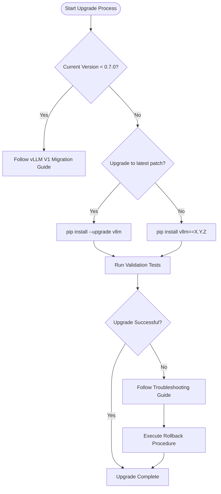

# Upgrade Guide

<cite>
**Referenced Files in This Document**   
- [README.md](file://README.md)
- [RELEASE.md](file://RELEASE.md)
- [pyproject.toml](file://pyproject.toml)
- [version.py](file://vllm/version.py)
- [vllm.py](file://vllm/config/vllm.py)
- [common.txt](file://requirements/common.txt)
- [build.txt](file://requirements/build.txt)
</cite>

## Table of Contents
1. [Introduction](#introduction)
2. [Versioning Scheme](#versioning-scheme)
3. [Pre-Upgrade Checklist](#pre-upgrade-checklist)
4. [Upgrade Paths](#upgrade-paths)
5. [Dependency Management](#dependency-management)
6. [Configuration Changes](#configuration-changes)
7. [Code Modifications](#code-modifications)
8. [Verification and Validation](#verification-and-validation)
9. [Troubleshooting](#troubleshooting)
10. [Rollback Procedures](#rollback-procedures)

## Introduction

This upgrade guide provides comprehensive instructions for migrating between vLLM versions. vLLM follows a structured release process with regular patch releases every two weeks, ensuring users have access to the latest features, performance improvements, and bug fixes. The guide covers the complete upgrade lifecycle, from pre-upgrade preparation to post-upgrade validation.

vLLM's upgrade process is designed to balance innovation with stability, allowing users to benefit from continuous improvements while maintaining system reliability. This document addresses the specific considerations for different upgrade scenarios, including minor version updates and major architectural changes such as the transition to vLLM V1.

The upgrade process involves several critical components: dependency management, configuration adjustments, potential code modifications, and thorough validation procedures. Understanding these elements is essential for a successful migration that maintains system performance and functionality.

**Section sources**
- [README.md](file://README.md#L1-L188)
- [RELEASE.md](file://RELEASE.md#L1-L91)

## Versioning Scheme

vLLM employs a "right-shifted" versioning scheme with the following components:

- **Major**: Reserved for major architectural milestones and incompatible API changes (similar to PyTorch 2.0)
- **Minor**: Indicates major feature additions
- **Patch**: Includes both new features and backwards-compatible bug fixes (released bi-weekly)
- **Post1**: Backwards-compatible bug fixes released 1-3 days after patch releases

This versioning approach differs from traditional semantic versioning by including feature additions in patch releases, enabling faster delivery of improvements to users. The bi-weekly release cadence ensures regular updates while maintaining stability.

The versioning scheme supports both incremental upgrades between consecutive patch versions and strategic upgrades across multiple versions. Understanding the nature of changes in each version type is crucial for planning upgrade strategies and assessing potential impacts on existing deployments.

**Section sources**
- [RELEASE.md](file://RELEASE.md#L5-L13)

## Pre-Upgrade Checklist

Before initiating any upgrade, complete the following pre-upgrade checklist to ensure a smooth migration process:

1. **Backup existing configuration files**: Preserve current configuration files to facilitate rollback if needed
2. **Document current version**: Record the current vLLM version using `vllm --version` or checking the installed package version
3. **Review release notes**: Examine the release notes for the target version to identify breaking changes, deprecations, and new features
4. **Verify hardware compatibility**: Ensure your hardware meets the requirements for the target version, particularly for GPU-specific optimizations
5. **Check dependency compatibility**: Validate that all third-party integrations and plugins are compatible with the target version
6. **Prepare test environment**: Set up a staging environment to test the upgrade before applying it to production systems
7. **Schedule maintenance window**: Plan the upgrade during a maintenance window to minimize impact on production workloads

Completing this checklist helps mitigate risks and ensures a controlled upgrade process. The bi-weekly release cadence of vLLM makes regular upgrades manageable while maintaining system stability.

**Section sources**
- [RELEASE.md](file://RELEASE.md#L14-L32)
- [pyproject.toml](file://pyproject.toml#L1-L306)

## Upgrade Paths

vLLM supports multiple upgrade paths depending on the starting version and target requirements. The following decision tree guides users through the appropriate upgrade strategy:



For users upgrading from versions prior to 0.7.0, special attention is required due to the architectural changes introduced in vLLM V1. Users on more recent versions can typically perform standard upgrades with minimal configuration changes.

The upgrade path selection should consider factors such as production environment constraints, testing requirements, and the criticality of new features in the target version. Regular patch upgrades are recommended to maintain security and performance improvements.

**Diagram sources**
- [RELEASE.md](file://RELEASE.md#L14-L32)
- [pyproject.toml](file://pyproject.toml#L1-L306)

**Section sources**
- [RELEASE.md](file://RELEASE.md#L14-L32)
- [pyproject.toml](file://pyproject.toml#L1-L306)

## Dependency Management

Proper dependency management is critical for successful vLLM upgrades. The following guidelines ensure compatibility and stability:

### Core Dependencies
vLLM requires specific versions of key dependencies:
- **PyTorch**: Version 2.9.0 (specified in pyproject.toml)
- **Transformers**: Version 4.56.0 or higher, but below 5.0.0
- **CUDA**: Compatible with the target hardware and PyTorch version

### Installation Methods
Two primary installation methods are available:

1. **PyPI Installation**:
```bash
pip install --upgrade vllm
```

2. **Source Installation**:
```bash
git clone https://github.com/vllm-project/vllm.git
cd vllm
pip install -e .
```

### Dependency Conflicts
When upgrading, watch for potential conflicts with existing packages:
- Check for version conflicts with existing PyTorch installations
- Verify compatibility with other machine learning frameworks in the environment
- Ensure CUDA toolkit version matches the PyTorch and vLLM requirements

The requirements files in the vLLM repository (common.txt, build.txt) provide detailed dependency specifications. Users should review these files when planning upgrades, particularly when moving between major versions.

**Section sources**
- [pyproject.toml](file://pyproject.toml#L1-L306)
- [common.txt](file://requirements/common.txt#L1-L52)
- [build.txt](file://requirements/build.txt#L1-L12)

## Configuration Changes

Configuration changes may be required when upgrading between vLLM versions. The following sections outline key configuration considerations:

### Configuration File Updates
When upgrading, review the following configuration aspects:
- **Optimization levels**: The OptimizationLevel enum defines different optimization profiles (O0-O3) that affect compilation and CUDA graph usage
- **KV cache configuration**: Changes to KV transfer configurations may require updates to cache settings
- **Compilation settings**: The CompilationConfig class manages torch.compile and cudagraph capture settings

### Environment Variables
vLLM supports various environment variables that may need adjustment after upgrades:
- `VLLM_USE_V1`: Enables the v1 KV connector
- `VLLM_LOGGING_LEVEL`: Controls logging verbosity for debugging upgrade issues
- `VLLM_CONFIG_FORMAT`: Specifies configuration file format

### Backward Compatibility
vLLM maintains backward compatibility for configuration options when possible. However, deprecated options may be removed in major releases. Users should:
- Check release notes for deprecated configuration options
- Test configuration files with the target version before production deployment
- Use the vllm config validation tools to verify configuration integrity

Configuration changes should be tested thoroughly in a staging environment before applying them to production systems.

**Section sources**
- [vllm.py](file://vllm/config/vllm.py#L1-L200)
- [version.py](file://vllm/version.py#L1-L40)

## Code Modifications

Most vLLM upgrades require minimal code modifications due to the project's commitment to backward compatibility. However, certain scenarios may necessitate code changes:

### API Changes
When upgrading across major versions, particularly to vLLM V1, review the following potential API changes:
- **KV connector interface**: The v1 KV connector introduces changes to the KV transfer API
- **Compilation interface**: Updates to the torch.compile integration may affect custom compilation configurations
- **Structured outputs**: Changes to structured output handling may require code adjustments

### Code Examples
The following example demonstrates a common upgrade scenario:

```python
# Pre-v1 KV connector usage
from vllm.distributed.kv_transfer import KVConnectorBase
# Post-v1 upgrade
from vllm.distributed.kv_transfer import KVConnectorBase_V1
```

### Migration Tools
vLLM provides tools to facilitate code migration:
- **Version compatibility checker**: Identifies potential compatibility issues
- **Deprecation warnings**: Runtime warnings for deprecated APIs
- **Migration scripts**: Automated tools for common upgrade patterns

Users should review the upgrade documentation and release notes for specific code modification requirements when moving between major versions.

**Section sources**
- [vllm.py](file://vllm/config/vllm.py#L1-L200)
- [version.py](file://vllm/version.py#L1-L40)

## Verification and Validation

After completing an upgrade, thorough verification and validation are essential to ensure system integrity and performance. Follow these steps to validate the upgrade:

### Basic Functionality Tests
1. **Version verification**:
```bash
vllm --version
```

2. **Basic inference test**:
```python
from vllm import LLM
llm = LLM(model="facebook/opt-125m")
output = llm.generate("Hello, my name is")
print(output)
```

### Performance Validation
Use the vLLM benchmark suite to validate performance:
```bash
python -m vllm.entrypoints.benchmark_throughput \
  --model facebook/opt-125m \
  --input-len 512 \
  --output-len 128
```

### End-to-End Testing
1. **Run existing workloads**: Execute typical inference workloads to verify functionality
2. **Compare performance metrics**: Compare throughput, latency, and memory usage with pre-upgrade baselines
3. **Validate error handling**: Test error conditions to ensure proper exception handling

### Monitoring
Enable detailed logging during validation:
```bash
export VLLM_LOGGING_LEVEL=DEBUG
vllm serve --model facebook/opt-125m
```

Successful validation should confirm that all expected functionality works correctly and that performance meets or exceeds pre-upgrade levels.

**Section sources**
- [RELEASE.md](file://RELEASE.md#L58-L90)
- [vllm.py](file://vllm/config/vllm.py#L1-L200)

## Troubleshooting

When upgrade issues occur, follow this systematic troubleshooting approach:

### Common Issues and Solutions

| Issue | Symptoms | Solution |
|-------|---------|----------|
| **Dependency conflicts** | Import errors, missing modules | Create clean virtual environment, reinstall dependencies |
| **Performance regression** | Reduced throughput, increased latency | Verify optimization level settings, check CUDA version compatibility |
| **Configuration errors** | Startup failures, invalid parameter errors | Validate configuration files, check for deprecated options |
| **Memory issues** | Out-of-memory errors, excessive memory usage | Adjust cache configuration, verify memory offload settings |

### Diagnostic Commands
Use these commands to diagnose upgrade issues:

1. **Check installation**:
```bash
pip show vllm
```

2. **Verify dependencies**:
```bash
pip check
```

3. **Test basic functionality**:
```bash
python -c "from vllm import LLM; print('Import successful')"
```

4. **Enable debug logging**:
```bash
export VLLM_LOGGING_LEVEL=DEBUG
```

### Community Resources
When encountering persistent issues:
- Check the [vLLM Forum](https://discuss.vllm.ai) for similar issues
- Search GitHub issues for known problems
- Join the [Developer Slack](https://slack.vllm.ai) for real-time assistance

Documenting the specific error messages and environment details will help community members provide targeted assistance.

**Section sources**
- [README.md](file://README.md#L178-L182)
- [RELEASE.md](file://RELEASE.md#L58-L90)

## Rollback Procedures

If an upgrade fails or introduces critical issues, follow these rollback procedures:

### Immediate Rollback Steps
1. **Stop vLLM services**:
```bash
# Stop running vLLM processes
pkill -f vllm
```

2. **Reinstall previous version**:
```bash
pip install vllm==<previous_version>
```

3. **Restore configuration files**:
```bash
# Replace upgraded configuration with backup
cp /backup/vllm_config.yaml /current/vllm_config.yaml
```

### Verification After Rollback
1. **Confirm version**:
```bash
vllm --version
```

2. **Test basic functionality**:
```python
from vllm import LLM
llm = LLM(model="facebook/opt-125m")
print("Rollback verification successful")
```

3. **Resume normal operations**: Gradually restore production workloads while monitoring system performance.

### Post-Rollback Analysis
After successful rollback:
- Document the issues encountered during the upgrade
- Analyze logs to identify root causes
- Plan a revised upgrade strategy addressing the identified issues
- Consider testing the upgrade in a more comprehensive staging environment

Maintaining regular backups of both the vLLM installation and configuration files enables quick recovery from problematic upgrades.

**Section sources**
- [pyproject.toml](file://pyproject.toml#L1-L306)
- [common.txt](file://requirements/common.txt#L1-L52)