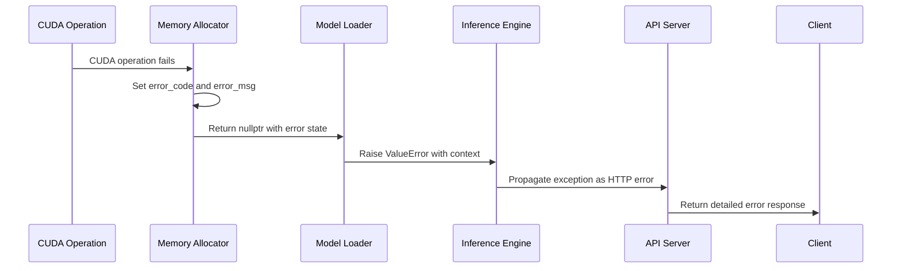

# Common Issues

<cite>
**Referenced Files in This Document**   
- [vllm/envs.py](file://vllm/envs.py)
- [vllm/logger.py](file://vllm/logger.py)
- [vllm/v1/engine/exceptions.py](file://vllm/v1/engine/exceptions.py)
- [vllm/model_executor/models/registry.py](file://vllm/model_executor/models/registry.py)
- [vllm/lora/models.py](file://vllm/lora/models.py)
- [vllm/lora/peft_helper.py](file://vllm/lora/peft_helper.py)
- [vllm/platforms/interface.py](file://vllm/platforms/interface.py)
- [vllm/third_party/pynvml.py](file://vllm/third_party/pynvml.py)
- [csrc/cumem_allocator.cpp](file://csrc/cumem_allocator.cpp)
- [cmake/utils.cmake](file://cmake/utils.cmake)
- [vllm/model_executor/model_loader/utils.py](file://vllm/model_executor/model_loader/utils.py)
</cite>

## Table of Contents
1. [Introduction](#introduction)
2. [Error Handling Mechanisms](#error-handling-mechanisms)
3. [Configuration-Related Issues](#configuration-related-issues)
4. [Model Loading and Tokenizer Issues](#model-loading-and-tokenizer-issues)
5. [CUDA and Hardware Initialization Errors](#cuda-and-hardware-initialization-errors)
6. [Validation and System Requirements](#validation-and-system-requirements)
7. [Troubleshooting Guide](#troubleshooting-guide)

## Introduction
This document provides comprehensive guidance on common issues encountered when using vLLM, a high-throughput and memory-efficient inference engine for large language models. The focus is on understanding error handling mechanisms, configuration problems, model loading failures, tokenizer mismatches, and CUDA initialization errors. By examining the implementation details from the actual codebase, this guide aims to help users interpret error messages, understand stack traces, and resolve common failure modes related to configuration parameters.

## Error Handling Mechanisms
vLLM implements a robust error handling system that captures and propagates exceptions throughout the inference pipeline. The system uses both Python-level exceptions and low-level CUDA error handling to ensure comprehensive error reporting.

The error handling mechanism in vLLM is designed to provide detailed information about failures while maintaining system stability. When an error occurs, it is first captured at the lowest level (often in CUDA operations) and then propagated up through the call stack with additional context information.



**Diagram sources**
- [csrc/cumem_allocator.cpp](file://csrc/cumem_allocator.cpp#L59-L74)
- [vllm/model_executor/model_loader/utils.py](file://vllm/model_executor/model_loader/utils.py#L77-L78)

The CUDA error handling is implemented through a macro-based system that captures error codes and messages:

```cpp
#define CUDA_CHECK(condition)                                           \
  do {                                                                  \
    CUresult error = condition;                                         \
    if (error != 0) {                                                   \
      error_code = error;                                               \
      char* error_string;                                               \
      cuGetErrorString(error, (const char**)&error_string);             \
      snprintf(error_msg, sizeof(error_msg), "CUDA Error: %s at %s:%d", \
               error_string, __FILE__, __LINE__);                       \
      std::cerr << error_msg << std::endl;                              \
    }                                                                   \
  } while (0)
```

This mechanism ensures that every CUDA operation is checked for errors, and detailed error messages are generated with file and line number information.

**Section sources**
- [csrc/cumem_allocator.cpp](file://csrc/cumem_allocator.cpp#L63-L74)

## Configuration-Related Issues
Configuration problems are a common source of issues in vLLM deployments. These include incorrect model paths, unsupported model architectures, and incompatible hardware setups. The system validates configuration parameters at multiple levels to prevent runtime failures.

### Environment Variable Validation
vLLM uses a comprehensive system for validating environment variables, ensuring that only supported values are accepted:

```python
def env_with_choices(
    env_name: str,
    default: str | None,
    choices: list[str] | Callable[[], list[str]],
    case_sensitive: bool = True,
) -> Callable[[], str | None]:
    """
    Create a lambda that validates environment variable against allowed choices
    """
    def _get_validated_env() -> str | None:
        value = os.getenv(env_name)
        if value is None:
            return default

        actual_choices = choices() if callable(choices) else choices

        if not case_sensitive:
            check_value = value.lower()
            check_choices = [choice.lower() for choice in actual_choices]
        else:
            check_value = value
            check_choices = actual_choices

        if check_value not in check_choices:
            raise ValueError(
                f"Invalid value '{value}' for {env_name}. "
                f"Valid options: {actual_choices}."
            )

        return value

    return _get_validated_env
```

This validation system is used throughout the codebase to ensure configuration integrity.

**Section sources**
- [vllm/envs.py](file://vllm/envs.py#L290-L332)

### Model Architecture Support
vLLM maintains a registry of supported model architectures, which is used to validate models during loading:

```python
_MODEL_REGISTRY = {
    "LlamaForCausalLM": ("llama", "LlamaForCausalLM"),
    "MistralForCausalLM": ("mistral", "MistralForCausalLM"),
    "Qwen2ForCausalLM": ("qwen2", "Qwen2ForCausalLM"),
    "Phi3ForCausalLM": ("phi3", "Phi3ForCausalLM"),
    "GemmaForCausalLM": ("gemma", "GemmaForCausalLM"),
    "StableLmForCausalLM": ("stablelm", "StableLmForCausalLM"),
    "StablelmForCausalLM": ("stablelm", "StableLmForCausalLM"),
    "Starcoder2ForCausalLM": ("starcoder2", "Starcoder2ForCausalLM"),
    "FalconForCausalLM": ("falcon", "FalconForCausalLM"),
    "MixtralForCausalLM": ("mixtral", "MixtralForCausalLM"),
    # [Multimodal]
    "Idefics3ForConditionalGeneration": (
        "idefics3",
        "Idefics3ForConditionalGeneration",
    ),
    "SmolVLMForConditionalGeneration": ("smolvlm", "SmolVLMForConditionalGeneration"),
    "KeyeForConditionalGeneration": ("keye", "KeyeForConditionalGeneration"),
    # [Encoder-decoder]
    "WhisperForConditionalGeneration": ("whisper", "WhisperForConditionalGeneration"),
}
```

When a model is loaded, its architecture is checked against this registry to ensure compatibility.

**Section sources**
- [vllm/model_executor/models/registry.py](file://vllm/model_executor/models/registry.py#L317-L427)

## Model Loading and Tokenizer Issues
Model loading failures and tokenizer mismatches are common issues that can prevent successful inference. vLLM implements several mechanisms to detect and handle these problems.

### LoRA Configuration Validation
When loading LoRA adapters, vLLM performs extensive validation to ensure compatibility:

```python
def validate_legal(self, lora_config: LoRAConfig) -> None:
    """
    Validates if this adapter's configuration is legal.
    
    Raises:
        ValueError: If the adapter's configuration is illegal.
    """
    if self.fan_in_fan_out:
        raise ValueError("fan_in_fan_out is not supported.")
    if self.bias != "none":
        raise ValueError("bias is not supported.")
    if self.modules_to_save is not None:
        raise ValueError("modules_to_save is not supported.")
    if self.pissa_init is not None:
        raise ValueError("pissa is not supported.")
    if self.r > 1024:
        raise ValueError(f"LoRA rank {self.r} is too large")
```

This validation ensures that only compatible LoRA configurations are loaded, preventing runtime errors.

**Section sources**
- [vllm/lora/peft_helper.py](file://vllm/lora/peft_helper.py#L114-L115)

### Model Weight Loading
During model weight loading, vLLM checks for unexpected modules and ensures that the loaded weights match the expected structure:

```python
if unexpected_modules and not is_regex_target_modules(
    peft_helper.target_modules, expected_lora_modules
):
    raise ValueError(
        f"While loading {lora_dir}, expected"
        f" target modules in {expected_lora_modules}"
        f" but got {unexpected_modules}"
    )
```

This prevents loading of incompatible LoRA adapters that could cause inference failures.

**Section sources**
- [vllm/lora/models.py](file://vllm/lora/models.py#L260-L265)

## CUDA and Hardware Initialization Errors
CUDA initialization errors and hardware compatibility issues are critical problems that can prevent vLLM from starting. The system includes comprehensive checks to detect and report these issues.

### Device Capability Checking
vLLM verifies GPU device capabilities before attempting to use them:

```python
@classmethod
def has_device_capability(
    cls,
    capability: tuple[int, int] | int,
    device_id: int = 0,
) -> bool:
    """
    Test whether this platform is compatible with a device capability.
    
    The `capability` argument can either be:
    - A tuple `(major, minor)`.
    - An integer `<major><minor>`.
    """
    current_capability = cls.get_device_capability(device_id=device_id)
    if current_capability is None:
        return False

    if isinstance(capability, tuple):
        return current_capability >= capability

    return current_capability.to_int() >= capability
```

This ensures that only GPUs with sufficient compute capability are used.

**Section sources**
- [vllm/platforms/interface.py](file://vllm/platforms/interface.py#L256-L277)

### NVML Error Handling
vLLM uses NVML (NVIDIA Management Library) to monitor GPU status and handle errors:

```python
NVMLError._errcode_to_string = {
    NVML_ERROR_INSUFFICIENT_SIZE:   "Insufficient Size",
    NVML_ERROR_INSUFFICIENT_POWER:  "Insufficient External Power",
    NVML_ERROR_DRIVER_NOT_LOADED:   "Driver Not Loaded",
    NVML_ERROR_TIMEOUT:             "Timeout",
    NVML_ERROR_IRQ_ISSUE:           "Interrupt Request Issue",
    NVML_ERROR_LIBRARY_NOT_FOUND:   "NVML Shared Library Not Found",
    NVML_ERROR_FUNCTION_NOT_FOUND:  "Function Not Found",
    NVML_ERROR_CORRUPTED_INFOROM:   "Corrupted infoROM",
    NVML_ERROR_GPU_IS_LOST:         "GPU is lost",
    NVML_ERROR_RESET_REQUIRED:      "GPU requires restart",
    NVML_ERROR_OPERATING_SYSTEM:    "The operating system has blocked the request.",
    NVML_ERROR_LIB_RM_VERSION_MISMATCH: "RM has detected an NVML/RM version mismatch.",
    NVML_ERROR_MEMORY:              "Insufficient Memory",
    NVML_ERROR_UNKNOWN:             "Unknown Error",
}
```

This mapping provides human-readable error messages for common GPU issues.

**Section sources**
- [vllm/third_party/pynvml.py](file://vllm/third_party/pynvml.py#L978-L991)

## Validation and System Requirements
Proper validation of installations and system requirements is essential for successful vLLM deployment. The system includes several mechanisms to verify that all requirements are met.

### Python Version Validation
During build time, vLLM validates the Python version to ensure compatibility:

```cmake
macro (find_python_from_executable EXECUTABLE SUPPORTED_VERSIONS)
  file(REAL_PATH ${EXECUTABLE} EXECUTABLE)
  set(Python_EXECUTABLE ${EXECUTABLE})
  find_package(Python COMPONENTS Interpreter Development.Module Development.SABIModule)
  if (NOT Python_FOUND)
    message(FATAL_ERROR "Unable to find python matching: ${EXECUTABLE}.")
  endif()
  set(_VER "${Python_VERSION_MAJOR}.${Python_VERSION_MINOR}")
  set(_SUPPORTED_VERSIONS_LIST ${SUPPORTED_VERSIONS} ${ARGN})
  if (NOT _VER IN_LIST _SUPPORTED_VERSIONS_LIST)
    message(FATAL_ERROR
      "Python version (${_VER}) is not one of the supported versions: "
      "${_SUPPORTED_VERSIONS_LIST}.")
  endif()
  message(STATUS "Found python matching: ${EXECUTABLE}.")
endmacro()
```

This ensures that only supported Python versions are used for building vLLM.

**Section sources**
- [cmake/utils.cmake](file://cmake/utils.cmake#L5-L20)

### Logging Configuration
vLLM includes comprehensive logging to help diagnose issues:

```python
def _configure_vllm_root_logger() -> None:
    if not envs.VLLM_CONFIGURE_LOGGING and envs.VLLM_LOGGING_CONFIG_PATH:
        raise RuntimeError(
            "VLLM_CONFIGURE_LOGGING evaluated to false, but "
            "VLLM_LOGGING_CONFIG_PATH was given. VLLM_LOGGING_CONFIG_PATH "
            "implies VLLM_CONFIGURE_LOGGING. Please enable "
            "VLLM_CONFIGURE_LOGGING or unset VLLM_LOGGING_CONFIG_PATH."
        )
```

This validation prevents configuration conflicts that could lead to missing log output.

**Section sources**
- [vllm/logger.py](file://vllm/logger.py#L161-L167)

## Troubleshooting Guide
This section provides guidance on interpreting error messages and resolving common issues.

### Interpreting Error Messages
When encountering errors in vLLM, follow these steps to diagnose the issue:

1. Check the error message for specific details about the failure
2. Look for stack traces that indicate where the error occurred
3. Verify configuration parameters against the documentation
4. Check system requirements and hardware compatibility
5. Review log files for additional context

### Common Failure Modes
The following table summarizes common failure modes and their solutions:

| Failure Mode | Symptoms | Solution |
|-------------|---------|----------|
| Model loading failure | "Model not found" or "Invalid model path" | Verify model path and permissions |
| Tokenizer mismatch | "Tokenizer mismatch" or "Vocabulary size mismatch" | Ensure tokenizer and model compatibility |
| CUDA initialization error | "CUDA Error" or "GPU is lost" | Check GPU drivers and CUDA installation |
| Memory allocation failure | "Out of memory" or "Insufficient Memory" | Reduce batch size or model size |
| Configuration error | "Invalid value" or "Unsupported option" | Validate configuration against documentation |

**Section sources**
- [vllm/envs.py](file://vllm/envs.py)
- [vllm/v1/engine/exceptions.py](file://vllm/v1/engine/exceptions.py)