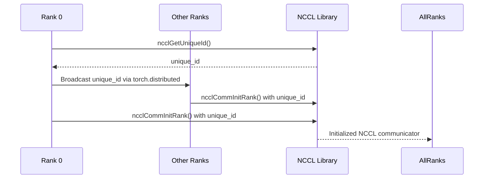
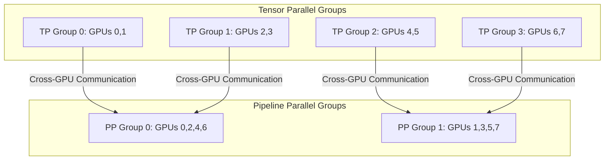
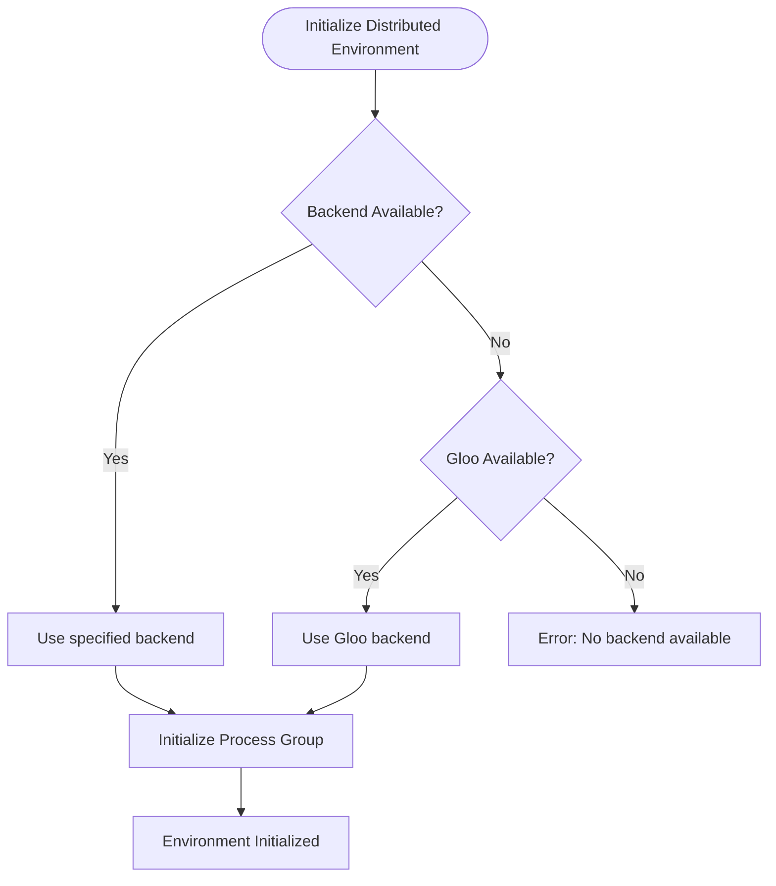

# Distributed Issues

<cite>
**Referenced Files in This Document**   
- [pynccl.py](file://vllm/distributed/device_communicators/pynccl.py)
- [pynccl_wrapper.py](file://vllm/distributed/device_communicators/pynccl_wrapper.py)
- [parallel_state.py](file://vllm/distributed/parallel_state.py)
- [symm_mem.py](file://vllm/distributed/device_communicators/symm_mem.py)
- [custom_all_reduce.py](file://vllm/distributed/device_communicators/custom_all_reduce.py)
- [data_parallel.py](file://examples/offline_inference/data_parallel.py)
- [base_device_communicator.py](file://vllm/distributed/device_communicators/base_device_communicator.py)
- [utils.py](file://vllm/distributed/utils.py)
</cite>

## Table of Contents
1. [Introduction](#introduction)
2. [NCCL Initialization and Communication](#nccl-initialization-and-communication)
3. [Tensor and Pipeline Parallelism](#tensor-and-pipeline-parallelism)
4. [Communication Backend Selection](#communication-backend-selection)
5. [Troubleshooting Distributed Issues](#troubleshooting-distributed-issues)
6. [Performance Optimization](#performance-optimization)
7. [Multi-Node Configuration](#multi-node-configuration)
8. [Conclusion](#conclusion)

## Introduction
This document provides comprehensive analysis of distributed inference issues in vLLM, focusing on communication problems, parallelism strategies, and troubleshooting techniques. The analysis covers NCCL initialization failures, network connectivity issues, synchronization errors, and solutions for various distributed configurations. The document examines how vLLM handles cross-GPU communication through tensor and pipeline parallelism, and provides concrete examples from the codebase for diagnosing collective operation failures and rank mismatches.

## NCCL Initialization and Communication

vLLM implements a robust distributed communication system centered around NCCL (NVIDIA Collective Communications Library) for efficient GPU-to-GPU communication. The PyNcclCommunicator class in `pynccl.py` serves as the primary interface for NCCL operations, providing a pure Python wrapper that enables CUDA graph integration.

The initialization process begins with the creation of a unique identifier through `ncclGetUniqueId()` which is broadcast across all ranks in the process group. This ensures consistent initialization across all participating processes:



**Diagram sources**
- [pynccl.py](file://vllm/distributed/device_communicators/pynccl.py#L104-L128)
- [pynccl_wrapper.py](file://vllm/distributed/device_communicators/pynccl_wrapper.py#L382-L385)

The system includes comprehensive error handling for NCCL initialization failures. When the NCCL library cannot be loaded, the system provides detailed error messages indicating whether this is expected (non-GPU environment) or due to library corruption or platform incompatibility:

```python
try:
    self.nccl = NCCLLibrary(library_path)
except Exception as e:
    logger.error(
        "Failed to load NCCL library from %s. "
        "It is expected if you are not running on NVIDIA/AMD GPUs."
        "Otherwise, the nccl library might not exist, be corrupted "
        "or it does not support the current platform %s.",
        so_file,
        platform.platform(),
    )
    raise e
```

Common initialization issues include:
- Missing NCCL library installation
- Version incompatibilities between nodes
- Platform-specific library requirements
- Insufficient permissions for library access

The system performs a small all_reduce operation as a warmup after initialization to verify communication integrity before processing actual workloads.

**Section sources**
- [pynccl.py](file://vllm/distributed/device_communicators/pynccl.py#L137-L148)
- [pynccl_wrapper.py](file://vllm/distributed/device_communicators/pynccl_wrapper.py#L308-L358)

## Tensor and Pipeline Parallelism

vLLM implements both tensor parallelism and pipeline parallelism to distribute model computation across multiple GPUs. The `initialize_model_parallel` function in `parallel_state.py` creates the necessary process groups for both parallelism strategies.

For tensor model parallelism, GPUs are grouped such that each group handles a portion of the tensor computation. For pipeline parallelism, GPUs are arranged in a sequence where each GPU handles a specific stage of the model. The following example illustrates the group creation process:



**Diagram sources**
- [parallel_state.py](file://vllm/distributed/parallel_state.py#L1269-L1297)

The communication pattern for tensor parallelism involves frequent all-reduce operations to synchronize gradients across the tensor parallel group. Pipeline parallelism requires send/receive operations between consecutive pipeline stages to forward activations and backward gradients.

Key implementation details:
- Tensor parallel groups are created with adjacent ranks on the same node when possible to optimize communication
- Pipeline parallel groups span multiple nodes to distribute the model depth
- Each GPU participates in exactly one tensor parallel group and one pipeline parallel group
- The system ensures that tensor parallel operations occur on tensors residing on the same device as the communicator

The code enforces device consistency with assertions that prevent illegal memory access:

```python
assert in_tensor.device == self.device, (
    f"this nccl communicator is created to work on {self.device}, "
    f"but the input tensor is on {in_tensor.device}"
)
```

**Section sources**
- [parallel_state.py](file://vllm/distributed/parallel_state.py#L1269-L1299)
- [pynccl.py](file://vllm/distributed/device_communicators/pynccl.py#L157-L165)

## Communication Backend Selection

vLLM supports multiple communication backends with a hierarchical selection strategy. The system prioritizes NCCL for GPU environments but falls back to Gloo when NCCL is unavailable. The backend selection occurs during distributed environment initialization:



**Diagram sources**
- [parallel_state.py](file://vllm/distributed/parallel_state.py#L1212-L1228)

The system implements specialized communicators for different communication patterns:
- **PyNcclCommunicator**: Primary NCCL-based communicator for standard collective operations
- **SymmMemCommunicator**: Optimized communicator using symmetric memory for small all-reduce operations
- **CustomAllreduce**: Custom implementation for specific optimization scenarios

The SymmMemCommunicator provides two algorithms based on world size and device capability:
- **Multimem algorithm**: Used for world sizes of 4, 6, or 8 on compatible hardware
- **Two-shot algorithm**: Fallback for other configurations

```python
def all_reduce(self, inp: torch.Tensor, *, out: torch.Tensor | None = None) -> torch.Tensor | None:
    if not self.should_use_symm_mem(inp):
        return None
        
    # Determine which algorithm to use
    use_multimem = False
    if self.force_multimem is not None:
        use_multimem = self.force_multimem
    else:
        use_multimem = (
            self.world_size in self._WORLD_SIZES_MULTIMEM[self.device_capability]
        )
        
    if use_multimem:
        torch.ops.symm_mem.multimem_all_reduce_(
            self.buffer[: inp.numel()], "sum", self.group.group_name
        )
    else:
        torch.ops.symm_mem.two_shot_all_reduce_(
            self.buffer[: inp.numel()], "sum", self.group.group_name
        )
```

The system automatically selects the appropriate communicator based on tensor size, dtype, and device compatibility, ensuring optimal performance across different scenarios.

**Section sources**
- [symm_mem.py](file://vllm/distributed/device_communicators/symm_mem.py#L127-L156)
- [parallel_state.py](file://vllm/distributed/parallel_state.py#L1212-L1240)

## Troubleshooting Distributed Issues

This section provides systematic approaches to diagnose and resolve common distributed inference issues in vLLM.

### NCCL Initialization Failures
When NCCL fails to initialize, check the following:
1. Verify NCCL library installation and accessibility
2. Ensure consistent NCCL versions across all nodes
3. Check environment variables like `VLLM_NCCL_SO_PATH`
4. Validate GPU availability and driver compatibility

The system logs detailed error information when NCCL loading fails:

```python
logger.error(
    "Failed to load NCCL library from %s. "
    "It is expected if you are not running on NVIDIA/AMD GPUs."
    "Otherwise, the nccl library might not exist, be corrupted "
    "or it does not support the current platform %s.",
    so_file,
    platform.platform(),
)
```

### Network Connectivity Issues
For multi-node setups, ensure:
- All nodes can reach the master address and port
- Firewall rules allow communication on the specified port
- Network latency is within acceptable limits
- IP addresses and hostnames are correctly configured

The `data_parallel.py` example demonstrates proper multi-node configuration:

```python
if node_size == 1:
    dp_master_ip = "127.0.0.1"
    dp_master_port = get_open_port()
else:
    dp_master_ip = args.master_addr
    dp_master_port = args.master_port
```

### Synchronization Errors
Common synchronization issues include:
- Rank mismatches in collective operations
- Device placement errors
- Timing issues in distributed initialization

The system includes safeguards against device placement errors:

```python
assert input_tensor.device == self.device, (
    f"this nccl communicator is created to work on {self.device}, "
    f"but the input tensor is on {input_tensor.device}"
)
```

### Collective Operation Failures
To diagnose collective operation failures:
1. Verify tensor sizes match across all ranks
2. Ensure all ranks participate in the collective operation
3. Check for consistent data types
4. Validate that all ranks are at the same execution point

The test suite includes verification of collective operations:

```python
dist.all_reduce(original_inp_direct_symm_mem, group=group)
torch.testing.assert_close(
    out_direct_symm_mem, original_inp_direct_symm_mem, atol=2.5, rtol=0.1
)
```

**Section sources**
- [pynccl_wrapper.py](file://vllm/distributed/device_communicators/pynccl_wrapper.py#L317-L327)
- [data_parallel.py](file://examples/offline_inference/data_parallel.py#L213-L219)
- [symm_mem.py](file://vllm/distributed/device_communicators/symm_mem.py#L98-L105)

## Performance Optimization

vLLM implements several strategies to optimize distributed communication performance:

### Small All-Reduce Optimization
For small tensors, the SymmMemCommunicator provides significant performance improvements by using symmetric memory:

```python
def should_use_symm_mem(self, inp: torch.Tensor):
    if self.disabled:
        return False
    if inp.dtype != self.dtype:
        return False
    inp_size = inp.numel() * inp.element_size()
    if inp_size % 4 != 0:
        return False
    return inp_size < self.max_size
```

The system automatically routes small all-reduce operations through the optimized path while using standard NCCL for larger tensors.

### Communication Hierarchy
The system establishes a hierarchical communication structure:
1. **World group**: All processes in the distributed setup
2. **Tensor parallel groups**: GPUs sharing tensor computation
3. **Pipeline parallel groups**: GPUs in the same pipeline stage
4. **Expert parallel groups**: For MoE (Mixture of Experts) models

This hierarchy minimizes unnecessary communication and optimizes bandwidth utilization.

### GPU-GPU Communication Optimization
To address GPU-GPU communication bottlenecks:
- Use direct GPU-to-GPU communication when possible
- Minimize host memory involvement
- Optimize tensor placement to reduce data movement
- Implement communication-computation overlap

The custom all-reduce implementation limits world size to powers of two for optimal performance:

```python
if world_size > 8:
    raise std::invalid_argument("world size > 8 is not supported")
if world_size % 2 != 0:
    raise std::invalid_argument("Odd num gpus is not supported for now")
```

**Section sources**
- [symm_mem.py](file://vllm/distributed/device_communicators/symm_mem.py#L117-L125)
- [custom_all_reduce.cu](file://csrc/custom_all_reduce.cu#L17-L20)

## Multi-Node Configuration

Configuring vLLM for multi-node distributed inference requires careful attention to several parameters:

### Environment Variables
Key environment variables for multi-node setups:
- `VLLM_DP_RANK`: Global data parallel rank
- `VLLM_DP_RANK_LOCAL`: Local data parallel rank
- `VLLM_DP_SIZE`: Data parallel size
- `VLLM_DP_MASTER_IP`: Master node IP address
- `VLLM_DP_MASTER_PORT`: Master node port

### Configuration Parameters
Essential command-line arguments:
- `--node-size`: Total number of nodes
- `--node-rank`: Rank of the current node (0-indexed)
- `--master-addr`: IP address of the master node
- `--master-port`: Port for master node communication
- `--dp-size`: Data parallel size
- `--tp-size`: Tensor parallel size

### Node Assignment Strategy
The system uses a consistent node assignment strategy to ensure optimal communication patterns:

```python
def _node_count(pg: ProcessGroup | StatelessProcessGroup) -> int:
    # Build node assignment map
    node_assignment = [0] * world_size  # rank -> node_id
    next_node_id = 0
    
    for current_rank in range(world_size):
        if node_assignment[current_rank] != 0:
            continue  # Already assigned to a node
            
        # Assign current rank to a new node
        next_node_id += 1
        node_assignment[current_rank] = next_node_id
```

This ensures that adjacent ranks are typically assigned to the same node, optimizing intra-node communication.

**Section sources**
- [data_parallel.py](file://examples/offline_inference/data_parallel.py#L132-L136)
- [parallel_state.py](file://vllm/distributed/parallel_state.py#L1754-L1782)

## Conclusion
vLLM provides a comprehensive distributed inference system with robust handling of communication issues, parallelism strategies, and performance optimization. The architecture supports both single-node and multi-node configurations with automatic backend selection and optimization. Key strengths include:
- Comprehensive error handling for NCCL initialization and communication
- Multiple communication backends with automatic selection
- Optimized paths for small collective operations
- Clear troubleshooting guidance for common issues
- Well-documented multi-node configuration requirements

For optimal performance, ensure consistent software versions across nodes, proper network configuration, and appropriate selection of parallelism parameters based on your hardware setup and model requirements.