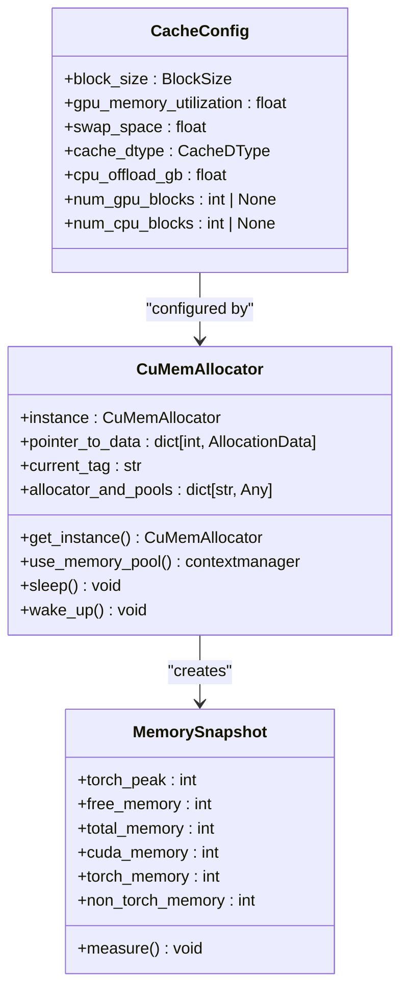
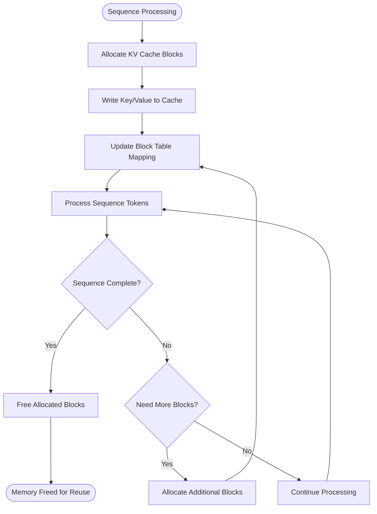
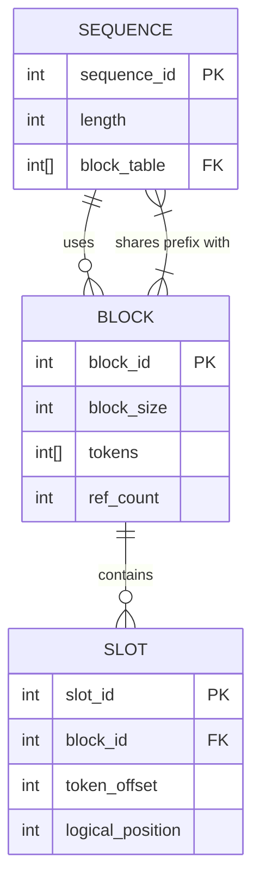
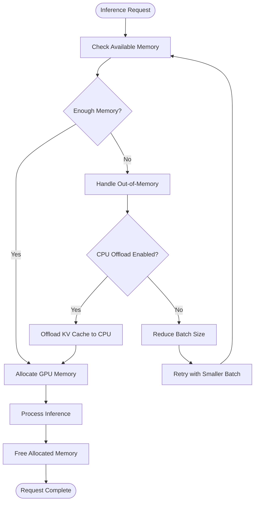
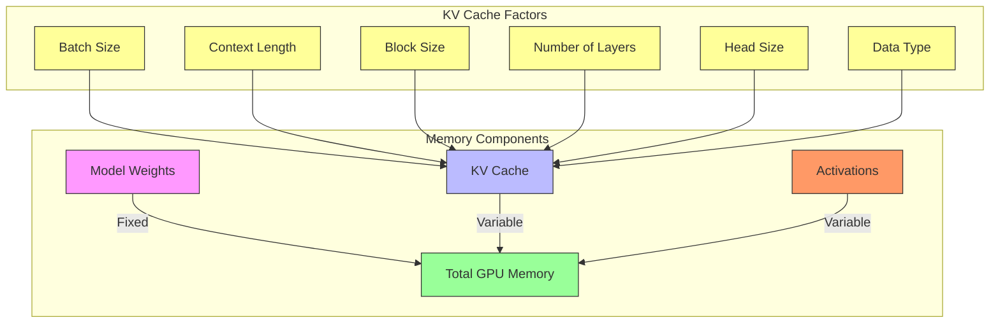

# Memory Issues

<cite>
**Referenced Files in This Document**   
- [cache.py](file://vllm/config/cache.py)
- [cumem.py](file://vllm/device_allocator/cumem.py)
- [cache.h](file://csrc/cache.h)
- [cache_kernels.cu](file://csrc/cache_kernels.cu)
- [paged_attn.py](file://vllm/attention/ops/paged_attn.py)
- [mem_utils.py](file://vllm/utils/mem_utils.py)
</cite>

## Table of Contents
1. [Introduction](#introduction)
2. [KV Cache Allocation and Management](#kv-cache-allocation-and-management)
3. [PagedAttention and Memory Fragmentation](#pagedattention-and-memory-fragmentation)
4. [Block Table Management](#block-table-management)
5. [Out-of-Memory Scenarios and Diagnostics](#out-of-memory-scenarios-and-diagnostics)
6. [Memory-Efficient Inference Configuration](#memory-efficient-inference-configuration)
7. [Relationship Between Context Length, Batch Size, and GPU Memory](#relationship-between-context-length-batch-size-and-gpu-memory)
8. [Cache Eviction Policies](#cache-eviction-policies)
9. [Conclusion](#conclusion)

## Introduction
vLLM employs advanced memory management techniques to optimize large language model inference, particularly through its PagedAttention mechanism. This document details the implementation of memory management in vLLM, focusing on KV cache allocation, block table management, and strategies for handling out-of-memory scenarios. The system is designed to efficiently manage GPU memory through block-based allocation, memory pooling, and sophisticated caching strategies that minimize fragmentation and maximize utilization.

**Section sources**
- [cache.py](file://vllm/config/cache.py#L1-L221)
- [mem_utils.py](file://vllm/utils/mem_utils.py#L1-L233)

## KV Cache Allocation and Management
vLLM implements a block-based KV cache system that divides GPU memory into fixed-size blocks for efficient allocation and management. The KV cache is configured through the `CacheConfig` class, which specifies critical parameters such as block size, GPU memory utilization, and data types for cache storage.

The system allocates KV cache blocks in a paged manner, where each block can store a fixed number of tokens (typically 16). This approach allows for non-contiguous memory allocation while maintaining logical continuity through block tables that map logical token positions to physical block locations. The cache supports various data types including bfloat16 and FP8, with FP8 providing reduced memory footprint at the potential cost of accuracy.

Memory allocation is handled through a custom CUDA allocator based on cumem APIs, which provides fine-grained control over GPU memory. The `CuMemAllocator` class implements a singleton pattern and manages memory pools that can be put to sleep when not in use, freeing up GPU memory for other processes. This is particularly useful in multi-tenant environments where memory resources need to be shared efficiently.



**Diagram sources**
- [cache.py](file://vllm/config/cache.py#L37-L221)
- [cumem.py](file://vllm/device_allocator/cumem.py#L140-L174)
- [mem_utils.py](file://vllm/utils/mem_utils.py#L58-L123)

**Section sources**
- [cache.py](file://vllm/config/cache.py#L1-L221)
- [cumem.py](file://vllm/device_allocator/cumem.py#L140-L174)
- [mem_utils.py](file://vllm/utils/mem_utils.py#L1-L233)

## PagedAttention and Memory Fragmentation
PagedAttention is vLLM's innovative approach to attention mechanism implementation that directly addresses memory fragmentation issues common in transformer-based models. Traditional attention implementations require contiguous memory allocation for KV caches, leading to fragmentation as sequences of different lengths are processed and deallocated.

PagedAttention solves this problem by dividing the KV cache into fixed-size blocks that can be allocated and deallocated independently. Each sequence maintains a block table that maps logical token positions to physical block locations, allowing for non-contiguous memory allocation while preserving logical continuity. This approach is analogous to virtual memory paging in operating systems.

The implementation is found in `paged_attn.py`, where the `PagedAttention` class provides methods for writing to and reading from the paged cache. The `write_to_paged_cache` method uses the `reshape_and_cache` CUDA kernel to store key and value tensors in the appropriate cache blocks based on slot mappings. This kernel handles data type conversion and scaling when using quantized formats like FP8.

Block allocation strategies are designed to minimize fragmentation by reusing freed blocks whenever possible. The system maintains a pool of available blocks that can be quickly allocated to new sequences or expanding sequences. When a sequence grows beyond its current block allocation, additional blocks are allocated and linked through the block table.



**Diagram sources**
- [paged_attn.py](file://vllm/attention/ops/paged_attn.py#L15-L52)
- [cache_kernels.cu](file://csrc/cache_kernels.cu#L21-L800)

**Section sources**
- [paged_attn.py](file://vllm/attention/ops/paged_attn.py#L1-L52)
- [cache.h](file://csrc/cache.h#L21-L37)
- [cache_kernels.cu](file://csrc/cache_kernels.cu#L21-L800)

## Block Table Management
Block table management is a critical component of vLLM's memory system, serving as the bridge between logical sequence positions and physical memory locations. Each sequence maintains a block table that maps logical token indices to physical block numbers in the KV cache.

The block table is implemented as a 2D tensor where each row corresponds to a sequence and contains the block indices that store its KV cache. The system uses a slot mapping mechanism to map individual token positions within blocks. This two-level mapping system (block table + slot mapping) enables efficient random access to any token in the sequence while maintaining the benefits of block-based allocation.

Block allocation follows a first-fit strategy, where the system searches for the first available block that can accommodate the requested tokens. When a sequence is completed or evicted, its blocks are returned to the free pool for reuse. The system also implements block sharing for common prefixes between sequences, which significantly reduces memory usage in scenarios with similar prompts.

The `make_block_tables_slot_mapping` function in the test utilities demonstrates how block tables and slot mappings are constructed for testing purposes. It calculates the minimum number of blocks required for each sequence based on the block size and sequence length, then assigns block indices in descending order from a base address.



**Diagram sources**
- [cache_kernels.cu](file://csrc/cache_kernels.cu#L43-L59)
- [utils.py](file://tests/kernels/utils.py#L685-L763)

**Section sources**
- [cache_kernels.cu](file://csrc/cache_kernels.cu#L43-L59)
- [utils.py](file://tests/kernels/utils.py#L685-L763)

## Out-of-Memory Scenarios and Diagnostics
Out-of-memory (OOM) scenarios in vLLM typically occur when the combined memory requirements of model weights, KV caches, and intermediate activations exceed available GPU memory. The system provides several mechanisms for diagnosing and mitigating these issues.

The `MemorySnapshot` class in `mem_utils.py` provides comprehensive memory profiling capabilities, capturing various memory metrics including torch peak memory, free memory, total memory, and non-torch memory usage. This allows for detailed analysis of memory consumption patterns during inference.

Common causes of OOM include:
- Excessive context length beyond what the available memory can support
- Large batch sizes that require proportionally larger KV caches
- Inefficient memory utilization due to fragmentation
- Insufficient GPU memory allocation for the model

Diagnostics can be performed by monitoring the memory usage metrics and comparing them against the configured limits. The `gpu_memory_utilization` parameter in `CacheConfig` controls the fraction of GPU memory allocated for the model executor, with a default of 0.9 (90%). When this limit is exceeded, OOM errors occur.

The system also provides CPU offloading capabilities through the `cpu_offload_gb` parameter, which allows portions of the KV cache to be stored in CPU memory and transferred to GPU memory as needed. This effectively increases the available memory at the cost of increased latency due to CPU-GPU data transfer.



**Diagram sources**
- [mem_utils.py](file://vllm/utils/mem_utils.py#L58-L123)
- [cache.py](file://vllm/config/cache.py#L49-L56)

**Section sources**
- [mem_utils.py](file://vllm/utils/mem_utils.py#L1-L233)
- [cache.py](file://vllm/config/cache.py#L1-L221)

## Memory-Efficient Inference Configuration
Configuring vLLM for memory-efficient inference involves optimizing several parameters to balance memory usage, throughput, and latency. The key configuration options are found in the `CacheConfig` class and related components.

Critical configuration parameters include:
- `block_size`: Size of contiguous cache blocks (1, 8, 16, 32, 64, 128, or 256 tokens)
- `gpu_memory_utilization`: Fraction of GPU memory to use (0.0-1.0)
- `cache_dtype`: Data type for KV cache storage (bfloat16, FP8, etc.)
- `cpu_offload_gb`: Amount of CPU memory to use for KV cache offloading
- `swap_space`: CPU swap space per GPU (in GiB)

For memory-constrained environments, the following strategies are recommended:
1. Use FP8 data type for KV cache storage to reduce memory footprint by approximately 50% compared to bfloat16
2. Enable CPU offloading to extend effective GPU memory capacity
3. Reduce block size to minimize internal fragmentation (though this may increase metadata overhead)
4. Adjust gpu_memory_utilization to leave memory for other processes
5. Implement request batching with appropriate batch sizes to maximize throughput without exceeding memory limits

The system also supports dynamic memory management through the cumem allocator, which allows memory pools to be put to sleep when not in use, freeing up GPU memory for other applications. This is particularly useful in multi-tenant environments or when running multiple vLLM instances on the same GPU.

**Section sources**
- [cache.py](file://vllm/config/cache.py#L1-L221)
- [cumem.py](file://vllm/device_allocator/cumem.py#L140-L174)

## Relationship Between Context Length, Batch Size, and GPU Memory
The relationship between context length, batch size, and GPU memory consumption in vLLM follows a predictable pattern based on the block-based KV cache architecture. Understanding this relationship is crucial for capacity planning and performance optimization.

GPU memory consumption for KV caches scales linearly with both context length and batch size. For a given model configuration, the memory required for KV caches can be approximated by:

```
KV Cache Memory = batch_size × ceil(context_length / block_size) × block_size × num_layers × 2 × head_size × bytes_per_element
```

Where:
- `batch_size`: Number of concurrent sequences
- `context_length`: Maximum sequence length
- `block_size`: Configured KV cache block size
- `num_layers`: Number of transformer layers
- `head_size`: Dimension of attention heads
- `bytes_per_element`: Bytes per element (2 for bfloat16, 1 for FP8)

This relationship means that doubling either the batch size or context length will approximately double the KV cache memory requirement. However, due to block-based allocation, memory usage is quantized in units of block_size, leading to potential inefficiencies when sequence lengths are not multiples of the block size.

The system provides tools for estimating maximum model length based on available memory through the `estimate_max_model_len` function. This uses binary search to find the maximum context length that can fit within the available memory, taking into account both KV cache requirements and other memory overhead.



**Diagram sources**
- [kv_cache_utils.py](file://vllm/v1/core/kv_cache_utils.py#L611-L644)
- [cache.py](file://vllm/config/cache.py#L49-L56)

**Section sources**
- [kv_cache_utils.py](file://vllm/v1/core/kv_cache_utils.py#L611-L644)
- [cache.py](file://vllm/config/cache.py#L1-L221)

## Cache Eviction Policies
vLLM implements sophisticated cache eviction policies to manage memory usage when resources are constrained. The system uses a combination of reference counting and LRU (Least Recently Used) mechanisms to determine which cache blocks to evict.

Each KV cache block maintains a reference count that tracks how many sequences are using it. Blocks with a reference count of zero are eligible for immediate reuse. For blocks that are still in use, the system employs an LRU policy to identify the least recently accessed blocks for potential eviction when memory pressure is high.

The `LRUCache` class in `vllm/utils/cache.py` provides the foundation for cache management, supporting features like pinned items that cannot be evicted and detailed cache statistics. This implementation extends the standard LRU cache with additional functionality tailored to the needs of large language model inference.

In addition to automatic eviction based on memory pressure, vLLM supports manual cache management through explicit API calls. This allows applications to implement custom eviction strategies based on their specific requirements, such as evicting caches for low-priority requests when high-priority requests arrive.

The system also implements prefix caching, where common prefixes between different sequences are shared in memory. This reduces memory usage and improves efficiency, particularly in scenarios with similar prompts. When a prefix is no longer needed by any sequence, it is automatically evicted.

**Section sources**
- [cache.py](file://vllm/config/cache.py#L76-L82)
- [cache.py](file://vllm/config/cache.py#L115-L118)
- [cache.py](file://vllm/config/cache.py#L161-L177)

## Conclusion
vLLM's memory management system represents a significant advancement in efficient large language model inference. Through its innovative PagedAttention mechanism, block-based KV cache allocation, and sophisticated memory optimization techniques, vLLM achieves high throughput and memory efficiency that surpasses traditional implementations.

The system's ability to handle memory fragmentation through paged allocation, combined with flexible configuration options for memory utilization, data types, and offloading, makes it well-suited for a wide range of deployment scenarios. From resource-constrained edge devices to large-scale inference servers, vLLM provides the tools needed to optimize memory usage while maintaining high performance.

Future developments may include more advanced eviction policies, dynamic block size adjustment based on workload characteristics, and enhanced integration with hardware-specific memory management features. As models continue to grow in size and complexity, vLLM's memory-efficient approach will remain a critical enabler for practical large language model deployment.