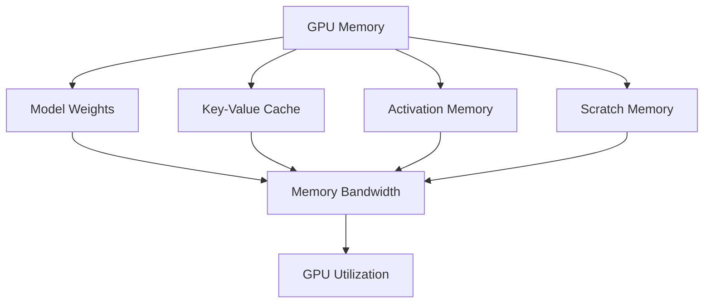
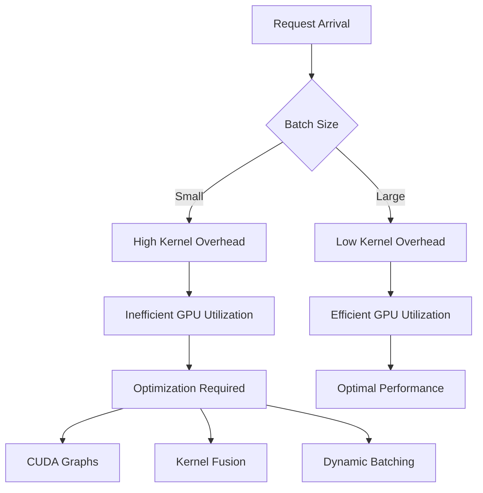
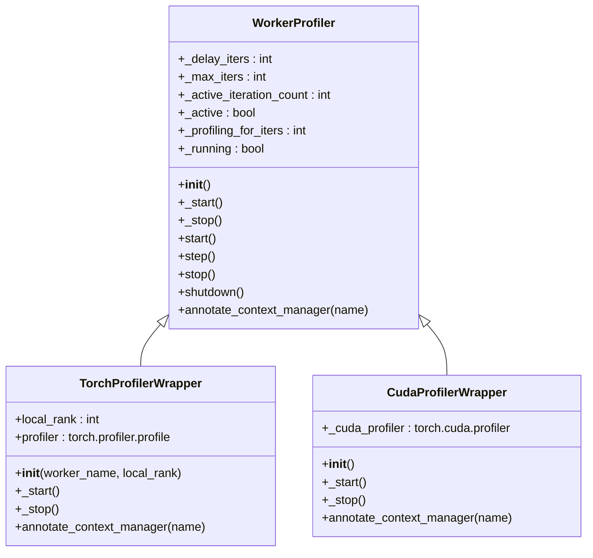
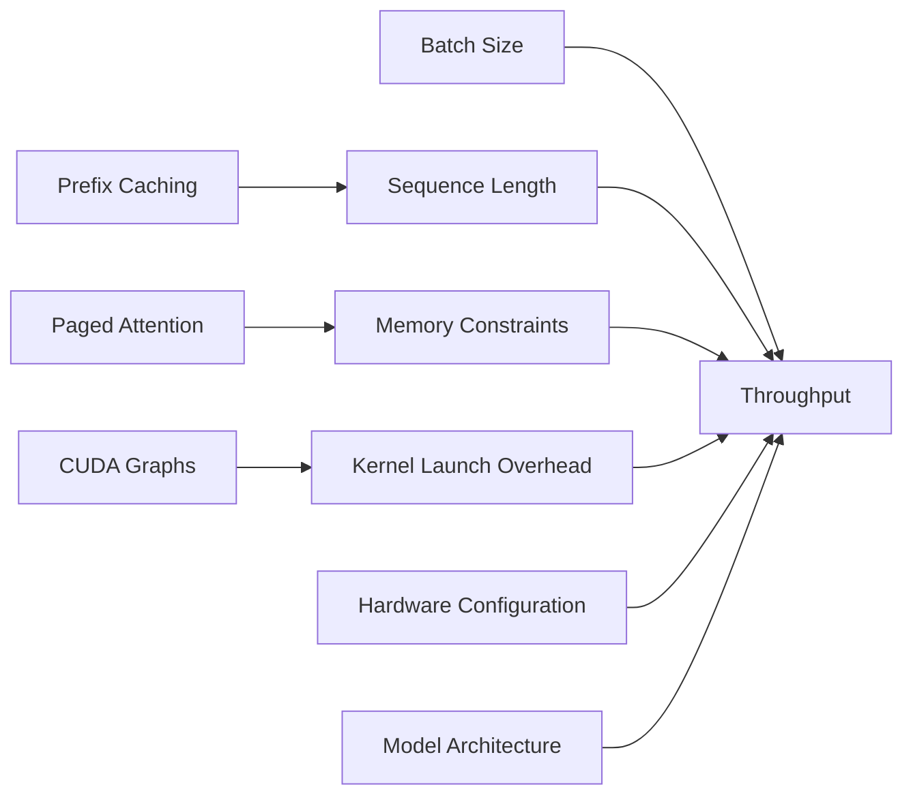

# Performance Issues

<cite>
**Referenced Files in This Document**   
- [simple_profiling.py](file://examples/offline_inference/simple_profiling.py)
- [gpu_profiler.py](file://vllm/profiler/gpu_profiler.py)
- [layerwise_profile.py](file://vllm/profiler/layerwise_profile.py)
- [profiling.py](file://vllm/utils/profiling.py)
- [cache.py](file://vllm/config/cache.py)
- [benchmark_shapes.py](file://benchmarks/kernels/benchmark_shapes.py)
- [utils.py](file://benchmarks/kernels/utils.py)
- [benchmark_layernorm.py](file://benchmarks/kernels/benchmark_layernorm.py)
- [benchmark_quant.py](file://benchmarks/kernels/benchmark_quant.py)
- [benchmark_lora.py](file://benchmarks/kernels/benchmark_lora.py)
- [pynvml.py](file://vllm/third_party/pynvml.py)
</cite>

## Table of Contents
1. [Introduction](#introduction)
2. [Performance Bottlenecks in vLLM](#performance-bottlenecks-in-vllm)
3. [GPU Utilization and Memory Constraints](#gpu-utilization-and-memory-constraints)
4. [Kernel Launch Overhead](#kernel-launch-overhead)
5. [Built-in Profiling Tools](#built-in-profiling-tools)
6. [Analyzing Profiling Output](#analyzing-profiling-output)
7. [Batch Size, Sequence Length, and Throughput](#batch-size-sequence-length-and-throughput)
8. [Optimization Strategies](#optimization-strategies)
9. [Conclusion](#conclusion)

## Introduction

vLLM is a high-performance library for large language model inference that focuses on maximizing throughput and minimizing latency. However, like any high-performance system, it can encounter various performance issues that affect tokens-per-second, latency, and overall efficiency. This document provides a comprehensive analysis of performance bottlenecks in vLLM, focusing on GPU utilization, kernel launch overhead, and memory bandwidth constraints. We'll explore how to use vLLM's built-in profiling tools to identify slow operations, analyze request processing times, and optimize performance across different model sizes and hardware configurations.

The performance characteristics of vLLM are influenced by several factors including batch size, sequence length, model architecture, hardware capabilities, and configuration parameters. Understanding these relationships is crucial for optimizing inference performance and achieving the best possible throughput and latency characteristics.

**Section sources**
- [simple_profiling.py](file://examples/offline_inference/simple_profiling.py#L1-L50)

## Performance Bottlenecks in vLLM

vLLM's performance can be constrained by several interrelated factors that impact overall inference efficiency. The primary bottlenecks include GPU utilization limitations, kernel launch overhead, and memory bandwidth constraints. These bottlenecks can manifest as low tokens-per-second, high latency spikes, or inefficient CUDA kernel usage.

One of the key performance challenges in vLLM is achieving optimal GPU utilization. The GPU may not be fully utilized due to various factors such as small batch sizes, short sequence lengths, or inefficient kernel launches. When the GPU is underutilized, the computational resources remain idle, leading to suboptimal throughput. This is particularly evident in scenarios with high request arrival rates but small individual requests, where the overhead of processing each request outweighs the actual computation time.

Kernel launch overhead represents another significant bottleneck, especially for smaller workloads. Each CUDA kernel launch incurs overhead that includes CPU-GPU synchronization, kernel setup, and scheduling. When processing small batches or short sequences, this overhead can become a substantial portion of the total processing time, reducing overall efficiency. The impact is more pronounced in scenarios with frequent kernel launches for different operations in the inference pipeline.

Memory bandwidth constraints also play a crucial role in vLLM's performance. The attention mechanism in transformer models requires significant memory bandwidth for operations such as key-value cache access, matrix multiplications, and layer normalization. When memory bandwidth becomes the limiting factor, increasing computational resources may not yield proportional performance improvements. This is particularly relevant for models with large hidden dimensions or when using high-precision data types that require more memory bandwidth.

**Section sources**
- [gpu_profiler.py](file://vllm/profiler/gpu_profiler.py#L1-L217)
- [layerwise_profile.py](file://vllm/profiler/layerwise_profile.py#L1-L393)
- [profiling.py](file://vllm/utils/profiling.py#L1-L57)

## GPU Utilization and Memory Constraints

GPU utilization in vLLM is influenced by multiple factors including model size, batch configuration, and memory management strategies. The library provides mechanisms to monitor and optimize GPU utilization through various configuration parameters and profiling tools.

The `gpu_memory_utilization` parameter in the CacheConfig class controls the fraction of GPU memory allocated for the model executor, with a default value of 0.9 (90% utilization). This parameter allows users to balance memory usage between the model and other processes running on the same GPU. For systems with multiple vLLM instances, this parameter can be adjusted to ensure fair resource allocation.



**Diagram sources**
- [cache.py](file://vllm/config/cache.py#L49-L56)

Memory constraints in vLLM are managed through several mechanisms including paged attention, CPU offloading, and swap space allocation. The paged attention system divides the key-value cache into fixed-size blocks, allowing for more efficient memory management and reducing memory fragmentation. The block size can be configured based on the specific hardware and workload characteristics.

CPU offloading provides a mechanism to extend effective GPU memory by utilizing CPU memory as an overflow buffer. The `cpu_offload_gb` parameter specifies the amount of CPU memory to use per GPU, effectively increasing the available memory for larger models. This approach requires fast CPU-GPU interconnects to minimize the performance penalty of transferring data between CPU and GPU memory during inference.

Memory bandwidth constraints are particularly evident in attention operations, where large amounts of data need to be transferred between global memory and compute units. The choice of data type for the key-value cache (controlled by `cache_dtype`) can significantly impact memory bandwidth requirements. Using lower precision formats like FP8 can reduce memory bandwidth requirements by up to 50% compared to FP16, potentially improving throughput at the cost of numerical precision.

**Section sources**
- [cache.py](file://vllm/config/cache.py#L1-L221)
- [pynvml.py](file://vllm/third_party/pynvml.py#L2076-L5993)

## Kernel Launch Overhead

Kernel launch overhead in vLLM can significantly impact performance, especially for smaller batch sizes or when processing requests with short sequence lengths. Each CUDA kernel launch involves CPU-GPU synchronization, kernel setup, and scheduling overhead that can become substantial relative to the actual computation time.

The impact of kernel launch overhead is particularly evident in the prefill phase of inference, where multiple kernels may be launched sequentially for different operations such as embedding lookup, attention computation, and feed-forward network processing. For short sequences, the time spent on kernel launches can exceed the time spent on actual computation, leading to inefficient GPU utilization.

vLLM employs several strategies to mitigate kernel launch overhead:

1. **CUDA Graphs**: By capturing sequences of operations as CUDA graphs, vLLM can reduce the overhead of individual kernel launches. CUDA graphs allow multiple kernels to be launched as a single operation, eliminating the per-kernel launch overhead.

2. **Kernel Fusion**: Combining multiple operations into a single kernel reduces the number of kernel launches required. For example, fusing layer normalization with subsequent operations can eliminate intermediate memory writes and reduce kernel launch frequency.

3. **Batch Processing**: Processing multiple requests simultaneously in a single batch amortizes the kernel launch overhead across multiple sequences, improving overall efficiency.

The effectiveness of these strategies depends on the specific workload characteristics. For workloads with high request arrival rates and variable sequence lengths, dynamic batching and continuous batching can help maintain high batch sizes and reduce the relative impact of kernel launch overhead.



**Diagram sources**
- [utils.py](file://benchmarks/kernels/utils.py#L56-L199)
- [benchmark_layernorm.py](file://benchmarks/kernels/benchmark_layernorm.py#L42-L75)

## Built-in Profiling Tools

vLLM provides comprehensive built-in profiling tools to help identify performance bottlenecks and optimize inference performance. These tools enable detailed analysis of GPU utilization, kernel execution times, and memory usage patterns.

The primary profiling mechanism in vLLM is the Torch Profiler integration, accessible through the `VLLM_TORCH_PROFILER_DIR` environment variable. When enabled, this profiler captures detailed information about CPU and CUDA operations, including kernel execution times, memory allocations, and call stacks. The profiler can be activated by setting the environment variable to specify the output directory for profiling results.

```python
import os
os.environ["VLLM_TORCH_PROFILER_DIR"] = "./vllm_profile"
```

The profiling system includes several configurable parameters that control the profiling behavior:

- `VLLM_PROFILER_DELAY_ITERS`: Specifies the number of iterations to wait before starting the profiler, allowing the system to reach a steady state.
- `VLLM_PROFILER_MAX_ITERS`: Limits the number of iterations for which profiling data is collected, preventing excessive output.
- `VLLM_TORCH_PROFILER_RECORD_SHAPES`: Controls whether tensor shapes are recorded in the profiling output.
- `VLLM_TORCH_PROFILER_WITH_PROFILE_MEMORY`: Enables memory profiling to track memory allocations and deallocations.
- `VLLM_TORCH_PROFILER_WITH_STACK`: Includes Python stack traces in the profiling output for better context.

The profiling system is implemented in the `WorkerProfiler` class hierarchy, with `TorchProfilerWrapper` and `CudaProfilerWrapper` providing specific implementations for different profiling backends. These wrappers handle the lifecycle of the profiler, including startup, iteration tracking, and shutdown.

For layer-wise performance analysis, vLLM provides the `layerwise_profile` context manager, which captures detailed information about model layers and their contribution to overall execution time. This tool generates hierarchical tables showing CPU and CUDA time for each model component, enabling identification of performance bottlenecks at the layer level.



**Diagram sources**
- [gpu_profiler.py](file://vllm/profiler/gpu_profiler.py#L16-L217)
- [layerwise_profile.py](file://vllm/profiler/layerwise_profile.py#L365-L393)

**Section sources**
- [simple_profiling.py](file://examples/offline_inference/simple_profiling.py#L1-L50)
- [gpu_profiler.py](file://vllm/profiler/gpu_profiler.py#L1-L217)
- [layerwise_profile.py](file://vllm/profiler/layerwise_profile.py#L1-L393)

## Analyzing Profiling Output

Analyzing profiling output in vLLM involves interpreting the data collected by the built-in profiling tools to identify performance bottlenecks and optimize system configuration. The profiling output provides detailed information about kernel execution times, memory usage, and computational efficiency.

The primary output format for vLLM profiling is the TensorBoard trace format, which can be visualized using TensorBoard or other compatible tools. The trace files contain information about CPU and CUDA operations, including timestamps, durations, and call stacks. This information can be used to identify long-running operations, frequent kernel launches, and synchronization bottlenecks.

For layer-wise analysis, vLLM provides the `LayerwiseProfileResults` class, which processes the raw profiling data and generates hierarchical tables showing performance metrics for each model component. The output includes:

- **CUDA Time**: The total time spent executing CUDA kernels for each component.
- **CPU Time**: The time spent on CPU operations related to each component.
- **Percentage of Total CUDA Time**: The relative contribution of each component to overall GPU utilization.
- **Invocations**: The number of times each component was executed.

The profiling output can be exported in CSV format for further analysis using tools like pandas. This enables quantitative analysis of performance characteristics and comparison across different configurations.

When analyzing profiling output, key indicators of performance issues include:

1. **High Kernel Launch Overhead**: A large number of short-duration kernel launches indicates that launch overhead may be significant relative to computation time.

2. **Memory Bandwidth Saturation**: High memory copy operations or long durations for memory-intensive operations suggest memory bandwidth may be a bottleneck.

3. **Inefficient GPU Utilization**: Periods of low GPU activity between kernel launches indicate opportunities for optimization through kernel fusion or CUDA graphs.

4. **Load Imbalance**: In distributed settings, significant differences in execution times across ranks suggest load balancing issues.

The `print_layerwise_table` method provides a formatted view of the profiling results, making it easier to identify components with high computational cost. This information can guide optimization efforts, such as focusing on the most time-consuming layers or identifying opportunities for kernel fusion.

**Section sources**
- [layerwise_profile.py](file://vllm/profiler/layerwise_profile.py#L74-L393)
- [gpu_profiler.py](file://vllm/profiler/gpu_profiler.py#L179-L192)

## Batch Size, Sequence Length, and Throughput

The relationship between batch size, sequence length, and throughput in vLLM is complex and depends on multiple factors including hardware capabilities, model architecture, and memory management strategies. Understanding these relationships is crucial for optimizing inference performance.

Throughput in vLLM, measured in tokens per second, generally increases with batch size due to better GPU utilization and amortization of kernel launch overhead. However, this relationship is not linear and eventually reaches a point of diminishing returns as memory constraints become limiting. The optimal batch size depends on the specific model, hardware configuration, and sequence length.

Sequence length has a significant impact on both latency and throughput. Longer sequences require more memory for the key-value cache and more computation for attention operations. The memory requirement for the key-value cache scales linearly with sequence length, while the computation for attention scales quadratically. This means that longer sequences can quickly become memory-bound or computation-bound, depending on the specific hardware and model configuration.

The interaction between batch size and sequence length is particularly important in vLLM's continuous batching system. When processing requests with varying sequence lengths, the system must balance the benefits of larger batch sizes with the memory requirements of longer sequences. This can lead to complex trade-offs where increasing the batch size may require reducing the maximum sequence length to stay within memory constraints.

Memory management strategies such as paged attention and prefix caching can significantly impact the relationship between these parameters. Paged attention allows for more efficient memory utilization by allocating memory in fixed-size blocks, reducing fragmentation and enabling better memory reuse. Prefix caching can improve throughput by sharing common prefix computations across multiple requests, effectively reducing the computational cost of processing similar prompts.

The optimal configuration for batch size and sequence length depends on the specific use case and performance requirements. For latency-sensitive applications, smaller batch sizes with shorter maximum sequence lengths may be preferred to minimize response times. For throughput-optimized applications, larger batch sizes with appropriate sequence length limits can maximize tokens per second.



**Diagram sources**
- [benchmark_shapes.py](file://benchmarks/kernels/benchmark_shapes.py#L4-L95)
- [cache.py](file://vllm/config/cache.py#L42-L48)

**Section sources**
- [cache.py](file://vllm/config/cache.py#L42-L104)
- [benchmark_shapes.py](file://benchmarks/kernels/benchmark_shapes.py#L1-L95)

## Optimization Strategies

Optimizing performance in vLLM requires a comprehensive approach that addresses GPU utilization, kernel launch overhead, and memory bandwidth constraints. The following strategies can help improve tokens-per-second, reduce latency spikes, and enhance overall efficiency.

### GPU Utilization Optimization

1. **Adjust gpu_memory_utilization**: Tune the `gpu_memory_utilization` parameter to balance memory usage between the model and other processes. For dedicated inference servers, values close to 0.95-0.98 may be optimal.

2. **Use appropriate cache data types**: Configure `cache_dtype` to use lower precision formats like FP8 when numerical precision requirements allow, reducing memory bandwidth usage and increasing effective memory capacity.

3. **Enable CPU offloading**: For models that exceed GPU memory capacity, use `cpu_offload_gb` to extend effective memory using CPU memory, enabling larger models to be served.

### Kernel Launch Overhead Reduction

1. **Enable CUDA graphs**: Use CUDA graphs to capture sequences of operations and reduce per-kernel launch overhead. This is particularly effective for stable workloads with predictable execution patterns.

2. **Increase batch sizes**: Process more requests simultaneously to amortize kernel launch overhead across multiple sequences. Use dynamic batching to maintain high batch sizes even with variable request arrival rates.

3. **Implement kernel fusion**: Combine multiple operations into single kernels to reduce the number of kernel launches and intermediate memory writes.

### Memory Bandwidth Optimization

1. **Optimize block size**: Configure the attention block size based on the specific hardware and workload characteristics to minimize memory fragmentation and improve cache efficiency.

2. **Use prefix caching**: Enable prefix caching to share common prefix computations across requests, reducing redundant computation and memory access.

3. **Implement sliding window attention**: For models that support it, use sliding window attention to limit the memory footprint of the key-value cache for long sequences.

### Model-Specific Optimizations

1. **Quantization**: Apply quantization techniques to reduce model size and memory bandwidth requirements. vLLM supports various quantization schemes that can significantly improve throughput with minimal accuracy impact.

2. **LoRA optimization**: For models using LoRA adapters, optimize the configuration of `num_loras` and `max_loras` to balance memory usage and computational efficiency.

3. **Mixture of Experts (MoE) optimization**: For MoE models, tune the expert selection and routing mechanisms to minimize computational overhead and memory access patterns.

### Hardware-Specific Configurations

1. **Multi-GPU optimization**: For multi-GPU setups, optimize tensor parallelism and pipeline parallelism configurations to balance computational load and minimize communication overhead.

2. **Memory hierarchy optimization**: Configure memory allocation strategies based on the specific memory hierarchy of the target hardware, taking advantage of high-bandwidth memory and cache structures.

3. **Power and thermal management**: Adjust power limits and thermal management settings to maintain optimal GPU clock speeds during sustained inference workloads.

The effectiveness of these optimization strategies depends on the specific use case, model architecture, and hardware configuration. A systematic approach involving profiling, experimentation, and iterative refinement is recommended to achieve optimal performance.

**Section sources**
- [cache.py](file://vllm/config/cache.py#L49-L149)
- [benchmark_layernorm.py](file://benchmarks/kernels/benchmark_layernorm.py#L42-L81)
- [benchmark_quant.py](file://benchmarks/kernels/benchmark_quant.py#L42-L81)
- [benchmark_lora.py](file://benchmarks/kernels/benchmark_lora.py#L547-L708)

## Conclusion

Performance optimization in vLLM requires a comprehensive understanding of the interplay between GPU utilization, kernel launch overhead, and memory bandwidth constraints. By leveraging the built-in profiling tools and applying targeted optimization strategies, significant improvements in tokens-per-second, latency, and overall efficiency can be achieved.

The key to successful optimization is systematic analysis using vLLM's profiling capabilities to identify specific bottlenecks in the inference pipeline. Once bottlenecks are identified, appropriate strategies can be applied, such as adjusting memory configuration, implementing kernel fusion, or optimizing batch processing parameters.

For different model sizes and hardware configurations, the optimal optimization strategy will vary. Smaller models may benefit more from kernel launch overhead reduction, while larger models may be more constrained by memory bandwidth and capacity. Similarly, different hardware architectures may have different performance characteristics that require tailored optimization approaches.

Continuous monitoring and profiling are essential for maintaining optimal performance as workloads evolve and new models are deployed. By establishing a systematic approach to performance analysis and optimization, organizations can ensure that their vLLM deployments deliver the highest possible efficiency and responsiveness.