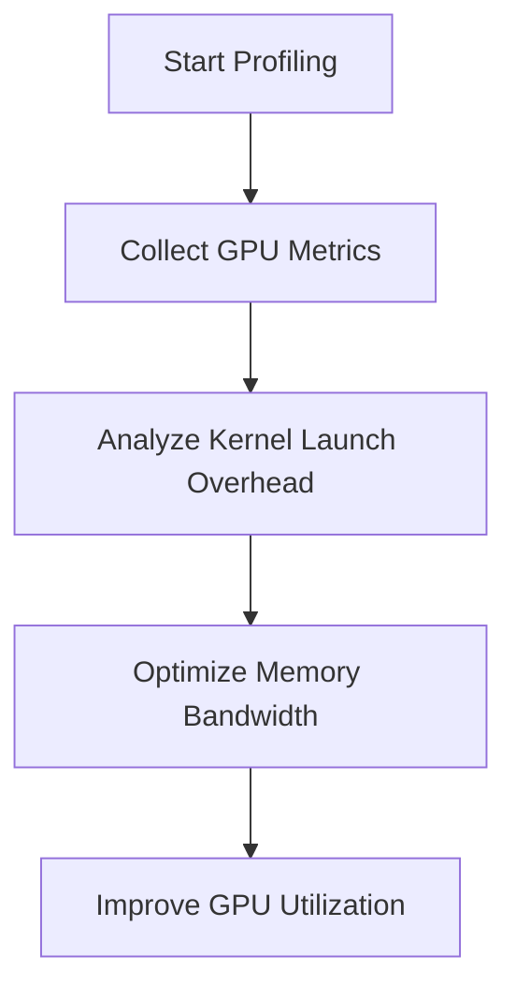
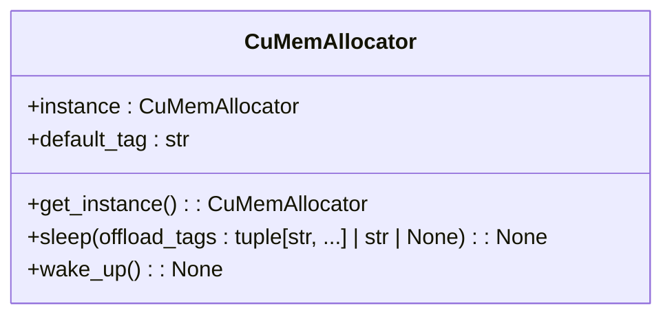
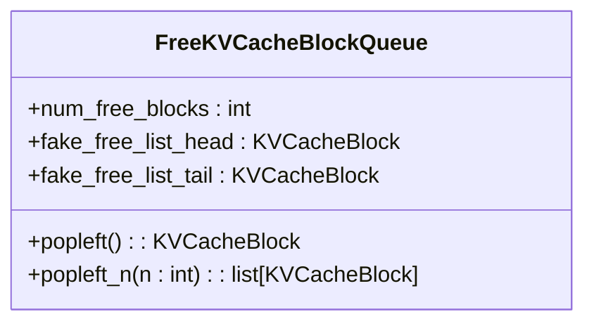
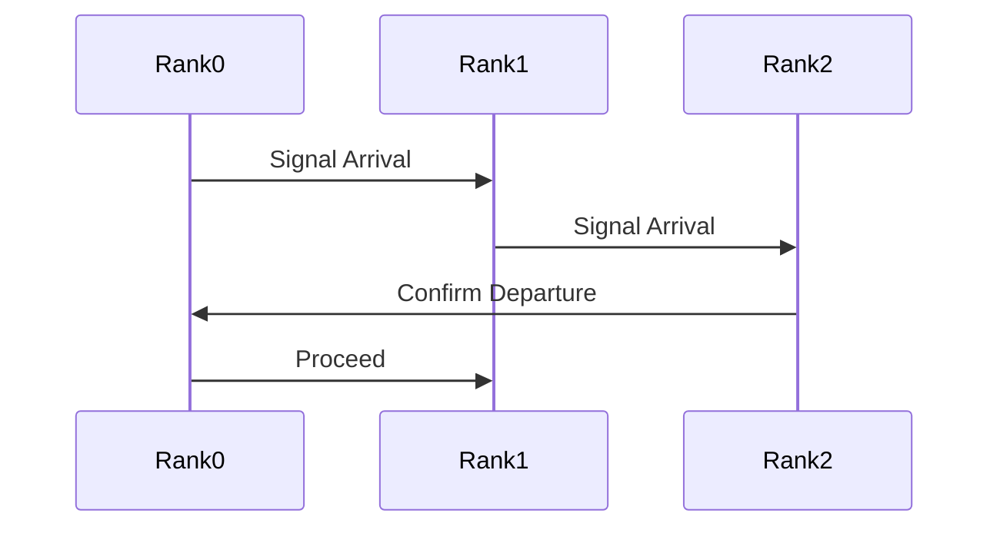
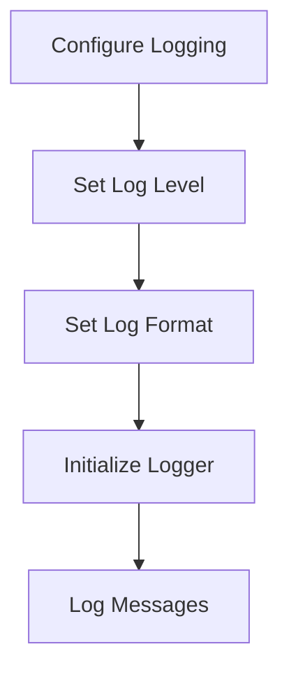

# Troubleshooting

<cite>
**Referenced Files in This Document**   
- [cumem_allocator.cpp](file://csrc/cumem_allocator.cpp)
- [cumem.py](file://vllm/device_allocator/cumem.py)
- [logger.py](file://vllm/logger.py)
- [pynvml.py](file://vllm/third_party/pynvml.py)
- [kv_cache_utils.py](file://vllm/v1/core/kv_cache_utils.py)
- [block_pool.py](file://vllm/v1/core/block_pool.py)
- [parallel_state.py](file://vllm/distributed/parallel_state.py)
- [pynccl.py](file://vllm/distributed/device_communicators/pynccl.py)
- [utils.py](file://vllm/distributed/utils.py)
</cite>

## Table of Contents
1. [Introduction](#introduction)
2. [Common Issues and Solutions](#common-issues-and-solutions)
3. [Performance Issues](#performance-issues)
4. [Memory Issues](#memory-issues)
5. [Distributed Training Issues](#distributed-training-issues)
6. [Diagnostic Tools and Logging](#diagnostic-tools-and-logging)
7. [Debugging Tips](#debugging-tips)
8. [Conclusion](#conclusion)

## Introduction
This document provides comprehensive troubleshooting content focused on diagnosing and resolving common issues with vLLM. The purpose is to help users identify and fix problems quickly, covering out-of-memory errors, slow inference performance, connection problems, and other critical issues. It includes both conceptual overviews of troubleshooting methodologies and technical details of diagnostic tools, with practical examples showing how to interpret error messages, analyze logs, and use profiling tools.

## Common Issues and Solutions

### Out-of-Memory Errors
Out-of-memory (OOM) errors are common when running large language models. These can be mitigated by adjusting the memory allocation settings or using memory-efficient models.

**Section sources**
- [cumem_allocator.cpp](file://csrc/cumem_allocator.cpp#L1-L349)
- [cumem.py](file://vllm/device_allocator/cumem.py#L110-L230)

### Slow Inference Performance
Slow inference performance can be caused by inefficient memory management or suboptimal model configurations. Optimizing the model and using efficient memory allocation strategies can improve performance.

**Section sources**
- [cumem_allocator.cpp](file://csrc/cumem_allocator.cpp#L1-L349)
- [cumem.py](file://vllm/device_allocator/cumem.py#L110-L230)

### Connection Problems
Connection problems can arise from network issues or misconfigured settings. Ensuring proper network connectivity and correct configuration can resolve these issues.

**Section sources**
- [pynccl.py](file://vllm/distributed/device_communicators/pynccl.py#L37-L185)
- [utils.py](file://vllm/distributed/utils.py#L227-L303)

## Performance Issues

### GPU Utilization
Low GPU utilization can be a sign of inefficient kernel launches or memory bandwidth bottlenecks. Profiling tools can help identify these issues.

**Diagram sources**
- [pynvml.py](file://vllm/third_party/pynvml.py#L5654-L5706)
- [cuda_utils_kernels.cu](file://csrc/cuda_utils_kernels.cu#L1-L35)

### Memory Bandwidth
Memory bandwidth issues can significantly impact performance. Using memory-efficient data structures and optimizing memory access patterns can help.

**Section sources**
- [cumem_allocator.cpp](file://csrc/cumem_allocator.cpp#L1-L349)
- [cumem.py](file://vllm/device_allocator/cumem.py#L110-L230)

### Kernel Launch Overhead
High kernel launch overhead can be reduced by batching operations and using CUDA graphs.

**Section sources**
- [cuda_utils_kernels.cu](file://csrc/cuda_utils_kernels.cu#L1-L35)
- [pynvml.py](file://vllm/third_party/pynvml.py#L5654-L5706)

## Memory Issues

### KV Cache Management
Effective management of the KV cache is crucial for performance. The `CuMemAllocator` class provides mechanisms to manage memory pools and offload data to CPU memory when necessary.

**Diagram sources**
- [cumem.py](file://vllm/device_allocator/cumem.py#L113-L230)

### Block Allocation
Block allocation in the KV cache is managed by the `FreeKVCacheBlockQueue` class, which organizes free blocks in a doubly linked list to support efficient allocation and deallocation.

**Diagram sources**
- [kv_cache_utils.py](file://vllm/v1/core/kv_cache_utils.py#L155-L259)

## Distributed Training Issues

### Network Connectivity
Network connectivity issues can be diagnosed using the `barrier` method in the `StatelessProcessGroup` class, which ensures all ranks reach the barrier before proceeding.

**Diagram sources**
- [utils.py](file://vllm/distributed/utils.py#L227-L303)

### Synchronization Problems
Synchronization problems can be addressed by ensuring all ranks are properly synchronized using the `barrier` method and other synchronization primitives.

**Section sources**
- [utils.py](file://vllm/distributed/utils.py#L227-L303)
- [pynccl.py](file://vllm/distributed/device_communicators/pynccl.py#L37-L185)

## Diagnostic Tools and Logging

### Logging Configuration
The logging configuration in vLLM is managed by the `logger.py` file, which sets up logging with various levels and formats.

**Diagram sources**
- [logger.py](file://vllm/logger.py#L1-L299)

### Profiling Tools
Profiling tools such as `simple_profiling.py` can be used to collect performance data and identify bottlenecks.

**Section sources**
- [simple_profiling.py](file://examples/offline_inference/simple_profiling.py#L1-L50)
- [visualize_layerwise_profile.py](file://tools/profiler/visualize_layerwise_profile.py#L371-L442)

## Debugging Tips

### Using Environment Variables
Environment variables such as `VLLM_TORCH_PROFILER_DIR` can be used to enable profiling and collect performance data.

**Section sources**
- [simple_profiling.py](file://examples/offline_inference/simple_profiling.py#L1-L50)

### Analyzing Logs
Analyzing logs can provide insights into the root cause of issues. The `logger.py` file provides detailed logging information that can be used for debugging.

**Section sources**
- [logger.py](file://vllm/logger.py#L1-L299)

## Conclusion
This document has provided a comprehensive guide to troubleshooting common issues with vLLM. By following the steps and using the tools described, users can quickly identify and resolve problems, ensuring optimal performance and reliability.